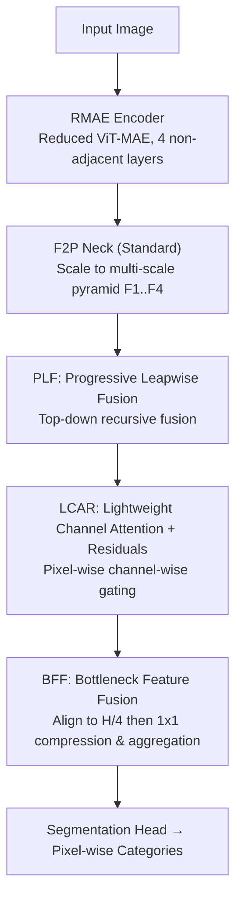

# RMAE-ProGRess: Advancing Semantic Segmentation in Unstructured Environments

**Conference**: CVPR 2026  
**Paper**: [CVF Open Access](https://openaccess.thecvf.com/content/CVPR2026/html/Bhurtel_RMAE-ProGRess_Advancing_Semantic_Segmentation_in_Unstructured_Environments_CVPR_2026_paper.html)  
**Code**: https://gitlab.com/coeaiml/rmae-progress  
**Area**: Semantic Segmentation  
**Keywords**: Unstructured environments, off-road segmentation, lightweight decoder, multi-scale fusion, MAE encoder

## TL;DR
For semantic segmentation in off-road/unstructured scenes, this paper employs a ViT-MAE encoder (RMAE) with half the layers removed to extract non-adjacent multi-layer features. It is paired with a lightweight decoder, ProGRess, consisting of three modules: Progressive Leapwise Fusion (PLF), Lightweight Channel Attention with Residuals (LCAR), and Bottleneck Feature Fusion (BFF). It achieves SOTA mIoU of 57.41% / 78.95% / 45.63% on RELLIS-3D / RELLIS-3DC / RUGD datasets with significantly fewer parameters.

## Background & Motivation
**Background**: Mainstream research in semantic segmentation focuses almost exclusively on structured urban scenes (Cityscapes, ADE20K), reaching high performance using powerful encoder-decoder architectures. However, off-road navigation, search and rescue, defense robotics, and planetary exploration involve unstructured environments characterized by irregular terrain, blurry boundaries, and a lack of geometric consistency.

**Limitations of Prior Work**: Unstructured segmentation suffers from two gaps. First, **lack of standardized benchmarks**: existing off-road works (various methods on RELLIS-3D and RUGD) use inconsistent evaluation protocols and unclear metrics, making direct comparison impossible for subsequent researchers. Second, **lack of targeted architecture design**: directly applying urban decoders (UPerNet, DeepLabV3+, OCRNet, etc.) to off-road data has neither been systematically verified nor accounts for parameter redundancy—off-road deployment often occurs in edge scenarios with limited compute, requiring a balance between high accuracy and controllable computation.

**Key Challenge**: General-purpose segmentation models are either accurate but too heavy (ViT-Base backbones 86M+, UPerNet decoders 32M+) or lightweight but suffer significant accuracy drops. Furthermore, visual cues in off-road scenes (fallen leaves, gravel, shadows, blurry boundaries) are highly heterogeneous, and simple multi-scale fusion is insufficient.

**Goal**: (1) Re-train and evaluate 16 mainstream CNN/Transformer segmentation models on off-road data to establish a reproducible standard benchmark; (2) Design a segmentation framework that balances accuracy, computational efficiency, and modularity.

**Core Idea**: On the encoder side—since adjacent ViT layer features are highly redundant, **half of the transformer layers are removed** to create the lightweight RMAE, extracting features only from non-adjacent interval layers. On the decoder side—three lightweight modules (PLF/LCAR/BFF) primarily based on $1 \times 1$ convolutions are used for progressive multi-scale fusion, replacing heavy FPN-style decoders.

## Method

### Overall Architecture
The RMAE-ProGRess is a standard encoder-neck-decoder pipeline, with each segment redesigned for "lightweight off-road" performance. Given an input image $I \in \mathbb{R}^{B \times C' \times H \times W}$, it first passes through the **RMAE encoder**—a slimmed-down ViT-MAE-Base reduced from 12 to 8/6/4 layers. It extracts four **non-adjacent** feature maps $f_i = \{f_1, f_2, f_3, f_4\}$ all at resolution $\frac{H}{16} \times \frac{W}{16}$, corresponding to early structures, mid-level patterns, and deep semantics. Next, the **F2P (Feature-to-Pyramid) neck** scales these same-resolution features by factors $r_i \in \{4, 2, 1, 0.5\}$ into a multi-scale pyramid (from $\frac{H}{4}$ to $\frac{H}{32}$), maintaining channel dimension $C$ throughout. Finally, the **ProGRess decoder** links PLF→LCAR→BFF: PLF performs top-down progressive fusion of pyramid features, LCAR applies pixel-wise and channel-wise gated weighting, and BFF aligns all scales to $\frac{H}{4}$ before compression and aggregation for pixel-level probability output.

F2P follows standard practices (transposed convolution upsampling + max-pooling downsampling); the core innovation lies in the RMAE encoder and the three ProGRess decoder modules.

### Key Designs

**1. RMAE Encoder: Halving ViT Layers and Extracting Non-Adjacent Features**

To address the redundancy in adjacent ViT-Base layers, the authors trim the 12 transformer layers of ViT-MAE-Base to 8/6/4 layers, resulting in RMAE-8L (58.5M), RMAE-6L (44.2M), and RMAE-4L (29.9M). Parameters decrease significantly compared to the original 86M, while representations are preserved via MAE self-supervised pre-training weights. Critically, since adjacent layers are highly correlated due to token mixing, the authors extract features only from **regularly spaced non-adjacent layers** (e.g., indices $\{1,3,5,7\}$ for RMAE-8L), covering early, middle, and deep semantic levels.

**2. PLF (Progressive Leapwise Fusion): Top-Down Recursive Fusion of Non-Adjacent Features**

Pyramid features from non-adjacent layers (leapwise) have discontinuous resolutions and semantic levels. PLF uses a **top-down recursive cascade** for fusion: it enhances the deepest layer through self-fusion $\tilde{F}_4 = \mathrm{Fuse}(F_4, F_4)$, then progressively fuses deep layers with preceding layers: $\tilde{F}_3 = \mathrm{Fuse}(F_3, \tilde{F}_4)$, $\tilde{F}_2 = \mathrm{Fuse}(F_2, \tilde{F}_3)$, and $\tilde{F}_1 = \mathrm{Fuse}(F_1, \tilde{F}_2)$. Each fusion operator is $\mathrm{Fuse}(F_i, F_j) = \phi(\mathrm{BN}(W_{ij} * [F_i \| U(F_j, \text{size of } F_i)]))$, where $U$ is nearest-neighbor interpolation, $\|$ is concatenation, and $W_{ij}$ is a learnable $1\times1$ convolution. The recursive structure ensures each $\tilde{F}_i$ contains information from all deeper layers $\{F_i, \dots, F_4\}$.

**3. LCAR (Lightweight Channel Attention with Residuals): Pooling-free Pixel-wise Gating + Selective Residuals**

To emphasize specific channels without losing spatial details in heterogeneous off-road scenes, LCAR avoids global average pooling. Instead, it uses a **pooling-free $1\times1$ convolution** to generate pixel-wise channel attention maps: $\mathrm{LCA}(X) = X \odot \sigma(W_c * X)$, where $W_c \in \mathbb{R}^{C\times C\times 1\times 1}$ mixes channels. A **residual connection with a binary switch** is added: $\mathrm{LCAR}(X) = \mathrm{LCA}(X) + \alpha X$, where $\alpha \in \{0,1\}$. Empirical results show $\alpha=1$ only for the deepest layer $\tilde{F}_4$ stabilizes gradient flow for fragile deep representations.

**4. BFF (Bottleneck Feature Fusion): Compression at Unified Resolution**

BFF aligns all LCAR outputs $\hat{F}_i$ to the target resolution $\frac{H}{4} \times \frac{W}{4}$ to get $\bar{F}_i$, then concatenates them and uses a $W_{bff} \in \mathbb{R}^{C\times 4C\times 1\times 1}$ convolution to compress channels from $4C$ back to $C$: $Z = \phi(\mathrm{BN}(W_{bff} * [\bar{F}_1\|\bar{F}_2\|\bar{F}_3\|\bar{F}_4]))$. The final prediction is $Y = \mathrm{softmax}(W_{cls} * Z)$. The entire decoder relies solely on $1\times1$ convolutions and interpolation, yielding only 4.86M parameters with a ViT-B16 backbone, an 85% reduction compared to UPerNet.

### Loss & Training
Based on the MMSegmentation framework, all models are trained for 160K iterations. The encoder uses MAE pre-trained weights and a layer-wise learning rate (LR) configuration. Nearest-neighbor interpolation is used by default as it provides the best accuracy with zero computational overhead.

## Key Experimental Results

### Main Results
Benchmarking 16 mainstream models on RELLIS-3D / RUGD (512×512):

| Dataset | Method | Backbone | Params (M) | mIoU | mAcc |
|--------|------|------|---------|------|------|
| RELLIS-3D | Swin-UPerNet (Strong Baseline) | Swin-B | 121.2 | 53.86 | 63.33 |
| RELLIS-3D | **ProGRess** | RMAE-4L | 46.5 | 53.23 | 63.04 |
| RELLIS-3D | **ProGRess** | RMAE-8L | 75.0 | 57.14 | 68.53 |
| RELLIS-3D | **ProGRess** | ViTMAE-Base | 103.6 | **57.41** | **69.21** |
| RUGD | Segformer (Strong Baseline) | MiT-B5 | 82.0 | 43.69 | 56.45 |
| RUGD | **ProGRess** | ViTMAE-Base | 103.6 | **45.63** | **57.80** |

The lightweight RMAE-4L variant (46.5M, 128 GFLOPs) achieves 53.23% mIoU, outperforming nearly all heavier baselines.

### Ablation Study
**Component Stacking** (RMAE-8L, RELLIS-3D Test Set):

| BFF | PLF | Self-Fusion | LCAR | mIoU (Frozen) | mIoU (Fine-tuned) |
|-----|-----|-------------|------|-----------|-----------|
| ✗ | ✗ | ✗ | ✗ | 49.02 | 52.52 |
| ✓ | ✓ | ✓ | ✓ | **53.18** | **56.90** |

**Decoder Cross-Backbone Generalization** (RELLIS-3D):

| Encoder | Decoder | Decoder Params (M) | mIoU |
|--------|--------|--------------|------|
| ViT-B16 | UPerNet | 32.27 | 48.03 |
| ViT-B16 | **ProGRess** | 4.86 | **55.68** |
| RMAE-4L | **ProGRess** | 9.46 | **53.23** |

### Key Findings
- **PLF provides the largest gain**: Adding PLF increases mIoU from 54.56 to 56.15.
- **Backbone Agnostic**: ProGRess improves performance across ResNet, Swin, MiT, and ViT encoders while using a fraction of the parameters compared to UPerNet.
- **Interpolation Insensitivity**: Differences between bicubic, bilinear, and nearest interpolation are $<0.42$ mIoU; nearest neighbor is selected for its efficiency.

## Highlights & Insights
- **Shrinking Depth vs. Width**: Unlike traditional lightweight ViTs that reduce embedding dimensions, RMAE preserves width but halves depth, utilizing non-adjacent layers to avoid redundancy.
- **1x1 Conv Decoder**: The decoder avoids heavy operators (ASPP, heavy Attention), providing a template for lightweight segmentation in resource-constrained environments.
- **Recursive Information Preservation**: The PLF module ensures global context permeates through high-resolution branches via recursive cascade.

## Limitations & Future Work
- **Absolute Accuracy**: mIoU remains relatively low (57% / 46%), reflecting the extreme difficulty of off-road segmentation.
- **F2P Neck**: The pyramid neck uses standard transposed convolutions rather than modules optimized specifically for off-road features.
- **Empirical Indexing**: The selection of non-adjacent layer indices is currently manual rather than learned or searched.

## Related Work & Insights
- **vs. Lightweight ViTs**: While others reduce width, this work reduces depth and leverages MAE weights, showing "depth redundancy" is more critical to address in off-road data.
- **vs. FPN-style Decoders**: ProGRess uses recursive cascades (PLF) rather than single-shot lateral connections, achieving higher accuracy with 85% fewer parameters than UPerNet.

## Rating
- Novelty: ⭐⭐⭐⭐
- Experimental Thoroughness: ⭐⭐⭐⭐⭐
- Writing Quality: ⭐⭐⭐⭐
- Value: ⭐⭐⭐⭐

<!-- RELATED:START -->

## Related Papers

- [\[ICLR 2026\] Advancing Complex Video Object Segmentation via Progressive Concept Construction](../../ICLR2026/segmentation/advancing_complex_video_object_segmentation_via_progressive_concept_construction.md)
- [\[CVPR 2026\] Bayesian Decomposition and Semantic Completion for Few-shot Semantic Segmentation](bayesian_decomposition_and_semantic_completion_for_few-shot_semantic_segmentatio.md)
- [\[CVPR 2026\] Frequency-Aware Affinity for Weakly Supervised Semantic Segmentation](frequency-aware_affinity_for_weakly_supervised_semantic_segmentation.md)
- [\[CVPR 2026\] From Softmax to Dirichlet: Evidential Learning for Semi-supervised Semantic Segmentation](from_softmax_to_dirichlet_evidential_learning_for_semi-supervised_semantic_segme.md)
- [\[CVPR 2026\] Leveraging Class Distributions in CLIP for Weakly Supervised Semantic Segmentation](leveraging_class_distributions_in_clip_for_weakly_supervised_semantic_segmentati.md)

<!-- RELATED:END -->
