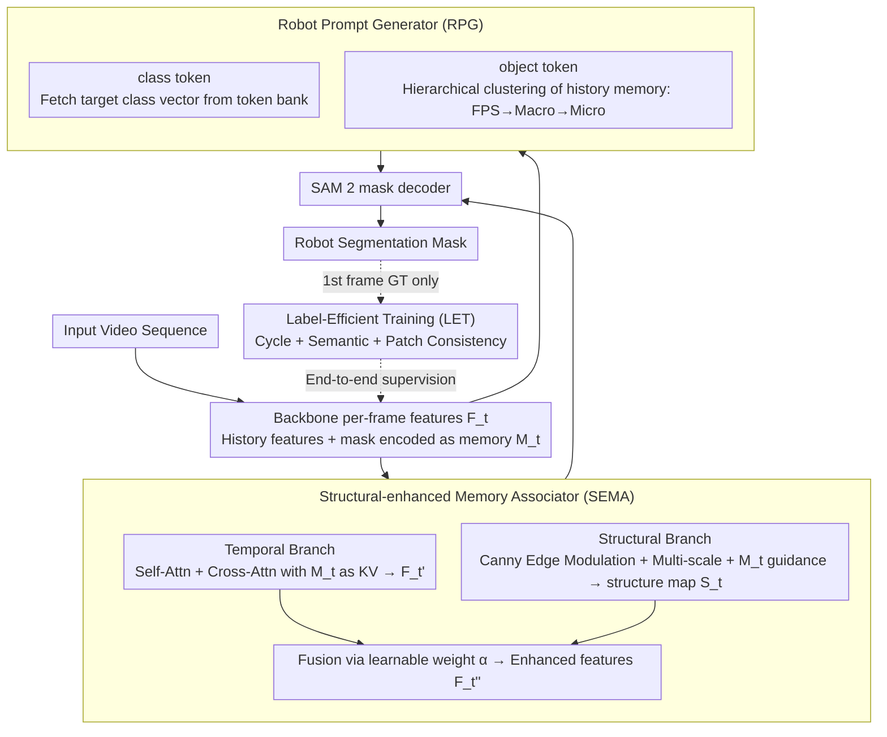

# RobotSeg: A Model and Dataset for Segmenting Robots in Image and Video

**Conference**: CVPR 2026  
**arXiv**: [2511.22950](https://arxiv.org/abs/2511.22950)  
**Code**: [https://github.com/showlab/RobotSeg](https://github.com/showlab/RobotSeg)  
**Area**: Segmentation  
**Keywords**: Robot Segmentation, SAM 2, Structure-Aware, Autonomous Segmentation, Label-Efficient Learning

## TL;DR

This paper proposes RobotSeg, the first foundation model supporting both image and video robot segmentation. Based on SAM 2, it introduces the Structural-enhanced Memory Associator (SEMA), Robot Prompt Generator (RPG), and a label-efficient training strategy. Requiring only first-frame annotations, it achieves 85.1 J&F for Whole Robot segmentation in autonomous mode, surpassing the fine-tuned SAM 2.1 by 4.9 points with only 41.3M parameters (significantly smaller than existing 638M+ solutions).

## Background & Motivation

1. **Background**: Robot segmentation is a fundamental capability for robotic perception, applied in visual servoing (VLA systems), cross-embodiment data augmentation, real-to-sim transfer, and safety monitoring. Existing solutions either rely on language-conditioned segmentation (CLIPSeg/LISA/EVF-SAM) or general prompt-based segmentation with SAM 2.
2. **Limitations of Prior Work**: (a) Robots exhibit diverse morphologies (Franka/Fanuc/Sawyer/UR5, etc.) and appearances that often blend into backgrounds; (b) Articulated structures are complex, often causing existing models to produce fragmented segments; (c) Drastic shape changes during operation lead to temporal inconsistencies. While SAM 2 is generalizable, it lacks structural priors for articulated robots, relies on manual prompts, and requires per-frame annotations.
3. **Key Challenge**: Robot segmentation necessitates structural awareness (joint geometry), autonomy (no manual prompts), and annotation efficiency (high cost of large-scale video labeling), which are not simultaneously satisfied by current methods.
4. **Goal**: Construct a specialized model and dataset to achieve structure-aware, autonomous, and label-efficient video robot segmentation.
5. **Key Insight**: Perform targeted enhancements on SAM 2—injecting structural priors via Canny edges and multi-scale perception, generating autonomous prompts using a learnable token bank with historical clustering, and implementing first-frame-only supervision through cycle, semantic, and patch consistency.
6. **Core Idea**: Graft three modules specialized for robotic characteristics (structural awareness, autonomous prompting, label efficiency) onto SAM 2 to achieve SOTA robot segmentation with only 41M parameters.

## Method

### Overall Architecture

The input is a video sequence, where the backbone extracts per-frame visual features. The SEMA module constructs memory from historical features and segmentation results, combining edge structural information to enhance current frame features. The RPG module generates semantic priors and temporal cues from a learnable token bank and historical memory as segmentation prompts, replacing manual clicks or boxes. The enhanced features and prompts are fed into the SAM 2 mask decoder to generate robot segmentation masks. During training, only the first-frame GT is required, with end-to-end learning achieved via a three-level consistency loss.

### Key Designs

**1. Structural-enhanced Memory Associator (SEMA): Enabling "Past Memory" and "Joint Clarity"**

The joints of articulated robots are the most difficult to segment—shapes change drastically during operation, and relying solely on current frame appearance often fragments the arm. Historical frames provide temporal cues that parts are connected. SEMA fuses these using two parallel branches. The temporal branch encodes historical features and masks into memory $M_t$. Current features $F_t$ pass through self-attention, cross-attention (with $M_t$ as KV), and an MLP to obtain temporal enhanced features $F_t'$, allowing the model to "look back" and confirm the robot's global shape.

The structural branch uses edges as low-cost joint detectors: Canny filters extract the edge map $E_t$, and features undergo edge modulation $F_t^{edge} = F_t \odot (1 + E_t)$ to amplify boundary responses. A multi-scale feature extractor and cross-attention with $M_t$ generate the structure map:

$$S_t = \sigma(\text{CrossAttn}(F_t^{ms}, M_t)).$$

Finally, a learnable weight $\alpha$ fuses the branches into $F_t'' = F_t' \odot (1 + \alpha S_t)$. Canny edges provide strong structural priors without training, and multi-scale perception ensures both large joints and fine end-effectors are captured, filling the structural inductive bias gap in general-purpose models like SAM 2.

**2. Robot Prompt Generator (RPG): Autonomous Prompt Generation**

SAM 2 is powerful but relies on manual clicks or boxes, which is impractical for long videos. RPG replaces manual input with two types of auto-generated "robot tokens." The **class token** is retrieved from a learnable token bank based on the target category (arm / gripper / whole), providing category-level semantic priors.

The **object token** is extracted from historical memory via hierarchical clustering to represent the specific robot's appearance: Farthest Point Sampling (FPS) selects $R$ macro centers, K-Means clustering generates region masks for coarse outlines, and then $S$ micro-clusters are extracted within each region for fine details. These prototype vectors form the object token. Together, the class token (semantics) and object token (appearance) guide the mask decoder, ensuring the articulated robot is segmented without losing parts or blurring end-effectors.

**3. Label-Efficient Training (LET): Training with First-Frame Supervision Only**

To mitigate the cost of per-frame video labeling, this strategy reduces supervision to only the first-frame GT mask, propagating signals via three-level consistency. **Cycle consistency** $\mathcal{L}_{cyc}$ utilizes temporal symmetry: forwarding from frame $0$ to $t$ and backward to $0$. Both the forward and returned masks at frame $0$ are supervised by the GT using focal and dice losses, treating the single annotation as a self-supervised anchor. **Semantic consistency** $\mathcal{L}_{sem}$ constrains the cosine similarity between the average features within the predicted mask of intermediate frames and the object semantics of the first frame. **Patch consistency** $\mathcal{L}_{patch}$ utilizes DINOv3 patch similarity to propagate the first-frame GT to intermediate frames to generate pseudo-labels, supervising via IoU loss at a downsampled 16× patch scale. The total loss is:

$$\mathcal{L}_{mask} = w_{cyc}\mathcal{L}_{cyc} + w_{sem}\mathcal{L}_{sem} + w_{patch}\mathcal{L}_{patch},$$

covering video, object, and patch levels to expand a single annotation into a full hierarchical supervision signal.

### Loss & Training

Trained jointly on RoboEngine-Train (3,532 images) and VRS-Train (2,707 videos, 131K frames) for 25 epochs. Optimized using AdamW with image encoder $lr=3\times10^{-4}$ and other components $lr=6\times10^{-5}$ using cosine decay. The structure map $S_t$ receives additional supervision. Training took 15 hours on 8 × NVIDIA A5000.

## Key Experimental Results

### Main Results

**VRS Video Dataset (Whole Robot J&F)**

| Method | Params | Autonomous (AU) | 1-click | 3-click | BBox | Interactive (OI) |
|------|--------|----------|---------|---------|------|----------|
| RoboEngine (fine-tuned) | 898.4M | - | - | - | - | - |
| SAM 2.1 (original) | 39.0M | - | 38.2 | 69.0 | 60.4 | 73.6 |
| SAM 2.1 (fine-tuned) | 39.0M | - | 73.6 | 82.1 | 82.5 | 85.1 |
| **RobotSeg** | **41.3M** | **85.1** | **85.1** | **86.3** | **85.8** | **86.7** |

**RoboEngine Image Dataset (Whole Robot J&F)**

| Method | Params | Autonomous (AU) | 1-click | 3-click | BBox |
|------|--------|----------|---------|---------|------|
| RoboEngine (fine-tuned) | 898.4M | 86.6 | - | - | - |
| SAM 2.1 (fine-tuned) | 39.0M | - | 78.0 | 90.2 | 86.0 |
| **RobotSeg** | **41.3M** | **87.9** | **88.8** | **93.5** | **89.4** |

### Ablation Study

| Config | AU | 1C | Added Components |
|------|----|----|-----------|
| (a) SAM 2.1 Original | - | 38.2 | - |
| (b) Fine-tuned | - | 73.6 | Robot Data |
| (e) +LET All | - | 77.4 | Cycle + Semantic + Patch |
| (g) +RPG All | 83.1 | 83.3 | Class + Object Token |
| (i) +SEMA All (Full) | **85.1** | **85.1** | Multi-scale + Memory guidance |

### Key Findings
- **Autonomous Segmentation**: RobotSeg is the only high-precision solution capable of autonomous segmentation without prompts (85.1 J&F). The negligible difference between AU and 1-click modes (85.1 vs 85.1) proves RPG's prompt quality.
- **Parameter Efficiency**: With 41.3M parameters, it is significantly smaller than RoboEngine (898.4M) and LISA (13993M), making it suitable for robotic deployment.
- **Label Efficiency**: LET improves performance from 73.6 to 77.4 (+3.8 Gain) using only first-frame annotations, solving the heavy burden of per-frame labeling.
- **Value of Structural Enhancement**: SEMA provides a 2.0 point gain over the RPG-only version (83.1→85.1), highlighting the importance of edge awareness and multi-scale modeling for joints.
- **Fine-grained Segmentation**: RobotSeg segments not just the whole robot but also arms (75.6 AU) and grippers (76.0 AU), supporting part-level augmentation and motion analysis.

## Highlights & Insights
- **VRS Dataset** is the first video-level robot segmentation benchmark (2812 videos, 138K frames, 10 robot types), 38 times larger than RoboEngine, serving as a vital infrastructure contribution.
- The **Three-level Label-Efficient Training loss** is clever: cycle consistency provides self-supervision, semantic consistency prevents degradation, and DINOv3 patch propagation provides pseudo-supervision. This can be transferred to other single-frame-annotated video tasks.
- The **SEMA** implementation is pragmatic: Canny edges + multi-scale perception + memory-guided modulation improve joint segmentation stability with minimal computational overhead.
- RPG's **hierarchical clustering** (FPS → Macro → Micro) provides a coarse-to-fine representation, particularly effective for articulated robots with drastic appearance changes.

## Limitations & Future Work
- Primarily focused on robots; generalization to other articulated objects (human hands, tools) is unexplored.
- Canny edges are static operators and may fail in low-texture or motion-blur scenarios; learnable edge detection could be considered.
- First-frame annotation still requires manual input; integration with VLMs for zero-annotation autonomous segmentation is a future direction.
- The testing set in VRS is relatively small (105 videos); expansion would provide more robust evaluation.

## Related Work & Insights
- **vs RoboEngine**: RoboEngine is image-only and relies on the heavy EVF-SAM (898M). RobotSeg supports both image and video with 41.3M parameters, outperforming it by 0.7-5.0 points in AU mode.
- **vs SAM 2.1**: Original SAM 2.1 remains unusable in autonomous mode even after fine-tuning (still needs manual prompts), whereas RobotSeg achieves autonomy via RPG.
- **vs LISA/EVF-SAM**: Language-conditioned models have massive parameters (14B/898M) but achieve only 42-64 J&F in AU mode, significantly lower than RobotSeg’s 85.1.

## Rating
- Novelty: ⭐⭐⭐⭐ Improvements on SAM 2 are incremental but well-combined; dataset contribution is significant.
- Experimental Thoroughness: ⭐⭐⭐⭐⭐ 5 evaluation settings, image+video, fine-grained parts, comprehensive ablation, and multi-method comparison.
- Writing Quality: ⭐⭐⭐⭐ Clear structure and rich illustrations, though some module descriptions are slightly verbose.
- Value: ⭐⭐⭐⭐⭐ The dataset and model have high practical value for the robotic perception community.

<!-- RELATED:START -->

## Related Papers

- [\[CVPR 2026\] RS-SSM: Refining Forgotten Specifics in State Space Model for Video Semantic Segmentation](rs-ssm_refining_forgotten_specifics_in_state_space_model_for_video_semantic_segm.md)
- [\[CVPR 2026\] VidEoMT: Your ViT is Secretly Also a Video Segmentation Model](videomt_your_vit_is_secretly_also_a_video_segmentation_model.md)
- [\[AAAI 2026\] Tracking and Segmenting Anything in Any Modality](../../AAAI2026/segmentation/tracking_and_segmenting_anything_in_any_modality.md)
- [\[CVPR 2026\] Concept-Aware LoRA for Domain-Aligned Segmentation Dataset Generation](concept-aware_lora_for_domain-aligned_segmentation_dataset_generation.md)
- [\[CVPR 2026\] CLP: A Real-World Dataset of Contaminated Lens Protectors for Robust Semantic Segmentation](clp_a_real-world_dataset_of_contaminated_lens_protectors_for_robust_semantic_seg.md)

<!-- RELATED:END -->
