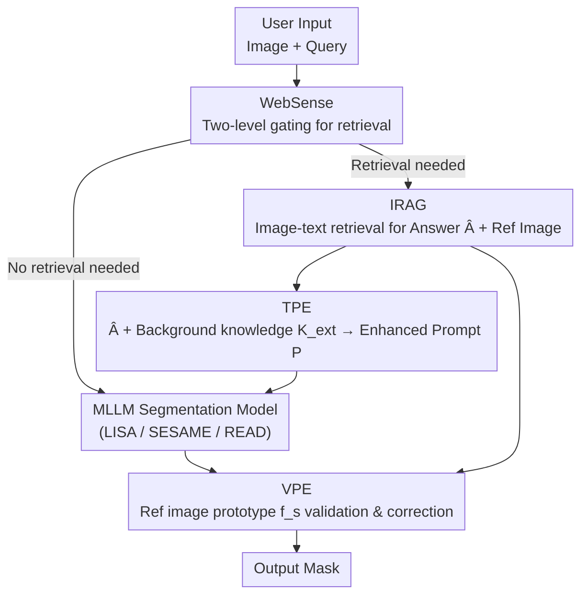

# ROSE: Retrieval-Oriented Segmentation Enhancement

**Conference**: CVPR 2026  
**arXiv**: [2604.14147](https://arxiv.org/abs/2604.14147)  
**Code**: https://henghuiding.com/ROSE/ (Project Page)  
**Area**: Segmentation / Multimodal VLM  
**Keywords**: Reasoning Segmentation, Emerging Entities, Retrieval-Augmented Generation, MLLM, Plug-and-play

## TL;DR
Addressing the critical flaw where Multimodal Large Language Model (MLLM) based segmentation models fail to recognize "entities appearing after the training cutoff," this paper proposes a new task NEST (Newly Emerging Entity Segmentation) along with an automatic data engine. It designs the plug-and-play ROSE framework, which leverages internet retrieval to feed textual answers and reference images into MLLM segmentation models in real-time. ROSE improves the gIoU on NEST by 19.2% compared to the strong retrieval baseline based on Gemini-2.0 Flash.

## Background & Motivation
**Background**: MLLM-based segmentation models like LISA, SESAME, and READ utilize the reasoning capabilities and world knowledge of large models for "reasoning segmentation"—given a query like "please segment the founder of SpaceX," the model can identify the corresponding person in an image with zero-shot capability.

**Limitations of Prior Work**: MLLM training is extremely costly (resource-intensive data collection, cleaning, and training) and cannot be updated frequently, leading to a "knowledge cutoff." Real-world knowledge evolves rapidly: a LLaMA 3 model from 2023 has no concept of what an iPhone 17 Pro Max (released in 2025) looks like. Although LISA recognizes Joe Biden and Donald Trump individually, it cannot answer "Who is the current President of the United States?" at a specific future time. Consequently, segmentation fails whenever queries involve recent entities.

**Key Challenge**: MLLM knowledge represents a "frozen snapshot," while segmentation tasks face a "continuously evolving open world"—creating a fundamental temporal gap. Narrowing this gap through retraining is neither fast nor cost-effective.

**Goal**: To enable MLLM segmentation models to handle two types of entities they originally cannot manage: (i) **Novel entities**: entirely absent from training data (e.g., iPhone 17 Pro Max, Xiaomi SU7); (ii) **Emerging entities**: concepts existing in the knowledge base but evolving over time, requiring current context for correct identification (e.g., "the current US President").

**Key Insight**: Since retraining is infeasible, this work borrows the concept of RAG (Retrieval-Augmented Generation) to retrieve the latest information from the internet during inference. This external knowledge is integrated into any MLLM segmentation model in a "plug-and-play" manner without altering the model itself. However, since segmentation is a multimodal task, text-only retrieval is insufficient; novel entities require visual prototypes from web images to supplement "what they look like."

**Core Idea**: Use "internet multimodal retrieval" to supplement missing knowledge at the input stage of the MLLM segmentation model. Specifically, textual answers and background knowledge are provided (targeting emerging entities), and reference image prototypes are added (targeting novel entities). A lightweight gate determines when retrieval is necessary.

## Method

### Overall Architecture
The objective of ROSE is to extend the segmentation capability of the original model, restricted to training knowledge space $K$, to $S = K \cup E$ (where $E$ is an external knowledge base). Given an input image $x_{img}$ and a user query $x_{query}$, the process is as follows: **WebSense** first determines if the query requires internet access to save computation and latency. If required, the **IRAG** (Internet Retrieval-Augmented Generation) module uses image-text inputs to search the web, yielding a definitive text answer $\hat{A}$ and relevant reference images $\hat{x}_{img}$. Subsequently, the **TPE** (Textual Prompt Enhancer) combines $\hat{A}$ with background knowledge $K_{ext}$ to form an enhanced prompt $P=f(x_{query}, \hat{A}, K_{ext})$, which is fed into the MLLM segmentation model for an initial result. The **VPE** (Visual Prompt Enhancer) then uses prototype features extracted from $\hat{x}_{img}$ to validate or correct this result. Finally, the underlying MLLM segmentation model (e.g., LISA) outputs the mask. This entire system acts as a "plug-and-play" add-on without modifying the weights of the original model.

### Key Designs

**1. IRAG: Compressing "Answer Candidates" into a Unique Answer via Joint Image-Text Retrieval**
A fatal issue with text-only retrieval is that answers to a question are often not unique (yielding a set of candidates $\{A_j\}_{j=1}^m$), making it unclear which one appears in the image. Implemented based on LangChain, IRAG first uses an LLM to rewrite $x_{query}$ into an optimized search term $q$, retrieves web content, and splits it into chunks $\{C_i\}_{i=1}^n$. These are vectorized as $E(C_i)\in\mathbb{R}^d$ and stored in a vector database $D=\{(E(C_i),C_i)\}$. Then, map-reduce and specialized prompts are used to extract relevant information into a summary of answer candidates $\{A_j\}$. The critical "disambiguation" step relies on the image: **Google Cloud Vision** (rather than the MLLM—since the MLLM precisely fails to recognize novel entities) extracts entities $\{E_k\}_{k=1}^l$ from $x_{img}$. The unique answer $\hat{A}$ is determined by matching candidate answers with these entities; if no match is found, the highest-confidence candidate is selected. Finally, reference images $\hat{x}_{img}$ are crawled using $\hat{A}$ as a keyword. This step simultaneously produces "textual answers" and "visual references."

**2. TPE: Weaving Retrieved Answers into the Prompt for "Emerging Entities"**
Simply having an answer word is insufficient; the MLLM must "understand" the target for accurate segmentation. TPE merges three components into an enhanced prompt $P=f(x_{query}, \hat{A}, K_{ext})$: the original query $x_{query}$, the answer $\hat{A}$ from IRAG, and the target description/background knowledge $K_{ext}$ retrieved using $\hat{A}$. This provides the model with clear direction and rich context, allowing the MLLM to align "retrieved new knowledge" with the "original instruction." Ablations show this primarily improves performance on emerging entities, where models have some prior concept but need current information.

**3. VPE: Validating and Correcting with Visual Prototypes for "Novel Entities"**
For completely unseen novel entities, textual descriptions are often inadequate for the MLLM. VPE follows a "validate-then-correct" path: it clusters reference images $\hat{x}_{img}$ from IRAG, keeps the largest cluster, and extracts CLIP features to obtain a prototype $f_s$. It then extracts CLIP features from the foreground region currently segmented by the MLLM and calculates similarity with $f_s$. Low similarity indicates a failure by the MLLM. Correction is then triggered: an object detector extracts candidate entities $\{E_i\}_{i=1}^n$ from $x_{img}$, and their features $f_i$ are compared against $f_s$. The highest-scoring candidate above a confidence threshold $\tau$ is identified as the target, and its bounding box is fed into **SAM's mask decoder** to generate a high-quality mask $\hat{M}$. This step bypasses the MLLM's cognitive blind spots for novel entities.

**4. WebSense: Distinguishing When to Retrieve**
Not every query requires internet access—many can be answered using internal knowledge. WebSense adopts a two-level decision process: the first level is a lightweight rule-based filter using predefined heuristics (e.g., time-sensitive keywords); for ambiguous or semantically complex queries, a second-level LLM performs deep semantic analysis. This ensures retrieval is only triggered when necessary, making ROSE "resource-aware."

### Example Scenario
Consider the query: "Which MLB player hit the walk-off three-run home run for the Dodgers on May 10, 2025? Please segment him." 
1. **WebSense** detects the time-sensitive term "May 10, 2025" and triggers retrieval.
2. **IRAG** rewrites the search term, retrieves news, and identifies candidate players via map-reduce. It matches these candidates with persons identified by Google Cloud Vision in $x_{img}$ to lock the unique answer $\hat{A}$ (the specific player).
3. **TPE** combines the answer and player bio into a prompt for LISA's initial segmentation.
4. **VPE** validates LISA’s output against the player’s web reference prototype. If LISA segments the wrong person (low similarity), VPE uses detective boxes to find the correct player and passes the box to SAM for the final mask.

## Key Experimental Results

Implementation Details: The base LLM is Llama-3-8B (knowledge cutoff 2023-12). Prototype features use CLIP-ViT-L/32, the detector is YOLOv8, and masks are generated by SAM. Evaluation is conducted on an A6000 48G. Metrics include gIoU, cIoU, and Acc. (for RAG QA quality). The NEST dataset contains 1,548 samples.

### Main Results: NEST Dataset

| Method | RAG | Acc. | Novel gIoU | Emerging gIoU | Overall gIoU | Overall cIoU |
|------|-----|------|-----------|---------------|--------------|--------------|
| LISA-7B (Baseline) | ✗ | - | 38.4 | 56.5 | 48.7 | 39.3 |
| Grounded-SAM | ✗ | - | 39.0 | 53.8 | 47.4 | 36.7 |
| LISA-7B + GPT-4o mini Search | ✓ | 68.1 | 35.4 | 67.0 | 53.5 | 49.0 |
| LISA-7B + Gemini-2.0 Flash Search | ✓ | 69.6 | 35.2 | 67.8 | 53.8 | 49.3 |
| **LISA-7B + ROSE (Ours)** | ✓ | **73.4** | **67.0** | **77.5** | **73.0** | **68.6** |
| **READ-7B + ROSE (Ours)** | ✓ | 74.2 | 67.1 | 76.0 | 72.2 | 68.3 |

Commercial retrieval baselines (two-stage: search via GPT-4o/Gemini, then prompt the segmentation model) improve **emerging entities** to ~67 gIoU but stagnate on **novel entities** (around 35) because they only provide text answers. ROSE brings novel entity gIoU to 67.0, with an overall gIoU 19.2% higher than the Gemini baseline (73.0 vs 53.8), proving the necessity of "visual completion."

### Generalization: NEST+ Mixed Dataset

| Method | NEST gIoU | ReasonSeg gIoU | RefSeg gIoU | Overall gIoU |
|------|-----------|----------------|-------------|--------------|
| LISA-7B | 51.1 | 42.5 | 54.9 | 50.9 |
| LISA-7B + ROSE | 75.3 | 42.2 | 54.4 | 67.6 |
| READ-7B + ROSE | 71.6 | 50.3 | 64.7 | 67.9 |

ROSE significantly improves NEST while maintaining performance on ReasonSeg and RefSeg (RefCOCO/+/g), as WebSense skips retrieval for these traditional tasks.

### Ablation Study (NEST, LISA-7B baseline, WebSense off)

| Configuration | Novel gIoU | Novel cIoU | Emerging gIoU | Overall gIoU | Overall cIoU |
|------|-----------|-----------|---------------|--------------|--------------|
| LISA-7B | 38.4 | 28.5 | 56.5 | 48.7 | 39.3 |
| + IRAG only | 40.4 | 30.9 | 67.1 | 55.7 | 49.1 |
| + IRAG + TPE | 41.3 | 31.6 | 73.3 | 59.6 | 51.8 |
| + IRAG + VPE | 64.9 | 61.7 | 71.7 | 68.7 | 63.8 |
| + Full (IRAG+TPE+VPE) | 68.6 | — | 79.4 | 74.7 | 70.1 |

## Key Findings
- **VPE is the turning point**: Adding VPE increases novel entity gIoU from 40.4 to 64.9 (+24.5% cIoU). This demonstrates that the bottleneck for novel entities is the lack of "visual concepts," which text descriptions cannot fully resolve.
- **TPE targets emerging entities**: Adding TPE to IRAG improves emerging entity gIoU by 6.2% but has negligible impact on novel entities, showing a clear division of labor.
- **IRAG as the foundation**: IRAG alone improves overall gIoU by 7.0% but fails to help "unseen" novel entities, highlighting the need for VPE.

## Highlights & Insights
- **Dual diagnosis of failures**: Categorizing MLLM segmentation failures into "missing current info" vs. "missing visual concepts" allows for targeted solutions (TPE vs. VPE).
- **Practical design using Google Cloud Vision**: The use of specialized vision APIs for disambiguation instead of the MLLM avoids the "blind leading the blind" problem since the MLLM inherently lacks knowledge of novel entities.
- **Two-stage validation-correction**: The VPE mechanism only invokes the correction pipeline (Detector + SAM) when the MLLM fails, ensuring the system doesn't degrade performance on samples where the MLLM is already correct.
- **Dynamic Data Engine**: Using Google Trends to automatically generate benchmarks prevents data leakage, as fixed datasets would eventually be incorporated into future MLLM training.

## Limitations & Future Work
- **External Chain Dependency**: IRAG relies on multiple external services (Search, Google Vision, LangChain). Failure or latency in any stage impacts the results.
- **Ambiguity in Disambiguation**: When candidates do not match extracted entities, the system defaults to the highest-confidence candidate, which is prone to error in noisy scenarios.
- **Evaluation Scope**: NEST currently focuses on people and products. Abstract or scene-level emerging entities are not yet covered.

## Related Work & Insights
- **vs. LISA / READ**: These models rely on internal knowledge and face temporal cutoffs. ROSE acts as a "temporal patch" that enhances them without retraining.
- **vs. Commercial Baselines**: ROSE outperforms "text-only" commercial search baselines by providing visual prototypes, especially for novel entities.
- **vs. Traditional RAG**: This work extends the RAG paradigm from pure text generation to "multimodal RAG for segmentation," moving from knowledge retrieval to pixel-level grounding.

## Rating
- **Novelty**: ⭐⭐⭐⭐⭐ Introduction of NEST task + automatic rolling benchmark + first multimodal RAG for MLLM segmentation.
- **Experimental Thoroughness**: ⭐⭐⭐⭐ Solid ablations across multiple base models, though lacks end-to-end latency analysis.
- **Writing Quality**: ⭐⭐⭐⭐ Clear motivation and modular explanation.
- **Value**: ⭐⭐⭐⭐⭐ Directly addresses the "frozen knowledge" pain point of MLLMs with a practical, plug-and-play solution.

<!-- RELATED:START -->

## Related Papers

- [\[CVPR 2026\] Task-Oriented Data Synthesis and Control-Rectify Sampling for Remote Sensing Semantic Segmentation](task-oriented_data_synthesis_and_control-rectify_sampling_for_remote_sensing_sem.md)
- [\[CVPR 2026\] HOPS: Hierarchical Open-vocabulary Part Segmentation with Attention-Aware Filtering and Affinity-Guided Enhancement](hops_hierarchical_open-vocabulary_part_segmentation_with_attention-aware_filteri.md)
- [\[CVPR 2026\] Follow the Saliency: Supervised Saliency for Retrieval-augmented Dense Video Captioning](follow_the_saliency_supervised_saliency_for_retrieval-augmented_dense_video_capt.md)
- [\[ECCV 2024\] General and Task-Oriented Video Segmentation](../../ECCV2024/segmentation/general_and_task-oriented_video_segmentation.md)
- [\[CVPR 2026\] Love Me, Love My Label: Rethinking the Role of Labels in Prompt Retrieval for Visual In-Context Learning](love_me_love_my_label_rethinking_the_role_of_labels_in_prompt_retrieval_for_visu.md)

<!-- RELATED:END -->
