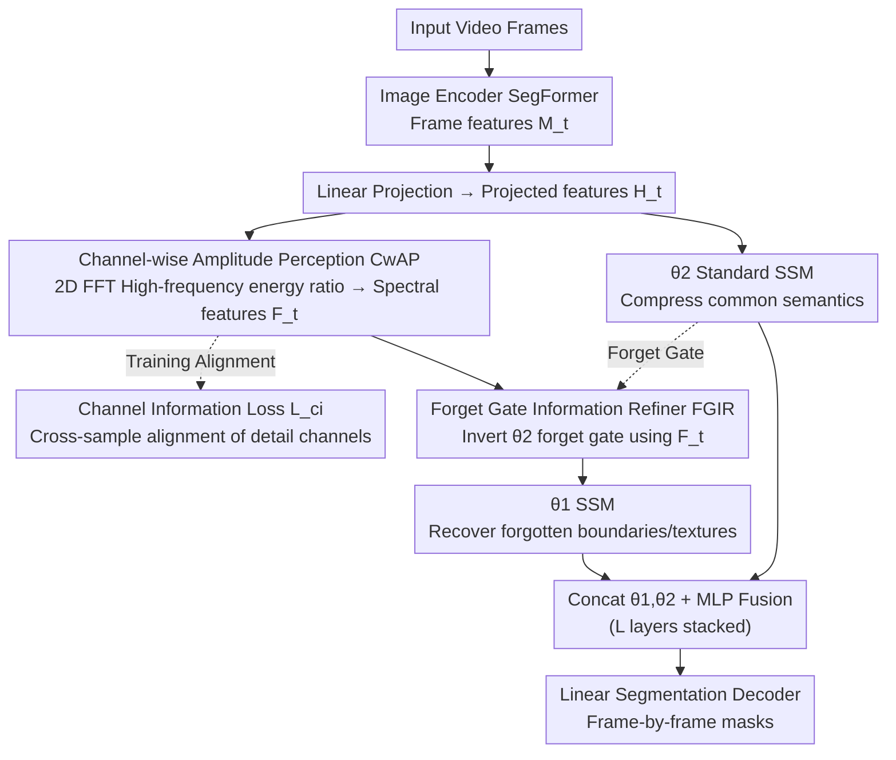

# RS-SSM: Refining Forgotten Specifics in State Space Model for Video Semantic Segmentation

**Conference**: CVPR 2026  
**arXiv**: [2603.24295](https://arxiv.org/abs/2603.24295)  
**Code**: [https://github.com/zhoujiahuan1991/CVPR2026-RS-SSM](https://github.com/zhoujiahuan1991/CVPR2026-RS-SSM)  
**Area**: Semantic Segmentation / Video Understanding  
**Keywords**: Video Semantic Segmentation, State Space Model, Forget Gate Refinement, Frequency Domain Analysis, Mamba

## TL;DR

RS-SSM is proposed to extract channel-wise specific information distribution features (CwAP) through frequency domain analysis and adaptively invert the forget gate matrix to supplement and refine spatio-temporal details lost during SSM state space compression (FGIR). It achieves SOTA performance on four video semantic segmentation benchmarks while maintaining high efficiency.

## Background & Motivation

1. **Background**: Video Semantic Segmentation (VSS) requires assigning semantic labels to every pixel in every frame while maintaining temporal consistency. Early methods used optical flow to model inter-frame motion but were computationally expensive and noisy. Transformer methods aggregated spatio-temporal information via global attention but suffered from quadratic complexity. Recently, State Space Model (SSM) based methods have efficiently compressed and propagated spatio-temporal semantic information with linear complexity.

2. **Limitations of Prior Work**: SSM compresses sequence information through a fixed-size state space. While effective for retaining common semantics (global structures, smooth regions), it inevitably loses specific information (boundaries, textures, local variations), leading to segmentation results that only roughly locate objects with blurred details.

3. **Key Challenge**: The essence of state space compression is representing an infinitely long sequence with limited-dimensional hidden states. The forget gate $\bar{A}_d = \exp(\Delta_d A_d)$ determines the degree of decay for historical information. Smaller forget gate values lead to aggressive compression, while values near 1 retain more information—for pixel-level VSS, the standard forget gate decay strategy systematically loses high-frequency details.

4. **Goal**: To compensate for the loss of spatio-temporal specific information during state space compression while maintaining the linear complexity advantage of SSM.

5. **Key Insight**: It is observed that different channels of hidden states contain varying amounts of specific information. Frequency domain analysis can be used to quantify the high-frequency energy ratio of each channel, followed by inverting the forget gate to specifically refine channels rich in high-frequency information.

6. **Core Idea**: Locate "specific information-rich" channels via frequency domain analysis and adaptively invert the forget gate to compensatively restore the spatio-temporal details compressed and forgotten.

## Method

### Overall Architecture

Input video frames $\{I_t\}_{t=1}^T$ pass through an image encoder to extract features $\{M_t\}$, which are then fed into $L$ dual-path SSM layers. Each layer first performs weight-shared linear projection to obtain projected features $H_t$, which are then split into two paths: $\theta_2$ is a standard SSM that compresses common semantics as usual; $\theta_1$ is responsible for compensation. The Channel-wise Amplitude Perception (CwAP) performs frequency domain analysis on $H_t$ to obtain spectral features $F_t$ (using Channel Information Loss $\mathcal{L}_{ci}$ for cross-sample alignment of detail channels), and the Forget Gate Information Refiner (FGIR) uses $F_t$ to invert the forget gate of $\theta_2$ to guide $\theta_1$ in focusing on recovering forgotten specific information. The outputs of the two paths are concatenated and fused via an MLP. These layers are stacked and finally fed into a linear segmentation decoder to generate frame-by-frame masks.

### Key Designs

**1. Channel-wise Amplitude Perception (CwAP): Locating "Detail-rich" Channels via High-frequency Energy Ratio**

To recover forgotten details, one must first identify which channels contain them—however, SSM hidden states lack labels indicating whether a dimension stores boundaries or smooth regions. CwAP uses the frequency domain for quantification: projected features $H_t \in \mathbb{R}^{D \times H \times W}$ undergo a 2D FFT to the frequency domain to obtain the amplitude spectrum $H_t^m$. The spectrum is then partitioned into $K$ concentric bands based on normalized frequency radius. Low-frequency bands correspond to common semantics like global structure, while high-frequency bands correspond to specific information like boundaries and textures. For each channel, the normalized energy ratio falling within the highest $k_h$ high-frequency bands is calculated to form spectral features $F_t \in \mathbb{R}^D$. Dimensions with larger values in $F_t$ represent channels with high-frequency content and rich details. This metric is unsupervised, requires only one FFT ($O(n\log n)$), and provides a map for subsequent refinement without additional labels.

**2. Channel Information Loss $\mathcal{L}_{ci}$: Aligning Detail Distributions Across Samples**

If spectral features from CwAP vary significantly between samples (e.g., details in channels 3 and 7 for one frame, but channels 12 and 20 for another), FGIR cannot use a unified strategy for refinement, leading to unstable training. $\mathcal{L}_{ci}$ enforces consistency: spectral features for each frame are L2-normalized, and a cosine similarity matrix $\mathbf{S}_{i,j}$ is calculated for all frame pairs within a batch. The loss is:

$$\mathcal{L}_{ci} = 1 - \frac{1}{|\mathcal{B}|^2} \sum_i \sum_j \mathbf{S}_{i,j}$$

Maximizing the average cosine similarity forces "specific information" into a stable subset of channels across samples, allowing FGIR to consistently refine the same dimensions for better convergence.

**3. Forget Gate Information Refiner (FGIR): Inverting the Forget Gate to Specifically Retrieve Details**

SSM is efficient because the forget gate $\bar{A}_d = \exp(\Delta_d A_d)$ actively decays historical information—the root cause of detail loss. Directly increasing the forget gate to "forget less" would destroy compression advantages. FGIR uses a dual-path approach: $\theta_2$ acts as a standard SSM for common semantics, while $\theta_1$ handles compensation. The key operation is "forget gate inversion"—the forget gate of $\theta_2$ itself indicates which channels are most decayed (losing the most detail). FGIR uses spectral features $F_t$ as weights to ensure these heavily compressed channels retain more information in $\theta_1$. Thus, $\theta_1$ focuses on channels that $\theta_2$ discarded but are identified as high-frequency. By merging the two outputs, $\theta_2$ maintains global semantics while $\theta_1$ restores boundary textures, creating a complementary division of labor.

### Loss & Training

The total loss includes standard cross-entropy loss for semantic segmentation and the channel information loss $\mathcal{L}_{ci}$. The image encoder uses SegFormer pre-trained weights. Input resolution is $480 \times 853$ for GFLOPs and FPS calculations. The number of dual-path SSM layers $L$ is a hyperparameter. The number of frequency bands $K$ and high-frequency bands $k_h$ are key hyperparameters for CwAP.

## Key Experimental Results

### Main Results

RS-SSM was compared with existing methods on VSPW, NYUv2, and CamVid datasets. It achieves SOTA or competitive accuracy while maintaining high efficiency:

| Dataset | Metric | RS-SSM Performance | Description |
| :--- | :--- | :--- | :--- |
| VSPW | mIoU | SOTA | Large-scale video semantic segmentation benchmark |
| NYUv2 | mIoU | SOTA | Indoor scene segmentation |
| CamVid | mIoU | SOTA | Driving scene video segmentation |
| 4 Benchmarks Overall | mIoU + GFLOPs + FPS | Best accuracy with efficiency | Linear complexity vs. Transformer quadratic complexity |

### Ablation Study

| Configuration | Description |
| :--- | :--- |
| Full RS-SSM | Complete model with CwAP + FGIR + $\mathcal{L}_{ci}$ |
| w/o CwAP | Frequency domain analysis removed; FGIR lacks spectral guidance |
| w/o FGIR | Forget gate inversion removed; standard dual-path SSM only |
| w/o $\mathcal{L}_{ci}$ | Channel alignment loss removed |
| Single-path SSM | Dual-path removed; degenerates to standard SSM (e.g., TV3S) |

### Key Findings

- **Forget gate inversion is the core contribution**: Visualizing the update gate $\bar{B}_d$ shows that standard SSM $\theta_2$ severely decays information in detail regions, whereas $\theta_1$ effectively restores forgotten boundaries and textures.
- **CwAP provides effective channel selection signals**: Channels with high high-frequency energy ratios indeed correspond to more boundary and texture information.
- **Effect of $\mathcal{L}_{ci}$**: Cross-sample alignment enables FGIR to consistently refine a similar subset of channels, avoiding training instability.
- **Linear complexity advantage**: Compared to Transformer methods with quadratic complexity bottlenecks on long videos, RS-SSM maintains linear efficiency.

## Highlights & Insights

- **"The opposite of forgetting is refinement"**: Instead of trying to prevent SSM from forgetting (which harms compression), a complementary SSM is used to restore forgotten content. This design is more elegant than simply increasing state dimensions.
- **Frequency domain as a channel analysis tool**: Quantifying "specific information" via FFT amplitude spectra is intuitive (high frequency = boundaries), efficient ($O(n \log n)$), and label-free.
- **Systemic improvement of SSM for vision**: Identifies the key bottleneck of SSM in pixel-level tasks (forgotten details) and provides a targeted solution, guiding future Mamba developments.

## Limitations & Future Work

- The dual-path design increases parameters and computation (though remaining linear). Efficiency advantages need verification at higher resolutions or longer videos.
- Hyperparameters $K$ and $k_h$ require manual tuning and may vary by dataset.
- Evaluated only on 4 VSS benchmarks; panoptic or instance-level video segmentation remains untested.
- Forget gate inversion might cause "information overload" by excessively retaining certain long-range dependencies.
- Learnable frequency selection mechanisms could replace fixed band partitioning.

## Related Work & Insights

- **vs. TV3S**: TV3S was the first to apply SSM to VSS but ignored detail loss from state space compression. RS-SSM addresses this via forget gate inversion.
- **vs. Transformer VSS (CFFM/MRCFA)**: Transformers retain details via global attention but have quadratic complexity. RS-SSM achieves comparable or better accuracy with linear complexity.
- **vs. VideoMamba**: VideoMamba is a general backbone; RS-SSM is task-specific, providing a refinement strategy for pixel-level segmentation.

## Rating

- Novelty: ⭐⭐⭐⭐ The combination of forget gate inversion and frequency domain analysis is novel.
- Experimental Thoroughness: ⭐⭐⭐⭐ Covers 4 benchmarks; update gate visualization provides intuitive verification.
- Writing Quality: ⭐⭐⭐⭐ Rigorous mathematical derivation and clear visualizations.
- Value: ⭐⭐⭐⭐ Provides a systemic solution for SSM in pixel-level vision tasks.

<!-- RELATED:START -->

## Related Papers

- [\[CVPR 2025\] Exploiting Temporal State Space Sharing for Video Semantic Segmentation](../../CVPR2025/segmentation/exploiting_temporal_state_space_sharing_for_video_semantic_segmentation.md)
- [\[CVPR 2025\] MV-SSM: Multi-View State Space Modeling for 3D Human Pose Estimation](../../CVPR2025/segmentation/mv-ssm_multi-view_state_space_modeling_for_3d_human_pose_estimation.md)
- [\[CVPR 2026\] MARSS: Radar Semantic Segmentation via Modular Attention and State Space Models](marss_radar_semantic_segmentation_via_modular_attention_and_state_space_models.md)
- [\[CVPR 2025\] GroupMamba: Efficient Group-Based Visual State Space Model](../../CVPR2025/segmentation/groupmamba_efficient_group-based_visual_state_space_model.md)
- [\[CVPR 2025\] DefMamba: Deformable Visual State Space Model](../../CVPR2025/segmentation/defmamba_deformable_visual_state_space_model.md)

<!-- RELATED:END -->
