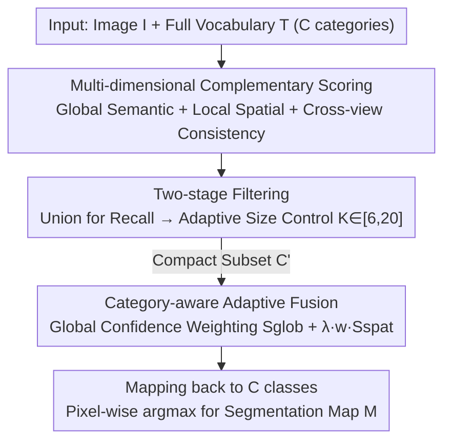

# S2C2Seg: Semantic-Spatial Consistency and Category Optimization for Open-Vocabulary Segmentation

**Conference**: CVPR 2026  
**Paper**: [CVF Open Access](https://openaccess.thecvf.com/content/CVPR2026/html/Qing_S2C2Seg_Semantic-Spatial_Consistency_and_Category_Optimization_for_Open-Vocabulary_Segmentation_CVPR_2026_paper.html)  
**Code**: To be confirmed  
**Area**: Open-vocabulary segmentation  
**Keywords**: Open-vocabulary segmentation, training-free, category subset selection, global-local fusion, CLIP

## TL;DR
S2C2Seg is a training-free, plug-and-play framework compatible with any CLIP-based segmentation method. It first prunes ultra-large vocabularies into a compact Candidate Subset (CSS) through a three-way scoring mechanism involving "global semantics + local spatial + cross-view consistency." Then, it adaptively fuses CLIP's global features with CLIPSeg's local predictions using category confidence weighting (CSG). Across 8 benchmarks, it provides mIoU improvements of +9.7, +6.8, and +3.4 for SCLIP, ProxyCLIP, and CorrCLIP respectively, pushing the average mIoU to a new SOTA of 51.2%.

## Background & Motivation

**Background**: Open-vocabulary semantic segmentation (OVSS) aims to generalize pixel-level recognition to categories described by arbitrary text. Prevailing training-free approaches directly leverage vision-language models like CLIP for dense prediction, as CLIP learns robust global image-text alignment during contrastive pre-training, enabling accurate zero-shot classification. Recent works (e.g., SCLIP, ProxyCLIP, CorrCLIP) mostly focus on spatial refinement of CLIP's self-attention or introducing complementary priors from models like DINO or diffusion models to compensate for spatial details.

**Limitations of Prior Work**: CLIP's pre-training objective is "global image-text alignment," making it inherently weak at dense prediction. This leads to two major bottlenecks: first, the spatial localization of attention maps is coarse; second, as vocabulary size increases, the activations of semantically similar (e.g., airplane / aircraft) or co-occurring (e.g., road / vehicle) categories overlap and contaminate each other. Current research lines typically address only one side: **Spatial refinement methods** (attention refinement, feature denoising, complementary models) treat all candidate categories equally regardless of semantic similarity or prediction reliability, passing blurred activations from global features directly to the final prediction. **Disambiguation methods** (CaR, FLOSS, CDAM) prune categories based on similarity ranking or entropy but rely on single-dimensional global similarity, ignoring spatial prediction consistency.

**Key Challenge**: The problems of "coarse localization" and "category overlap" are actually coupled—larger vocabularies with more similar categories cause blurred global activations to spread further spatially. Existing methods treat these as independent issues, leading to sub-optimal results: either pruning categories without refining space, or refining space without pruning categories.

**Goal**: To simultaneously resolve "vocabulary disambiguation" and "spatial refinement" within a training-free framework that can be directly integrated into existing baselines without additional training costs.

**Key Insight**: The authors observe that image-level models (CLIP) and pixel-level models (CLIPSeg) possess complementary capabilities—CLIP has stable global semantics but coarse spatial resolution, while CLIPSeg provides fine spatial details but inconsistent cross-category predictions. By combining "semantic, spatial, and consistency" clues from both, one can filter redundant categories and allocate trust based on category reliability during fusion.

**Core Idea**: First, prune the vocabulary into a compact subset using multi-dimensional scoring (reducing confusion sources), then adaptively fuse global and local features using category-aware confidence weighting (applying stronger global regularization to semantically strong categories while preserving local spatial precision for others). This combination of "vocabulary pruning + category-confidence fusion" simultaneously addresses redundancy and coarse localization.

## Method

### Overall Architecture
S2C2Seg treats the dense predictions of existing baselines as "spatial clue sources" and wraps two training-free modules into a two-stage pipeline. Given an image $I \in \mathbb{R}^{H \times W \times 3}$ and $C$ text categories $\mathcal{T}=\{t_1,\dots,t_C\}$, standard OVSS evaluates all $C$ categories independently for each pixel, which causes predictions to disperse among visually similar categories (redundancy) and lack global semantic constraints (global-local inconsistency). In the first stage, **Category Subset Selection (CSS)** prunes the $C$ categories into a compact subset $\mathcal{C}' \subset \mathcal{C}$ ($K=|\mathcal{C}'|$, constrained by $K_{\min}=6$ and $K_{\max}=20$). In the second stage, **Consistent Semantic Guidance (CSG)** adaptively fuses CLIP's global features with local spatial predictions on this subset to generate the final segmentation: $\mathbf{M}=\mathrm{CSG}(\mathbf{I}, \mathcal{C}', \mathbf{S}_{\text{spat}})$, where $\mathbf{S}_{\text{spat}}$ represents the pixel-level spatial predictions of the filtered subset (provided by the baseline or CLIPSeg).

### Key Designs

**1. Multi-dimensional Complementary Scoring: Voting via Semantic, Spatial, and Consistency Clues**

A common pitfall in vocabulary pruning is "rely on a single dimension"—CaR only uses CLIP's global similarity, which misses categories that have weak global alignment but strong local presence. CSS addresses this by calculating three complementary scores for each candidate category $c_i$. **Global semantic alignment** $s^{(i)}_{\text{glob}}$ uses CLIP to calculate the cosine similarity between L2-normalized text embeddings $\mathbf{T}\in\mathbb{R}^C \times d$ and global image features $v_{\text{glob}}\in\mathbb{R}^d$. **Local spatial presence** $s^{(i)}_{\text{spat}}$ spatial-averages the pixel-level activation maps $P^{(i)}\in[0,1]^{H'\times W'}$ from the dense model; a higher value indicates stronger fine-grained evidence in the frame. **Cross-view consistency** is more nuanced: the two scores are first L1-normalized into distributions $\bar{s}_{\text{glob}}$ and $\bar{s}_{\text{spat}}$. Their inner product is passed through a sigmoid to obtain a fusion weight 

$$\alpha = \sigma\!\left(\sum_{i=1}^{C}\bar{s}^{(i)}_{\text{glob}}\cdot\bar{s}^{(i)}_{\text{spat}} - 0.5\right),$$

resulting in a high $\alpha$ when views are consistent and a low $\alpha$ when they conflict. This is re-normalized to a fused distribution $p^{(i)}$. Crucially, the authors use "conditional entropy" to quantify the certainty of each category selection. After selecting $c_i$, the residual distribution is $p^{(j|i)}_{\text{res}}=p^{(j)}/(1-p^{(i)})$, and the normalized conditional entropy is $H^{(i)}=-\frac{1}{\log(C-1)}\sum_{j\neq i}p^{(j|i)}_{\text{res}}\log p^{(j|i)}_{\text{res}}$. The final consistency score is

$$s^{(i)}_{\text{conf}} = p^{(i)}\,(1-H^{(i)}) \in [0,1],$$

rewarding categories that have both a high probability of appearance $p^{(i)}$ and high selection certainty $1-H^{(i)}$. By combining these three clues, the method avoids the blind spots of any single metric.

**2. Two-stage Filtering: Union for Recall, Unified Scoring for Adaptive Size Control**

To prune categories without missing targets or retaining redundancy, CSS employs a "loose-then-tight" two-stage strategy. **Stage 1: Multi-aspect Aggregation for Recall**: The Top-$\lfloor\tau C\rfloor$ indices (with a uniform retention ratio $\tau\in(0,1]$) are taken from each of the three score vectors to form index sets $\mathcal{I}_k$. Their **union** $\mathcal{C}_{\text{init}}=\{c_i: i\in\mathcal{I}_{\text{glob}}\cup\mathcal{I}_{\text{spat}}\cup\mathcal{I}_{\text{conf}}\}$ is taken to ensure that any category with strong evidence in any dimension is preserved, maximizing recall. **Stage 2: Adaptive Size Control for Precision**: For each category in $\mathcal{C}_{\text{init}}$, the three scores are min-max normalized to $[0,1]$. A unified ranking score $s^{(i)}_{\text{final}}=\hat{s}^{(i)}_{\text{glob}}+\hat{s}^{(i)}_{\text{spat}}+\hat{s}^{(i)}_{\text{conf}}$ is calculated, and the Top-$K$ items are selected, where $K$ is clamped between $K_{\min}=6$ and $K_{\max}=20$. The lower bound ensures sufficient diversity even in simple scenes, while the upper bound prevents redundant categories in complex scenes.

**3. Category-aware Adaptive Fusion: Trusting Local Predictions Based on Global Semantic Strength**

After pruning the vocabulary, the challenge is merging CLIP's global semantics with CLIPSeg's local spatial predictions. Simple addition treats all categories equally, but reliability varies significantly. CSG performs dual-stream feature extraction: the CLIP vision encoder provides patch-level features to calculate a patch-text similarity matrix $\mathbf{S}_{\text{glob}}=\bar{\mathbf{V}}\bar{\mathbf{T}}'^{\top}$, which is bilinearly upsampled. CLIPSeg provides local spatial predictions $\mathbf{S}_{\text{spat}}=F_{\text{dense}}(\mathbf{I},\mathcal{T}')$. The core of the fusion is **category confidence weighting**: global similarities are spatially averaged for each category $g^{(i)}=\frac{1}{HW}\sum_{h,w}\mathbf{S}^{(i)}_{\text{glob}}(h,w)$, and $g=[g^{(1)},\dots,g^{(K)}]^\top$ is passed through a temperature-scaled softmax to obtain confidence weights $w$. The final fused logits are

$$\mathbf{S}^{(i)}_{\text{fused}} = \mathbf{S}^{(i)}_{\text{glob}} + \lambda\cdot w^{(i)}\cdot\mathbf{S}^{(i)}_{\text{spat}},$$

where $\lambda$ balances global and local contributions. The weight $w^{(i)}$ ensures that categories with strong global semantic evidence receive higher weights to absorb more local spatial details (since the localization is likely more trustworthy), while weights for weaker categories are down-regulated to avoid noise. Finally, the $K$ subset categories are mapped back to the full $C$-class label space, with excluded categories filled with $-\infty$. Pixel-wise argmax determines the segmentation map $\mathbf{M}(h,w)=\arg\max_j \mathbf{S}^{(j)}_{\text{final}}(h,w)$.

### Loss & Training
The method is entirely training-free, with no learnable parameters or loss functions. It utilizes ViT-B/16 CLIP as the vision-language backbone and CLIPSeg for dense prediction. Each category uses 80 prompt templates for text embeddings. Key hyperparameters: CSS retention ratio $\tau=0.3$, subset size bounds $K_{\min}=6$/$K_{\max}=20$, and CSG fusion weight $\lambda=0.6$. The short side of images is resized to 336 for VOC/Context and 448 for ADE20K/Cityscapes/COCO-Stuff.

## Key Experimental Results

### Main Results
mIoU results across 8 benchmarks (VOC20/21, Context59/60, COCO-Object, COCO-Stuff, ADE20K, Cityscapes) show that S2C2Seg consistently improves three representative baselines:

| Configuration | Average mIoU | Gain | Notes |
|------|-----------|------|------|
| SCLIP (ECCV'24) | 38.2 | — | Attention refinement type |
| SCLIP + Ours | 47.9 | **+9.7** | Larger gain on weaker baseline |
| ProxyCLIP (ECCV'24) | 42.3 | — | Uses self-supervised models |
| ProxyCLIP + Ours | 49.1 | **+6.8** | — |
| CorrCLIP (ICCV'25) | 47.8 | — | Current SOTA baseline |
| CorrCLIP + Ours | **51.2** | **+3.4** | New SOTA |
| Trident (ICCV'25) | 45.8 | — | One of the previous best |
| CASS (CVPR'25) | 44.4 | — | — |

The 51.2% mIoU achieved by S2C2Seg+CorrCLIP outperforms Trident by 5.4 points and CASS by 6.8 points. Gains are inversely proportional to baseline complexity. On VOC21, which contains background, CSG corrects local biases using CLIP's global discriminative power, resulting in a single-dataset increase of +11.5 points.

### Ablation Study
Component ablation (using ProxyCLIP / CLIPSeg as baseline) and CSS three-dimensional scoring ablation:

| Configuration | VOC21 mIoU | 8-bench Avg | Description |
|------|-----------|--------------|------|
| ProxyCLIP baseline | 61.3 | — | Original baseline |
| + CSS only | 64.3 | — | Pruning only, VOC21 +3.0 |
| Ours (w/o CSG) | 70.4 | — | Pruning + uniform weighting, VOC21 +9.1 |
| Ours (w/o CSS) | 68.0 | — | No pruning + adaptive fusion, VOC21 +6.7 |
| **Ours (Full)** | **72.8** | — | VOC21 +11.5 (Super-additive) |

| CSS Scoring Dimensions | 8-bench Avg mIoU | Description |
|--------------|-------------------|------|
| w/o Sel. (No pruning) | 45.9 | Baseline |
| $S_{\text{glob}}$ only | — | Global similarity only |
| $S_{\text{glob}}+S_{\text{spat}}$ | 47.7 | Incl. spatial presence |
| $S_{\text{glob}}+S_{\text{conf}}$ | 47.8 | Incl. consistency |
| **Full CSS (3D)** | **49.1** | Optimal three-way complementarity |
| Oracle (GT Classes) | 61.9 | Upper bound |

For the CSG fusion strategy comparison, category-aware fusion achieved 49.1% average mIoU, which is +2.4 higher than direct addition (Add. 70.4 on VOC21). Improvements were particularly significant on Context59 (+4.6) and ADE (+2.7).

### Key Findings
- **Complementary and Super-additive Modules**: On VOC21, CSS alone provides +3.0 and CSG alone provides +6.7, but together they yield +11.5, suggesting that fusion is most effective only after the vocabulary is cleaned.
- **Essential Three-Way Scoring**: Removing any dimension results in a performance drop; cross-view consistency $S_{\text{conf}}$ and spatial presence $S_{\text{spat}}$ are true supplements to global similarity.
- **Disambiguation via Confusion Matrix**: CSS primarily reduces confusion between semantically similar classes (e.g., bicycle/motorbike), while CSG reduces confusion between spatially adjacent classes (e.g., person/chair).
- **Hyperparameter Robustness**: Performance is stable across various $\lambda$, $\tau$, and $K_{\max}$ values, suggesting the method does not rely on meticulous fine-tuning.
- **Oracle Upper Bound (61.9%)**: The gap between Full CSS (49.1%) and the Oracle suggests significant room for further improvement in category selection.

## Highlights & Insights
- **Training-free & Plug-and-play**: Does not introduce learnable parameters and improves various baselines. This "external module" design has very low migration costs.
- **Systematic Vocabulary Pruning**: Unlike previous single-metric methods, it combines global semantics, local spatial, and cross-view consistency, using conditional entropy to encode both "existent probability" and "lack of entanglement."
- **Category Confidence Weighting**: The idea of applying stronger local refinement to certain categories while relying on global semantics for uncertain ones acts as a form of adaptive regularization.
- **Union-then-Rerank Strategy**: Stage 1 uses a union to ensure recall, followed by unified score ranking to control precision, which is more stable than fixed-threshold pruning.

## Limitations & Future Work
- **Oracle Gap**: The 12.8-point gap to the Oracle suggests that CSS recall/precision trade-offs can be improved further.
- **External Model Dependency**: The framework's overall performance is bounded by the quality of the local spatial prediction source (e.g., CLIPSeg).
- **Hard-coded Hyperparameters**: While robust, fixed bounds like $K \in [6, 20]$ may not be optimal for datasets with vastly different category counts (e.g., 19-class Cityscapes vs 171-class COCO-Stuff).
- **Computational Overhead**: Calculating conditional entropy for every candidate category might be expensive for ultra-large vocabularies (thousands of classes).

## Related Work & Insights
- **vs CaR (CVPR'24)**: CaR relies solely on global similarity, underestimating categories with weak global alignment but strong local existence; CSS includes spatial and consistency dimensions for better recall.
- **vs FLOSS / CDAM**: These use single-dimension criteria like text entropy or JS divergence; CSS balances recall and precision in a two-stage framework.
- **vs Spatial Refinement (SCLIP/CorrCLIP)**: These methods refine all categories equally; S2C2Seg complements them by adding category disambiguation and confidence-aware fusion.
- **vs DenseCLIP**: Unlike previous works that inject CLIP as a fixed prior, CSG introduces dynamic category-aware weighting to modulate local predictions based on global confidence.

## Rating
- **Novelty**: ⭐⭐⭐⭐ Combines "category selection" and "global-local fusion" through three-dimensional scoring and confidence weighting. While using existing components, the integration logic is clever.
- **Experimental Thoroughness**: ⭐⭐⭐⭐⭐ Comprehensive evaluation across 8 benchmarks and 3 baselines, with extensive ablations on scoring, fusion, and robustness.
- **Writing Quality**: ⭐⭐⭐⭐ Clear framework and formulas; though the CSS section is notation-heavy, it is logically sound.
- **Value**: ⭐⭐⭐⭐ High practical value due to its training-free, plug-and-play nature and significant SOTA improvements.

<!-- RELATED:START -->

## Related Papers

- [\[CVPR 2026\] Direct Segmentation without Logits Optimization for Training-Free Open-Vocabulary Semantic Segmentation](direct_segmentation_without_logits_optimization_for_training-free_open-vocabular.md)
- [\[CVPR 2026\] ReAttnCLIP: Training-Free Open-Vocabulary Remote Sensing Image Segmentation via Re-defined Attention in CLIP](reattnclip_training-free_open-vocabulary_remote_sensing_image_segmentation_via_r.md)
- [\[CVPR 2026\] PEARL: Geometry Aligns Semantics for Training-Free Open-Vocabulary Semantic Segmentation](pearl_geometry_aligns_semantics_for_training-free_open-vocabulary_semantic_segme.md)
- [\[CVPR 2026\] Looking Beyond the Window: Global-Local Aligned CLIP for Training-free Open-Vocabulary Semantic Segmentation](looking_beyond_the_window_global-local_aligned_clip_for_training-free_open-vocab.md)
- [\[CVPR 2026\] The Power of Prior: Training-Free Open-Vocabulary Semantic Segmentation with LLaVA](the_power_of_prior_training-free_open-vocabulary_semantic_segmentation_with_llav.md)

<!-- RELATED:END -->
