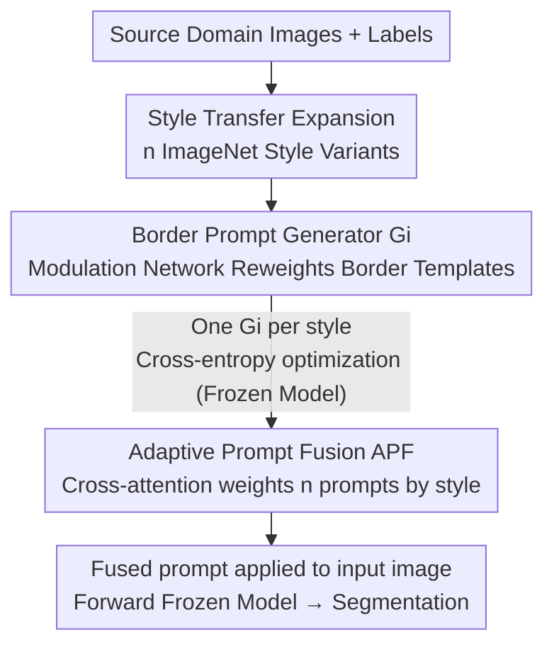

# SAGE: Style-Adaptive Generalization for Privacy-Constrained Semantic Segmentation Across Domains

**Conference**: CVPR 2026  
**Paper**: [CVF Open Access](https://openaccess.thecvf.com/content/CVPR2026/html/Li_SAGE_Style-Adaptive_Generalization_for_Privacy-Constrained_Semantic_Segmentation_Across_Domains_CVPR_2026_paper.html)  
**Code**: None  
**Area**: Semantic Segmentation / Domain Generalization  
**Keywords**: Domain Generalization Semantic Segmentation, Privacy Constraints, Visual Prompting, Style Transfer, Cross-Attention Fusion

## TL;DR
Addressing privacy-constrained deployment scenarios where "segmentation models are frozen and internal parameters cannot be accessed," SAGE avoids fine-tuning the backbone. Instead, it learns a generator for each style to produce border-shaped visual prompts, then adaptively fuses these prompts using cross-attention based on the input style to re-apply them to the input image. This allows a frozen model to surpass similar privacy-preserving methods across five DGSS benchmarks and outperform full fine-tuning in all settings.

## Background & Motivation
**Background**: The goal of Domain Generalization Semantic Segmentation (DGSS) is to train on source domains while generalizing to unseen target domains with different weather, lighting, or urban landscapes. Current mainstream approaches leverage the strong feature capabilities of foundation models like Transformers, **fine-tuning a backbone pre-trained on large-scale data** (e.g., ISW, SAW, FAMix) to eliminate domain-related style components through style decoupling or enhancement.

**Limitations of Prior Work**: These methods assume that **model parameters are modifiable**. However, in real-world deployment, segmentation models are often **frozen as black boxes** due to privacy protection, intellectual property, and deployment security (IP encryption, sandboxing). Internal parameters are inaccessible, making traditional fine-tuning or adaptation impossible. Consequently, the only remaining path is the "input-level": improving generalization by modifying inputs without touching model weights.

**Key Challenge**: The "style invariance" of a frozen model is static, whereas the "style diversity" of target domains is dynamic. Existing external visual prompting works (e.g., Bahng et al., A2XP) only modify the input without touching internal parameters, but they are mostly trained on a single domain, resulting in a **style-fixed prompt**. This prompt is only effective for images similar to the source domain and fails when styles change. Furthermore, prompts are typically applied during inference without opportunities for test-time optimization.

**Goal**: To enable cross-domain generalization for frozen segmentation models without accessing internal parameters, addressing two specific challenges: (1) Parameter inaccessibility; (2) High diversity of target domain styles that a single fixed prompt cannot cover.

**Key Insight**: The authors observe that while internal parameters are inaccessible during training, **gradients at the input end are available** (black boxes can backpropagate to the input). This provides a feasible space for "optimizing only input-side prompts." Meanwhile, single images often mix multiple styles, and different contents focus on different prompt regions, necessitating prompts that are both **multi-style** and **instance-adaptive**.

**Core Idea**: Use style transfer to expand the source domain into $n$ style variants, train a **content-adaptive border prompt generator** for each style, and use **cross-attention during inference to dynamically fuse** these prompts based on the input style before re-applying them to the input image—replacing backbone fine-tuning with input-level alignment.

## Method

### Overall Architecture
SAGE aims to solve: given a frozen pre-trained segmentation model $\Phi$ and a labeled source domain $D_s=\{(x_i,y_i)\}$, ensure accurate segmentation on unseen target domains $D_t$ **without modifying any parameters or architecture of $\Phi$**. The pipeline is divided into two serial training stages followed by inference:

Phase 1: **Style Prompt Generation (SPG)**: First, source domain images are rendered into $n$ different stylistic versions using style transfer. A generator $G_i$ is trained separately for each style to produce the most suitable prompt for that style. The prompt is applied to the input image and fed into the frozen model, using segmentation cross-entropy backpropagation to optimize $G_i$ (gradients only update the generator, not $\Phi$). Phase 2: **Adaptive Prompt Fusion (APF)**: An input image is passed through all $n$ generators to obtain $n$ prompts. Cross-attention is then used to weight each prompt according to the image's style, fusing them into a unified prompt. During inference, the fused prompt is directly applied to the query image from the unseen domain and passed through the frozen model for segmentation.

### Key Designs

**1. Multi-style Expansion + Border Prompt Generator: Encoding style priors with border templates, then adapting via content modulation**

To address the "style diversity of target domains" limitation, the authors first randomly sample $n$ categories from ImageNet as **style references**. Image-to-image translation renders source images into $n$ style versions, allowing prompts to cover a broader visual distribution. However, since different objects/scenes focus on different prompt regions even within the same style, each style cannot have a single static prompt. Thus, each generator $G_i$ maintains a **learnable border-shaped prompt template** $T_i=\{P_t,P_b,P_l,P_r\}$, where learnable parameters are distributed only along the four borders, with the center filled with zeros. This "border-only" structure efficiently encodes style priors while minimizing interference with original content.

The key lies in "adaptation": given an input image $X$, a lightweight **modulation network** $M$ (consisting of cascaded ModulatorBlocks with residuals, $f_{block}(X;\theta_i)=F(X;\theta_i)+S(X;\phi_i)$, where the main path $F$ is $BN_2(Conv_2(\sigma(BN_1(Conv_1(X)))))$) extracts style-related high-level features $X_{mod}\in\mathbb{R}^{B\times D\times \frac{H}{8}\times \frac{W}{8}}$ by expanding channels and reducing resolution. These are then compressed via 1×1 convolution and global pooling into a compact representation, restructured into four sets of border modulation coefficients $\alpha=[\alpha_t,\alpha_b,\alpha_l,\alpha_r]$. Each coefficient is element-wise multiplied with its corresponding border $P'_t=P_t\odot\alpha_t$, achieving **content-aware border modulation**. This allows the model to enhance or suppress specific border prompts based on current image semantics even under the same style. The modulated borders are combined with the zero-center to form a full-sized prompt, added to $X$ and fed to the frozen model, with $G_i$ trained using cross-entropy $L_{CE}(\hat M,M)=-\frac{1}{N}\sum_i\sum_c M_{i,c}\log(\hat M_{i,c})$. Ablations confirm "adaptation" is essential: A-Border / A-Full significantly outperform their fixed versions, and A-Border outperforms A-Full because border prompts provide auxiliary information with minimal content interference.

**2. Adaptive Prompt Fusion (APF): Combining n prompts via cross-attention weighted by input style, with tanh compression for overconfidence prevention**

SPG provides $n$ generators, each specialized in a style. However, at inference time, it is unknown which style prompt an unseen domain image should use. Furthermore, single images often mix multiple styles in varying proportions—manual style specification is impractical. APF uses **cross-attention** to automatically select and combine prompts. First, each prompt is L2-normalized $P_i=G_i(X)/\|G_i(X)\|_2$ to ensure consistent numerical scales and balanced contributions. A pre-trained **shared encoder** $E$ projects both the input image and prompts into the same feature space, with two independent linear heads $W_x,W_p$ learning specialized representations. Attention scores are calculated with the input image feature as Query and prompt features as Key: $A_i=W_x(E(X))W_p(E(P_i))^T$. The final fused prompt is:

$$P_{fused}=\sum_{i=1}^{n}\tanh\!\left(\frac{e^{A_i}}{\sum_{j=1}^{n}e^{a_j}}\right)P_i$$

Here, softmax converts attention scores into a probability distribution to focus on relevant prompts, while a **tanh compression** layer prevents weights from approaching 1, avoiding overconfident bias toward a single prompt. Notably, **only the two linear heads are optimized** in this phase; the shared encoder remains frozen, ensuring the architecture remains lightweight. Ablations (Table 3) show that PN → +softmax → +tanh are step-wise effective (40.63 → 41.85 → 42.17 → 43.90). Using softmax without normalization performed worse due to scale imbalances distorting the weighted sum.

### Loss & Training
Both phases use segmentation **cross-entropy** for supervision. In the SPG phase, each generator is trained for 10,000 steps, batch=2, SGD (momentum 0.9), initial lr 1e-4, with prompt template padding=30. In the APF phase, the shared encoder uses an ImageNet pre-trained ResNet18 with two linear heads, trained for 40,000 steps, batch=2, AdamW, lr 1e-4 on a single RTX 4090. The privacy model is fixed as SegFormer-B5 pre-trained on ADE20K and remains frozen throughout. For prompt template initialization, **Meta-initialization** (pre-training briefly on style subsets to gain basic prompting capability before SPG fine-tuning) significantly outperformed zero/uniform/normal initializations, as it starts from a semantically meaningful state, leading to faster convergence and better alignment with style features.

## Key Experimental Results

### Main Results
Five datasets: GTAV (G), SYNTHIA (S) as synthetic; Cityscapes (C), BDD-100K (B), Mapillary (M) as real. Average mIoU(%) for three cross-domain settings. ✓ indicates privacy-preserving (frozen backbone) methods.

| Setting | Metric | Baseline (Frozen) | Full Fine-Tuning | A2XP (Privacy) | Ours (Privacy) |
|------|------|------|------|------|------|
| G→{C,B,M,S} | Avg mIoU | 36.16 | 39.14 | 29.50 | **42.09** |
| C→{B,M,G,S} | Avg mIoU | 37.56 | 41.07 | 30.96 | **43.90** |
| S→{C,B,M,G} | Avg mIoU | 34.19 | 35.98 | 27.40 | **37.58** |
| — | # Trainable Params | 0.01M | 84.61M | 1.21M | 1.53M |

Ours uses only 1.53M trainable parameters (approx. 1/55 of full fine-tuning) and achieves the highest overall average in G→ and S→ settings. It is the best among privacy methods in the C→ group. Overall, it surpasses the frozen baseline by 3–5%, exceeds the similar privacy visual prompting method A2XP by approx. 12–14%, and outperforms full fine-tuning in all three settings. ⚠️ Note: The authors state that some comparative results are cited from prior work; potential issues with absolute cross-table comparability should be noted.

### Ablation Study (APF Components, Cityscapes Source)
| Configuration | Avg mIoU | Description |
|------|---------|------|
| No components | 40.63 | APF raw baseline |
| + Prompt Norm | 41.85 | L2 normalization balances prompt scales |
| Softmax only (No norm) | 40.49 | Scale imbalance hinders performance |
| PN + Softmax | 42.17 | Probabilistic focus on relevant prompts |
| PN + Softmax + tanh (Full) | **43.90** | tanh prevents overconfidence, +3.27% vs raw |

### Key Findings
- **Adaptive modulation is the primary driver**: Both A-Border and A-Full outperform static prompts, indicating that different images within the same style require differentiated prompts. A-Border's superiority over A-Full suggests border-shaped prompts are optimal for providing information while minimizing original content interference.
- **tanh weighting is the finishing touch for APF**: Adding tanh alone yields a 1.73% gain, preventing the model from collapsing weights onto a single prompt. Conversely, softmax without normalization fails due to scale imbalances.
- **Style attention shows distinctiveness**: Attention distributions for four style prompts (lakeside/pier/valley/volcano) vary significantly across different target domains, validating the hypothesis of "domain style-adaptive prompt selection."
- **Robust Synthetic-to-Real transfer**: Achieving 40.87% for S→C and 51.38% for G→C demonstrate that input-level style alignment maintains semantic consistency despite large domain gaps.

## Highlights & Insights
- **Formalizing "black-box constraints" as a research setting**: The study highlights the realistic "privacy-frozen model" scenario in DGSS for the first time. By exploiting the gap where "parameters are unreachable but input gradients are available," it moves the problem entirely to the input side—a valuable perspective.
- **Clever border-shaped prompt template**: Learnable parameters only on the four borders with a zero center provide an elegant trade-off between effectiveness and minimal interference with the original image content. This is transferable to other black-box vision adaptation tasks.
- **The softmax + tanh trick**: Using a bounded function to suppress attention weights and prevent degradation into a "single-prompt focus" provides a reusable methodology for multi-expert or multi-prompt fusion.
- **Two-stage division + lightweight heads**: SPG learns styles while APF learns selection. By freezing the shared encoder and only training two linear heads, the trainable parameters are reduced to 1.53M while outperforming full fine-tuning, demonstrating impressive parameter efficiency.

## Limitations & Future Work
- **Dependency on external style sources and hyperparameter n**: Style references are randomly sampled from ImageNet classes. The number of styles $n$ and template padding are pre-set; the paper does not fully discuss the optimal $n$ or sensitivity to style selection.
- **Absolute accuracy remains low**: DGSS is inherently difficult; the best average mIoUs remain in the 37–44% range, far from practical utility. Additionally, cross-setting comparisons should be viewed with caution as some values are cited from elsewhere.
- **Inference overhead**: Every image must pass through $n$ generators before fusion. As $n$ grows, inference cost increases. The paper lacks latency/throughput analysis.
- **Future Directions**: Exploring unsupervised test-time adaptation for fusion weights (currently fixed at inference) or automatically selecting style references based on target domain statistics rather than random sampling.

## Related Work & Insights
- **vs ISW / SAW (Style Decoupling/Augmentation DGSS)**: These rely on whitening or randomization at the **feature/backbone level** to remove style, requiring modification of model parameters. Ours avoids touching the backbone entirely, using adaptive prompts at the input level, thus working with frozen black boxes and outperforming these 25M-parameter methods with only 1.53M parameters.
- **vs A2XP (Privacy Visual Prompting)**: A2XP also targets frozen models using cross-attention to integrate multi-expert prompts, but its prompts are style-fixed and designed for classification. Ours introduces content-adaptive border modulation + multi-style expansion, leading to a significant lead (approx. 12–14% higher average) in segmentation.
- **vs VPT / X-Prompt (Visual Prompt Tuning)**: These methods inject prompts into internal model tokens/layers, requiring access and modification of the architecture. Ours treats the prompt as an external perturbation to the input image, bypassing dependencies on internal structures.

## Rating
- Novelty: ⭐⭐⭐⭐ First to formally set privacy-frozen models in DGSS; the combination of border adaptive prompting + cross-attention fusion is novel.
- Experimental Thoroughness: ⭐⭐⭐⭐ Five datasets across three cross-domain settings with multi-perspective ablations on components/initialization/attention. Lacks inference overhead and style-number sensitivity analysis.
- Writing Quality: ⭐⭐⭐⭐ Clear motivation and good diagrams; some mathematical notation is slightly abbreviated.
- Value: ⭐⭐⭐⭐ High parameter efficiency for real-world black-box deployment; concepts are transferable to other frozen model adaptation tasks.

<!-- RELATED:START -->

## Related Papers

- [\[CVPR 2026\] SAQN: Semantic-based Adaptive Query Network for 3D Referring Expression Segmentation](saqn_semantic-based_adaptive_query_network_for_3d_referring_expression_segmentat.md)
- [\[CVPR 2026\] Heuristic Self-Paced Learning for Domain Adaptive Semantic Segmentation under Adverse Conditions](heuristic_self-paced_learning_for_domain_adaptive_semantic_segmentation_under_ad.md)
- [\[CVPR 2026\] Masked Representation Modeling for Domain-Adaptive Segmentation](mrm_masked_representation_modeling_domain_adaptive.md)
- [\[CVPR 2026\] Mixture of Prototypes for Test-time Adaptive Segmentation](mixture_of_prototypes_for_test-time_adaptive_segmentation.md)
- [\[CVPR 2026\] Generalizable Co-Salient Object Detection via Mixed Content-Style Modulation](generalizable_co-salient_object_detection_via_mixed_content-style_modulation.md)

<!-- RELATED:END -->
