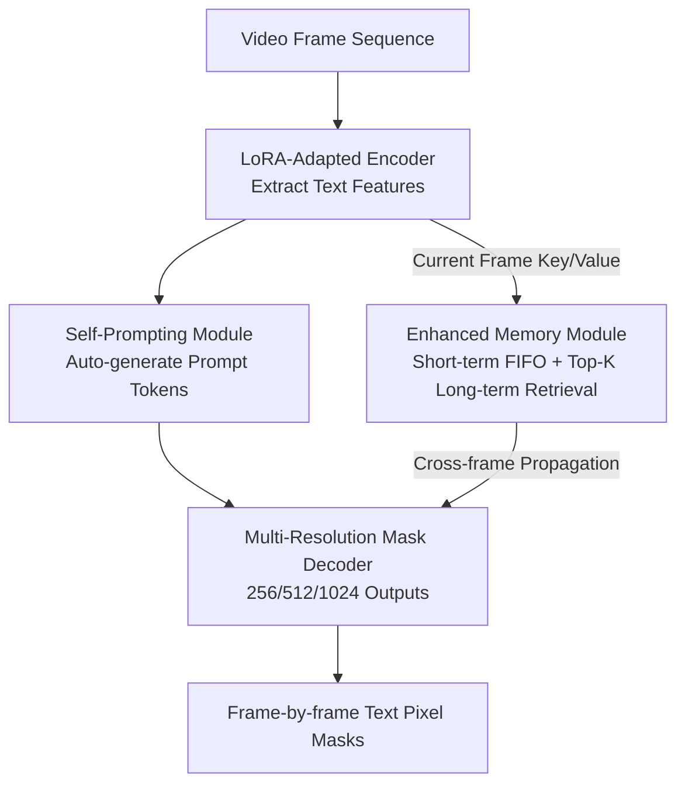

# SAM2Text: Towards Prompt-Free and Multi-Resolution Video Scene Text Segmentation

**Conference**: CVPR 2026  
**Paper**: [CVF Open Access](https://openaccess.thecvf.com/content/CVPR2026/html/Zhang_SAM2Text_Towards_Prompt-Free_and_Multi-Resolution_Video_Scene_Text_Segmentation_CVPR_2026_paper.html)  
**Code**: https://github.com/insuper-zhang/SAM2Text/  
**Area**: Video Understanding / Semantic Segmentation  
**Keywords**: Video Scene Text Segmentation, SAM2, Self-Prompting, Multi-Resolution Decoding, Memory Mechanism

## TL;DR
SAM2 is systematically adapted into SAM2Text specialized for video scene text segmentation (video STS): LoRA is employed to enable the encoder to learn text features, a self-prompting module is added to eliminate external prompts, 512/1024 high-resolution branches are appended to the decoder to preserve stroke details, and a "Short-term FIFO + Top-K Long-term Retrieval" dual-layer memory is used to stabilize cross-frame flickering. Two pixel-level video text datasets (STS-SynthV / STS-RealV) are released, achieving SOTA performance on both image and video benchmarks.

## Background & Motivation
**Background**: Scene Text Segmentation (STS) has progressed significantly on images, evolving from CNN-based models (DeepLabV3, HRNet, TexRNet) to Transformer-based models (SegFormer, TFT, EAFormer), and recently to Hi-SAM, which extends SAM into hierarchical text segmentation. For video, SAM2 serves as a backbone with native streaming processing and hierarchical memory.

**Limitations of Prior Work**: Directly applying image STS methods to video encounters three challenges: ① existing text segmentation models lack generalization in complex real-world scenes (varying fonts, layouts, background interference); ② most SOTA models are designed for single images and cannot efficiently process continuous frames in a streaming manner to meet latency requirements; ③ they lack mechanisms to suppress mask flickering, leading to poor temporal consistency across frames. Although SAM2 supports video, it is class-agnostic and designed for general segmentation; it is insensitive to fine stroke structures of text, its output resolution is limited to 256×256 resulting in blurred details, and it relies on external prompts, preventing prompt-free automation.

**Key Challenge**: There is a domain gap between SAM2's "general video segmentation capability (streaming + memory)" and the "specialized needs of text segmentation (fine structures, high fidelity, prompt-free, temporal stability)." Directly using it yields insufficient precision, while full retraining for text would sacrifice SAM2's valuable streaming and memory properties. Additionally, a fundamental obstacle is the near-total lack of pixel-level annotated data for video text (existing datasets only provide word-level boxes, not masks).

**Goal**: To bridge the four gaps—text features, automatic prompting, detail resolution, and temporal stability—while preserving the original streaming and memory advantages of SAM2, and to create pixel-level video text datasets for training and evaluation.

**Key Insight**: Instead of building from scratch, SAM2 is treated as a backbone for "surgical" minimal invasive modification—freezing the backbone and inserting lightweight modules at key locations to maintain streaming inference while reducing training costs.

**Core Idea**: Integrate LoRA, self-prompting, multi-resolution decoding, and enhanced memory to "train" the general SAM2 into a prompt-free, detail-preserving, and temporally stable expert for video text segmentation.

## Method

### Overall Architecture
SAM2Text introduces four modifications to the four core components of SAM2 (ViT image encoder, prompt encoder, mask decoder, and memory module). The input is a sequence of video frames, and the output consists of high-resolution pixel masks for each text instance per frame, requiring no manual boxes or points throughout.

The pipeline operates as follows: Each frame passes through the **LoRA-adapted image encoder** to extract features with text-specific biases. These features are fed into the **Self-Prompting Module**, which generates a set of sparse prompt tokens (replacing external prompts). The prompt tokens and image features then enter the **Multi-Resolution Mask Decoder**, which outputs mask logits at three levels (256/512/1024) in parallel, where high-resolution branches preserve stroke edges. Simultaneously, the key/value of the current frame enters the **Enhanced Memory Module**, where an effective memory set consisting of "Short-term FIFO cache + Top-K Long-term retrieval" performs cross-frame cross-attention for decoding, steadily propagating masks from previous frames to the current one. The system supports two modes: AMG (Automatic Mask Generation) and PS (Promptable Segmentation), and is trained end-to-end on STS-SynthV / STS-RealV.

### Key Designs

**1. LoRA Domain Adaptation Encoder: Teaching SAM2 to "See Text" while Maintaining Streaming**

The SAM2 encoder is a class-agnostic general segmenter with insufficient modeling for elongated stroke structures. Full fine-tuning would be expensive and destroy its native streaming inference. The authors use LoRA for parameter-efficient adaptation: adding a low-rank increment to the linear layer $y = Wx$, resulting in $y = Wx + \Delta W x$, where $\Delta W = \frac{\alpha}{r} BA$, with $A \in \mathbb{R}^{r \times d_{in}}$ and $B \in \mathbb{R}^{d_{out} \times r}$ being trainable low-rank matrices, $r$ the rank, and $\alpha$ the scaling factor. $A$ is initialized with Kaiming uniform distribution and $B$ is initialized to zero to ensure the initial output matches the original model. Dropout of 0.1 is applied to inputs. Adapters are specifically placed in the attention branches (Q/K/V and output projections) to modulate feature correlation and in the FFN branches (both linear layers of MLP) to enhance extraction of **local stroke textures and elongated geometric structures**. Original weights remain frozen.

**2. Self-Prompting Module: Eliminating External Prompts by Autonomously Focusing on Text Regions**

SAM2 requires external prompts for segmentation. This module allows the model to generate prompts itself. First, four levels of **depthwise separable convolutions** generate a spatial attention map $S = \mathrm{Sigmoid}(D_4(D_3(D_2(D_1(F)))))$ from the encoded features $F \in \mathbb{R}^{B \times C \times H \times W}$. Each $D_i$ consists of a 3×3 depthwise and 1×1 pointwise convolution to save parameters while maintaining the receptive field. $S \in \mathbb{R}^{B \times L \times H \times W}$ (where $L$ is prompt length) serves as weights for spatial weighted averaging of image features to obtain sparse prompt tokens: $P_{b,l,:} = \frac{1}{H \cdot W} \sum_{h}\sum_{w} S_{b,l,h,w} F_{b,:,h,w}$. Local textures are reinforced using $F' = \mathrm{GELU}(\mathrm{Conv2D}(F))$. Finally, **Dual-path Collaborative Attention** refines the prompts: self-attention models long-range dependencies between tokens $P' = \mathrm{LayerNorm}(P + \mathrm{Dropout}(\mathrm{SelfAttn}(P)))$, followed by cross-attention with the enhanced features $F'$, $P'' = \mathrm{LayerNorm}(P' + \mathrm{Dropout}(\mathrm{CrossAttn}(P', F')))$. The resulting $P''$ serves as high-quality prompts for the decoder, achieving true prompt-free operation.

**3. Multi-Resolution Mask Decoder: Preserving Stroke Details via Parallel High-Resolution Branches**

The SAM2 decoder only outputs 256×256, which causes small characters and fine strokes to blur. The authors extend the decoder with two extra branches. Given the transformer decoder output $F^{dec} \in \mathbb{R}^{C \times H \times W}$ ($H=W=64$), two levels of transposed convolutions first upsample it to a shared base feature $F^{dec}_{256}$. The mid-resolution branch upsamples further to 512×512 ($F^{dec}_{512}$), and the high-resolution branch upsamples to 1024×1024 ($F^{dec}_{1024}$) followed by 3×3 convolutions for refinement. LayerNorm2d + GELU are used for stability. Mask generation uses a **Hypernetwork** mechanism: given a mask token $t$, scale-specific MLPs $g_s(\cdot)$ dynamically generate convolutional weights $w_s = g_s(t)$. Mask logits are obtained via inner product: $M_s(x,y) = \langle w_s, F^{dec}_s(x,y)\rangle$ for $s \in \{256,512,1024\}$. During training, the 256/512 branches support multiple mask outputs, while the 1024 branch predicts a single high-resolution mask using the primary mask token to balance computation and quality.

**4. Dual-layer Enhanced Memory (Short-term FIFO + Top-K Long-term Retrieval): Stabilizing Temporal Consistency without Linear Memory Expansion**

Traditional memory mechanisms store key-values for all history frames, leading to linear memory growth. This module is split: **Short-term memory** $M_s$ uses a FIFO to maintain the most recent $L$ frames, $M^t_s = \mathrm{FIFO\text{-}Update}(M^{t-1}_s, k_t, v_t, L)$, managing local temporal continuity. The **Long-term memory pool** $M_g$ stores compact representations of earlier frames with bounded capacity. During retrieval, history entries are scored by $r_j = \cos(q_t, k_j) + \lambda \cdot \mathrm{qual}_j$, which combines cosine similarity between current query and historical keys with a quality score $\mathrm{qual}_j$ of historical entries. Standard attention is then performed only on the effective memory set $U_t = M^t_s \cup M^t_h$ obtained via Top-K. This reduces attention complexity from $O(T)$ to $O(L+K)$, preserving long-range context while suppressing mask flickering.

### Loss & Training
The model is trained end-to-end based on the SAM2 architecture. LoRA rank is 16, with $\alpha=32.0$. It is trained for 80 epochs using AdamW with a learning rate of 3e-5 and batch size of 1, using bfloat16 mixed precision. Data augmentation includes random horizontal flips, affine transformations, color jitter, and grayscale conversion. Frames are resized to 1024×1024 and processed in 8-frame segments.

## Key Experimental Results

### Main Results

Image Benchmarks (fgIOU and F-score per-image):

| Dataset | Metric | SAM2Text | Hi-SAM (Prev. SOTA) | Gain |
|--------|------|----------|----------|------|
| Total-Text | fgIOU | **85.50** | 84.59 | +0.91 |
| Total-Text | F-score | **89.84** | 88.69 | +1.15 |
| TextSeg | fgIOU | **89.52** | 88.96 | +0.56 |
| TextSeg | F-score | **94.33** | 93.87 | +0.46 |

Video Benchmarks (STS-SynthV / STS-RealV, global aggregation):

| Dataset | Metric | SAM2Text | Hi-SAM | SAM2.1 (Orig) | Gain over Hi-SAM |
|--------|------|----------|--------|------------|------|
| STS-SynthV | fgIOU | **93.25** | 91.67 | 90.85 | +1.58 |
| STS-SynthV | F-score | **94.83** | 94.15 | 93.52 | +0.68 |
| STS-RealV | fgIOU | **80.71** | 78.34 | 77.45 | +2.37 |
| STS-RealV | F-score | **87.45** | 85.92 | 84.98 | +1.53 |

Note: The original SAM2.1 is outperformed by the text-specific Hi-SAM on video text tasks (77.45 vs 78.34 fgIOU on STS-RealV), highlighting the necessity of text-specific adaptation. SAM2Text improves upon SAM2.1 by +2.40 / +3.26 fgIOU on synthetic/real data respectively.

### Ablation Study
On STS-RealV, starting from SAM2.1 baseline (baseline, +LoRA, +Self-prompting rows use GT boxes as oracle prompts; the full model is evaluated in a prompt-free setting):

| Configuration | fgIOU(%) | F-score(%) | Sub-labels |
|------|---------|-----------|------|
| SAM2.1 Baseline | 77.45 | 84.98 | Starting point |
| + LoRA Adaptation | 78.92 | 86.23 | Gain +1.47, largest contribution |
| + Self-prompting Module | 79.64 | 86.87 | Gain +0.72, automated prompting |
| + Multi-resolution Decoder | 80.15 | 87.21 | Gain +0.51, preserved details |
| + Enhanced Memory | 80.71 | 87.45 | Gain +0.56, temporal stability |

### Key Findings
- **LoRA adaptation provides the largest gain**: This single component contributes +1.47 fgIOU, confirming that bringing the general model into the text domain is the most critical step.
- The four components target different sub-problems (features, prompts, details, and timing); their gains are synergistic rather than just additive.
- Real video (STS-RealV) is significantly more challenging than synthetic video (80.71 vs 93.25 fgIOU), and SAM2Text's lead over Hi-SAM is larger on real data (+2.37 vs +1.58).

## Highlights & Insights
- **The paradigm of "Minimal Invasive Modification of a Backbone" is highly practical**: By freezing the SAM2 backbone and inserting LoRA in Q/K/V/FFN, it retains the streaming inference advantage while adapting to the domain efficiently.
- **Self-prompting realizes prompt-free operation**: Using spatial attention maps refined via dual-path attention allows the model to produce its own SAM-style prompts, an idea applicable to other SAM-derivative tasks.
- **Dual-layer memory balances complexity and performance**: Reducing attention cost from $O(T)$ to $O(L+K)$ provides a clean compromise for maintaining temporal consistency in long videos within controllable memory limits.
- **Data contribution is a cornerstone**: 1,410 synthetic (STS-SynthV) and 660 real (STS-RealV) pixel-level video segments fill a major gap in text segmentation resources.

## Limitations & Future Work
- The fgIOU on real videos (80.71) is still lower than that on images (85~89); complex scenarios like dense small text, strong background noise, and fast motion remain bottlenecks.
- There's a slight evaluation protocol discrepancy in the ablation study (oracle prompt vs prompt-free), as noted in the original paper.
- Sensitivity to hyperparameters like prompt length $L$ or memory parameters was not systematically explored.
- Real-world data generation relies on a heavy pipeline (CHSAM + manual refinement), making it costly to scale to even larger datasets.

## Related Work & Insights
- **vs Hi-SAM**: Hi-SAM is an image-level method; SAM2Text is based on SAM2 with native memory support, leading by +2.37 fgIOU on video benchmarks.
- **vs Original SAM2.1**: SAM2.1 is class-agnostic and resolution-limited; SAM2Text bridges the gap using specialized modules for text, gaining +3.26 fgIOU on real data.
- **vs FlowText**: FlowText was seminal for synthetic video text but only provided word-level boxes; this work upgrades the pipeline to output pixel-level masks (STS-SynthV).

## Rating
- Novelty: ⭐⭐⭐⭐ First systematic adaptation of SAM2 for video STS; components are logically combined though individual modules (LoRA/retrieval) are well-known.
- Experimental Thoroughness: ⭐⭐⭐⭐ Extensive multi-benchmark tests, though hyperparameter sensitivity analysis is less detailed.
- Writing Quality: ⭐⭐⭐⭐ Clear structure and derivation of motivations.
- Value: ⭐⭐⭐⭐⭐ Significant practical value due to both the framework and the released pixel-level video datasets.

<!-- RELATED:START -->

## Related Papers

- [\[CVPR 2026\] V²-SAM: Marrying SAM2 with Multi-Prompt Experts for Cross-View Object Correspondence](v2-sam_marrying_sam2_with_multi-prompt_experts_for_cross-view_object_corresponde.md)
- [\[CVPR 2026\] Test-Time Multi-Prompt Adaptation for Open-Vocabulary Remote Sensing Image Segmentation](test-time_multi-prompt_adaptation_for_open-vocabulary_remote_sensing_image_segme.md)
- [\[CVPR 2026\] SPOT: Spatiotemporal Prompt Optimization for Motion-Stabilized MLLM-Guided Video Segmentation](spot_spatiotemporal_prompt_optimization_for_motion-stabilized_mllm-guided_video_.md)
- [\[CVPR 2026\] M4-SAM: Multi-Modal Mixture-of-Experts with Memory-Augmented SAM for RGB-D Video Salient Object Detection](m4-sam_multi-modal_mixture-of-experts_with_memory-augmented_sam_for_rgb-d_video_.md)
- [\[CVPR 2026\] Training-Free Open-Vocabulary Camouflaged Object Segmentation via Fine-Grained Object Binding and Adaptive Hybrid Prompt](training-free_open-vocabulary_camouflaged_object_segmentation_via_fine-grained_o.md)

<!-- RELATED:END -->
