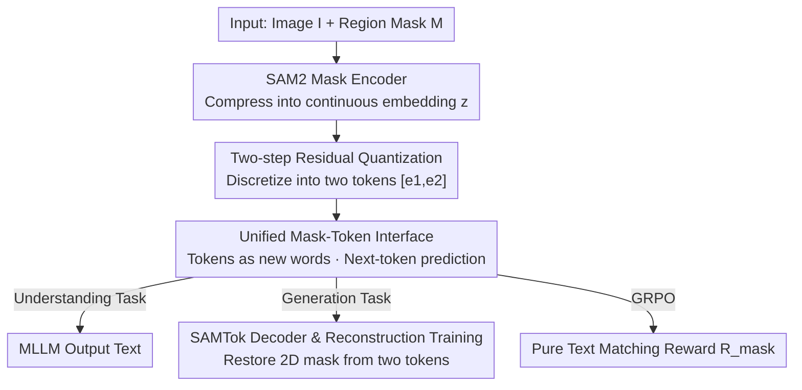

# SAMTok: Representing Any Mask with Two Words

**Conference**: CVPR 2026  
**Paper**: [CVF Open Access](https://openaccess.thecvf.com/content/CVPR2026/html/Zhou_SAMTok_Representing_Any_Mask_with_Two_Words_CVPR_2026_paper.html)  
**Code**: None (Project page https://zhouyiks.github.io/projects/SAMTok/)  
**Area**: Segmentation / Pixel-level Multimodal VLM  
**Keywords**: mask tokenizer, residual vector quantization, pixel-level MLLM, referring expression segmentation, text-reward RL

## TL;DR
SAMTok compresses any region mask into two discrete text tokens, enabling standard MLLMs (like QwenVL) to understand and generate masks just like text via next-token prediction. It requires no specialized segmentation heads or custom losses, and by turning masks into "text," it allows reinforcement learning with pure character-matching rewards for the first time.

## Background & Motivation
**Background**: Equipping MLLMs with pixel-level capabilities (understanding specific regions, segmenting objects according to instructions) is critical for building interactive visual systems. Existing pixel-level MLLMs typically attach two sets of specialized modules: the understanding side uses ROI pooling/region encoders to feed the mask in, while the generation side uses segmentation heads like SAM to decode hidden states into masks.

**Limitations of Prior Work**: This "auxiliary module" paradigm suffers from four specific issues: (1) Mask input and output cannot be modeled uniformly—understanding uses region pooling while generation uses a segmentation decoder, making the two paths incompatible; (2) The generation side uses continuous embeddings to connect the MLLM and the segmentation head, making it impossible to perform RL on mask generation directly and cleanly (rewards require decoding continuous features into masks via SAM before calculating IoU); (3) These specialized modules must be co-trained with the MLLM, involving segmentation losses and forward flows different from standard VQA training, which complicates scaling; (4) A few works treat masks as images or use RLE/polygon text representations, but a single mask then requires dozens or hundreds of tokens, causing inference costs to explode.

**Key Challenge**: The split between understanding and generation, along with the difficulty of RL, stems from masks being treated as "continuous geometric objects requiring specialized modules" rather than "textual symbols" that MLLMs are natively designed to handle. As long as masks remain continuous embeddings, they cannot escape segmentation heads, custom losses, and complex reward chains.

**Goal**: To enable any mask to be read and written in an MLLM like ordinary text—acting as input symbols during understanding and output symbols during generation. This reduces the entire learning process to SFT next-token prediction + simple RL, without modifying the MLLM architecture or adding specialized losses.

**Key Insight**: The authors observe that three types of models each possess a critical capability: VAEs excel at converting between images and latent representations, perception models like SAM excel at precise object segmentation using a single embedding, and vector quantization excels at discretizing continuous latent representations into compact codes. By stitching these together, one can obtain a mask tokenizer that is "capable of encoding masks, reconstructing masks from a highly condensed embedding, and operating in discrete form."

**Core Idea**: Use SAM as the encoding/decoding backbone combined with residual vector quantization to compress any mask into two discrete tokens. These two tokens are then treated as new "words" in the MLLM vocabulary, transforming all mask understanding and generation into pure text next-token prediction.

## Method

### Overall Architecture
SAMTok itself is a "discrete VAE for masks": the input is an image $I$ and a region mask $\mathcal{M}$. The encoder compresses this mask into a continuous embedding $z$, the quantizer discretizes $z$ into two tokens $[e_1, e_2]$, and the decoder restores the 2D mask from these two tokens. The only training goal is mask reconstruction. Once this tokenizer is trained, the bidirectional mapping between "two tokens ↔ one mask" is fixed.

Then comes the critical leap: treat these two tokens as two new special words in the MLLM vocabulary. Consequently, any region can be written as a "pair of mask words." Understanding tasks (e.g., region captioning) involve encoding the mask into this pair of words and inserting them into the text instruction; generation tasks (e.g., referring expression segmentation) involve letting the MLLM directly predict this pair of words and then using the SAMTok decoder to restore the mask. All tasks are thus rewritten into pure "image + text" corpora and can be co-trained using standard next-token prediction loss. Furthermore, as masks are now discrete text, RL rewards for mask generation can be calculated directly via character matching, eliminating the need for external tools to decode features into masks.

### Key Designs

**1. SAM2 Mask Encoder: Compressing any region mask into a continuous embedding**

To use masks as "language," the first step is an encoder capable of precisely encoding regions of arbitrary shapes into a fixed-length representation. The authors adapt a SAM model $f_{\text{enc}}$: they remove the final mask prediction head of the SAM mask decoder, making it output features instead of masks. Analogous to interactive segmentation, the SAM prompt encoder $f_{\text{prm}}$ encodes the 2D mask $\mathcal{M}$ into a dense prompt embedding at the same resolution as the image features. This is added to the image features from the SAM image backbone $f_{\text{img}}$, fed into the SAM mask decoder $f_{\text{msk}}$, and after interacting with a pre-initialized mask embedding, results in a $d$-dimensional continuous mask embedding:

$$\mathbf{z} = f_{\text{enc}}(\mathcal{I}, \mathcal{M}) = f_{\text{msk}}\big(f_{\text{img}}(\mathcal{I}),\, f_{\text{prm}}(\mathcal{M})\big) \in \mathbb{R}^{d}$$

The resulting $z$ leverages SAM's ability to "represent an object with a single embedding," concentrating an entire mask into one vector and laying the foundation for discretization into minimal tokens.

**2. Two-step Residual Quantization: Discretizing one embedding into two tokens**

A continuous $z$ is not enough; MLLMs require discrete symbols, and fewer tokens mean more efficient inference. The authors use Residual Quantization (RQ) for two-step discretization: first, find the nearest neighbor for $z$ in codebook $\mathcal{C}$ to get the first code $e_1$ and calculate the residual $r_1 = z - e_1$; then, find the nearest neighbor for residual $r_1$ to get the second code $e_2$. Combined, these form the discrete representation $q=[e_1, e_2]$ of the mask:

$$\mathbf{e}_1 = \operatorname*{argmin}_{\mathbf{e}\in\mathcal{C}} \|\mathbf{z}-\mathbf{e}\|_2^2,\quad \mathbf{r}_1 = \mathbf{z}-\mathbf{e}_1,\quad \mathbf{e}_2 = \operatorname*{argmin}_{\mathbf{e}\in\mathcal{C}} \|\mathbf{r}_1-\mathbf{e}\|_2^2,\quad \mathbf{q}=[\mathbf{e}_1,\mathbf{e}_2]$$

Residual quantization is used instead of standard VQ because it achieves high fidelity with a relatively small codebook—the second step specifically compensates for the residual left by the first. Thus, using only two tokens, the mask is compressed efficiently while remaining informative, which is the origin of the "two words" in the title.

**3. SAMTok Decoder and Reconstruction Training: Restoring masks from two tokens**

The tokenizer must be bidirectionally invertible to serve as both input and output. The decoder $f_{\text{dec}}$ is a full SAM model: it treats the discrete mask embeddings $[e_1, e_2]$ as special "language prompts" for the current image. The SAM prompt encoder sums them into a sparse prompt embedding, which is then sent to the mask decoder to perform self-attention with pre-initialized mask embeddings and cross-attention with image features. This recovers the feature of the continuous embedding $z$, and finally, the mask prediction head restores the 2D mask $\hat{\mathcal{M}}$:

$$\hat{\mathcal{M}} = f_{\text{dec}}(\mathcal{I}, [\mathbf{e}_1, \mathbf{e}_2]) = f_{\text{msk}}\big(f_{\text{img}}(\mathcal{I}),\, f_{\text{prm}}([\mathbf{e}_1, \mathbf{e}_2])\big)$$

SAMTok is trained on 209M masks solely via a reconstruction task. The loss includes a reconstruction term and a quantization commitment term: $\mathcal{L}_{\text{recon}} = \mathcal{L}_{\text{CE}}(\mathcal{M},\hat{\mathcal{M}}) + \mathcal{L}_{\text{DICE}}(\mathcal{M},\hat{\mathcal{M}})$, and $\mathcal{L}_{\text{commit}} = \|\mathbf{z}-\operatorname{sg}(\mathbf{e}_1)\|_2^2 + \|\mathbf{r}_1-\operatorname{sg}(\mathbf{e}_2)\|_2^2$, where $\operatorname{sg}(\cdot)$ is stop-gradient. The total loss is $\mathcal{L}=\mathcal{L}_{\text{recon}}+\lambda\mathcal{L}_{\text{commit}}$. Initializing with SAM2 accelerates convergence and leverages strong segmentation priors, ensuring the masks restored from two tokens fit original boundaries across diverse visual domains.

**4. Unified Mask-Token Interface + Text-Reward RL: Treating masks as a new language**

With an invertible tokenizer, the authors add special mask words (matching the codebook size) to the MLLM vocabulary. Thus, any region = a pair of special words. During understanding, masks are encoded into special words and inserted into instructions; during generation, the MLLM predicts special words, which SAMTok decodes into masks. All tasks (mask-to-text, text-to-mask, interleaved generation, interactive segmentation) are pre-processed as pure text corpora and co-trained with standard next-token prediction loss without architecture changes.

Crucially, RL becomes extremely clean. Previously, pixel-level MLLMs used continuous features to connect to segmentation heads, requiring rewards to decode features via SAM into masks before calculating IoU. SAMTok represents masks as discrete text, allowing rewards to be calculated via character matching. Specifically, all mask special words are extracted from the rollout response and de-duplicated. Each is checked against the ground-truth answer string. If it hits, it is recorded as a true positive. The reward is:

$$\mathcal{R}_{\text{mask}} = \mathcal{N}_{\text{TP}} / \max(\mathcal{N}_{pred}, \mathcal{N}_{gt})$$

where $\mathcal{N}_{\text{TP}}$ is the number of correctly predicted masks, $\mathcal{N}_{pred}$ is the number of predicted masks before de-duplication (to penalize repetitive predictions), and $\mathcal{N}_{gt}$ is the number of ground-truth masks. This reward requires no detokenization or external models and can be run directly with GRPO.

### Loss & Training
**SAMTok stage**: Reconstruction pre-training on 209M masks with loss $\mathcal{L}=\mathcal{L}_{\text{recon}}+\lambda\mathcal{L}_{\text{commit}}$ (CE + Dice + Commitment). 
**MLLM stage**: SFT on approximately 5M SAMTok-labeled conversation entries (covering region captioning, region QA, referring segmentation, interleaved generation, scene graph parsing, etc.) using unified next-token prediction. Subsequently, GRPO RL is applied to mask generation tasks using the pure text matching reward $\mathcal{R}_{\text{mask}}$.

## Key Experimental Results

### Main Results
**Text-to-mask** (GRES, average of three splits): The 3B QwenVL-SAMTok via SFT already surpasses the 8B expert model. After adding GRPO with pure text rewards, gIoU/cIoU/N-acc are further elevated across the board, all without a segmentation head or segmentation loss:

| Method | Size | gIoU | cIoU | N-acc |
|------|------|------|------|------|
| LISA | 7B | 62.2 | 63.6 | 52.2 |
| MLLMSeg | 8B | 73.9 | 72.3 | 70.4 |
| ARGenSeg | 8B | 73.6 | 72.1 | – |
| Qwen2.5VL-SAMTok (ft) | 3B | 74.3 | 71.1 | 72.9 |
| **Qwen2.5VL-SAMTok (rl)** | 3B | **76.7** | **73.7** | **77.1** |

**Interleaved text-mask generation** (GCG, val split): Again with a 3B model, adding RL leads to a comprehensive lead in AP50 / mIoU / Recall over the 8B Sa2VA:

| Method | Size | AP50 | mIoU | Recall |
|------|------|------|------|------|
| GLaMM | 7B | 30.8 | 66.3 | 41.8 |
| Sa2VA | 8B | 33.2 | 67.7 | 45.1 |
| Qwen2.5VL-SAMTok (ft) | 3B | 37.0 | 71.7 | 47.7 |
| **Qwen2.5VL-SAMTok (rl)** | 3B | **41.5** | **73.5** | **53.5** |

### Ablation Study
**Mask-to-text** (DLC-Bench region captioning, Avg): Without any architectural changes, the 4B Qwen3VL-SAMTok approaches the expert model DAM and far outpaces general MLLMs of the same size. Even when general MLLMs are provided with category names and other richer priors, their scores remain much lower, indicating that the two mask tokens provide more precise and unambiguous region localization:

| Method | Size | Avg |
|------|------|------|
| GPT-4o | – | 61.5 |
| Qwen2.5VL | 7B | 41.2 |
| DAM (Expert) | 3B | 67.3 |
| Qwen3VL-SAMTok | 4B | 65.6 |

### Key Findings
- **Text-reward RL is the primary driver for improvement**: On GRES val, the 3B model improved from SFT (gIoU 70.5 / N-acc 60.5) to GRPO (79.4 / 81.5), representing a **Gain** of +8.9 gIoU and +21.0 N-acc. This proves that "writing masks as text" facilitates RL by simplifying the chain from "feature→SAM→mask→IoU" to "character matching," effectively raising the generation ceiling.
- **Small models outperform large experts**: SAMTok models at 3B/4B generally match or exceed 7B-8B specialized segmentation MLLMs in referring segmentation, interleaved generation, and region captioning. This indicates performance comes from the "unified token paradigm" rather than parameter scaling or custom losses.
- **Strong zero-shot generalization**: On GroundingSuite, it achieves a zero-shot gIoU of 67.8 vs. 62.6 for other region MLLMs. On MDVP-Bench, it exceeds the expert DAM in three out of four metrics, showing that explicit mask supervision is not necessary for effective text-to-mask reasoning.

## Highlights & Insights
- **"Two words represent any mask"**: Compressing an entire segmentation mask into two discrete tokens is the most striking "Aha!" moment—it allows masks to exist as native MLLM symbols for the first time, unifying understanding, generation, and RL under next-token prediction.
- **Discretization unlocks pure text RL**: Previous pixel-level MLLMs were hindered by rewards needing to decode features into masks. SAMTok uses character-matching rewards to bypass the entire detokenization chain. This idea of "replacing geometric supervision with string supervision" can be migrated to other structured outputs like boxes, points, or keypoints.
- **Reusing SAM as an encoding/decoding backbone**: The encoder is a SAM without a prediction head, and the decoder is a full SAM. By reversing the prompt mechanism of interactive segmentation into a reversible "token ↔ mask" channel, the authors avoid training a mask VAE from scratch and inherit SAM's strong boundary priors.

## Limitations & Future Work
- The addition of a SAMTok encoder-decoder (dual SAM) as an external tokenizer is decoupled from the MLLM but still introduces extra computational and engineering overhead during inference (encoding for understanding, decoding for visualization) ⚠️.
- The capacity limit of two tokens might restrict the reconstruction fidelity of extremely complex or fine-grained masks. The paper does not provide quantitative results in the main text on reconstruction quality versus token count (this is in the appendix); degradation for fine-grained boundaries remains a question ⚠️.
- Character-matching rewards essentially check "hit or miss" for special words and lack a smooth gradient for masks that are close but not perfectly overlapping. This may be less refined than continuous IoU rewards for boundary fine-tuning; the authors position this as simple and effective rather than optimal.

## Related Work & Insights
- **vs. Segmentation Head MLLMs (LISA / Sa2VA / OMG-LLaVA)**: These rely on specialized heads, segmentation losses, and joint training. Ours discretizes masks into text for unified next-token prediction. The difference lies in moving "geometric decoding" into a decoupled tokenizer; the advantage is no architectural changes and clean RL, with the cost being an external encoder-decoder.
- **vs. Mask-as-Image/RLE/Polygon (ARGenSeg / HiMTok)**: These also aim for a text paradigm, but require dozens or hundreds of tokens per mask, making inference expensive. SAMTok uses only two tokens, an order of magnitude difference in compactness.
- **vs. Box/Point Prompt + SAM for RL (SAM4MLLM)**: These still require SAM to convert boxes/points to masks to calculate IoU rewards. Ours removes all external tool dependencies on the reward side via pure character matching.

## Rating
- Novelty: ⭐⭐⭐⭐⭐ Represents any mask with two discrete tokens, unifying pixel-level tasks into next-token prediction; a paradigm-level innovation.
- Experimental Thoroughness: ⭐⭐⭐⭐⭐ Covers multiple tasks and benchmarks (referring segmentation, interleaved generation, region captioning) with SFT/RL and zero-shot comparisons.
- Writing Quality: ⭐⭐⭐⭐ Motivation and methods are clear, but ablations and reconstruction quality analysis are mostly relegated to the appendix.
- Value: ⭐⭐⭐⭐⭐ Provides a scalable, language-native, and concise paradigm for giving MLLMs pixel-level capabilities; easy to reuse and extend.

<!-- RELATED:START -->

## Related Papers

- [\[ICCV 2025\] Refer to Any Segmentation Mask Group With Vision-Language Prompts](../../ICCV2025/segmentation/refer_to_any_segmentation_mask_group_with_vision-language_prompts.md)
- [\[CVPR 2026\] SPAR: Single-Pass Any-Resolution ViT for Open-Vocabulary Segmentation](spar_single-pass_any-resolution_vit_for_open-vocabulary_segmentation.md)
- [\[CVPR 2026\] GenMask: Adapting DiT for Segmentation via Direct Mask Generation](genmask_adapting_dit_for_segmentation_via_direct_mask_generation.md)
- [\[CVPR 2026\] VideoMaMa: Mask-Guided Video Matting via Generative Prior](videomama_mask-guided_video_matting_via_generative_prior.md)
- [\[CVPR 2026\] From 2D Alignment to 3D Plausibility: Unifying Heterogeneous 2D Priors and Penetration-Free Diffusion for Occlusion-Robust Two-Hand Reconstruction](from_2d_alignment_to_3d_plausibility_unifying_heterogeneous_2d_priors_and_penetr.md)

<!-- RELATED:END -->
