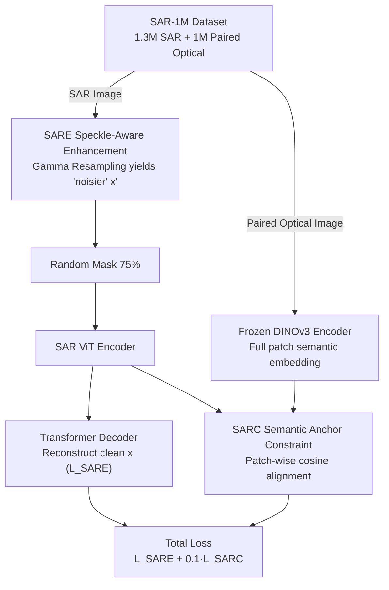

# SARMAE: Masked Autoencoder for SAR Representation Learning

**Conference**: CVPR2026  
**arXiv**: [2512.16635](https://arxiv.org/abs/2512.16635)  
**Code**: [SARMAE](https://github.com/SARMAE/SARMAE)  
**Area**: Semantic Segmentation / SAR Representation Learning  
**Keywords**: SAR, Self-supervised Pre-training, Masked Autoencoder, Speckle Noise, Optical-SAR Alignment, Remote Sensing

## TL;DR

The SARMAE framework is proposed, achieving noise-robust SAR self-supervised pre-training through the million-scale SAR dataset SAR-1M, Speckle-Aware Representation Enhancement (SARE), and Semantic Anchor Representation Constraint (SARC). It achieves SOTA results across multiple downstream tasks including classification, detection, and segmentation.

## Background & Motivation

**Unique Advantages and Challenges of SAR Imaging**: SAR possesses all-weather, all-day imaging capabilities and is widely used in maritime monitoring, disaster assessment, and urban analysis. However, its inherent speckle noise leads to low semantic content and weak structural clues, severely affecting the quality of deep learning representations.

**Data Scale Bottleneck**: SAR data acquisition is costly. Existing pre-training datasets are limited in scale—SARATR-X has only 180k images and SUMMIT has only 560k images, which are insufficient to support general SAR representation learning.

**Inapplicability of Optical Pre-training Strategies**: Existing methods directly adopt optical image pre-training strategies (e.g., MAE, MoCo), ignoring the physical characteristics of SAR speckle noise—speckle is multiplicative noise rather than additive Gaussian noise and requires specialized modeling.

**Semantic Limitations of Single-Modality Pre-training**: Relying solely on SAR data for pre-training is limited by the low semantic identifiability of SAR images themselves, resulting in representations that lack semantic richness and generalization.

**Limitations of Prior Work in SAR Foundation Models**: Although SARATR-X and SUMMIT attempted unified pre-training, neither modeled the physical priors of SAR speckle nor utilized complementary multimodal information.

**Semantic Guidance Potential of Optical Images**: Optical images have clearer semantic structures. Leveraging paired SAR-optical data for cross-modal alignment can significantly enhance the semantic quality of SAR representations.

## Method

### Overall Architecture

SARMAE aims to solve the problem of poor representation learning in self-supervised pre-training caused by "weak semantics and blurred structures" in SAR images due to speckle noise. It is pre-trained on the million-scale SAR-1M dataset and builds two branches based on MAE: the SAR branch consists of a ViT encoder + Transformer decoder, following standard MAE with 75% random mask reconstruction but incorporating the SARE module to handle speckle; the optical branch uses a frozen DINOv3 encoder (sharing the ViT architecture with the SAR branch) to provide semantic anchors for SAR data with paired optical images. The two branches collaborate (SARC alignment) when paired optical images are available; otherwise, only the SAR branch is processed.

### Key Designs

**1. Speckle-Aware Representation Enhancement (SARE): Enabling models to reconstruct clean images from noisier inputs**

Speckle is an inherent multiplicative noise in SAR imaging. Directly applying optical pre-training designed for additive Gaussian noise is ineffective. SARE explicitly injects the physical model of speckle into training: multi-look SAR intensity images follow a Gamma distribution $Z\sim\text{Gamma}(L,\bar{I}/L)$ (where $L$ is the number of looks and $\bar{I}$ is the true backscattering intensity). Thus, for an input patch $x$, a noisier version $x'$ is sampled from the Gamma distribution using a lower synthetic look number $L_{\text{syn}}$—maintaining the mean but increasing the variance. The randomly masked $x'$ is fed into the encoder, and the decoder is required to reconstruct the original clean $x$ rather than the noisy version, forcing the model to actively filter out speckle. The loss is $\mathcal{L}_{\text{SARE}} = \frac{1}{|\mathcal{M}|} \sum_{p \in \mathcal{M}} \| D(E_{\text{SAR}}(\tilde{x}'))_p - x_p \|_2^2$; in addition to Gamma, Rayleigh, Gaussian, and Uniform noises are included to further enhance robustness.

**2. Semantic Anchor Representation Constraint (SARC): "Correcting" SAR features using clear semantics from optical images**

Pre-training on SAR data alone is limited by its low semantic identifiability. SARC utilizes paired optical images as semantic anchors: after masking the SAR image, it is passed through the SAR encoder to obtain visible patch embeddings $f_{\text{SAR}}^i$; the unmasked optical image passes through the frozen DINOv3 to obtain full patch embeddings $f_{\text{OPT}}^i$. A patch-wise cosine distance loss is applied to spatially corresponding patch pairs: $\mathcal{L}_{\text{SARC}} = \frac{1}{|\mathcal{V}|} \sum_{i \in \mathcal{V}} \left(1 - \frac{f_{\text{SAR}}^i \cdot f_{\text{OPT}}^i}{\|f_{\text{SAR}}^i\|_2 \|f_{\text{OPT}}^i\|_2}\right)$. Consequently, the SAR encoder is guided to align with semantically clearer optical features, resulting in richer semantic representations. Ablations show that directly fine-tuning SAR with a frozen DINOv3 performs poorly (74.25%), indicating that the effectiveness stems from explicit SAR-optical alignment rather than DINOv3 itself.

**3. SAR-1M Dataset: Scaling pre-training data from hundred-thousand to million scale**

SARATR-X has 180k images and SUMMIT has 560k, which are insufficient for general SAR representation. SAR-1M aggregates 18 public datasets across 57 categories, totaling 1.3 million SAR images and 1 million paired optical images for a total of 2.3 million samples. It covers multiple sensors (Sentinel-1, Gaofen-3, RadarSat-2, TerraSAR-X), across C/X/Ku/Ka bands, HH/HV/VV/VH polarizations, and 0.1m–60m resolutions. The paired optical images serve as the prerequisite for SARC cross-modal alignment.

### Loss & Training

The total pre-training loss combines two terms: $\mathcal{L}_{\text{pretrain}} = \mathcal{L}_{\text{SARE}} + \lambda \mathcal{L}_{\text{SARC}}$, where $\lambda = 0.1$. SARE enables the model to understand and filter noise, while SARC provides clear semantic guidance, making the two complementary.

## Experiments

### Main Results

| Task | Dataset | Metric | SARMAE (ViT-B) | SARMAE (ViT-L) | Prev. SOTA |
|------|--------|------|-----------------|-----------------|---------|
| Classification | FUSAR-SHIP (40-shot) | Top1 Acc | **89.30%** | **90.86%** | 87.61% (Copernicus FM) |
| Classification | FUSAR-SHIP (30%) | Top1 Acc | **92.92%** | 92.80% | 71.91% (SUMMIT) |
| Classification | MSTAR (40-shot) | Top1 Acc | **96.70%** | **97.24%** | 91.60% (SAR-JEPA) |
| Detection | SARDet-100k | mAP | 57.90% | **63.10%** | 57.30% (SARATR-X) |
| Detection | SSDD | mAP | **68.10%** | **69.30%** | 67.50% (SARATR-X) |
| Rotation Det. | RSAR | mAP | 66.80% | **72.20%** | 64.82% (O-RCNN) |
| Segmentation | AIR-PolSAR-Seg (Multi-class) | mIoU | 66.53% | **67.51%** | 52.58% (ANN) |
| Segmentation | AIR-PolSAR-Seg (Water) | IoU | 92.31% | **93.06%** | 89.29% (DANet) |

### Ablation Study

| Model | Pre-train Data | SARE | SARC | FUSAR | SSDD | AIR-PolSAR-Seg |
|------|-----------|------|------|-------|------|----------------|
| MAE (Baseline) | ImageNet-1K | ✗ | ✗ | 75.40 | 64.00 | 60.28 |
| MAE | SAR-1M (SAR only) | ✗ | ✗ | 82.22 | 64.20 | 64.36 |
| MAE + Noise | SAR-1M (SAR only) | ✓ | ✗ | 86.80 | 64.40 | 65.15 |
| SARMAE | SAR-1M (SAR/OPT) | ✓ | ✓ | **89.30** | **68.10** | **66.53** |

### Key Findings

- **Significant In-domain Pre-training Gains**: SAR-1M pre-training improves Top1 accuracy on FUSAR by +6.82% compared to ImageNet pre-training, proving the significant distribution shift between SAR and natural images.
- **SARE Contribution**: Incorporating speckle noise modeling improves classification by +4.58%. Attention maps show the model focuses more accurately on semantic targets and even captures subtle semantically related objects.
- **SARC Contribution**: Yields a +3.7% mAP improvement on SSDD detection, effectively mitigating false alarm issues caused by speckle interference. Reconstruction visualizations indicate SARC helps recover local scene structures.
- **Excellent Scalability**: Scaling from ViT-B to ViT-L yields a +5.4 mAP increase in rotation detection.
- **DINOv3 Direct Fine-tuning Fails**: Directly fine-tuning SAR with frozen DINOv3 features results in poor performance (74.25%), demonstrating that SARC's effectiveness originates from explicit SAR-optical alignment.

## Highlights & Insights

- Constructs the first million-scale SAR dataset, SAR-1M, filling the gap in large-scale SAR pre-training data.
- The speckle noise injection design based on a physical model (Gamma distribution) directly adapts the pre-training process to SAR imaging physics.
- SARE and SARC are complementary: the former helps the model understand noise, while the latter provides clear semantic guidance.
- Achieves comprehensive SOTA across classification, detection, and segmentation tasks on multiple datasets, demonstrating strong generalization.

## Limitations & Future Work

- High resource consumption during pre-training (300 epochs, batch 1024, A800 GPUs) makes replication difficult for standard laboratories.
- SARC relies on paired SAR-optical data; SAR data from areas without pairs (e.g., polar regions, high latitudes) cannot benefit from cross-modal alignment.
- The optical branch uses a frozen DINOv3; joint training or other optical teacher models' potential advantages remain unexplored.
- While SAR-1M covers multiple sensors, differences in annotation standards and quality across the 18 source datasets may introduce bias.
- Downstream task evaluation does not yet cover scenarios like change detection or object tracking.

## Related Work & Insights

- **SAR Pre-training**: SARATR-X (HiViT + two-stage self-supervision), SUMMIT (MAE + multi-auxiliary tasks), SAR-JEPA (masked autoencoding + local reconstruction).
- **Remote Sensing Pre-training**: SeCo (MoCo), RVSA (MAE + rotated window attention), SatMAE (multispectral/multitemporal), ScaleMAE (scale-aware masking).
- **General Vision Pre-training**: MAE, BEiT, DINOv3, CROMA (contrastive learning), Copernicus FM (DINO distillation).

## Rating

- Novelty: ⭐⭐⭐⭐ — Physical noise modeling in SARE and cross-modal alignment in SARC are innovative; SAR-1M is a significant contribution.
- Experimental Thoroughness: ⭐⭐⭐⭐⭐ — Covers three major tasks, multiple datasets, and comprehensive ablations with consistent and significant results.
- Writing Quality: ⭐⭐⭐⭐ — Clear structure, rigorous physical modeling formulas, and rich visualizations.
- Value: ⭐⭐⭐⭐⭐ — Dataset + framework + SOTA results provide a major push for the SAR community.

<!-- RELATED:START -->

## Related Papers

- [\[CVPR 2026\] Masked Representation Modeling for Domain-Adaptive Segmentation](mrm_masked_representation_modeling_domain_adaptive.md)
- [\[CVPR 2026\] AFRO: Bootstrap Dynamic-Aware 3D Visual Representation for Scalable Robot Learning](bootstrap_dynamic-aware_3d_visual_representation_for_scalable_robot_learning.md)
- [\[ICLR 2026\] AMLRIS: Alignment-aware Masked Learning for Referring Image Segmentation](../../ICLR2026/segmentation/amlris_alignment-aware_masked_learning_for_referring_image_segmentation.md)
- [\[ICCV 2025\] Region-based Cluster Discrimination for Visual Representation Learning](../../ICCV2025/segmentation/region-based_cluster_discrimination_for_visual_representation_learning.md)
- [\[CVPR 2026\] Structure-Aware Representation Distillation for Tiny-Dense Object Segmentation](structure-aware_representation_distillation_for_tiny-dense_object_segmentation.md)

<!-- RELATED:END -->
