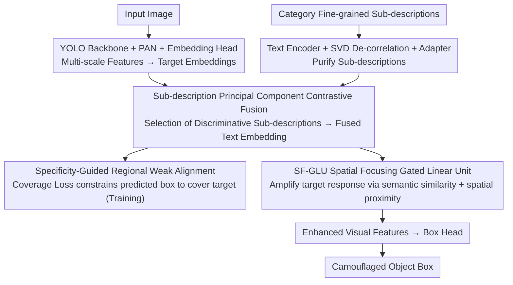

# SDDF: Specificity-Driven Dynamic Focusing for Open-Vocabulary Camouflaged Object Detection

**Conference**: CVPR 2026  
**arXiv**: [2603.26109](https://arxiv.org/abs/2603.26109)  
**Code**: [https://github.com/Zh1fen/SDDF](https://github.com/Zh1fen/SDDF)  
**Area**: Image Segmentation  
**Keywords**: Open-vocabulary object detection, Camouflaged object detection, Vision-language models, Fine-grained description, Dynamic focusing

## TL;DR

SDDF proposes a new task, Open-Vocabulary Camouflaged Object Detection (OVCOD), and establishes the OVCOD-D benchmark. It achieves a 56.4 AP under open-set settings through a sub-description principal component contrastive fusion strategy to remove redundant textual noise, alongside specificity-guided regional weak alignment and dynamic focusing mechanisms to enhance the discriminative power between camouflaged targets and backgrounds.

## Background & Motivation

Open-Vocabulary Object Detection (OVOD) leverages vision-language pre-trained models to achieve strong zero-shot generalization. However, when faced with camouflaged objects, detectors fail to effectively distinguish targets from backgrounds because the visual features of camouflaged targets are highly similar to their surroundings.

**Core Problem**: (1) Redundancy in textual embeddings—fine-grained descriptions generated by Multimodal Large Language Models (MLLMs) contain many redundant modifiers, introducing noise during cross-modal learning and misleading visual feature extraction. (2) Highly similar target-background embeddings—the decision boundary between camouflaged targets and backgrounds is difficult to learn in the embedding space.

**Key Insight**: Utilize SVD decomposition to remove noisy components from textual descriptions and use target-specific semantic priors to guide visual features to focus on the actual target regions.

## Method

### Overall Architecture

SDDF addresses the failure of open-vocabulary detectors in camouflaged scenarios: targets and backgrounds are visually nearly identical, and fine-grained text descriptions from MLLMs carry redundant modifiers that bias cross-modal alignment. The methodology focuses on "cleaning the text first, then using the text to guide visual focus on the target." Specifically, the input image passes through a lightweight YOLO backbone + PAN to obtain multi-scale visual features, followed by an embedding head for target embeddings. Simultaneously, fine-grained sub-descriptions for each category are purified via a text encoder + SVD de-correlation + Adapter, then fused with target embeddings using sub-description principal component contrastive fusion to obtain a clean fused text embedding. This fused embedding serves two purposes: first, via specificity-guided regional weak alignment using a coverage loss to constrain predicted specificity regions to cover the ground truth; second, as conditional input to the SF-GLU to dynamically amplify target responses in the spatial dimension, eventually feeding enhanced features into the Box Head for detection.

### Key Designs

**1. Sub-description Principal Component Contrastive Fusion: Removing noisy modifiers from fine-grained descriptions**

Descriptions generated by MLLMs appear detailed but actually have low lexical diversity (Figure 2 in the paper shows low lexical diversity and avg_unique_ratio). Frequent redundant modifiers pull visual features in the wrong direction during contrastive learning. SDDF first decomposes category attribute descriptions into sub-descriptions, encodes them into vectors, and applies SVD de-correlation followed by a three-layer MLP (text adapter). The subspace spanned by principal components represents shared, stable semantic structures, while components on small singular values—likely redundant noise—are suppressed. Furthermore, contrastive importance is used to weight sub-descriptions: the similarity of a sub-description to a **specific target embedding** $v_i$ minus its similarity to the **global average embedding** $v_{\text{global}}$ yields an importance score $w_k$ (Eq. 2). A sub-description accurately capturing "how this target differs from others" receives higher weight after softmax normalization, resulting in the fused text embedding $t_c^{\text{fused}}$.

**2. Specificity-guided Regional Weak Alignment: Aligning specific regions using regional coverage instead of pixel-level labels**

Boundaries of camouflaged objects are inherently blurry; forcing pixel-level alignment is unrealistic and costly. SDDF uses a coverage-based loss that encourages the model to generate regions activated by textual specificity that gradually cover the ground truth target area. This "weak" alignment only requires regional overlap rather than pixel-perfect matching, making it more robust to blurry boundaries and training constraints in camouflaged scenarios.

**3. Spatial Focusing Gated Linear Unit (SF-GLU): Dynamically amplifying target area responses based on descriptions**

Camouflaged target features are often submerged by backgrounds. SF-GLU uses the fused target embedding $t_c^{\text{fused}}$ and region matching scores as conditions to calculate a gating gain for each spatial position. The gain is determined by: (1) matching similarity $S_j$ between the position and target description, and (2) spatial distance $d_{j,i_t}$ to the "most likely target patch" $i_t$. Positions semantically similar and spatially close to the target receive maximum gain (Eq. 9). The gate follows $\hat{z}\odot(1+\sigma(\cdot))$, where $1+\sigma$ ensures all positions retain original responses while specifically amplifying the target domain. This "pulls" the camouflaged target out of the background in the feature space, increasing the distance between target and background in the embedding space.

### Loss & Training

Based on a lightweight detector pre-trained on large-scale detection datasets, the model is fine-tuned on OVCOD-D. The total loss consists of three parts: standard detection loss, coverage loss for regional weak alignment, and cross-modal contrastive learning loss.

## Key Experimental Results

### Main Results

| Method | Setting | AP | Note |
|------|------|-----|------|
| YOLO-World-M | Open-set | Low | Baseline significantly drops on OVCOD-D |
| SDDF | Open-set | 56.4 | New SOTA on OVCOD-D benchmark |
| SDDF | Closed-set | Strong | Competitive on traditional COD tasks |

The massive AP gap between overlapping categories on the LVIS dataset and OVCOD-D validates the severe challenge camouflaged targets pose to OVOD.

### Ablation Study

| Configuration | AP | Note |
|------|-----|------|
| Baseline (w/o SDDF) | Significantly Lower | OVOD is extremely weak in camouflaged scenes |
| + Sub-description PC Fusion | Increase | Textual de-noising is effective |
| + Regional Weak Alignment | Further Increase | Specificity guidance works |
| + SF-GLU | 56.4 | Dynamic focusing contributes the most |

### Key Findings

- Performance of open-vocabulary detectors drops significantly on camouflaged objects, validating the necessity of OVCOD as a new research direction.
- De-noising text embeddings (SVD decomposition) is critical, suggesting that blindly using MLLM-generated descriptions can be counterproductive.
- The model is lightweight enough for deployment on edge devices.

## Highlights & Insights

- **Value of New Task Definition**: OVCOD intersects open-vocabulary detection and camouflaged object detection, identifying a blind spot in existing OVOD methods.
- **SVD for De-noising Text Embeddings**: Using matrix decomposition to identify and remove noise in text embeddings is more mathematical and controllable than simple prompt engineering.
- **Practicality of Weak Alignment**: In scenarios with high labeling costs or blurry boundaries, weak alignment is a more practical choice than pixel-level alignment.

## Limitations & Future Work

- The OVCOD-D dataset scale is limited, and category distribution is long-tailed.
- Dependence on MLLMs for description generation; quality is limited by MLLM capabilities.
- May still struggle with extreme camouflage (targets completely blended into the background).
- Future work could explore camouflaged object detection in video using motion cues.

## Related Work & Insights

- **vs YOLO-World/YOLO-UniOW**: These OVOD methods perform well on regular objects but fail on camouflaged ones; SDDF bridges this gap via specificity guidance.
- **vs Traditional COD (SINet/ZoomNet)**: Traditional COD is closed-set and requires pixel-level labels; OVCOD is more flexible.
- **vs GLIP/Detic**: General open-vocabulary methods lack specialized handling for camouflaged scenarios.

## Rating

- Novelty: ⭐⭐⭐⭐ New task + SVD de-noising + weak alignment combination is innovative.
- Experimental Thoroughness: ⭐⭐⭐⭐ Open-set and closed-set testing with complete ablation.
- Writing Quality: ⭐⭐⭐ Rich content, some expressions could be more concise.
- Value: ⭐⭐⭐⭐ Defines a meaningful new direction; the benchmark dataset has long-term value.

<!-- RELATED:START -->

## Related Papers

- [\[CVPR 2026\] Beyond Appearance: Camouflaged Object Detection via Geometric Structure](beyond_appearance_camouflaged_object_detection_via_geometric_structure.md)
- [\[CVPR 2026\] Seeing Both Sides: Towards Bidirectional Semantic Alignment for Open-Vocabulary Camouflaged Object Segmentation](seeing_both_sides_towards_bidirectional_semantic_alignment_for_open-vocabulary_c.md)
- [\[CVPR 2026\] Training-Free Open-Vocabulary Camouflaged Object Segmentation via Fine-Grained Object Binding and Adaptive Hybrid Prompt](training-free_open-vocabulary_camouflaged_object_segmentation_via_fine-grained_o.md)
- [\[CVPR 2026\] DSS: Discover, Segment, and Select for Zero-shot Camouflaged Object Segmentation](discover_segment_and_select_a_progressive_mechanism_for_zero-shot_camouflaged_ob.md)
- [\[ECCV 2024\] Learning Camouflaged Object Detection from Noisy Pseudo Label](../../ECCV2024/segmentation/learning_camouflaged_object_detection_from_noisy_pseudo_label.md)

<!-- RELATED:END -->
