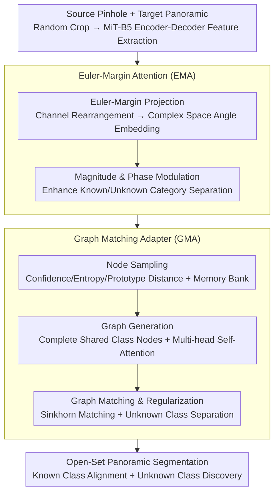

# Seeing Beyond: Extrapolative Domain Adaptive Panoramic Segmentation

**Conference**: CVPR 2026  
**arXiv**: [2603.15475](https://arxiv.org/abs/2603.15475)  
**Code**: [Available](https://github.com/zyfone/EDA-PSeg)  
**Area**: Semantic Segmentation  
**Keywords**: Panoramic Semantic Segmentation, Open-Set Domain Adaptation, FoV Transfer, Graph Matching, Euler Attention

## TL;DR

The EDA-PSeg framework is proposed, which utilizes two core modules: the Graph Matching Adapter (GMA) and Euler-Margin Attention (EMA). It achieves open-set unsupervised domain adaptive semantic segmentation from pinhole views to 360° panoramic images for the first time, simultaneously addressing geometric Field of View (FoV) distortion and unknown category discovery.

## Background & Motivation

**Importance of Panoramic Vision**: Panoramic images provide a 360° Field of View (FoV), enabling complete scene perception without occlusions, with broad applications in autonomous driving and robotics.

**Challenges in Cross-Domain Panoramic Segmentation**: Existing methods trained on labeled pinhole images (source domain) and migrated to unlabeled panoramic images (target domain) face severe geometric FoV distortion and semantic distribution inconsistency.

**Limitations of Closed-set Assumption**: Most existing CPS methods assume that only categories seen during training appear at test time (closed-set setting). These methods fail when encountering unknown objects in open-world scenarios, posing safety risks.

**Shortcomings of Pixel-level Prototype Methods**: Existing open-set domain adaptation methods (e.g., BUS, UniMAP) rely on pixel-level prototype mapping. However, style inconsistency and geometric distortion in panoramic images limit the effectiveness of such approaches.

**Interference from Adverse Weather**: Migration from single or multiple weather conditions to diverse adverse weather further undermines cross-domain alignment.

**First Work in Open-Set Panoramic Segmentation**: This paper defines the open-set cross-domain panoramic semantic segmentation task for the first time, requiring models to adapt to different FoV scenarios and weather conditions while generalizing to unseen categories.

## Method

### Overall Architecture

EDA-PSeg is based on the DAFormer architecture, using a MiT-B5 encoder-decoder network as the backbone. Input source domain (pinhole images) and target domain (panoramic images) are randomly cropped and fed into the network to extract features, followed by:

- **Euler-Margin Attention (EMA)**: Projects features into a complex vector space for angle-aware embedding, mitigating cross-view geometric distortion through angle margin constraints and enhancing known/unknown category separability via magnitude and phase modulation.
- **Graph Matching Adapter (GMA)**: Constructs high-order semantic graph relationships, aligning graph nodes of categories shared across domains while separating unknown categories through regularization.

### Key Designs

The two core modules are detailed according to the data flow (Encoder-Decoder → EMA → GMA).

**1. Euler-Margin Attention (EMA): Projecting features into complex angular space using angle margins to smooth cross-view distortion**

Geometric distortion from pinhole to panoramic views causes feature direction drift for the same class across views, which standard self-attention cannot handle. EMA decomposes this process:

- **Euler-Margin Projection**: Performs descending channel rearrangement on input features (ensuring gradient backpropagation via a soft permutation matrix). Rearranged even/odd channels are used as real/imaginary parts, respectively, and projected into complex space via Euler's formula $\mathcal{F}(\mathbf{V}) = \Lambda \cdot e^{i\theta}$. Channel rearrangement constrains the range of phase angle $\theta$ (the "angle margin"), enhancing intra-class cohesion to mitigate cross-view differences.
- **Magnitude and Phase Modulation**: Introduces learnable parameters in the self-attention dot product: $\delta_1$ (exponential magnitude scaling) adjusts feature importance, while $\delta_2$ (phase scaling factor) and $b$ (phase bias) adjust semantic direction. The final attention score is $\mathcal{E}_{\text{Euler}} = (e^{2\delta_1}(\Lambda_q \odot \Lambda_k))^\top \text{Re}[\exp(i[\delta_2(\theta_q - \theta_k) + b])]$. Magnitude encodes feature importance and phase encodes semantic direction, enhancing the separability of known and unknown categories.

**2. Graph Matching Adapter (GMA): Using high-order semantic graphs instead of pixel prototypes to align known classes and isolate unknown classes**

Panoramic style inconsistency and geometric distortion render traditional pixel-level prototype alignment ineffective. GMA instead models high-order relationships of graph nodes, performing graph matching on EMA-enhanced features:

- **Node Sampling**: Representative local semantic nodes are sampled based on confidence, entropy, and prototype distance, then aggregated into class-level global prototypes. For known categories, positive/negative sample sets are filtered using confidence $\tau_p$ and entropy $\tau_e$ thresholds. For unknown categories, positive/negative samples are segmented by median entropy $\tau_m$. The nearest K nodes are retained, and the global memory bank $\mathcal{M}$ is updated via Exponential Moving Average (EMA).
- **Graph Generation**: Shared categories between source and target domains are identified. The memory bank $\mathcal{M}$ is used to complete missing category nodes (with added Gaussian noise). Node sets are updated via multi-head self-attention, generating node features and edge affinity matrices to form semantic graphs.
- **Graph Matching and Regularization**: The Sinkhorn algorithm calculates the node matching matrix, constructing open-set matching labels that ignore unknown classes. The loss function includes three terms: graph matching loss (node alignment), graph edge affinity loss (structural consistency), and unknown class regularization loss (Frobenius norm penalty on known/unknown nodes) to push unknown classes away while aligning shared classes.

### Loss & Training

Total training objective: $\mathcal{L}_{\text{total}} = \ell_{\text{seg}} + \ell_{\text{mixup}} + \gamma \cdot \ell_{\text{graph}}$

- $\ell_{\text{seg}}$: Supervised segmentation loss on the source domain.
- $\ell_{\text{mixup}}$: Pseudo-label loss for source-target domain mixed training.
- $\ell_{\text{graph}}$: Graph matching loss for the GMA module (node matching, edge affinity, and unknown class regularization).
- Weight $\gamma = 0.1$ (balancing common/private class performance).
- MobileSAM is used for target domain pseudo-label mask refinement.
- 40k iterations, 512×512 random crop, testing at original panoramic resolution.

## Key Experimental Results

### Main Results

**Open-Set Domain Adaptation results on four benchmarks (mIoU %):**

| Benchmark Setting | Type | Common | Private | H-Score |
| :--- | :--- | :--- | :--- | :--- |
| C2D (Cityscapes→DensePASS) | Pin2Pan, Real2Real | **56.81** | **18.86** | **28.32** |
| S2D (SynPASS→DensePASS) | Syn2Real, Pan2Pan | **35.07** | **7.48** | **12.33** |
| G2S (GTA→SynPASS) | Pin2Pan + Weather | **44.96** | **10.20** | **16.63** |
| S2A (SynPASS→ACDC) | Syn2Real + Weather | **30.17** | **9.18** | **14.08** |

**Comparison with best baselines (C2D benchmark):**

| Method | Common | Private | H-Score |
| :--- | :--- | :--- | :--- |
| HRDA | 53.42 | 0.00 | 0.00 |
| BUS (SAM) | 49.47 | 3.10 | 5.84 |
| **EDA-PSeg (Ours)** | **56.81** | **18.86** | **28.32** |

Closed-set methods (DAFormer/HRDA/MIC) yield a Private mIoU of 0, failing completely to identify unknown categories.

### Ablation Study

**Module Ablation (C2D):**

| GMA | EMA | Common | Private | H-Score |
| :--- | :--- | :--- | :--- | :--- |
| ✗ | ✗ | 52.56 | 8.57 | 14.74 |
| ✓ | ✗ | 55.15 | 14.67 | 23.18 |
| ✗ | ✓ | 56.12 | 13.00 | 21.11 |
| ✓ | ✓ | **56.81** | **18.86** | **28.32** |

**EMA vs. Other Attention Mechanisms (C2D):**

| Method | Common | Private | H-Score |
| :--- | :--- | :--- | :--- |
| Self-Attention | 55.45 | 10.95 | 18.28 |
| EulerFormer | 55.09 | 7.20 | 12.74 |
| Deformable MLP | 55.89 | 7.68 | 13.51 |
| **Euler-Margin (Ours)** | **56.12** | **13.00** | **21.11** |

**GMA Loss Component Ablation**: Removing the graph matching term results in the largest performance drop (H-Score from 23.18 to 8.73). Unknown class regularization significantly improves Private mIoU (from 7.78 to 14.67).

### Key Findings

1. **Closed-set methods fail completely in open-set settings**: All closed-set UDA methods yield a Private mIoU and H-Score of 0, failing to recognize any unknown categories.
2. **GMA and EMA are complementary**: GMA primarily improves Private class identification (+6.10), while EMA primarily improves Common class representation (+3.56). Together, they improve the H-Score from 14.74 to 28.32.
3. **Graph matching is the core of GMA**: Among the three loss terms in GMA, graph matching contributes the most; its removal drops the H-Score from 23.18 to 8.73.
4. **Weight Sensitivity**: A $\gamma$ that is too large (1.0) favors Private classes but hurts Common classes, while one that is too small (0.01) does the opposite; $\gamma=0.1$ is the optimal balance point.

## Highlights & Insights

- **Pioneering Open-Set Panoramic Segmentation Definition**: Unified modeling of FoV geometric transformation and unknown category discovery, which is closer to real-world scenarios than traditional closed-set CPS.
- **Clever Application of Euler's Formula**: Utilizes magnitude-phase decomposition in complex space. Magnitude encodes feature importance and phase encodes semantic direction. Channel ordering constrains angle ranges to achieve view invariance.
- **Graph Matching vs. Pixel Prototypes**: High-order graph relationship modeling is more robust than traditional pixel-level prototype alignment, handling both node matching and structural consistency.
- **Comprehensive Benchmark Coverage**: Covers various domain transfer scenarios such as Pin↔Pan, Syn→Real, and multiple weather conditions, systematically comparing closed-set and open-set methods.

## Limitations & Future Work

- Random cropping introduces sampling sensitivity, occasionally leading to training instability.
- Graph matching increases model parameters and computational overhead; EMA also adds architectural complexity.
- Improvement on some fine-grained categories (e.g., Traffic Light, Traffic Sign) is limited, with near 0 mIoU on certain benchmarks.
- Absolute Private mIoU on S2D and S2A benchmarks remains low (7-9%), indicating that open-set discovery capabilities need further enhancement.

## Related Work & Insights

- **Cross-Domain Panoramic Segmentation**: CFA (Distortion-Aware Attention), DPPASS (Tangential Projection), Trans4PASS (Deformable Patch Embedding), OmniSAM/GoodSAM (SAM-assisted alignment).
- **Open-Set Domain Adaptation**: BUS (SAM mask + Prototype Matching), UniMAP (Prototype weight scaling), OSBP/UAN/UniOT (Traditional OSDA).
- **Position Encoding**: RoPE (Rotary Position Embedding), EulerFormer (Unified semantic-position representation in Euler space).
- **Graph Matching**: Cross-domain Named Entity Recognition, Medical Image Analysis, Graph Relation Reasoning in Object Detection.

## Rating

- Novelty: ⭐⭐⭐⭐ — First to define open-set panoramic segmentation; EMA and GMA designs are creative.
- Experimental Thoroughness: ⭐⭐⭐⭐ — Four benchmarks, multi-scenario coverage, detailed ablation, though absolute performance for some classes is still low.
- Writing Quality: ⭐⭐⭐⭐ — Clear problem definition, systematic method presentation; formulas are numerous but logically consistent.
- Value: ⭐⭐⭐⭐ — Fills the gap in open-set panoramic segmentation; the method has practical significance.

<!-- RELATED:START -->

## Related Papers

- [\[CVPR 2026\] Masked Representation Modeling for Domain-Adaptive Segmentation](mrm_masked_representation_modeling_domain_adaptive.md)
- [\[CVPR 2026\] REL-SF4PASS: Panoramic Semantic Segmentation with REL Depth Representation and Spherical Fusion](rel-sf4pass_panoramic_semantic_segmentation_with_rel_depth_representation_and_sp.md)
- [\[CVPR 2026\] Heuristic Self-Paced Learning for Domain Adaptive Semantic Segmentation under Adverse Conditions](heuristic_self-paced_learning_for_domain_adaptive_semantic_segmentation_under_ad.md)
- [\[CVPR 2026\] Seeing Both Sides: Towards Bidirectional Semantic Alignment for Open-Vocabulary Camouflaged Object Segmentation](seeing_both_sides_towards_bidirectional_semantic_alignment_for_open-vocabulary_c.md)
- [\[CVPR 2026\] Denoise and Align: Towards Source-Free UDA for Robust Panoramic Semantic Segmentation](denoise_and_align_towards_source-free_uda_for_robust_panoramic_semantic_segmenta.md)

<!-- RELATED:END -->
