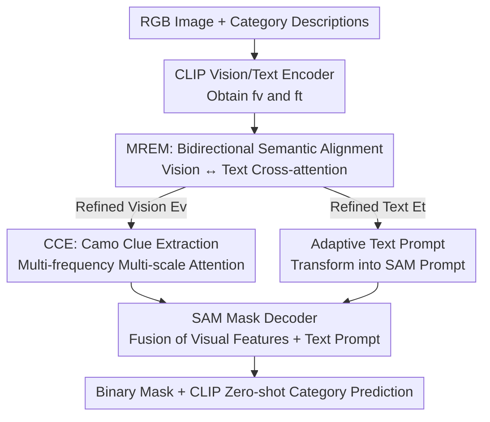

# Seeing Both Sides: Towards Bidirectional Semantic Alignment for Open-Vocabulary Camouflaged Object Segmentation

**Conference**: CVPR 2026  
**Paper**: [CVF Open Access](https://openaccess.thecvf.com/content/CVPR2026/html/Zhang_Seeing_Both_Sides_Towards_Bidirectional_Semantic_Alignment_for_Open-Vocabulary_Camouflaged_CVPR_2026_paper.html)  
**Code**: https://github.com/okmaybach/BaCLIP-CVPR2026  
**Area**: Open-Vocabulary Segmentation / Camouflaged Object Segmentation  
**Keywords**: Camouflaged Object Segmentation, Open-Vocabulary, Bidirectional Cross-modal Alignment, CLIP, SAM

## TL;DR
BaCLIP utilizes a Mutual Refinement Enhancement Module (MREM) to enable bidirectional calibration between text and visual features. By transforming refined text embeddings into semantic prompts for SAM, BaCLIP achieves SOTA performance on the OVCamo benchmark for Open-Vocabulary Camouflaged Object Segmentation (OVCOS) with a lightweight architecture, surpassing the previous SOTA by 4.5% in cIoU.

## Background & Motivation

**Background**: Camouflaged Object Segmentation (COS) aims to extract targets from scenes where they highly blend into the background. Traditional COS follows a closed-set paradigm, restricted to categories seen during training. With the rise of vision-language pre-training like CLIP, Pang et al. formally introduced the Open-Vocabulary Camouflaged Object Segmentation (OVCOS) task, along with the OVCamo benchmark and the CLIP-based OVCoser baseline, enabling models to identify unseen camouflaged categories using natural language. Subsequently, SuCLIP introduced a semantic consistency loss to mitigate the issue of different parts of the same object being assigned to different categories.

**Limitations of Prior Work**: Both OVCoser and SuCLIP share a fundamental flaw: they rely on **unidirectional interaction**. Text features unilaterally enhance or guide visual feature matching (text-to-vision), while the visual side provides no feedback to the text. This unidirectional design ignores the semantic gap between CLIP's "image-level text semantics" and the "pixel-level precision" required for segmentation.

**Key Challenge**: CLIP's text descriptions are naturally image-level and coarse-grained, whereas segmentation requires pixel-level, fine-grained discrimination. Unidirectional guidance causes the model to confuse regions that are "semantically related but visually distinct." For example, when querying "a green insect on a leaf," the model might misidentify the green leaf as the target because text pulls vision without vision feeding back structural cues (shape, texture, boundary continuity) to correct the text's attention. The paper names this phenomenon "semantic confusion," where visually similar backgrounds are mismatched as camouflaged objects, leading to fragmented segmentation and misclassification.

**Goal**: To establish a **bidirectional** guidance mechanism between vision and language, allowing visual cues to refine and disambiguate text semantics while mapping these alignment results onto pixel-level masks.

**Key Insight**: Through t-SNE visualization, the authors observed that the boundaries between 24 unseen categories extracted by frozen CLIP are blurred and intra-class features are loose. Introducing bidirectional alignment results in compact clusters and sharper decision boundaries, supporting the hypothesis that bidirectional interaction improves cross-modal separability.

**Core Idea**: Use "bidirectional cross-attention" instead of "unidirectional text-to-vision matching" to eliminate semantic confusion, and transform refined text embeddings into adaptive prompts for SAM to bridge image-level semantics to pixel-level segmentation.

## Method

### Overall Architecture

The input to BaCLIP is an RGB image and a set of category descriptions, while the output is a binary mask of the camouflaged object plus a category prediction. The pipeline operates as follows: The vision side uses a CLIP visual encoder to obtain multi-scale features $f_v$; the text side feeds category descriptions into CamoPrompts and then through a CLIP text encoder to obtain text embeddings $f_t$. Both paths interact in the **MREM** via bidirectional cross-attention for mutual calibration, producing refined visual features $E_v$ and text features $E_t$. On the visual side, $E_v$ enters the **CCE** (Camo Clue Extractor, containing cascaded MFMSA modules) for frequency-domain and multi-scale fine-grained enhancement to obtain camouflage-sensitive features $E_v^*$. On the text side, $E_t$ is transformed into **adaptive prompts** $E_t^*$ through self-attention and projection, which are then fed into the frozen SAM Prompt Encoder. Finally, $E_v^*$ and $E_t^*$ are input into the SAM Mask Decoder to generate high-resolution masks, followed by CLIP’s zero-shot capability to predict the mask category.

### Key Designs

**1. MREM: Eliminating Semantic Confusion via Bidirectional Cross-attention**

This is the core of the paper, addressing the "semantic confusion caused by unidirectional text-to-vision" pain point. Instead of text unilaterally pulling vision, MREM allows both modalities to inject information into each other, evolving toward a consistent semantic space. This is implemented via multi-head bidirectional cross-attention: given visual features $f_v \in \mathbb{R}^{H \times W \times C}$ (processed by Conv1) and text embeddings $f_t \in \mathbb{R}^{N \times C}$ (processed by Linear), they are projected into their respective QKV triplets. Two directions are computed simultaneously—vision uses its query to search text keys/values, and text uses its query to search vision keys/values:

$$F^{head}_{v,i} = \mathrm{Softmax}\!\left(\frac{Q_{v,i} k_{t,i}^{T}}{\sqrt{d_k}}\right) v_{t,i}, \qquad F^{head}_{t,i} = \mathrm{Softmax}\!\left(\frac{q_{t,i} K_{v,i}^{T}}{\sqrt{d_k}}\right) V_{v,i}$$

Where $F^{head}_{v,i}$ is the visual feature refined by text, and $F^{head}_{t,i}$ is the text feature refined by vision. After concatenating heads and applying linear projection, the final $E_v$ and $E_t$ are obtained. The key to this bidirectional exchange is: text tokens inject category semantics into visual features, while visual cues refine the text's focus of attention. When visually similar background regions exist (e.g., same-colored leaves or sand), visual feedback can pull the text's attention away from these misleading areas, improving both boundary accuracy and category discrimination—something unidirectional matching cannot achieve.

**2. CCE + MFMSA: Digging Camouflage Clues in Frequency and Multi-scale Domains**

While MREM addresses semantic alignment, camouflaged objects and backgrounds are too similar in the spatial domain. CCE (Camo Clue Extractor) performs fine-grained enhancement on $E_v$. Its core is the cascaded MFMSA (Multi-frequency Multi-scale Attention) module, each consisting of two parts. **MFCA (Multi-frequency Channel Attention)**: $E_v$ is downsampled into three scales ($E_1, E_2, E_3$), and each is decomposed into multiple frequency components using DCT Bias. These components pass through parallel fully connected layers to aggregate into channel attention maps, which are multiplied back to obtain frequency-refined features $\chi_i$. The intuition is that visually indistinguishable camouflaged objects often "reveal" themselves in the frequency domain. **MSDA (Multi-scale Differential Attention)**: Uses $\chi_i$ to strengthen cross-scale boundary cues, introducing learnable parameters $\alpha_i, \beta_i$ to control foreground/background information flow:

$$\lambda_i = \mathrm{Conv3}\big(\alpha_i(\chi_i \otimes F_i) \oplus \beta_i(\chi_i \otimes B_i)\big)$$

Where $F_i = \mathrm{Sigmoid}(\mathrm{Conv1}(\chi_i))$ is the foreground attention map, and the background map is the complement $B_i = 1 - F_i$. Features are upsampled, aligned, and summed as $\chi = \lambda_1 \oplus \mathrm{Up2}(\lambda_2) \oplus \mathrm{Up4}(\lambda_3)$, then fused residually with the input to get $E_v^* = E_v \oplus \chi$. Separately modeling foreground/background with learnable weights directly addresses the blurred boundaries in camouflaged scenes.

**3. Adaptive Text Prompts: Transforming SAM into an Open-Vocabulary, Semantic-Driven Segmenter**

The original SAM relies on spatial prompts (points, boxes, masks) and is category-agnostic, lacking high-level semantics. This design transforms refined text embeddings $E_t$ into SAM-compatible prompts. It uses self-attention to capture token dependencies $P_t = \mathrm{SelfAttention}(E_t)$, followed by a projection layer to feed into the frozen SAM Prompt Encoder, resulting in $E_t^* = \mathrm{PromptEncoder}(\mathrm{Proj}(P_t))$. During decoding, $E_v^*$ and $E_t^*$ are fed into the SAM Mask Decoder. This replaces manual spatial prompts with "adaptive text prompts," allowing SAM to generalize to unseen categories driven by semantics.

### Loss & Training
Segmentation supervision uses weighted BCE loss and Dice loss: $L_{seg} = L_{BCE} + L_{Dice}$, where Dice loss mitigates class imbalance between target and background. CLIP parameters are frozen throughout training. Inputs are resized to $384 \times 384$. AdamW optimizer, batch size 4, learning rate $3 \times 10^{-5}$ for 30 epochs with cosine annealing. Training is conducted on a single RTX 4090 (24GB) with data augmentation including random flipping, rotation, and color jittering.

## Key Experimental Results

### Main Results
On the OVCamo benchmark (14 base classes for training / 61 novel classes for testing), compared with various OVSS methods and the OVCOS method OVCoser across six metrics (cSm, cFωβ, cMAE, cFβ, cEm, cIoU; cMAE is lower the better):

| Method | VLM / Backbone | cSm ↑ | cFωβ ↑ | cMAE ↓ | cIoU ↑ |
|------|----------------|-------|--------|--------|--------|
| SuCLIP† | CLIP-ConvNeXt-L | 0.533 | 0.449 | 0.368 | 0.395 |
| OVCoser (Prev. SOTA) | CLIP-ConvNeXt-L | 0.579 | 0.490 | 0.336 | 0.443 |
| **BaCLIP (Ours)** | CLIP-ConvNeXt-L | **0.589** | **0.540** | **0.327** | **0.488** |
| Gain | — | +1.0% | +5.0% | +0.9% | +4.5% |

BaCLIP sets a new SOTA across all six metrics without relying on additional visual backbones (e.g., ResNet/Swin). By replacing SAM's original backbone with the CLIP visual encoder, the structure is significantly more lightweight.

### Hard Categories Analysis
The authors analyzed the hardest 25% of categories (15 classes) as ranked by OVCoser's cIoU, verifying that BaCLIP's advantages are more pronounced in scenes prone to semantic confusion:

| Subset | Metric | OVCoser | Ours | Gain |
|------|------|---------|------|------|
| All 61 Classes | cIoU ↑ | 0.443 | 0.488 | +4.5% |
| All 61 Classes | cFωβ ↑ | 0.490 | 0.540 | +5.0% |
| Hard 15 Classes | cIoU ↑ | 0.382 | 0.445 | +6.3% |
| Hard 15 Classes | cFωβ ↑ | 0.446 | 0.517 | +7.1% |
| Hard 15 Classes | cMAE ↓ | 0.466 | 0.437 | +2.9% |

In hard categories, the cIoU Gain increases from 4.5% to 6.3%, and the cMAE reduction increases from 0.9% to 2.9%, indicating that the improvement primarily stems from MREM's alleviation of semantic confusion.

### Ablation Study
Incremental component addition (Tab. 3) and MREM internal breakdown (Tab. 5):

| Configuration | cSm ↑ | cIoU ↑ | Description |
|------|-------|--------|------|
| baseline (CLIP + Conv Decoder) | 0.528 | 0.311 | Weak starting point |
| +SAM (Prompt Encoder + Mask Decoder) | 0.531 | 0.332 | Integrating SAM foundation |
| +CCE | 0.555 | 0.428 | +9.6% relative cIoU over SAM baseline |
| +CCE+MREM (Full Model) | 0.589 | 0.488 | Additional +6.0% relative gain |
| MREM: w/o visual (Text→Vision only) | 0.559 | 0.432 | Unidirectional, limited gain |
| MREM: w/o text (Vision→Text only) | 0.574 | 0.462 | Unidirectional, limited gain |
| MREM: w/o SA | 0.580 | 0.470 | Removing Self-Attention in prompts |

### Key Findings
- **CCE contributes the most**: Adding CCE to the SAM baseline increases cIoU from 0.332 to 0.428 (+9.6% relative), proving that mining camouflage clues in frequency and multi-scale domains is the primary source of segmentation quality.
- **Bidirectionality is the soul of MREM**: Unidirectional variants (w/o visual 0.432, w/o text 0.462) perform significantly worse than the full bidirectional version (0.488).
- **MFMSA Cascade Sweet Spot**: 3 cascaded MFMSA modules are optimal (cIoU 0.488); more modules result in performance drops.
- **Backbone Preference**: ConvNeXt versions consistently outperform ViT (ConvNeXt-L 0.488 > ViT-L/14 0.458), likely because ViT lacks multi-scale features for dense segmentation tasks.

## Highlights & Insights
- **Bidirectional interaction as a targeted fix**: Attributing semantic confusion to the lack of visual feedback and solving it with cross-attention is intuitive and effective. Support from t-SNE and attention maps completes a strong logical chain.
- **Semanticizing SAM's prompt interface**: Transforming CLIP text embeddings into SAM prompts effectively turns a spatial tool into a semantic-driven, open-vocabulary segmenter. This "VLM embedding to SAM prompt" conversion is highly transferable to other tasks like referring expression segmentation.
- **Frequency domain for camouflage**: Using DCT to decompose visually similar textures aligns with the intuition that camouflage is easier to detect in non-spatial domains.

## Limitations & Future Work
- **Dependency on OVCamo benchmark**: Results are limited to a single benchmark; generalization to real-world open scenes or other datasets remains to be verified.
- **CLIP zero-shot as a bottleneck**: Final class prediction relies on CLIP's inherent zero-shot ability. Misclassifications (e.g., rabbit to dog) stem partly from CLIP's own discriminative limits.
- **Empirical tuning**: The number of MFMSA modules and the choice of ConvNeXt-L were empirically determined; their optimality on other datasets is unknown.

## Related Work & Insights
- **vs. OVCoser**: OVCoser is unidirectional (text-to-vision). BaCLIP replaces this with bidirectional MREM, outperforming it across all metrics, especially in hard categories.
- **vs. SuCLIP**: SuCLIP uses semantic consistency loss. BaCLIP addresses the issue at the architecture level via interaction directionality (unidirectional → bidirectional).
- **vs. SEEM / OVSAM**: While these integrate SAM and VLM, the prompt's influence on visual decoding remains largely unidirectional. BaCLIP's bidirectional alignment + adaptive prompts provide both better semantic guidance and pixel-level precision.

## Rating
- Novelty: ⭐⭐⭐⭐ The "unidirectional to bidirectional" shift is clear and targeted. Semanticizing SAM prompts is a practical innovation.
- Experimental Thoroughness: ⭐⭐⭐⭐ Broad comparison with OVSS methods and detailed internal ablations; logic supported by visualization.
- Writing Quality: ⭐⭐⭐⭐ Clear motivation-observation-method-validation chain.
- Value: ⭐⭐⭐⭐ Sets a new SOTA for OVCOS with a lightweight structure and offers transferable ideas for VLM-SAM integration.

<!-- RELATED:START -->

## Related Papers

- [\[CVPR 2026\] Training-Free Open-Vocabulary Camouflaged Object Segmentation via Fine-Grained Object Binding and Adaptive Hybrid Prompt](training-free_open-vocabulary_camouflaged_object_segmentation_via_fine-grained_o.md)
- [\[CVPR 2026\] Semantic Alignment in Hyperbolic Space for Open-Vocabulary Semantic Segmentation](semantic_alignment_in_hyperbolic_space_for_open-vocabulary_semantic_segmentation.md)
- [\[CVPR 2026\] SDDF: Specificity-Driven Dynamic Focusing for Open-Vocabulary Camouflaged Object Detection](sddf_specificity-driven_dynamic_focusing_for_open-vocabulary_camouflaged_object.md)
- [\[CVPR 2026\] S2C2Seg: Semantic-Spatial Consistency and Category Optimization for Open-Vocabulary Segmentation](s2c2seg_semantic-spatial_consistency_and_category_optimization_for_open-vocabula.md)
- [\[CVPR 2026\] PEARL: Geometry Aligns Semantics for Training-Free Open-Vocabulary Semantic Segmentation](pearl_geometry_aligns_semantics_for_training-free_open-vocabulary_semantic_segme.md)

<!-- RELATED:END -->
