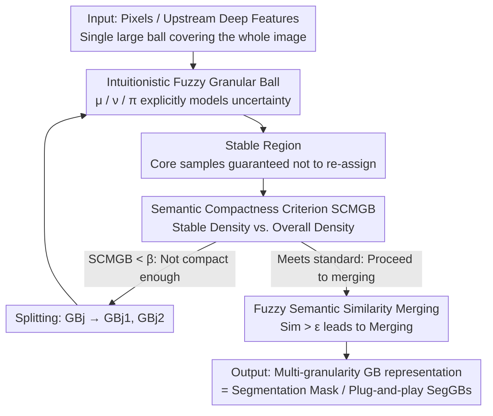

# SegGBC: Justifiable Coarse-to-Fine Granular-Ball Computing for Enhancing Clustering Image Segmentation

**Conference**: CVPR 2026  
**Paper**: [CVF Open Access](https://openaccess.thecvf.com/content/CVPR2026/html/Chong_SegGBC_Justifiable_Coarse-to-Fine_Granular-Ball_Computing_for_Enhancing_Clustering_Image_Segmentation_CVPR_2026_paper.html)  
**Code**: None  
**Area**: Semantic Segmentation (Unsupervised Clustering Segmentation / Granular-Ball Computing)  
**Keywords**: Granular-Ball Computing, Unsupervised Segmentation, Clustering Segmentation, Intuitionistic Fuzzy Sets, Multi-granularity Representation

## TL;DR
SegGBC introduces the "Granular-Ball Computing (GBC)" paradigm, a coarse-to-fine multi-granularity clustering approach, to image segmentation for the first time. It explicitly models inherent image uncertainty using Intuitionistic Fuzzy Sets (IFS) and guides granular-ball splitting and merging with a semantic-aware "Semantic Compactness Measure for Granular Balls (SCMGB)." It can perform unsupervised segmentation independently and serves as a plug-and-play front end that enhances SA / mIoU of existing clustering segmentation methods by more than 3%.

## Background & Motivation

**Background**: Since pixel-level dense annotation is prohibitively expensive, unsupervised "Clustering-based Segmentation Methods (CSM)" have gained popularity. They require no training, offer explicit representations, and cluster image elements based on feature similarity. CSMs mainly follow two paths: **pixel-level** (treating each pixel as an independent sample, clustering by color/position, often adding spatial constraints for intra-object coherence) and **cluster-level** (clustering on intermediate representations, or directly constraining pixel clusters, or implicitly encoding semantics using pre-trained deep features).

**Limitations of Prior Work**: Regardless of being pixel-level or cluster-level, these CSMs are restricted to analysis at a **single, fixed granularity**. Pixel-level methods suffer from high computational complexity and fail to capture high-level semantics; cluster-level methods are hampered by single-scale semantics, lack of robustness, and an inability to handle high uncertainty caused by morphological changes. Fixed granularity often leads to sub-optimal segmentation—either over-segmentation or the grouping of semantically distinct but visually similar regions.

**Key Challenge**: Image segmentation inherently requires **multi-scale** perspectives (larger regions need to be coarse, while boundary details need to be fine). Traditional clustering iteratively updates centroids and "point-to-centroid distances" at a single granularity, failing to balance coarse and fine scales. Granular-Ball Computing (GBC) follows a "global-first" principle—starting with a large granular ball covering the entire dataset and recursively "splitting-merging" based on quality criteria, naturally providing a multi-granularity, low-overhead approach. However, GBC has previously been limited to traditional data mining. Applying it to images faces two major hurdles: **i) how to characterize internal image uncertainty (noise, low contrast, blurred boundaries) to avoid precision collapse**; **ii) how to design a justifiable, semantic-aware quality criterion aligned with image attributes**—purely geometric metrics (purity, radius) cannot encode semantic coherence.

**Goal / Key Insight**: The authors argue that applying GBC to segmentation necessitates addressing "uncertainty representation" and "semantic quality criteria." The observation is that image uncertainty includes both geometric components (which GBC can handle) and **epistemic uncertainty** stemming from noise/low contrast/blurred boundaries—the latter is precisely the strength of Intuitionistic Fuzzy Sets (IFS), which explicitly model "indeterminacy" using the hesitation degree $\pi$.

**Core Idea**: Each granular ball is upgraded to an "Intuitionistic Fuzzy Granular Ball" to explicitly quantify uncertainty using IFS. A semantic compactness criterion, SCMGB (combining the ball's "stable region" and overall density), is designed to decide ball splitting. Finally, similarity fusion of geometry and fuzzy semantics determines merging. This constitutes SegGBC, the first GBC framework oriented toward segmentation, which can also be used as a plug-and-play enhancement for existing CSMs.

## Method

### Overall Architecture
The input to SegGBC is a set of image feature vectors $X=\{x_1,\dots,x_n\}\in\mathbb{R}^d$ (raw pixels or upstream deep features), and the output is a multi-granularity granular-ball representation and the final clustering (i.e., segmentation mask). The pipeline follows a "coarse-to-fine" process: starting with one large granular ball covering the image, then repeatedly "splitting by quality criteria and merging by similarity" until all balls meet the standards.

The four core components are: (1) Transforming each ball into an **Intuitionistic Fuzzy Granular Ball**, using membership, non-membership, and hesitation degrees to explicitly encode intra-ball uncertainty and refine the ball's radius and center; (2) Defining a **stable region** within each ball—samples inside are guaranteed not to re-assign to neighboring balls in the current round, providing a robust "prototype core" and reducing redundant computation; (3) Using the **semantic compactness criterion SCMGB** (comparing stable density vs. overall density) to judge if a ball is semantically compact enough, splitting it if it fails; (4) Using **fuzzy semantic similarity** to decide if adjacent balls should merge. Splitting refines granularity while merging groups semantically similar regions, iterating until convergence.

### Key Designs

**1. Intuitionistic Fuzzy Granular Ball: Incorporating Image Uncertainty via Hesitation**

Traditional granular balls are defined as $GB(c, r)$ with center $c_j=\frac{1}{|GB_j|}\sum_i x_i$ and radius $r=\max_i \|x_i-c_j\|_2$. Being purely geometric, they are insensitive to image uncertainties like noise or blurred boundaries, leading to precision collapse when applied to images. SegGBC embeds Intuitionistic Fuzzy Sets (IFS) into granular balls: for a sample $x_i$ relative to center $c_j$, membership and non-membership are calculated using Gaussian decay at two different scales:

$$\mu_{GB_j}(x_i)=\exp\!\left(-\frac{\|x_i-c_j\|_2}{\sigma_m^2}\right),\quad \nu_{GB_j}(x_i)=1-\exp\!\left(-\frac{\|x_i-c_j\|_2}{\sigma_n^2}\right),$$

Then the hesitation degree is $\pi_{GB_j}(x_i)=1-\mu_{GB_j}(x_i)-\nu_{GB_j}(x_i)$. A key constraint is $\sigma_m\neq\sigma_n$ and $\sigma_m>\sigma_n$; if $\sigma_m=\sigma_n$, the model reverts to a standard fuzzy set where hesitation is always zero. The authors parameterize these scales using the maximum ball radius $r_{max}$: $\sigma_m=\alpha\cdot r_{max}$ and $\sigma_n=(1-\alpha)\cdot r_{max}$, with $\alpha\in(0.5,1)$ ensuring asymmetry.

With hesitation, the radius and center are redefined to be more robust: $r_{max}=\max_i(\|x_i-c_j\|_2+\pi_{GB_j}(x_i))$ and $c_j=\frac{1}{|GB_j|}\sum_i(x_i+\theta[\pi_{GB_j}(x_i)])$, where $\theta[\cdot]$ broadcasts the hesitation scalar to a vector. This incorporates both geometric distance and "indeterministic" uncertainty into splitting-merging decisions, handling blurred boundaries much more stably than distance-only balls. This is the core mechanism for filling the first gap (uncertainty representation) in GBC.

**2. Stable Region: Efficiency and Robustness via a "Non-jumping" Core**

Using the maximum distance as the radius is highly sensitive to outliers. While the average radius $r_{avg}=\frac{1}{|GB_j|}\sum_i(\|x_i-c_j\|_2+\pi_{GB_j}(x_i))$ is less sensitive, it remains computationally expensive and lacks semantic awareness. SegGBC addresses this by defining a **stable region**—a spherical area with radius $r_{sta}$ where cluster membership is "highly stable." Theorem 1 provides a justifiable basis: samples within the stable region are guaranteed not to be re-assigned to any neighboring granular ball in the current iteration. The radius is:

$$r_{sta}=\frac{1}{2}\min_{GB_a\in N\{GB_j\}}\!\left(\|c_j-c_a\|_2+\Delta\pi_{ja}\right),\quad \Delta\pi_{ja}=\pi_{GB_j}(x)+\pi_{GB_a}(x),$$

which is half the minimum value of "distance + sum of hesitations" to all neighbor balls. Intuitively, when combining distance and hesitation, a sample's uncertainty regarding its own ball $GB_j$ is lower than its uncertainty regarding any neighbor, so it remains. This design captures the core density and semantic structure using representative "prototypes" while saving computation by ignoring redundant operations in uncertain areas.

**3. SCMGB: A Justifiable Semantic Split Criterion in [0, 1]**

The most significant gap when moving GBC to images is a semantic split criterion; pure radius or purity criteria overlook semantics, leading to premature convergence or over-splitting. SCMGB considers both radius and density through three types of densities: maximum radius density $\rho^{max}_{GB_j}=|GB_j|/r_{max}^d$, average radius density $\rho^{avg}_{GB_j}$ (samples within $r_{avg}$ divided by $r_{avg}^d$), and stable density $\rho^{sta}_{GB_j}$ (samples within $r_{sta}$ divided by $r_{sta}^d$). The criterion is:

$$SCMGB=\frac{\min(\rho^{avg}_{GB_j},\rho^{max}_{GB_j})\cdot\min(\rho^{sta}_{GB_j},\rho^{max}_{GB_j})}{\max(\rho^{avg}_{GB_j},\rho^{max}_{GB_j})\cdot\max(\rho^{sta}_{GB_j},\rho^{max}_{GB_j})}.$$

Theorem 2 proves it always lies in $[0,1]$. Semantically, as the stable density $\rho^{sta}$ approaches the average density $\rho^{avg}$, SCMGB nears 1, indicating stable intra-ball distribution and semantic consistency. A lower value suggests semantically diverse regions needing split. The algorithm uses a threshold $\beta$ (default 0.8): any ball where $SCMGB_j<\beta$ is split. This enforces intra-ball consistency and inter-ball separation, reducing over-segmentation and sharpening boundaries.

**4. Fuzzy Semantic Similarity Merging: Preventing Erroneous Merging of Semantically Distinct Regions**

Splitting alone creates too many fragments; merging is required for semantically similar neighbor balls. Traditional merging relies on geometric distance, often merging visually similar but semantically different regions. SegGBC uses a similarity measure fusing "fuzzy semantics":

$$Sim(GB_i,GB_j)=\frac{1}{2}\left[\frac{\sum \mu_{GB_i}(x)\mu_{GB_j}(x)}{\sqrt{\sum\mu_{GB_i}^2}\sqrt{\sum\mu_{GB_j}^2}}+(1-\Delta\pi_{ij})\right],$$

The first term is cosine similarity of memberships (semantic alignment), while $(1-\Delta\pi_{ij})$ rewards pairs with low hesitation (clear relations). Merging occurs only if $Sim>\varepsilon$ (default 0.75) and geometric adjacency is met. Prioritizing semantic similarity over geometric distance effectively suppresses "over-merging."

### Example: Ball Convergence from 23 to Semantic Partitions
The authors visualize the coarse-to-fine process on NI 3: the initial stage features 23 heterogeneous balls of various sizes (SA=53.69%), reflecting the multi-scale strategy. Driven by merging criteria, semantically similar regions are integrated, and the number of balls drops to 9 (SA rises to 77.86%). At convergence (SA=95.87%), semantically meaningful partitions are achieved. The "23 → 9 → convergence" trajectory intuitively demonstrates how SCMGB splitting and similarity merging refine the segmentation.

### Loss & Training
SegGBC is **training-free**. It has no learnable parameters; the process is driven by Algorithm 1: Initialize IFGBs (Eq. 6–9) → Calculate $r_{avg}$, $r_{sta}$ (Eq. 10–11) → Calculate SCMGB (Eq. 13–16) → While $SCMGB_j<\beta$, split → Finally, merge adjacent balls where $Sim(GB_i,GB_j)>\varepsilon$. Key hyperparameters: splitting threshold $\beta=0.8$, merging threshold $\varepsilon=0.75$, and asymmetric coefficient $\alpha\in(0.5,1)$. When used as the plug-and-play front end "SegGBs" to enhance other CSMs, it feeds the multi-granularity representation to the downstream classification/clustering processes.

## Key Experimental Results

Datasets and Protocols: Single-image protocols use natural images BSD500, DUST, and remote sensing images (RSI) LoveDA for pixel-level CSM evaluation. Image-set protocols use 128×128 patches from COCO-Stuff and COCO-Stuff-3 for cluster-level CSM evaluation. Metrics include SA (Segmentation Accuracy), F1, NMI, mIoU, PixelAcc, and time consumption mTC/TC.

### Main Results: 7 Natural Images (7-NI)
SegGBC outperforms all pixel-level, cluster-level, and other granular-ball methods with the lowest time cost.

| Method | Type | 7-mIoU(%)↑ | mTC(s)↓ | Remarks |
|------|------|-----------|---------|------|
| DeepCut [ICCV'23] | Cluster-level (Implicit) | 52.73 | 11.60 | Deep feature clustering |
| FLRSC [TFS'23] | Cluster-level (Superpixel) | 49.36 | 7.69 | — |
| Ball k-means [TPAMI'22] | Granular Ball | 59.50 | 2.87 | Previous strongest GBC |
| MGNR [TPAMI'24] | Granular Ball | 57.32 | 3.76 | — |
| **SegGBC (Ours)** | GB + IFS | **68.76** | **2.06** | 9.26% gain over 2nd best, fastest |

On single-image metrics, SegGBC leads by 8.53 / 8.79 points in SA on NI 6 / NI 7, and by 31.8 points in NMI on NI 1. On remote sensing images (3-RSI), 3-mIoU reaches 62.10%, exceeding the runner-up by 4.41 points with the lowest latency.

### Gain: SegGBs as a Front End
Using SegGBs as a data representation front end for existing methods consistently improves performance.

| Baseline + SegGBs | Dataset / Metric | Gain |
|---------------|-----------|------|
| DFKM + SegGBs | NI 2 / SA | **+38.22** pts |
| RLFCM + SegGBs | NI 7 / SA | +18.79 pts |
| PiCIE+H + SegGBs | COCO-Stuff-3 / mIoU | 52.51→**79.93** (+27+ pts) |
| DeepClu + SegGBs | COCO-Stuff-3 / PixelAcc | +17.61 pts |
| IRCIS + SegGBs | COCO-Stuff / PixelAcc | +13.45 pts |

The conservative lower bounds are gains of +3.25% SA and +3.92% mIoU across standard images and COCO-Stuff.

### Ablation Study (NI 7 / RSI 3, SA(%) / TC(s))
| Configuration | IFS/FS | Stable SCMGB | NI 7 SA | RSI 3 SA |
|------|--------|--------------|---------|----------|
| Traditional GB w/ $r_{max}$ | — | ✗ | 63.34 | 53.69 |
| Traditional GB w/ $r_{avg}$ | — | ✗ | 69.20 | 60.60 |
| Traditional GB w/ $r_{sta}$ | — | ✓ | 76.97 | 62.34 |
| Fuzzy GB w/ $r_{avg}$ | IFS | ✗ | 72.80 | 67.29 |
| Fuzzy GB FS+$r_{sta}$ | FS | ✓ | 80.86 | 74.65 |
| **SegGBC: IFS+$r_{sta}$** | IFS | ✓ | **96.83** | **82.91** |

### Key Findings
- **IFS and SCMGB are synergistic**: IFS alone improves SA by at least 15.97 / 8.26 points over traditional fuzzy sets. SCMGB (stable region criterion) alone boosts SA by ~22.03 points on NI 7. The full SegGBC reaches 96.83 / 82.91, far exceeding individual components.
- **Stable regions improve both accuracy and efficiency**: Configurations with $r_{sta}$ show lower TC (e.g., NI 7 TC dropped from 3.16/3.91 to 2.09/2.72), confirming efficiency gains from excluding redundant computations in uncertain zones.
- **Remote Sensing Performance**: While most GBC methods struggle with RSI, SegGBC maintains a lead (SA +11.79 points on RSI 3).

## Highlights & Insights
- **Dual Representation of Uncertainty**: Granular balls handle geometric uncertainty, while IFS hesitation $\pi$ handles epistemic uncertainty (noise/low contrast). This complementary division is why it remains robust at blurred boundaries.
- **High-ROI of "Stable Regions"**: Theorem 1 ensures a set of samples with stable membership, serving as robust prototypes, improving density estimation, and saving compute power.
- **Justifiable SCMGB**: The criterion is not a heuristic but a theoretically grounded metric in the $[0, 1]$ interval with clear semantic interpretation (stable vs. overall density), making it more solid than many engineering heuristics.
- **Training-free Plug-and-play**: It enhances pre-trained deep clustering methods (like PiCIE) without learnable parameters, showing that "good multi-granularity representation" is a valuable asset in itself.

## Limitations & Future Work
- **Limitations**: Reliance on manually tuned hyperparameters ($\alpha, \beta, \varepsilon$); fixed, non-learning semantic criteria; sensitivity to intense local variations; high overhead on very high-resolution RSI.
- **Future Work**: Transforming SCMGB into a differentiable module for deep learning to optimize parameters alongside gradients and textures, improving semantic fidelity and efficiency.
- **Evaluation Scale**: Single-image comparisons on 7+3 images show large gains (+31 points NMI), but statistical significance on larger scales warrants further validation.

## Related Work & Insights
- **vs. Traditional GBC (Ball k-means / MGNR)**: These focus on data mining with distribution-only criteria. SegGBC adds IFS for uncertainty and SCMGB for semantics, leading by over 10 points on average across three metrics.
- **vs. Pixel-level CSM (RLFCM)**: These often struggle with high-order semantics and high compute costs on single pixels; SegGBC’s multi-granularity ball approach is both faster and more semantically aware.
- **vs. Cluster-level Deep CSM (PiCIE / DeepClu)**: These use deep features but are single-scale. SegGBC complements them as a front end (PiCIE+H mIoU +27 points), rather than replacing them.

## Rating
- Novelty: ⭐⭐⭐⭐ First systematic transfer of GBC to image segmentation with effective IFS and SCMGB components.
- Experimental Thoroughness: ⭐⭐⭐ Strong ablation and enhancement results, though the single-image evaluation scale is relatively small.
- Writing Quality: ⭐⭐⭐⭐ Clear motivation, solid theoretical backing (Theorems 1 & 2), and complete algorithms.
- Value: ⭐⭐⭐⭐ Training-free, plug-and-play, and efficient; provides practical value for both unsupervised segmentation and GBC communities.

<!-- RELATED:START -->

## Related Papers

- [\[CVPR 2026\] Universal 3D Shape Matching via Coarse-to-Fine Language Guidance](universal_3d_shape_matching_via_coarse-to-fine_language_guidance.md)
- [\[ECCV 2024\] Active Coarse-to-Fine Segmentation of Moveable Parts from Real Images](../../ECCV2024/segmentation/active_coarsetofine_segmentation_of_moveable_parts_from_real.md)
- [\[CVPR 2026\] High-Precision Dichotomous Image Segmentation via Depth Integrity-Prior and Fine-Grained Patch Strategy](high-precision_dichotomous_image_segmentation_via_depth_integrity-prior_and_fine.md)
- [\[CVPR 2026\] SouPLe: Enhancing Audio-Visual Localization and Segmentation with Learnable Prompt Contexts](souple_enhancing_audio-visual_localization_and_segmentation_with_learnable_promp.md)
- [\[CVPR 2026\] CDICS: Delving Into Fine-Grained Attribute for In-Context Segmentation via Compositional Prompts and Phased Decoupling](cdics_delving_into_fine-grained_attribute_for_in-context_segmentation_via_compos.md)

<!-- RELATED:END -->
