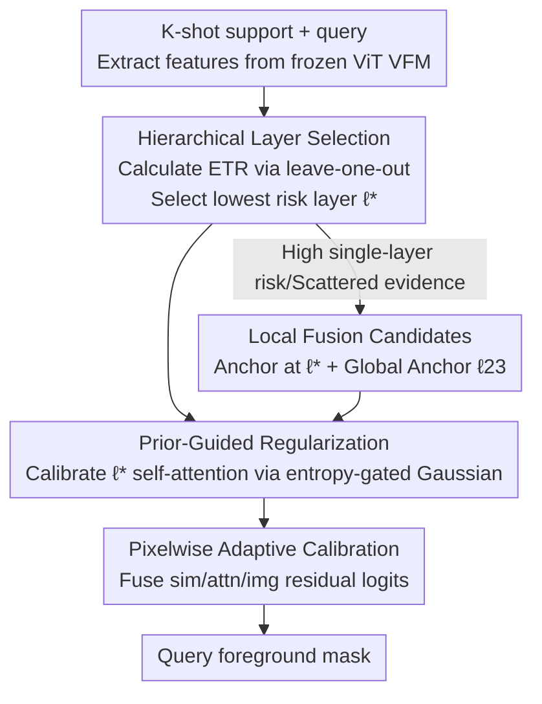

# Selective, Regularized, and Calibrated: Harnessing Vision Foundation Models for Cross-Domain Few-Shot Semantic Segmentation

**Conference**: CVPR 2026  
**arXiv**: [2605.19340](https://arxiv.org/abs/2605.19340)  
**Code**: https://zhiyuan624.github.io/HERA-CDFSS/ (Project Page)  
**Area**: Semantic Segmentation / Cross-Domain Few-Shot / Vision Foundation Models  
**Keywords**: Cross-Domain Few-Shot Segmentation, Vision Foundation Models, Test-Time Adaptation, Layer Selection, Attention Regularization

## TL;DR
HERA identifies that the failure of using Vision Foundation Models (VFMs) for cross-domain few-shot segmentation stems from "layer sensitivity + attention noise + pixel error." It proposes a three-stage select-regularize-calibrate framework: first, it adaptively selects the most stable layer per episode via Hierarchical Layer Selection (HLS); second, it regularizes the self-attention of that layer using an entropy-gated Gaussian prior (PGR); finally, it fuses multi-path residuals to calibrate pixel predictions (PAC). The entire backbone remains frozen, fine-tuning <2.7% of parameters at test-time without accessing source data, surpassing SOTA by over 4.1 mIoU across four CD-FSS benchmarks.

## Background & Motivation
**Background**: Few-shot semantic segmentation (FSS) learns class-agnostic correspondences via support–query pairs to generalize from base to novel classes, performing well under in-distribution settings. Cross-domain few-shot segmentation (CD-FSS) requires pixel-level prediction under the triple constraints of "unseen target domains + novel classes + minimal support annotations." Existing CD-FSS methods are predominantly based on CNN backbones, either performing domain generalization training on source data or mining cross-image correspondences.

**Limitations of Prior Work**: CNN-based routes are costly and depend on source data; their convolutional inductive bias limits long-range reasoning, and sparse annotations lead to overfitting under distribution shifts. Intuitively, replacing them with VFMs (such as DINOv3, SAM, or CLIP, which use large-scale pre-trained ViTs) should provide stronger and more transferable representations. However, direct application of VFMs to CD-FSS encounters two new challenges: (1) The few annotations for novel classes are insufficient relative to the VFM's pre-training scale, making retraining prone to overfitting and source data dependency; (2) Insufficient coverage of target domain distributions in pre-training leads to **cross-domain inconsistency** and **inter-layer sensitivity**—the transferability of different VFM layers varies significantly under distribution shift, making both global freezing and joint fine-tuning unreliable.

**Key Challenge**: The authors empirically found (using DINOv3 as an example) that ViT layers 0–11 emphasize low signal-to-noise ratio edge textures, while layers 12–23 provide sharper, class-agnostic objectness, with a semantic leap occurring around layers 11–12. However, the **optimal layer fluctuates with episodes and domain shifts**, rendering any fixed layer selection fragile. The root cause is not the lack of VFM representation capability, but rather the unhandled **layer-level transferability fluctuations and head-level interaction noise**.

**Goal**: Establish a source-free test-time adaptation setting—without source data access, source/target retraining, or anything beyond episodic support samples—to allow frozen VFMs to adapt stably to new domains. This involves selecting the correct working layer, purifying its attention, and calibrating the final pixel predictions.

**Key Insight**: Since errors cascade from representation to prediction, corrections should be applied hierarchically—from "Representation → Interaction → Pixel"—rather than applying single-point patches. Each episode uses a leave-one-out strategy to create pseudo-queries from support data to estimate risk, transforming "layer selection" into a data-driven computable metric rather than a heuristic score.

**Core Idea**: Utilize a hierarchical pipeline of "per-episode lowest risk layer selection (select) → entropy-gated prior attention regularization (regularize) → multi-path residual pixel calibration (calibrate)" to guide the frozen VFM in adapting to new domains, only updating <2.7% of parameters during testing.

## Method

### Overall Architecture
HERA (Hierarchical Exemplar Representation Adaptation) takes an episodic $K$-shot task—consisting of $K$ support images with masks $\mathcal{S}=\{(I_s^i,M_s^i)\}_{i=1}^K$ and a query image $I_q$—and outputs the foreground mask of the query. The entire pipeline performs test-time adaptation on a **frozen ViT VFM** (DINOv3 by default) through three top-down stages:

Stage 1: **HLS** addresses "which layer to use." For candidate layers (restricted to the semantically stable 12–23 range), a data-dependent Exemplar Transfer Risk (ETR) is calculated per episode to select the lowest-risk layer $\ell^\star$ (either a single layer or a local fusion anchored at the optimal layer), fine-tuning minimal parameters only for that layer. Stage 2: **PGR** addresses "noisy layer attention." It calibrates self-attention at layer $\ell^\star$ using a head-wise, entropy-gated Gaussian prior to enhance locality and suppress far-field spurious peaks while preserving global coverage. Stage 3: **PAC** addresses "pixelwise residuals." It fuses the selected representations, purified attention maps, and query-prototype contrast maps into lightweight residual logits to calibrate pixel predictions, specifically refining thin boundaries and low-contrast regions. This select–regularize–calibrate hierarchical path freezes the backbone, maintains a peak VRAM of 4.2GB, and involves <2.7% trainable parameters.

### Key Designs

**1. Hierarchical Layer Selection (HLS): Per-Episode Selection via Data-Dependent Transfer Risk**

Addressing the fragility of fixed layers under domain shift. HLS replaces heuristic scoring with a task-aligned metric: leave-one-out within each episode using support samples as pseudo-queries. In the $i$-th iteration, $(I_s^i,M_s^i)$ acts as the pseudo-query, while the remaining support samples calculate the prototype $\mathbf{P}_s^i$. Features $\mathbf{F}_q^i$ are extracted at layer $\ell$, and the Exemplar Transfer Risk is defined as "1 minus the average pseudo-query mIoU":

$$\mathcal{R}_{\text{layer}}(\ell)=1-\frac{1}{K}\sum_{i=1}^{K}\mathrm{mIoU}\big(\cos(\mathbf{P}_s^{i},\mathbf{F}_q^{i}),M_q^{i}\big),\qquad \ell^\star=\arg\min_{\ell\in\mathcal{C}}\mathcal{R}_{\text{layer}}(\ell)$$

where the pseudo-query ground truth $M_q^i$ is the support’s own mask $M_s^i$. The candidate set $\mathcal{C}$ is limited to the semantic stable zone $\{12,\dots,23\}$. Once $\ell^\star$ is selected, the backbone remains frozen, and a minimal parameter set $\phi$ is fine-tuned using the same leave-one-out structure via a binary segmentation BCE loss: $\mathcal{L}_{\text{TTA}}=\frac{1}{K}\sum_i\mathrm{BCE}(\cos(\mathbf{P}_s^{i,\ell^\star},\mathbf{F}_q^{i,\ell^\star}),M_q^i)$. This stage contributes the most to the framework (providing a +13.6 mIoU gain in isolation) by grounding "layer selection" in episodic evidence.

**2. Local Fusion Candidates: Stabilizing Selection when Single Layers are Fragile**

Addressing cases where single layers struggle with thin structures or clutter. HLS does not just pick one optimal layer $\ell_{\text{single}}$; it constructs a compact local fusion pool $\mathcal{U}$ centered on it. The final layer $\ell_{23}$ is included in every fusion candidate as a global context anchor to compensate for occlusion. Fusion weights combine the "single-layer risk $r_\ell$" and "distance to $\ell_{23}$":

$$w_\ell=\frac{\exp(-\beta r_\ell-\mathrm{dist}(\ell,\ell_{23})/\tau)}{\sum_{j\in U}\exp(-\beta r_j-\mathrm{dist}(j,\ell_{23})/\tau)},\qquad F^U=\sum_{\ell\in U}w_\ell F^\ell$$

$\beta$ controls the reliance on risk evidence, and $\tau$ is the local bandwidth favoring deep semantic aggregation. All candidates (single/fused) are evaluated via ETR.

**3. Prior-Guided Regularization (PGR): Per-Head External Calibration of Attention**

Addressing "interaction noise" at the head level under distribution shift. PGR injects a Gaussian prior $\phi(p_j;p_i,\sigma)=\exp(-\|p_j-p_i\|^2/2\sigma^2)$ centered at query locations $p_i$, using an **entropy gate** to decide the sharpness of the prior for each head. Let $\bar H_q^{(h)}$ be the average row entropy of $QK^\top$ and $\bar H_k^{(h)}$ reflect local stability; a logistic gate $g(\cdot)$ with temperature $\alpha$ is used:

$$\gamma_h=g(\alpha(\bar H_q^{(h)}-\bar H_k^{(h)})),\qquad \sigma_h=(1-\gamma_h)\sigma_{\text{glo}}+\gamma_h\sigma_{\text{loc}}$$

Heads with high locality and confidence receive sharper priors (smaller $\sigma$). This adaptive mechanism respects the functional diversity of ViT heads across different spatial scales.

**4. Pixelwise Adaptive Calibration (PAC): Multi-Path Residual Prediction Calibration**

Addressing "residual artifacts" near thin boundaries. PAC computes three lightweight residual paths—feature similarity $\ell_{\text{sim}}$, one-hop attention propagation $\ell_{\text{attn}}$, and image appearance $\ell_{\text{img}}$—adding them to the base logit $\ell_0$:

$$\ell_{\text{final}}(x)=\ell_0(x)+w_{\text{sim}}\ell_{\text{sim}}(x)+w_{\text{attn}}\ell_{\text{attn}}(x)+w_{\text{img}}\ell_{\text{img}}(x)$$

A single-step refine-vote gate ensures residuals are applied only when estimated gain is positive, incurring negligible overhead.

### Loss & Training
TTA only optimizes a binary segmentation loss $\mathcal{L}_{\text{TTA}}$ (BCE via leave-one-out). Optimizer: Adam (lr $=1.3\times10^{-3}$). The few-shot head uses SSP, with the backbone (DINOv3) frozen. For each target episode: (i) HLS selects the layer; (ii) Leave-one-out updates are performed on $K$ support samples. For 1-shot, soft copy–paste synthesizes views. Peak VRAM: 4.2GB; Trainable parameters: 8.39M (2.69%).

## Key Experimental Results

### Main Results
Testing across four target domains (DeepGlobe, ISIC2018, Chest X-ray, FSS-1000) with episodic sampling. HERA is source-free; baselines often require source/target retraining.

| Method | Training Paradigm (S/T) | 1-shot mIoU | 5-shot mIoU |
|------|------|------|------|
| SSP (ECCV22, no-retrain baseline) | ✓/× | 57.3 | 63.1 |
| DATO (CVPR25, CNN, Source trained) | ✓/× | **70.3** | 73.8 |
| IFA (CVPR24) | ✓/✓ | 67.8 | 71.4 |
| LoEC‡ (CVPR25, ViT) | ✓/✓ | 65.0 | 70.4 |
| SDRC‡ (ICML25, ViT) | ✓/✓ | 63.2 | 67.3 |
| **HERA‡ (Ours, DINOv3)** | **∅ source-free** | 68.3 | **77.9** |

Ours (DINOv3) achieves 68.3/77.9 (1-/5-shot). In 5-shot, HERA outperforms LoEC by +7.5 and the no-retrain baseline SSP by +14.8. Even compared to source-trained CNN methods like DATO, 5-shot gain is +4.1.

### Ablation Study
**Component-wise gain (5-shot mIoU)**:

| Configuration | DeepGlobe | ISIC | Chest X-ray | FSS-1000 | Mean | Δ vs SSP |
|------|------|------|------|------|------|------|
| SSP Baseline | 49.6 | 48.2 | 74.5 | 80.2 | 63.1 | +0.0 |
| + HLS | 61.7 | 71.4 | 87.7 | 86.0 | 76.7 | **+13.6** |
| + HLS + PGR | 62.6 | 72.0 | 88.0 | 86.5 | 77.3 | +14.2 |
| + HLS + PAC | 62.1 | 71.6 | 88.3 | 86.6 | 77.2 | +14.1 |
| + HLS + PGR + PAC | 63.4 | 73.6 | 87.9 | 86.7 | **77.9** | +14.8 |

**Key Findings**:
- **HLS is the main driver**: Contributing +13.6 out of the +14.8 total gain, proving that "selecting the right layer" is the bottleneck for VFMs in CD-FSS.
- **PGR and PAC are complementary**: One operates at the representation level and the other at the pixel level; using both yields a gain slightly higher than the sum of individual gains.
- **Efficiency**: Peak VRAM is just 4.2GB with <2.7% trainable parameters, making deployment costs negligible compared to retraining methods.

## Highlights & Insights
- **Risk Minimization for Layer Selection**: ETR transforms layer selection into a computable task via leave-one-out on support samples, aligning selection with the final task without proxy losses.
- **Entropy-Gated Prior Bandwidth**: Using the difference between $QK^\top$ and $KK^\top$ row entropy to determine head locality is an elegant mechanism for adaptive attention regularization.
- **Source-free + Frozen Backbone**: High utility for privacy-sensitive deployments (e.g., medical settings) where source data is inaccessible and backbones must remain frozen.
- **Diagnostic Contribution**: The paper maps the semantic shift in ViT layers to identify exactly where VFMs fail, then provides targeted solutions.

## Limitations & Future Work
- **1-shot gap**: Although strong, HLS still trails behind the best CNN-based 1-shot methods (68.3 vs 70.3) due to higher risk estimation variance with single-sample pseudo-queries.
- **Candidate Range**: The candidate set (12-23) is based on DINOv3 observations; its robustness for other backbones like SAM or MAE remains to be fully explored.
- **PAC Gain**: The +0.64 total gain from PAC is relatively small; more sophisticated boundary modeling might raise this ceiling.

## Related Work & Insights
- **vs CNN CD-FSS (DATO/IFA)**: These rely on source domain training; HERA enables "plug-and-play" of frozen VFMs to new domains without source data, significantly leading in 5-shot scenarios.
- **vs ViT-based CD-FSS (LoEC/SDRC)**: Previous ViT methods still assume source retraining, which risks overfitting; HERA is the first to achieve superior performance in a completely source-free, episodic adaptive manner.

## Rating
- Novelty: ⭐⭐⭐⭐⭐ 
- Experimental Thoroughness: ⭐⭐⭐⭐ 
- Writing Quality: ⭐⭐⭐⭐⭐ 
- Value: ⭐⭐⭐⭐⭐ 

<!-- RELATED:START -->

## Related Papers

- [\[CVPR 2026\] Cross-Domain Few-Shot Segmentation via Multi-view Progressive Adaptation](cross-domain_few-shot_segmentation_via_multi-view_progressive_adaptation.md)
- [\[CVPR 2026\] GKD: Generalizable Knowledge Distillation from Vision Foundation Models for Semantic Segmentation](gkd_generalizable_knowledge_distillation_vfm.md)
- [\[AAAI 2026\] Bridging Granularity Gaps: Hierarchical Semantic Learning for Cross-Domain Few-Shot Segmentation](../../AAAI2026/segmentation/bridging_granularity_gaps_hierarchical_semantic_learning_for_cross-domain_few-sh.md)
- [\[ICML 2025\] Adapter Naturally Serves as Decoupler for Cross-Domain Few-Shot Semantic Segmentation](../../ICML2025/segmentation/adapter_naturally_serves_as_decoupler_for_cross-domain_few-shot_semantic_segment.md)
- [\[CVPR 2026\] Bayesian Decomposition and Semantic Completion for Few-shot Semantic Segmentation](bayesian_decomposition_and_semantic_completion_for_few-shot_semantic_segmentatio.md)

<!-- RELATED:END -->
