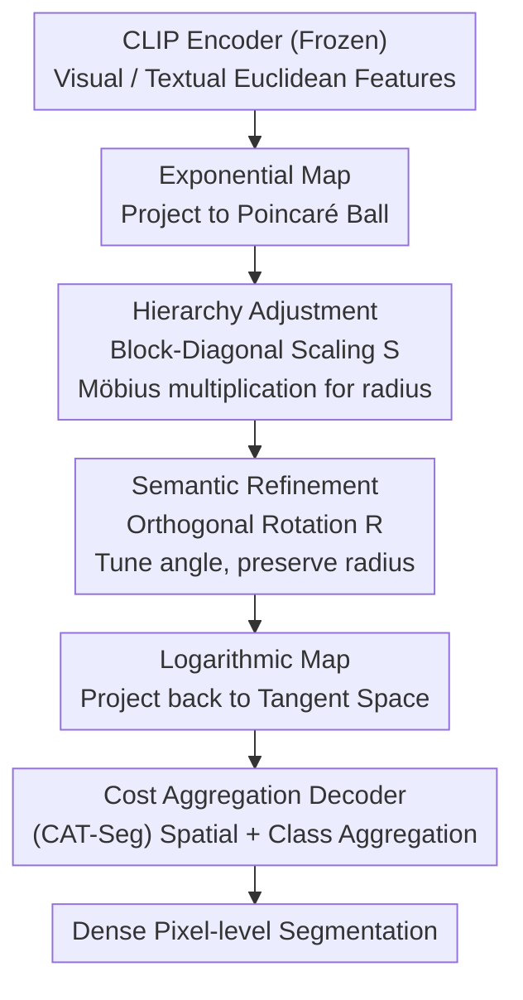

# Semantic Alignment in Hyperbolic Space for Open-Vocabulary Semantic Segmentation

**Conference**: CVPR 2026  
**arXiv**: [2605.08874](https://arxiv.org/abs/2605.08874)  
**Code**: https://tmhoanggg.github.io/HyRo/ (Project Page)  
**Area**: Open-vocabulary semantic segmentation / Hyperbolic geometry / Vision-language models  
**Keywords**: Open-vocabulary segmentation, Poincaré ball, Orthogonal rotation, CLIP fine-tuning, Semantic alignment

## TL;DR
HyRo migrates CLIP fine-tuning to hyperbolic space, observing that "hierarchy" (encoded by radius) and "semantic similarity" (encoded by angle) were previously entangled. It utilizes orthogonal rotation matrices constructed via Cayley transform to **tune only angles while keeping radii fixed**, refining cross-modal semantic alignment while preserving hierarchical structures. This achieves SOTA on 4 out of 6 benchmarks in open-vocabulary semantic segmentation.

## Background & Motivation

**Background**: Open-vocabulary semantic segmentation aims to adapt image-level vision-language models like CLIP to pixel-level dense prediction. The mainstream approach has shifted from "proposal generation then frozen CLIP classification" (with closed-set bias) to "direct CLIP fine-tuning in a shared representation space + cost aggregation decoding" (e.g., CAT-Seg, SED). Recently, hyperbolic geometry has been employed to model visual concept hierarchies. A representative work, HyperCLIP, observed that the hierarchy of image embeddings drifts from image-level to pixel-level during fine-tuning. It learned a diagonal scaling matrix in the Poincaré ball to adjust the **hyperbolic radius** of text embeddings to match pixel-level granularity.

**Limitations of Prior Work**: Methods like HyperCLIP solely adjust the radius, **imposing no constraints on the semantic alignment between embeddings**. Consequently, semantically unrelated concepts may be placed at similar radii (correct hierarchy) but with incorrect angles, making classes difficult to distinguish. Figure 1 illustrates an example: in an image of "a person sitting on a chair," HyperCLIP misclassifies both the person and the chair as "chair" because semantic orientation is lost.

**Key Challenge**: Hierarchy and semantics correspond to **two distinct geometric attributes**—hierarchy is encoded by **radial distance** (radius), while semantic similarity is encoded by **angular orientation**. Prior works coupled these into a single radius scaling operation, inevitably compromising one for the other: adjusting the radius aligns granularity but fails to adjust angles to separate similar categories.

**Goal**: Decouple these two tasks in the Poincaré ball: the radius governs hierarchy, while the angle governs semantics, allowing each to be adjusted independently.

**Key Insight**: A critical property of the Poincaré ball is **conformality**, meaning angles measured at the origin are identical to those in Euclidean space. This implies that a "rotation around the origin" can change angles (semantics) while **strictly preserving the radius** (hierarchy), achieving true decoupling. Orthogonal transformations are precisely the operations that satisfy this.

**Core Idea**: Use an orthogonal rotation matrix $\mathbf{R}$ in hyperbolic space to tune only the embedding angles without altering their radii. Radius scaling (following prior work) is responsible for placing embeddings at the correct hierarchy, while rotation refines semantic angular alignment. The two operations are orthogonal in responsibility.

## Method

### Overall Architecture

HyRo is a lightweight adaptation framework that **fine-tunes only a small number of hyperbolic transform parameters while freezing the entire CLIP**. Given a Euclidean feature $\mathbf{x}\in\mathbb{R}^d$ (visual or textual) from a CLIP encoder, the pipeline is as follows: first, it uses an **exponential map** to project the feature from Euclidean tangent space to the Poincaré ball; then, it performs two stages of decoupled alignment—**Hierarchy Adjustment** using a block-diagonal scaling matrix $\mathbf{S}$ via Möbius multiplication to adjust the radius and align granularity to the pixel-level; **Semantic Refinement** using a block-diagonal orthogonal rotation matrix $\mathbf{R}$ to adjust the angle while strictly preserving the radius; finally, a **logarithmic map** projects the refined embedding back to Euclidean tangent space for a cost aggregation decoder to produce a dense segmentation map. The complete transformation is expressed as:

$$\mathbf{x}' = \log_{\mathbf{0}}^{\mathbb{D},c}\!\left(\mathbf{R}\cdot\left(\mathbf{S}\otimes_c \exp_{\mathbf{0}}^{\mathbb{D},c}(\mathbf{x})\right)\right)$$

where $\exp_{\mathbf{0}}$ enters the ball, $\mathbf{S}\otimes_c$ adjusts the radius (Möbius matrix-vector multiplication), $\mathbf{R}\cdot$ rotates the angle, and $\log_{\mathbf{0}}$ exits the ball. Both visual and textual paths undergo this refinement before cost volume computation.

### Key Designs

**1. Hyperbolic Rotation: Completely Decoupling "Angle" and "Radius" Adjustment**

This is the core contribution. While prior works caused "semantic collapse" for similar categories by only tuning the radius, this method tunes angles without destroying the hierarchy. The insight is that in the conformal Poincaré ball, **orthogonal transformations** around the origin are ideal "rotations"—they modify angles but preserve norms. Given a hyperbolic embedding $\mathbf{q}\in\mathbb{D}_c^d$ and an orthogonal matrix $\mathbf{R}$, the refined embedding is $\mathbf{v}=\mathbf{R}\mathbf{q}$. Theoretical proof (Sec 3.2) shows that rotating a tangent vector $\mathbf{v_x}=\log_{\mathbf{0}}^c(\mathbf{x})$ to $\mathbf{R}\mathbf{v_x}$ and mapping back to the manifold yields $\mathbf{x}'=\mathbf{R}\mathbf{x}$ due to orthogonality $\|\mathbf{R}\mathbf{v_x}\|=\|\mathbf{v_x}\|$. This ensures the hyperbolic radius remains strictly unchanged $\text{Rad}_{\mathbf{x}'}=\text{Rad}_{\mathbf{x}}$, while the angle at the origin becomes $\cos(\alpha')=\frac{\langle\mathbf{R}\mathbf{x},\mathbf{y}\rangle}{\|\mathbf{x}\|\|\mathbf{y}\|}$. This mathematically guarantees that semantic alignment (angle) and hierarchical depth (radius) are controlled independently.

**2. Cayley Transform + Block-Diagonal Structure: Strictly Orthogonal and Efficient**

To ensure $\mathbf{R}$ satisfies $\mathbf{R}^\top\mathbf{R}=\mathbf{I}$, the paper uses the **Cayley transform** to parameterize an unconstrained learnable matrix $\mathbf{\Theta}$. First, the skew-symmetric part is taken $\mathbf{A}=\mathbf{\Theta}-\mathbf{\Theta}^\top$, then $\mathbf{R}=(\mathbf{I}+\mathbf{A})(\mathbf{I}-\mathbf{A})^{-1}$ is derived. This ensures $\mathbf{R}$ is always orthogonal. To manage the $\mathcal{O}(d^3)$ cost of matrix inversion for high-dimensional CLIP embeddings (e.g., 768 for ViT-B/16), $\mathbf{R}$ is decomposed into $K_{\mathbf{R}}=d/n$ independent blocks $\mathbf{R}=\text{diag}(\mathbf{R}_1,\dots,\mathbf{R}_{K_{\mathbf{R}}})$. Each block $\mathbf{R}_i\in\mathbb{R}^{n\times n}$ undergoes the Cayley transform independently, reducing complexity to $\mathcal{O}(d^3/n^2)$. A block size of $n=256$ is found to be optimal.

**3. Block-Diagonal Radius Scaling: Aligning Granularity to Pixel-level**

The hierarchy step adopts the learnable diagonal matrix $\mathbf{S}$ from HyperCLIP, implemented via Möbius matrix-vector multiplication $\mathbf{q}=\mathbf{S}\otimes_c\mathbf{h}$ for radius scaling. For efficiency, $\mathbf{S}$ also uses a block-diagonal structure $\mathbf{S}=\text{diag}(\mathbf{S}_1,\dots,\mathbf{S}_{K_{\mathbf{S}}})$, where each block $\mathbf{S}_k\in\mathbb{R}^{b\times b}$ learns scaling factors for specific feature subspaces. This complements the rotation: scaling positions embeddings at the correct abstract hierarchy (pixel vs. image), while rotation separates similar categories at that level.

**4. Cost Aggregation Decoder: Reconnecting Hyperbolic Features to Dense Prediction**

The decoder follows CAT-Seg: instead of direct pixel labeling, it computes cosine similarity between vision embeddings $D^V\in\mathbb{R}^{(H\times W)\times d}$ and text embeddings $D^L\in\mathbb{R}^{N_\mathcal{C}\times d}$ to form a cost volume $C(i,n)$. Aggregation includes **Spatial Aggregation** (using Swin blocks with shifted windows to reinforce consistency and suppress background noise) and **Class Aggregation** (using a transformer without positional encoding). A lightweight upsampling head progressively blends intermediate CLIP layers (e.g., layers 4 and 8 of ViT-B/16) to reach a $96\times96$ resolution.

### Loss & Training

The training objective is standard **pixel-wise cross-entropy** without additional regularization:

$$\mathcal{L}=-\frac{1}{H\times W}\sum_{i=1}^{H\times W}\log\frac{\exp(\hat{Y}_{i,y_i})}{\sum_{n=1}^{N_\mathcal{C}}\exp(\hat{Y}_{i,n})}$$

Crucially, **only hyperbolic transform parameters** (scaling $\mathbf{S}$ and rotation $\mathbf{R}$) are fine-tuned, while the CLIP encoder is frozen to preserve zero-shot generalization. Optimizer: AdamW; hyperbolic lr: $2\times10^{-4}$, CLIP encoder lr: $1\times10^{-6}$; both matrix block sizes are set to 256; curvature defaults to $c=0.01$; batch size is 8, trained for 40k steps.

## Key Experimental Results

Training is performed on COCO-Stuff, with cross-dataset zero-shot evaluation on ADE20K (A-150 / A-847), PASCAL-Context (PC-59 / PC-459), and PASCAL VOC (PAS-20 / PAS-20b) using mIoU. The backbone is CLIP ViT-B/16.

### Main Results

| Dataset | HyRo (Ours, H) | HyperCLIP (H) | SED (E) | SAN (E) | Gain vs HyperCLIP |
|--------|------|------|------|------|------|
| A-847 | **12.0** | 11.9 | 11.4 | 10.1 | +0.1 |
| PC-459 | **18.9** | 18.2 | 18.6 | 12.6 | +0.7 |
| A-150 | 31.2 | **31.7** | 31.6 | 27.5 | −0.5 |
| PC-59 | **57.3** | 57.1 | 57.3 | 53.8 | +0.2 |
| PAS-20 | **95.0** | 94.9 | 94.4 | 94.0 | +0.1 |
| PAS-20b | 76.7 | **77.1** | — | — | −0.4 |

("E"=Euclidean, "H"=Hyperbolic.) HyRo achieves state-of-the-art results on 4 out of 6 benchmarks. Gains are most significant in **large-vocabulary** settings (A-847 and PC-459), confirming that rotation-based angular refinement is particularly useful for distinguishing a large number of visually similar categories.

### Ablation Study

| Radius | Rotation | A-847 | PC-459 | A-150 | PC-59 | PAS-20 | PAS-20b |
|--------|----------|-------|--------|-------|-------|--------|---------|
| ✗ | ✗ | 11.4 | 17.6 | 29.8 | 56.2 | 94.8 | 75.9 |
| ✓ | ✗ | 11.9 | 18.2 | **31.7** | 57.1 | 94.9 | 76.4 |
| ✗ | ✓ | 11.6 | 18.3 | 30.6 | 56.5 | **95.4** | **76.7** |
| ✓ | ✓ | **12.0** | **18.9** | 31.2 | **57.3** | 95.0 | **76.7** |

Ablation of Curvature $c$ and Rotation Block Size $n$:

| Config | A-847 | PC-459 | A-150 | Description |
|------|-------|--------|-------|------|
| $c=0.01$ (Default) | 12.0 | 18.9 | 31.2 | "Gentle" curvature preserves zero-shot generalization |
| $c=1.0$ | 11.2 | 17.6 | 30.1 | High curvature distorts pretrained space excessively |
| $n=32$ | 11.4 | 17.6 | 29.8 | Insufficient rotation capacity |
| $n=128$ | 11.6 | 18.3 | 30.6 | Medium |
| $n=256$ (Default) | **12.0** | **18.9** | **31.2** | Optimal balance of capacity and generalization |

### Key Findings
- **Rotation is a key driver for open-vocabulary generalization**: On A-847, adding rotation alone improves the baseline from 11.4 to 11.6 and prevents "semantic collapse." Radius scaling handles granularity (improving A-150 from 29.8 to 31.7). The combination is optimal.
- **Curvature must be "gentle"**: $c=0.01$ is generally best. High curvature ($c=1.0$) might favor saturated benchmarks but hurts performance on diverse ones like A-847 due to excessive distortion of the Euclidean CLIP space.
- **Large vocabularies require higher rotation capacity**: Larger block sizes ($n$) yield more significant gains on fine-grained targets like A-847.
- Attention visualization shows that HyRo concentrates attention on targets (e.g., "person", "window") and suppresses background noise, confirming improved cross-modal semantic correspondence.

## Highlights & Insights
- **Translating "Semantics vs. Hierarchy" to "Angle vs. Radius" is the most elegant geometric intuition of the paper**: This polar coordinate perspective in the Poincaré ball provides a natural mathematical framework for decoupling.
- **Cayley Transform + Block-Diagonal structure is a reusable engineering trick**: This combination for "strictly orthogonal, learnable, and computationally efficient" matrices can be transferred to any high-dimensional representation learning task requiring orthogonal constraints.
- **Extremely Lightweight Adaptation**: Freezing the entire CLIP and learning only two block-diagonal matrices in 8 hours on 8 GPUs is highly efficient and preserves zero-shot capabilities.
- The two-stage decoupling process of "radius then angle" essentially decomposes an entangled alignment goal into two orthogonal sub-objectives, applicable to any retrieval or alignment task with hierarchical and similarity constraints.

## Limitations & Future Work
- **Small Absolute Gains**: The improvement over HyperCLIP is often between 0.1~0.7 mIoU, and performance slightly decreases on A-150 and PAS-20b, suggesting marginal utility in saturating benchmarks.
- **Evaluation Scope**: Experiments were conducted on a single backbone (ViT-B/16) and one decoder type (CAT-Seg); the stability of rotation across larger backbones or different decoders remains unverified.
- **Interaction between Scaling and Rotation**: While theoretical decoupling is guaranteed, the paper lacks detailed analysis of how the two branches interact during simultaneous optimization.
- Future work aims to extend the framework to open-vocabulary **video segmentation**, where temporal consistency will pose new challenges for hyperbolic refinement.

## Related Work & Insights
- **vs. HyperCLIP**: Both fine-tune CLIP in the Poincaré ball. HyperCLIP only adjusts radius for granularity; this work adds the "missing half" by refining angles (semantics) and theoretically proving they do not interfere with the radius.
- **vs. Euclidean Cost-Aggregation (CAT-Seg/SED)**: These utilize Euclidean cost volumes; this work demonstrates that non-Euclidean geometry better models the hierarchical and semantic structure of visual concepts.
- **vs. Mask-Proposal Methods (OVSeg/ZSseg)**: Unlike proposal-based methods with closed-set biases, this approach uses direct dense fine-tuning, which is more robust for unseen categories.
- **vs. Hyperbolic Vision-Language (MERU)**: While previous works use hyperbolic radius to model modality hierarchies (e.g., text is more abstract than images), this work is the first to explicitly treat **angle** as the semantic dimension and optimize it via orthogonal rotations.

## Rating
- Novelty: ⭐⭐⭐⭐ The "hierarchy=radius, semantics=angle" decoupling perspective is clear; orthogonal rotation via Cayley transform is theoretically grounded.
- Experimental Thoroughness: ⭐⭐⭐⭐ Strong benchmark coverage and detailed ablations, though focused on a single architecture with modest absolute gains.
- Writing Quality: ⭐⭐⭐⭐⭐ Excellent flow from motivation to geometric intuition and theoretical proof.
- Value: ⭐⭐⭐⭐ Lightweight and provides a reusable trick for orthogonal constraints in high-dimensional spaces.

<!-- RELATED:START -->

## Related Papers

- [\[CVPR 2026\] Seeing Both Sides: Towards Bidirectional Semantic Alignment for Open-Vocabulary Camouflaged Object Segmentation](seeing_both_sides_towards_bidirectional_semantic_alignment_for_open-vocabulary_c.md)
- [\[CVPR 2026\] S2C2Seg: Semantic-Spatial Consistency and Category Optimization for Open-Vocabulary Segmentation](s2c2seg_semantic-spatial_consistency_and_category_optimization_for_open-vocabula.md)
- [\[CVPR 2026\] The Power of Prior: Training-Free Open-Vocabulary Semantic Segmentation with LLaVA](the_power_of_prior_training-free_open-vocabulary_semantic_segmentation_with_llav.md)
- [\[CVPR 2026\] GeoGuide: Hierarchical Geometric Guidance for Open-Vocabulary 3D Semantic Segmentation](geoguide_hierarchical_geometric_guidance_for_open-vocabulary_3d_semantic_segment.md)
- [\[CVPR 2026\] MARIS: Marine Open-Vocabulary Instance Segmentation](maris_marine_open-vocabulary_instance_segmentation.md)

<!-- RELATED:END -->
