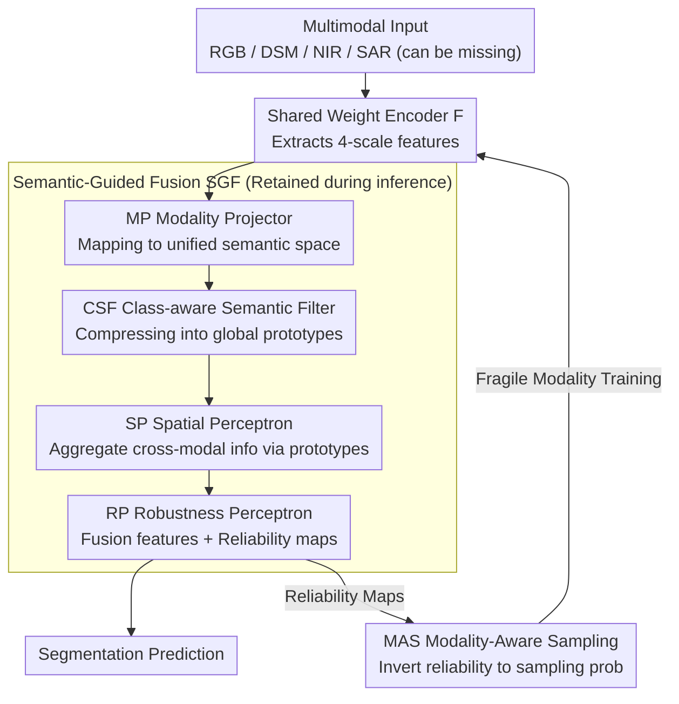

# SGMA: Semantic-Guided Modality-Aware Segmentation for Remote Sensing with Incomplete Multimodal Data

**Conference**: CVPR 2026  
**arXiv**: [2603.02505](https://arxiv.org/abs/2603.02505)  
**Code**: None  
**Area**: Semantic Segmentation  
**Keywords**: Incomplete Multimodal Semantic Segmentation (IMSS), Remote Sensing, Modality Imbalance, Semantic Prototypes, Adaptive Fusion

## TL;DR

This paper proposes the SGMA framework, which employs a Semantic-Guided Fusion (SGF) module to construct global semantic prototypes for adaptive cross-modal fusion. It further utilizes a Modality-Aware Sampling (MAS) module to dynamically increase the training frequency of fragile modalities, addressing three major challenges in IMSS for remote sensing: modality imbalance, large intra-class variance, and cross-modal heterogeneity.

## Background & Motivation

### 1. Background

Multimodal Semantic Segmentation (MSS) integrates multi-source sensor information (e.g., RGB, NIR, DSM, SAR) to achieve more accurate scene understanding in remote sensing earth observation. However, in practical applications, sensor failures or incomplete coverage often lead to missing modalities, giving rise to research on Incomplete Multimodal Semantic Segmentation (IMSS).

### 2. Limitations of Prior Work

IMSS faces three major challenges:

- **Modality Imbalance**: Dominant modalities (e.g., RGB) dominate the learning process during training, suppressing feature learning in fragile modalities (e.g., DSM/NIR/SAR).
- **Large Intra-class Variance**: The same semantic category varies significantly across different scales, orientations, and shapes (e.g., buildings of various sizes).
- **Cross-modal Heterogeneity**: Different modalities produce contradictory responses for the same semantic region (e.g., rooftops and ground may have similar colors in RGB but different heights in DSM).

### 3. Key Challenge

Existing methods rely on contrastive learning or joint optimization; however, forced alignment often discards modality-specific information (over-alignment), and imbalanced training biases results toward robust modalities. Modality dropout fails to sufficiently train fragile modalities, while MAE-based methods focus on low-level reconstruction rather than high-level semantics.

### 4. Goal

Design a unified framework that maintains robust performance under arbitrary missing modality scenarios while explicitly addressing modality imbalance, intra-class variance, and cross-modal heterogeneity.

### 5. Key Insight

Establish cross-modal semantic anchors via category-level semantic prototypes to avoid the drawbacks of pixel-wise contrastive alignment. Use attention weights to quantify modality robustness and guide adaptive fusion and sampling.

### 6. Core Idea

Multimodal features are compressed into global semantic prototypes (one vector per category), which act as queries to adaptively aggregate features from each modality via attention. These attention weights also reflect modality reliability, driving the MAS module to increase the training frequency of fragile modalities, thereby achieving balanced learning.

## Method

### Overall Architecture

To achieve robust segmentation in remote sensing scenarios with arbitrary missing modalities, the core mechanism of SGMA shifts from hard pixel-wise alignment to "translating" individual modality features into a shared semantic space. Global semantic prototypes (one per category) serve as anchors, and attention mechanisms perform fusion and reliability assessment around these anchors. The pipeline is as follows: A weight-shared encoder $F$ extracts features at four scales for all modalities; the Modality Projector (MP) maps them into a unified semantic space; the Class-aware Semantic Filter (CSF) compresses features into global prototypes; and two attention stages (SP / RP) aggregate cross-modal information using prototypes as queries, while simultaneously outputting modality reliability maps. These maps drive MAS to determine the sampling priority for the next training iteration.

The framework is organized into two plug-and-play, parallelly optimized branches: Semantic-Guided Fusion (SGF, containing MP/CSF/SP/RP) reduces intra-class variance, harmonizes cross-modal contradictions, and produces segmentation predictions; Modality-Aware Sampling (MAS) utilizes reliability scores from SGF to dynamically adjust sampling probabilities to resolve modality imbalance. Both branches generate segmentation predictions for joint optimization during training, while only the SGF branch is retained during inference, ensuring additional overhead is concentrated on the training phase.

### Key Designs

**1. Modality-specific Projector (MP): Mapping Heterogeneous Modalities to a Single Semantic Space**

Physical meanings vary drastically across modalities (RGB for color, DSM for height, SAR for backscatter). Direct concatenation leads to fusion on "incomparable" features. MP uses three parallel depth-wise separable convolutions of different sizes (11×11, 7×7, 3×3) for each modality to capture multi-scale context, followed by a 1×1 convolution for projection. Multi-scale parallelism is crucial: same semantic categories (like buildings) vary greatly in scale in remote sensing imagery. Parallel receptive fields ensure that projected features are aligned to a common space while preserving modality-specific scale information.

**2. Class-aware Semantic Filter (CSF) + Global Semantic Prototypes: Anchoring Dispersed Pixels with Class Centers**

Intra-class variance is a major IMSS pain point—objects of the same class look different across scales and shapes. CSF compresses modal features from $C_i$ channels to $K$ (number of classes) channels to obtain compact responses, which are then matrix-multiplied with semantic features to gather global prototypes:

$$\{p_{se}^{i,k}\}_{k=1}^K = [c_m^i] \otimes [f_{m \to se}^i]^T, \quad p_{se}^{i,k} \in \mathbb{R}^{C}$$

Each $p_{se}^{i,k}$ is a global prototype vector for category $k$ under modality $i$, possessing a global receptive field. It pulls scattered pixel representations toward their respective class centers. Subsequent fusion revolves around $K$ stable class anchors rather than millions of pixels, suppressing intra-class variance and avoiding "over-alignment" that erases modality-specific traits.

**3. Spatial Perceptron (SP): Category-based Cross-modal Feature Selection**

SP broadcasts global prototypes to every spatial location as queries to search rearranged multimodal features via multi-head attention:

$$a_{se}^{i,k} = \text{MHA}_{SP}(q_i, k_i, v_i)$$

where $q_i$ is the broadcasted prototype and $k_i = v_i$ are the rearranged multimodal features. This allows each pixel to selectively aggregate relevant cross-modal signals based on its specific category, rather than using a uniform average fusion, enhancing categorical consistency.

**4. Robustness Perceptron (RP): Joint Fusion and Reliability Quantification**

RP uses the semantic-guided features from SP as queries for another multi-head attention pass, outputting both the fused features $f_{SGF}^i$ and modality robustness maps $\{r_m^i\}_{m \in \mathcal{M}}$. The attention weights encode how well each modality aligns with the semantic prototypes—better alignment indicates higher reliability for that specific spatial location and category. This provides a category-dependent and scale-dependent reliability assessment (e.g., DSM gets high weights for buildings, NIR performs better on vegetation).

**5. Modality-Aware Sampling (MAS): Translating Low Reliability into Training Priority**

Modality imbalance occurs when dominant modalities (RGB) dominate gradients, leaving fragile modalities under-trained. MAS decouples this by inverting robustness scores into sampling probabilities. For each training iteration, one modality is sampled for independent training:

$$\hat{r}_m^i = \frac{1/r_m^i}{\sum_{m'} 1/r_{m'}^i}$$

Modalities with lower robustness have a higher probability of being sampled, granting fragile modalities more opportunities for independent training. This "decoupled training" approach fundamentally resolves the imbalance issue by removing direct gradient competition.

### Loss & Training

- SGF and MAS each output segmentation predictions, optimized using cross-entropy loss: $\mathcal{L}_{IMSS} = \lambda_{SGF} \mathcal{L}_{SGF} + \lambda_{MAS} \mathcal{L}_{MAS}$, where $\lambda_{SGF} = 2$ and $\lambda_{MAS} = 1$.
- Modality dropout is used during training to simulate missing scenarios across all modality combinations.
- Optimizer: AdamW, lr = 6e-5, polynomial decay (power 0.9), 200 epochs with 10-epoch warm-up.

## Key Experimental Results

### Main Results

**Datasets**: ISPRS Potsdam (RGB+DSM+NIR), DFC2023 (RGB+DSM+SAR), DELIVER (RGB+Depth+Event+LiDAR).

**Table 1: ISPRS Dataset mIoU (%) — PVT-v2-b2 backbone**

| Method | R | D | N | R+D | R+N | D+N | R+D+N | Average | Last-1 |
|--------|---|---|---|---|---|---|-------|---------|--------|
| MuSS   | 40.21 | 17.13 | 1.36 | 83.75 | 57.71 | 31.52 | 86.50 | 45.45 | 1.36 |
| M3L    | 30.72 | 10.41 | 20.99 | 81.31 | 78.54 | 72.76 | 84.07 | 54.12 | 10.41 |
| IMLT   | 69.57 | 38.78 | 69.82 | 80.03 | 81.29 | 67.82 | 85.12 | 70.35 | 38.78 |
| MAGIC  | 81.39 | 34.34 | 46.97 | 83.27 | 77.99 | 63.30 | 84.75 | 67.43 | 34.34 |
| **Ours** | **83.51** | **57.05** | **76.06** | **86.62** | **84.25** | **82.56** | **86.84** | **79.55** | **57.05** |

Average mIoU increased by +9.20%, and Last-1 (worst modality) increased by **+18.26%**.

### Ablation Study

**Table 3: Progressive Ablation of SGF and MAS — ISPRS (PVT-v2-b2)**

| Variant | SGF | MAS | Average mIoU | Last-1 mIoU |
|---------|-----|-----|--------------|-------------|
| (a) Baseline | ✗ | ✗ | 46.51 | 2.61 |
| (b) SGF Only | ✓ | ✗ | 49.13 | 7.01 |
| (c) SGF+MAS | ✓ | ✓ | **79.55** | **57.05** |

- SGF alone provides limited improvement (+2.62%) because fragile modalities remain under-trained without MAS.
- Adding MAS leads to a surge in Average (+30.42%) and Last-1 (**+50.04%**) mIoU.

### Key Findings

1. **Significant Boost for Fragile Modalities**: Fragile modal performance (DSM/SAR/Event) saw the highest gains (+10~+18%).
2. **Modality Scalability**: SGMA is the only method where performance consistently improves as more modalities are added.
3. **Backbone Generalization**: Effective on ResNet-50 as well, showing plug-and-play capability.
4. **Computational Efficiency**: Only adds 9.47 GFLOPs and 4.79M parameters (1.1% and 1.7% of the backbone respectively).
5. **Interpretability**: Visualization shows attention weights adapt across layers—near-equal in shallow layers, RGB dominant (0.66) in deep layers.

## Highlights & Insights

1. **Semantic Prototypes as Anchors**: Using class-level prototypes instead of pixel-wise alignment avoids over-alignment while suppressing intra-class variance.
2. **Dual-purpose Attention**: RP attention weights are used for both weighted fusion and robustness evaluation simultaneously.
3. **Decoupled Training Logic**: MAS solves imbalance not through gradient competition, but by ensuring fragile modalities "train more" independently.
4. **Success of Fragile-only Combinations**: Combinations like DSM+SAR or Event+LiDAR produced meaningful segmentations, showing excellent utilization of complementary information.

## Limitations & Future Work

1. **Explainability**: Lack of an explicit mechanism to quantify the learning dynamics beyond reliability map visualization.
2. **Temporal Multimodality**: Dynamic changes in modality reliability due to temporal factors (e.g., seasons) are not modeled.
3. **Prototype Stability**: Global prototypes might be unstable in early training stages, especially for rare classes.
4. **Inference Robustness**: MAS is training-only; robustness might be limited when encountering entirely unseen fragile modality combinations during inference.

## Related Work & Insights

- **IMLT**: Uses contrastive learning + masked pre-training, but forced alignment tends to lose modality-specific info.
- **MAGIC**: Statically splits modalities into robust/fragile groups; SGMA improves on this with dynamic assessment.
- **M3L**: Utilizes modality dropout but fails to address the training sufficiency of fragile modalities.
- **Insight**: The semantic prototype approach and MAS strategy are applicable to other multimodal tasks like medical imaging (missing MRI/CT/PET).

## Rating

⭐⭐⭐⭐ A systemic and practical IMSS framework. The combination of semantic prototypes and robustness-guided sampling is elegantly designed. The massive improvement in fragile modalities (Last-1 +18%) offers significant value for real-world deployment. The low-overhead, plug-and-play design enhances engineering feasibility.

<!-- RELATED:START -->

## Related Papers

- [\[CVPR 2026\] Test-Time Multi-Prompt Adaptation for Open-Vocabulary Remote Sensing Image Segmentation](test-time_multi-prompt_adaptation_for_open-vocabulary_remote_sensing_image_segme.md)
- [\[CVPR 2026\] ReAttnCLIP: Training-Free Open-Vocabulary Remote Sensing Image Segmentation via Re-defined Attention in CLIP](reattnclip_training-free_open-vocabulary_remote_sensing_image_segmentation_via_r.md)
- [\[CVPR 2026\] Task-Oriented Data Synthesis and Control-Rectify Sampling for Remote Sensing Semantic Segmentation](task-oriented_data_synthesis_and_control-rectify_sampling_for_remote_sensing_sem.md)
- [\[CVPR 2026\] F2Net: A Frequency-Fused Network for Ultra-High Resolution Remote Sensing Segmentation](f2net_a_frequency-fused_network_for_ultra-high_resolution_remote_sensing_segment.md)
- [\[CVPR 2026\] Uncertainty-Aware Modality Fusion for Unaligned RGB-T Salient Object Detection](uncertainty-aware_modality_fusion_for_unaligned_rgb-t_salient_object_detection.md)

<!-- RELATED:END -->
