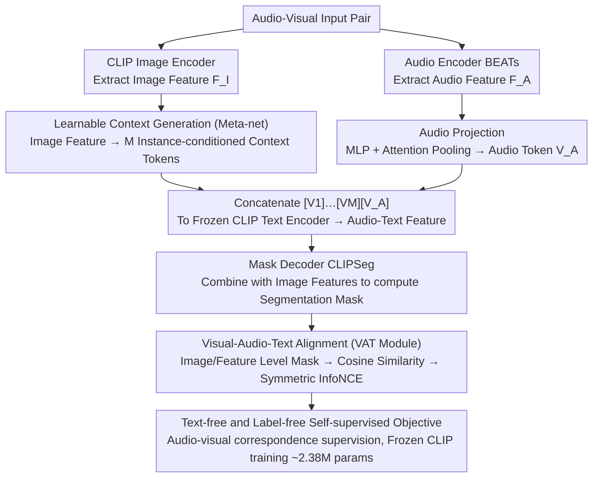

# SouPLe: Enhancing Audio-Visual Localization and Segmentation with Learnable Prompt Contexts

**Conference**: CVPR 2026  
**arXiv**: [2603.22732](https://arxiv.org/abs/2603.22732)  
**Code**: None  
**Area**: Segmentation / Audio-Visual Localization  
**Keywords**: Audio-visual localization, prompt learning, CLIP adaptation, sound source segmentation, contrastive learning

## TL;DR

Proposes SouPLe (Sound-aware Prompt Learning), which enhances semantic correspondence between audio embedding tokens and visual features by replacing fixed text prompts in CLIP with learnable context tokens generated from image features. This achieves a 3.75 cIoU improvement on VGG-SS and a 6.32 cIoU improvement in open-set settings, outperforming previous methods.

## Background & Motivation

**Background**: Audio-visual sound source localization aims to locate sounding objects within a visual scene. Mainstream methods utilize contrastive learning frameworks for self-supervised learning based on audio-visual correspondence. Recently, ACL-SSL made significant progress by using pretrained CLIP models to transform audio signals into tokens compatible with the CLIP text encoder.

**Limitations of Prior Work**: The core issue of ACL-SSL lies in its use of a fixed prompt "a photo of a $[V_A]$," which has two flaws: (1) when replacing the classification token $[CLS]$ with the audio embedding token $[V_A]$, $[V_A]$ lacks semantic information that can integrate with visual information; (2) the lack of meaningful semantic connection between fixed tokens like "a photo of a" and $[V_A]$ leads to localization failure in certain scenarios.

**Key Challenge**: CLIP's text encoder is designed to process natural language descriptions, but audio embedding tokens are not natural language. Wrapping them in fixed, non-semantic prompts is inherently a mismatch, limiting the quality of cross-modal audio-visual alignment.

**Goal**: How to provide better context for audio embedding tokens within the CLIP framework to more effectively align them with visual features for precise sound source localization and segmentation.

**Key Insight**: Inspired by CoCoOp, the prompt engineering problem is transformed into a prompt learning problem—allowing prompt tokens to be adaptively generated based on input image features rather than using fixed manual prompts.

**Core Idea**: Replace fixed text prompts with learnable context tokens conditioned on image features, allowing audio embedding tokens to achieve better semantic alignment within a rich visual context.

## Method

### Overall Architecture

SouPLe addresses the issue where ACL-SSL inserts audio into a fixed text prompt "a photo of a $[V_A]$," which lacks semantics and fails to connect with the audio token. The approach replaces this fixed shell with an image-conditioned generation—creating context tokens on-the-fly based on the current image.

The pipeline operates as follows: an audio-visual input pair is received; the CLIP image encoder extracts image features $F_I$, while the Meta-net translates these into $M$ instance-conditioned context tokens $[V_1][V_2]\dots[V_M]$. Simultaneously, the audio encoder (BEATs) extracts audio features, which are compressed into an audio embedding token $[V_A]$ via Audio Projection. Both are concatenated as $[V_1]\dots[V_M][V_A]$ and fed into the frozen CLIP text encoder to produce "image-aware" audio-text features. Finally, these features are combined with image features in a mask decoder (CLIPSeg) to solve for the sound source segmentation mask. The VAT module calculates contrastive losses between audio-text and vision at both image and feature levels. Only the Meta-net and decoder are trained; all three CLIP encoders remain frozen.

### Key Designs

**1. Learnable Context Generation (Meta-net): Image-conditioned Prompt Evolution**

The limitation is straightforward—fixed prompts like "a photo of a" provide the same generic context for every image, whereas the semantic needs of sound sources vary greatly (e.g., water flowing in a kitchen vs. human voices in a stadium). SouPLe adopts CoCoOp’s instance-conditioning approach, using a Meta-net to translate image features $F_I$ into prompts. The structure is lightweight: a two-layer bottleneck Linear-ReLU-Linear network that reduces hidden dimensions by 16x and outputs $M$ context tokens to replace the fixed prompt.

A subtle but critical detail is the token order: placing $[V_A]$ at the end ($[V_1]\dots[V_M][V_A]$) yields a cIoU approximately 3 points higher than placing it at the front. This is due to the causal attention in CLIP’s text encoder, which processes information from left to right. Previous context tokens establish the semantic space first, allowing the audio token at the end to be interpreted within that established context.

**2. Visual-Audio-Text Alignment (VAT Module): Dual-granularity Alignment**

Generating prompts is insufficient without a signal linking the audio to specific image regions. The VAT module uses the generated sound source mask to perform region highlighting in two versions: the image-level mask $M_I$ highlights the foreground source and dims the background for global correspondence; the feature-level mask $M_F$ emphasizes the source area within spatial visual features to focus on highly relevant local details. Cosine similarities $S^I$ and $S^F$ are calculated between these versions and the audio-text features, optimized via symmetric InfoNCE.

The dual-layer approach is necessary because image and feature levels capture different information—image-level ensures global alignment, while feature-level focuses on the specific sounding area. Additionally, an area regularization term $\mathcal{L}_{REG}$ constrains the mask to cover only the sounding region, preventing it from incorrectly highlighting the entire image.

**3. Text-free and Label-free Self-supervised Design**

Sound source localization lacks pixel-level labels. SouPLe relies entirely on natural audio-visual pairing without text annotations or ground truth masks. With all three CLIP encoders frozen, only approximately 2.38M parameters (less than 1% of the total model) are trained. This avoids expensive labeling and prevents the model from being restricted to specific label sets, enhancing generalization to unseen categories. The overall training objective is $\mathcal{L} = \lambda_1 \mathcal{L}_{ACL_I} + \lambda_2 \mathcal{L}_{ACL_F} + \lambda_3 \mathcal{L}_{REG}$.

### Loss & Training

The total training loss consists of three components: image-level audio-text contrastive loss, feature-level audio-text contrastive loss, and area regularization loss. Training is performed on VGGSound-144K using the Adam optimizer with a learning rate of $10^{-3}$, weight decay of $10^{-5}$, for 20 epochs with a batch size of 16. Audio inputs are 10-second clips sampled at 16kHz, and video frames are resized to $352 \times 352$.

## Key Experimental Results

### Main Results

Sound source localization on standard benchmarks:

| Method | VGG-SS cIoU↑ | VGG-SS AUC↑ | SoundNet cIoU↑ | SoundNet AUC↑ |
|------|-------------|-------------|----------------|---------------|
| ACL-SSL | 49.46 | 46.32 | 80.80 | 64.62 |
| **SouPLe** | **53.21** | **48.15** | **84.80** | **67.64** |
| Gain | +3.75 | +1.83 | +4.00 | +3.02 |

Open-set localization (110 Heard + 110 Unheard categories):

| Test Set | ACL-SSL cIoU | SouPLe cIoU | Gain |
|--------|-------------|-------------|------|
| Heard 110 | 48.44 | 54.76 | +6.32 |
| Unheard 110 | 41.98 | 48.40 | +6.42 |

AVSBench S4 (Zero-shot): mIoU 62.89 (+3.13), F-Score 71.47 (+2.44).

### Ablation Study

| Ablation Item | VGG-SS cIoU | AUC |
|--------|-------------|-----|
| ctx=4 (default) | 53.21 | 48.15 |
| ctx=8 | 52.01 | 47.32 |
| ctx=16 | 51.08 | 46.93 |
| $V_A$ at first | 49.91 | 46.21 |
| $V_A$ at last (default) | 53.21 | 48.15 |

### Key Findings

- Only 4 context tokens are required for optimal performance; increasing parameter count reduces performance, indicating quality matters over quantity.
- Placing $[V_A]$ at the end works best because CLIP’s causal attention allows the preceding context to establish the semantic space.
- SouPLe leads significantly in challenging settings such as Extended VGG-SS/SoundNet which include silent or invisible sound sources.
- Performance degrades in multi-object scenarios (AVSBench MS3) because the label-free supervision causes the model to segment all potential objects.

## Highlights & Insights

- **Significant Gains from Minimal Changes**: Introducing only ~2.38M parameters (< 1%) achieves stable improvements across multiple benchmarks.
- **Migration of CoCoOp to Audio-Visual Domain**: Successfully adapts prompt learning from image classification to cross-modal localization tasks.
- **End-to-end Label-free Framework**: Purely dependent on audio-visual correspondence, making it engineering-friendly and easy to deploy.
- Ablation of $[V_A]$ positioning reveals the importance of token sequence within causal attention mechanisms.

## Limitations & Future Work

- Suboptimal performance in multi-source scenarios (AVSBench MS3) due to over-segmentation from lack of label guidance.
- Temporal information (e.g., continuous frames in video) is not utilized, potentially losing dynamic cues.
- The Meta-net structure is relatively simple; more complex conditioning mechanisms (e.g., cross-attention) might offer further improvements.
- Lacks in-depth comparison with other multi-modal prompt learning methods like MaPLe.
- Could explore expansion to other downstream tasks like audio-visual separation and event localization.

## Related Work & Insights

- **CoOp/CoCoOp**: Primary inspiration for prompt learning; the instance-conditioning strategy of CoCoOp was successfully migrated.
- **ACL-SSL**: Direct baseline; SouPLe replaces its fixed prompts with learnable ones.
- **CLIPSeg**: Used as the mask decoder; substitution with other CLIP-variant decoders could be investigated.
- The effectiveness of prompt learning in multi-modal alignment warrants promotion in more cross-modal tasks.

## Rating

- **Novelty**: ⭐⭐⭐ The core idea is a direct migration of CoCoOp to audio-visual tasks; technical innovation is limited but the migration is effective.
- **Experimental Thoroughness**: ⭐⭐⭐⭐ Covers 5 datasets plus open-set, zero-shot, extended benchmarks, and thorough ablations.
- **Writing Quality**: ⭐⭐⭐⭐ Clear motivation and complete experiments, though the Methodist section could be more concise.
- **Value**: ⭐⭐⭐⭐ Validates the effectiveness of prompt learning in the audio-visual field, providing a general improvement strategy for CLIP-based methods.

<!-- RELATED:START -->

## Related Papers

- [\[CVPR 2025\] Robust Audio-Visual Segmentation via Audio-Guided Visual Convergent Alignment](../../CVPR2025/segmentation/robust_audio-visual_segmentation_via_audio-guided_visual_convergent_alignment.md)
- [\[CVPR 2026\] GeoSURGE: Geo-localization using Semantic Fusion with Hierarchy of Geographic Embeddings](geosurge_geo-localization_using_semantic_fusion_with_hierarchy_of_geographic_emb.md)
- [\[CVPR 2026\] BiPA: Bilevel Prompt Adaptation for Underwater Instance Segmentation](bipa_bilevel_prompt_adaptation_for_underwater_instance_segmentation.md)
- [\[CVPR 2026\] Revisiting Geometric Obfuscation with Dual Convergent Lines for Privacy-Preserving Image Queries in Visual Localization](revisiting_geometric_obfuscation_with_dual_convergent_lines_for_privacy-preservi.md)
- [\[CVPR 2026\] Bootstrap Your Own AV-Proxies: Adaptive Contrastive and Prototype Learning for Audio-Visual Segmentation](bootstrap_your_own_av-proxies_adaptive_contrastive_and_prototype_learning_for_au.md)

<!-- RELATED:END -->
