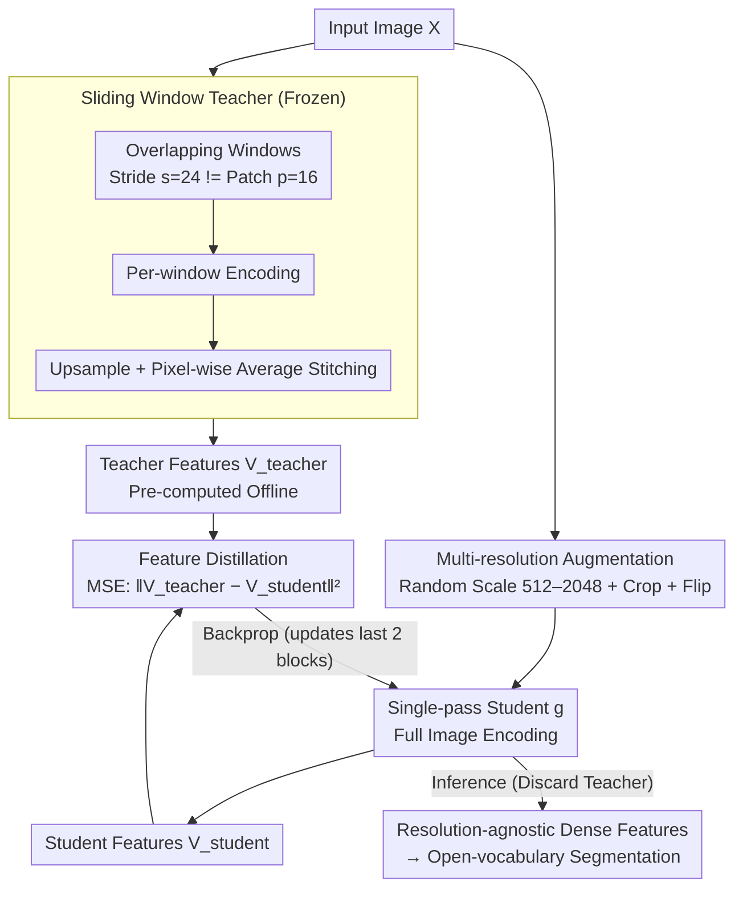

# SPAR: Single-Pass Any-Resolution ViT for Open-Vocabulary Segmentation

**Conference**: CVPR 2026  
**arXiv**: [2604.02252](https://arxiv.org/abs/2604.02252)  
**Code**: [https://github.com/naomikombol/SPAR](https://github.com/naomikombol/SPAR)  
**Area**: Segmentation / Open-Vocabulary Segmentation  
**Keywords**: Open-vocabulary segmentation, resolution-agnostic, knowledge distillation, Vision Transformer, sliding window inference

## TL;DR

This work proposes SPAR, a method that distills the spatial reasoning capabilities of a fine-stride sliding window teacher into a single-pass student. This transforms ViTs into resolution-agnostic dense feature extractors, achieving a 10.5 mIoU improvement over single-pass baselines in open-vocabulary segmentation while being 52x faster than the teacher.

## Background & Motivation

**Background**: Foundation ViTs (CLIP, SigLIP2, DINOv3) excel at image-level understanding through contrastive or self-supervised learning. However, they show limited performance in dense prediction tasks like segmentation, which require fine-grained spatial understanding, due to fixed-resolution pre-training and coarse patch-level representations. Open-vocabulary segmentation (OVS) further demands precise pixel-level reasoning for arbitrary categories from text prompts.

**Limitations of Prior Work**: Two strategies exist for handling high-resolution images: (1) Single-pass inference with interpolated positional encodings—efficient but inaccurate due to distortion from training-inference resolution mismatch; (2) Sliding window inference—significantly improves accuracy via overlapping windows (where each patch appears in multiple contexts) but is computationally expensive. For instance, a sliding window with stride 24 is approximately 52x slower than single-pass inference.

**Key Challenge**: A severe trade-off exists between accuracy and efficiency—single-pass is fast but poor, while sliding window is good but slow. Existing resolution adaptation schemes (e.g., NaFlex) are effective for image-level tasks but perform poorly on dense predictions.

**Goal**: To achieve segmentation accuracy approaching or exceeding that of fine-stride sliding window inference while maintaining the efficiency of a single-pass forward.

**Key Insight**: The advantage of sliding window inference stems from exposing sub-patch regions to different contexts and the robustness gained through averaging. This spatial reasoning capability can be transferred to a single-pass model via distillation.

**Core Idea**: Distill the spatial features of a fine-stride sliding window teacher into a single-pass student of the same architecture using a feature regression loss, without requiring architectural modifications or pixel-level annotations.

## Method

### Overall Architecture

SPAR addresses the core conflict where sliding window inference is accurate but 52x slower, and single-pass inference is fast but inaccurate. The approach utilizes the "expensive but high-quality" sliding window output as a supervisory signal to distill a "cheap" single-pass model, requiring no architectural changes or pixel annotations. The pipeline consists of two steps: first, a frozen **sliding window teacher** (VLM visual encoder in sliding window mode) generates high-quality dense feature maps for an image. Second, a **single-pass student** of the same architecture encodes the entire image once, using an MSE **feature distillation** loss to approximate the teacher's feature map. To ensure the student is truly resolution-agnostic, **multi-resolution augmentation** is applied during training, forcing positional encodings to be learned as smooth variations across sizes. Only the student is updated; during inference, the teacher is discarded, leaving a resolution-agnostic encoder that provides sliding-window-level features in one pass.

### Key Designs

**1. Sliding Window Teacher: Generating Distillation Targets via Overlap**

To provide high-quality supervision, the teacher uses a sliding window approach to avoid the distortion caused by feeding high-resolution images directly to fixed-resolution ViTs. An image $X \in \mathbb{R}^{3 \times H \times W}$ is divided into $m$ overlapping windows of size $K \times K$ (where $K$ matches the pre-trained resolution). Each window is encoded, upsampled (factor $r=2$), and stitched back via pixel-wise averaging: $V_\text{teacher}(X) = \text{stitch}(\{f(X_{w_i})\}_{i=1}^m)$. A critical detail is the stride $s=24$, which is intentionally **not divisible** by the patch size $P=16$. If divisible (e.g., $s=32$), sub-patch regions appear at the same relative positions in every window, seeing redundant contexts. Stride $s=24$ ensures a pixel region is partitioned into different patches across windows, exposing it to diverse contexts and providing robustness similar to test-time augmentation.

**2. Feature Distillation: Transferring Spatial Reasoning to Single-Pass**

The student $g$ performs a single forward pass on the full image to obtain $V_\text{student}(X) = g(X)$. The training objective is a pixel-wise regression of the teacher's features:

$$\mathcal{L}_\text{distill} = \|V_\text{teacher}(X) - V_\text{student}(X)\|_2^2$$

This simple MSE loss is effective because the student and teacher share the same architecture and feature space. For efficiency, teacher features are pre-computed. Standard OVS setups only require unfreezing the last 2 blocks to capture most gains; only extreme resolutions benefit from full parameter fine-tuning.

**3. Multi-resolution Augmentation: Enabling Any-Resolution Encoding**

To achieve true resolution-agnosticism, the student is exposed to varied inputs during training. The short side of input images is randomly scaled between 512–2048 pixels, followed by random cropping and horizontal flipping. Images are resampled to dimensions divisible by the patch size. This training regime forces positional encodings to learn smooth spatial transitions rather than overfitting to a specific resolution.

### Loss & Training

A pure feature regression loss (MSE) is used without any annotations. The AdamW optimizer is employed with a constant learning rate of $2 \times 10^{-5}$ and weight decay of $10^{-4}$ for 10 epochs. Usually, only the last 2 blocks are tuned. Teacher features (~170GB) are pre-computed to save time. Due to variable sequence lengths, the batch size is set to 1.

## Key Experimental Results

### Main Results

Average mIoU across 6 datasets for SigLIP2 – ViT-B-16:

| Method | Inference Mode | Mean₆ |
|------|----------|-------|
| NaFlex | Single-pass | 31.7 |
| Pre-trained | Single-pass | 33.1 |
| Pre-trained | Sliding Window (s=24) | 41.2 |
| **SPAR** | **Single-pass** | **43.6** |
| SPAR + AnyUp | Single-pass | 46.8 |
| SPAR + LPOSS | Single-pass | 46.7 |

SPAR improves the single-pass baseline by +10.5 mIoU and even outperforms the teacher (sliding window s=24) by +2.4 mIoU.

### Ablation Study

Gains across different backbones:

| Backbone | Single-pass Baseline | SPAR | Gain |
|----------|----------|------|------|
| SigLIP2 ViT-B-16 | 33.1 | 43.6 | +10.5 |
| OpenCLIP ViT-B-16 | 27.7 | 34.4 | +6.7 |
| DINOv3 ViT-L-16 | 43.8 | 44.4 | +0.6 |

### Key Findings

- **NaFlex is unsuitable for dense prediction**: While SigLIP2's NaFlex handles resolution adaptation for image-level tasks, it fails at patch-level spatial understanding compared to SPAR.
- **Non-divisible strides perform better**: A stride $s=24$ outperforms $s=32$ (divisible by patch size 16) by exposing patches to more diverse contexts.
- **Student outperforms Teacher**: SPAR achieves better mean performance than the teacher, likely due to the implicit regularization provided by multi-resolution training during distillation.
- **DINOv3 shows smaller gains**: Since DINOv3 already includes RoPE and high-resolution fine-tuning, its baseline is higher, yet SPAR still improves Cityscapes mIoU from 35.9 to 40.1.

## Highlights & Insights

- **Extreme Simplicity**: No architectural changes, no pixel labels, and no complex loss functions—huge gains from pure MSE distillation.
- **52x Speedup**: Maintains single-pass efficiency while matching sliding window accuracy, offering significant practical value.
- **Generalizability**: Validated effectively across SigLIP2, OpenCLIP, and DINOv3.
- **Low Training Cost**: Converges in ~1.5 hours using 25k unlabeled images.
- **Insight**: Demonstrates that the benefits of sliding window inference can be distilled and that the resulting model can even surpass the teacher.

## Limitations & Future Work

- Limited improvement for models already robust to resolution (e.g., DINOv3).
- Significant storage requirement for pre-computed teacher features (~170GB).
- Only validated in training-free OVS settings; not yet tested on detection or depth estimation.
- Batch size restricted to 1 due to variable sequence lengths.
- Potential to explore advanced distillation strategies like attention distillation.

## Related Work & Insights

- **FlexiViT / NaViT / ResFormer**: Improve resolution robustness through multi-resolution pre-training but require training from scratch.
- **SigLIP2 NaFlex**: Integrates flexible patching but proved insufficient for dense prediction.
- **LPOSS**: A training-free label propagation method that is complementary to SPAR (+3.1 mIoU gain).

## Rating

- **Novelty**: ⭐⭐⭐⭐ Clever insight to distill sliding window advantages into a single pass.
- **Experimental Thoroughness**: ⭐⭐⭐⭐⭐ Comprehensive evaluation across multiple backbones and datasets.
- **Writing Quality**: ⭐⭐⭐⭐ Clear motivation and concise methodological description.
- **Value**: ⭐⭐⭐⭐⭐ Highly practical—efficient and universally applicable to ViT-based dense reasoning.

<!-- RELATED:START -->

## Related Papers

- [\[CVPR 2026\] S2C2Seg: Semantic-Spatial Consistency and Category Optimization for Open-Vocabulary Segmentation](s2c2seg_semantic-spatial_consistency_and_category_optimization_for_open-vocabula.md)
- [\[CVPR 2026\] MARIS: Marine Open-Vocabulary Instance Segmentation](maris_marine_open-vocabulary_instance_segmentation.md)
- [\[CVPR 2026\] PCA-Seg: Revisiting Cost Aggregation for Open-Vocabulary Semantic and Part Segmentation](pca-seg_revisiting_cost_aggregation_for_openvocabulary_semantic_and_part_segmentat.md)
- [\[CVPR 2026\] Retrieve and Segment: Are a Few Examples Enough to Bridge the Supervision Gap in Open-Vocabulary Segmentation?](retrieve_and_segment_are_a_few_examples_enough_to_bridge_the_supervision_gap_in_.md)
- [\[CVPR 2026\] Test-Time Multi-Prompt Adaptation for Open-Vocabulary Remote Sensing Image Segmentation](test-time_multi-prompt_adaptation_for_open-vocabulary_remote_sensing_image_segme.md)

<!-- RELATED:END -->
