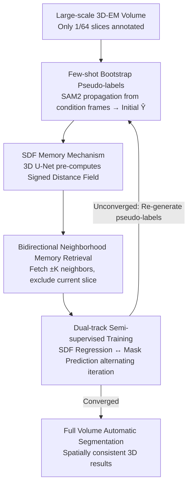

# Spatial-SAM: Spatially Consistent 3D Electron Microscopy Segmentation with SDF Memory and Semi-Supervised Learning

**Conference**: CVPR 2026  
**Paper**: [CVF Open Access](https://openaccess.thecvf.com/content/CVPR2026/html/Huang_Spatial-SAM_Spatially_Consistent_3D_Electron_Microscopy_Segmentation_with_SDF_Memory_CVPR_2026_paper.html)  
**Code**: https://github.com/Giluir/Spatial-SAM  
**Area**: 3D Vision / Semantic Segmentation / Medical Imaging  
**Keywords**: EM Segmentation, SDF Memory, SAM2, Semi-Supervised Learning, Spatial Consistency

## TL;DR
Spatial-SAM replaces the "frame-by-frame 2D logit memory" of SAM2 with a Signed Distance Field (SDF) memory pre-computed by a lightweight 3D U-Net. It adopts a dual-track semi-supervised pipeline—bootstrapping pseudo-labels with SAM2 few-shot capabilities followed by alternating training of SDF and masks. With only 1/64 of the slices annotated, it approaches fully supervised SOTA performance across multiple 3D EM datasets while significantly improving inter-slice 3D morphological consistency.

## Background & Motivation

**Background**: Electron Microscopy (EM) provides ultrastructural cellular images at the nanometer scale, where segmentation is the entry point for converting raw grayscale images into quantifiable structures (mitochondria, nuclei, synapses). Prevailing methods utilize U-Net, its 3D variants, or Transformer-based networks for fully supervised training. Recently, foundation models like SAM/SAM2 have demonstrated strong zero/few-shot capabilities, with SAM2 introducing streaming memory for inter-slice consistency.

**Limitations of Prior Work**: Both existing routes have critical flaws. Fully supervised 3D networks require massive voxel-wise annotations, which is prohibitively expensive for large-scale high-resolution EM. Existing semi-supervised methods (pseudo-labeling + consistency regularization) are mostly 2D-based; while individual slices may appear reasonable, reconstruction into 3D reveals inter-slice discontinuities, thickness "flickering," and jagged transitions. Directly applying SAM2 to 3D EM is also sub-optimal, as its memory consists of 2D prediction logits from past frames, lacking explicit volumetric geometric information.

**Key Challenge**: The memory mechanism of SAM2 has three structural defects: ① **Directional Dependency**: Memory only contains past frames in the propagation direction, ignoring future frames, leading to inconsistent segmentation quality across different propagation paths. ② **Error Accumulation**: Prediction errors in one frame are written into the memory bank and amplified in subsequent frames. ③ **Sensitivity to Slice Selection**: The choice of propagation axis and condition frames significantly affects the final results. The root cause is that "memory = historical 2D predictions" lacks geometry and is prone to self-contamination.

**Goal**: To inject "geometry-aware volumetric structure guidance" into SAM2 without sacrificing its long-range context and few-shot advantages, while designing an annotation-efficient training recipe to scale from few 2D labels to fully automatic segmentation of entire volumes.

**Core Idea**: Replace SAM2's online logit memory with a one-time pre-computed **SDF Memory** (geometrically complete, naturally smooth, and free from per-frame error accumulation). Utilize a dual-track **SDF Regression ↔ Mask Prediction** consistency pipeline to amplify 1/64 sparse annotations into full-volume automatic segmentation.

## Method

### Overall Architecture
Spatial-SAM transforms SAM2 into a spatially coherent 3D EM segmentation tool, consisting of two main components: **(A) Spatial-SAM Model with SDF Memory**—a lightweight 3D U-Net predicts the entire volume as an SDF grid at low resolution, which is then sliced and fed into the SAM2 memory encoder as "preset context," allowing SAM2 to segment automatically without manual prompts during inference. **(B) Dual-track Semi-supervised Training**—given a subset $D$ from a large dataset $D_{all}$, only $m$ slices are interactively annotated to obtain high-quality masks $\{Y_j\}_{j=1}^m$. These are used as condition frames for SAM2 to propagate initial pseudo-labels $\tilde{Y}$. Subsequently, the SDF track and mask track are trained alternately for iterative refinement, finally deploying the trained model for fully automatic segmentation across $D_{all}$.

The pipeline moves from "sparse interactive annotation" to "fully automatic segmentation," where the key lies in the coupling and mutual enhancement of the two modules (3D U-Net for geometry, SAM2 for masks) via SDF memory and "Mask ↔ SDF" conversion.

### Key Designs

**1. SDF Memory: Replacing SAM2 Online Logit Memory with Pre-computed SDF**

This directly addresses the "lack of geometry, error accumulation, and directional dependency" of SAM2 memory. Instead of writing probability logits from past frames, a Signed Distance Field (SDF) is used as the memory representation. For any point $x\in\mathbb{R}^3$ in the volume, the SDF is defined as the signed nearest distance to the target boundary:

$$\mathrm{SDF}(x)=\begin{cases}+\min_{y\in\partial\Omega_{obj}}\lVert x-y\rVert, & x\in\Omega_{obj}\\[2pt]-\min_{y\in\partial\Omega_{obj}}\lVert x-y\rVert, & x\notin\Omega_{obj}\end{cases}$$

where $\Omega_{obj}$ is the target object volume and $\partial\Omega_{obj}$ is its boundary. SDF offers two fundamental advantages: First, as an implicit representation of 3D objects, it provides more complete global geometric semantics. Second, distance values are naturally smooth, allowing the model to capture geometric consistency across slices even with limited memory length. Crucially, **SDF is pre-computed**, so single-frame prediction errors are not written back, breaking the error accumulation chain.

**2. Bidirectional + Self-Excluding Memory Retrieval**

While logit memory is unidirectional (looking back), SDF memory supports bidirectional neighbor retrieval. When segmenting target slice $I_t$, memories of $K$ preceding and succeeding slices are retrieved for memory attention:

$$\tilde{\phi}(I_t)=\mathrm{Attn}\big(\phi(I_t),\{M_\tau\}_{\tau\in N_t}\big),\quad N_t=\{t-K,\dots,t-1,t+1,\dots,t+K\}$$

The neighborhood $N_t$ **deliberately excludes $t$ itself**. Since the 3D U-Net provides a coarse SDF, including the current slice's own coarse SDF would lead to self-coupling and error amplification. Utilizing only neighboring SDFs allows the geometric context to "constrain" the current slice without overriding it.

**3. Dual-task Consistency & Loss**

The semi-supervised recipe focuses on using SAM2's few-shot capability for high-quality initial supervision and achieving volume-wide consistency through alternating tracks.

**Ours** utilizes a dual-track training inspired by Dual-task Consistency (DTC). **SDF Training**: Pseudo-labels $\tilde{Y}$ are converted to 3D SDF $S$ to supervise U-Net regression $\hat{S}$, distilling semantic cues into a smooth geometry field. **Mask Training**: Predicted $\hat{S}$ is sliced into SDF memory to derive refined pseudo-labels $\tilde{Y}'$ for training SAM2 alongside the sparse ground truth.

**Loss**: The U-Net uses MSE for value alignment and an Eikonal term to ensure the gradient magnitude is close to 1:

$$L_{\text{U-Net}}=L_{\text{MSE}}(\hat{S},S)+\lambda L_{\text{Eikonal}},\quad L_{\text{Eikonal}}=\frac{1}{|\Omega_{dom}|}\sum_{x\in\Omega_{dom}}\big(\lVert\nabla\hat{S}(x)\rVert-1\big)^2$$

SAM2 uses a composite loss with refined targets $Y_t^*$:

$$L_{\text{SAM2}}(\hat{Y}_t,Y_t^*)=\alpha L_{\text{Dice}}+\beta L_{\text{IoU}}+\gamma L_{\text{Focal}}$$

## Key Experimental Results

### Main Results
Performance on four 3D-EM datasets (Dice/mIoU %). Semi-supervised methods use 1/64 annotation.

| Dataset | Metric | Spatial-SAM (1/64) | Best Semi-supervised (CPS, 1/64) | Best Full Supervised (SAM4EM) |
|--------|------|------|------|------|
| OOMLM | Dice/mIoU | 96.51 / 93.25 | 95.74 / 91.84 | 96.75 / 93.70 |
| MitoEM-R | Dice/mIoU | 94.45 / 89.51 | 93.38 / 87.60 | 95.12 / 90.71 |

Average across datasets: Compared to the strongest semi-supervised baseline CPS U-Net, Spatial-SAM achieves a gain of **+8.07% Dice / +11.49% mIoU**. Compared to the fully supervised SAM4EM, the gap is only **-0.09% Dice / -0.10% mIoU**.

### Ablation Study (MitoEM-R)
| Memory Type | Direction | Exclude Self | Dice | mIoU |
|------|------|------|------|------|
| SAM2 (Original logit) | Uni | - | 92.62 | 86.31 |
| SDF | Uni | - | 93.62 | 88.03 |
| SDF | Bi | No | 94.11 | 88.90 |
| SDF | Bi | Yes | **94.45** | **89.51** |

### Key Findings
- **SDF Encoding is the primary driver**: Switching memory from logit to SDF (both unidirectional) yields a gain of +1.00% Dice, proving that continuous signed distance encoding enhances spatial consistency.
- **Bidirectional + Self-Exclusion is critical**: The bidirectional approach improves mIoU by +1.48%. Excluding the current slice's own SDF avoids error amplification from self-coupling.
- **Spatial consistency is a qualitative leap**: Spatial-SAM maintains consistent thickness across slices and suppresses zig-zag artifacts without any 3D post-processing.

## Highlights & Insights
- Changing the "memory" from probability to geometry is the most innovative aspect of this work, solving directionality, error accumulation, and sensitivity issues simultaneously.
- The self-exclusion strategy demonstrates a deep understanding of error propagation.
- The combination of few-shot bootstrapping and dual-track iteration allows 1/64 labels to match full supervision, offering significant value for connectomics.

## Limitations & Future Work
- **Severely damaged slices**: Significant artifacts or sudden exposure changes can still disrupt slice continuity.
- **Training Time**: Alternating dual-track training and re-generating pseudo-labels per round is computationally expensive.
- **Binary vs. Instance**: Evaluated primarily on semantic segmentation; instance separation capabilities for tightly packed mitochondria were not explicitly measured.

## Related Work & Insights
Compared to **SAM4EM**, Spatial-SAM avoids online error propagation by using pre-computed 3D geometric representations. Unlike **MedSAM**, which processes slices independently, Spatial-SAM explicitly models volumetric consistency. It outperforms standard semi-supervised methods like **CPS** and **CCT** significantly in low-label regimes (1/64).

## Rating
- Novelty: ⭐⭐⭐⭐ Target-specific geometric modification of SAM2 memory.
- Experimental Thoroughness: ⭐⭐⭐⭐ Extensive datasets and baselines; minor weakness in hyperparameter sensitivity.
- Writing Quality: ⭐⭐⭐⭐ Clear logic chain and honest discussion of limitations.
- Value: ⭐⭐⭐⭐ High practical value for large-scale 3D EM segmentation.

<!-- RELATED:START -->

## Related Papers

- [\[CVPR 2026\] From Softmax to Dirichlet: Evidential Learning for Semi-supervised Semantic Segmentation](from_softmax_to_dirichlet_evidential_learning_for_semi-supervised_semantic_segme.md)
- [\[CVPR 2026\] M4-SAM: Multi-Modal Mixture-of-Experts with Memory-Augmented SAM for RGB-D Video Salient Object Detection](m4-sam_multi-modal_mixture-of-experts_with_memory-augmented_sam_for_rgb-d_video_.md)
- [\[CVPR 2026\] Spatial Matters: Position-Guided 3D Referring Expression Segmentation](spatial_matters_position-guided_3d_referring_expression_segmentation.md)
- [\[CVPR 2026\] Boxes2Pixels: Learning Defect Segmentation from Noisy SAM Masks](boxes2pixels_learning_defect_segmentation_from_noisy_sam_masks.md)
- [\[AAAI 2026\] S5: Scalable Semi-Supervised Semantic Segmentation in Remote Sensing](../../AAAI2026/segmentation/s5_scalable_semi-supervised_semantic_segmentation_in_remote_sensing.md)

<!-- RELATED:END -->
