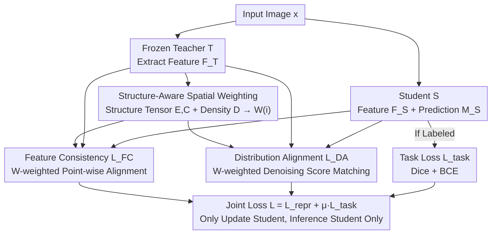

# Structure-Aware Representation Distillation for Tiny-Dense Object Segmentation

**Conference**: CVPR 2026  
**Paper**: [CVF Open Access](https://openaccess.thecvf.com/content/CVPR2026/html/Liu_Structure-Aware_Representation_Distillation_for_Tiny-Dense_Object_Segmentation_CVPR_2026_paper.html)  
**Code**: https://github.com/liuuuuuuxuesong/SARD  
**Area**: Semantic Segmentation / Knowledge Distillation  
**Keywords**: Tiny-dense objects, representation distillation, structure tensor, boundary IoU, feature space alignment

## TL;DR
SARD shifts segmentation knowledge distillation from "mask imitation" to "aligning feature space geometry." It utilizes a "structure importance map" $W(i)$, synthesized from boundaries, curvature, and spatial crowding, to weight the feature distillation loss. This directs the lightweight student model to concentrate its capacity on boundaries and dense contact zones, consistently improving mIoU and boundary IoU (bIoU) across Cityscapes, ADE20K, and the industrial rock fragmentation dataset RockFrag (specifically +4.3 mIoU / +6.7 bIoU on RockFrag over CWD), with zero additional inference overhead.

## Background & Motivation
**Background**: In scenarios involving vast numbers of tiny, densely packed objects (e.g., medical microscopy, remote sensing, industrial inspection, rock fragmentation analysis), even a single-pixel deviation can significantly alter downstream measurement results. While foundation models like SAM and Mask2Former offer strong generalization, they are computationally expensive. Efficient variants such as FastSAM, MobileSAM, and EfficientSAM, though faster, suffer severe performance drops in domains dominated by tiny-scale patterns. Consequently, achieving lightweight models that preserve structural details is a critical requirement for practical deployment, with knowledge distillation (KD) serving as the primary method for compressing large teachers into small students.

**Limitations of Prior Work**: Traditional distillation methods (logit distillation, pixel-level alignment SKD, channel distillation CWD, decoupled logit DKD, masked reconstruction MGD, multi-layer review) essentially focus on **mimicking the teacher's output mask or intermediate logits** and **uniformly weighting all spatial positions**. However, information density in tiny-dense scenes is naturally non-uniform: contact boundaries between rocks or junction points between fragments require far higher representation precision than homogeneous object interiors. Uniform distillation distributes equal attention to fragment interiors and contact boundaries, resulting in students that learn "coarser semantic alignment" while losing boundary fidelity—a common failure mode in tiny-dense tasks.

**Key Challenge**: Existing methods assume that "information density is equal everywhere," whereas geometric complexity is spatially imbalanced. Boundaries, junctions, and crowded areas carry the vast majority of critical geometric information, yet their learning signals are diluted by uniform losses.

**Goal**: To enable distillation to automatically concentrate learning signals on "geometrically important" locations without altering the architecture or adding inference modules.

**Key Insight**: Successful tiny-dense transfer requires **structure-aware representation alignment** rather than output imitation. Instead of directly matching masks, the student should **reproduce the geometry within the teacher's feature space** (where fine-scale edges, boundaries, and regional densities are encoded). This reformulates distillation as a representation learning problem: preserving spatial structure and local information flow independent of specific teacher architectures.

**Core Idea**: Construct a structure importance map $W(i)$ that integrates boundary saliency, structural complexity, and local feature variation. This map is used to **weight the feature-level distillation loss**, thereby "tilting" the student's feature space towards sensitivity to tiny-dense characteristics.

## Method

### Overall Architecture
SARD (Structure-Aware Representation Distillation) is a teacher-agnostic, single-stage distillation framework. Given an input image (and optional prompts), the frozen teacher $T$ and trainable student $S$ encode intermediate features $F_T=E_T(x)$ and $F_S=E_S(x)$ with $C$ channels and spatial dimensions $H\times W$. The student decoder then uses $F_S$ to predict the segmentation mask $M_S=D_S(F_S,p)$.

The standard distillation objective aligns student features to teacher features at every position:

$$\min_S \frac{1}{|\Omega|}\sum_{i\in\Omega} L_{repr}(F_S(i),F_T(i)) + \lambda L_{seg}(M_S,M_{gt})$$

The key modification in SARD is multiplying the representation loss by a **position-wise structure weight** $W(i)$, rewriting the objective as:

$$\min_S L_{repr}(F_S,F_T;W) + \mu L_{seg}(M_S,M_{gt}),\quad W(i)=\frac{S(i)}{\sum_{j\in\Omega}S(j)},\ \sum_i W(i)=1$$

where $S(i)$ quantifies the structural importance of position $i$. The pipeline involves: the frozen teacher providing features $\rightarrow$ **calculating** $W(i)$ from teacher features (label-free) $\rightarrow$ training the student with $W(i)$-weighted dual representation losses (feature consistency + distribution alignment) $\rightarrow$ adding standard segmentation losses when labels are available. During inference, only the student network is executed, incurring zero extra overhead.

### Key Designs

**1. Structure Importance Map $W(i)$: Explicitly Modeling Non-uniform Information Density as Distillation Weights**

This is the core innovation of SARD, directly addressing the dilution of critical signals by uniform distillation. The authors observe that segmentation failures in tiny-dense scenes stem from two levels of complexity: **intra-instance structure** (multiple facets and surface variations within a single rock or irregular membranes in cells) and **inter-instance crowding** (stacked, contacting, or overlapping objects creating blurred boundaries at contact points). SARD synthesizes these into a scalar score:

$$S(i)=\beta_e E(i)+\beta_c C(i)+\beta_d D(i)$$

which is normalized into weight $W(i)=S(i)/\sum_j S(j)$ (summing to 1 across the image). Here, $E, C$ characterize geometric complexity (edges, corners, facets), and $D$ characterizes spatial crowding. Normalization ensures learning signals are naturally concentrated at geometrically complex and spatially crowded locations. This is effective because it avoids creating separate "edge detection" or "region" modules, instead **embedding these cues directly into the representation space loss weights**—by amplifying gradients at these critical locations, the student's feature representation spontaneously evolves sensitivity to tiny-dense characteristics.

**2. Geometric Complexity $E, C$ based on Structure Tensors: Distinguishing "Oriented Boundaries" and "Junctions" via Second-order Statistics of Feature Gradients**

To locate geometric information in an unsupervised manner, SARD calculates spatial gradients $\nabla F_T^{(c)}(i)=[\partial_x F_T^{(c)},\partial_y F_T^{(c)}]^\top$ for each channel $c$ of the teacher feature $F_T$ at position $i$ (using standard Sobel operators). It then accumulates the outer products of these gradients to form a $2\times 2$ symmetric **structure tensor**:

$$J(i)=\sum_{c=1}^{C}\nabla F_T^{(c)}(i)\,\nabla F_T^{(c)}(i)^\top$$

Eigen-decomposition of $J(i)$ yields two eigenvalues $\lambda_1 \ge \lambda_2 \ge 0$ (gradient intensities in the primary and perpendicular directions), from which two complementary geometric measures are derived:

$$E(i)=\lambda_1(i)-\lambda_2(i),\qquad C(i)=\sqrt{\lambda_1(i)\lambda_2(i)}$$

The difference $E$ is a standard **anisotropy measure**, quantifying gradient directional bias, which is high for oriented transitions (boundaries, facets). The geometric mean $C$ captures **multi-directional gradient intensity**, which is high for complex junctions and connection points, while remaining numerically stable. Together, they cover the full spectrum of geometric complexity. This unified formulation treats "inter-instance boundaries" and "intra-instance structures" equivalently as they both represent critical geometric information requiring precise alignment.

**3. Spatial Density $D(i)$: Unsupervised Identification of "Crowded Zones" via Feature Dispersion**

Geometric measures alone are insufficient for dense scenes—identifying individual edges and corners does not prioritize regions where "crowding induces confusion." SARD estimates local instance density: using ground truth counts if available, or **feature dispersion** as a proxy:

$$D(i)=\frac{1}{|W_r(i)|}\sum_{j\in\ Norton r(i)}\|F_T(j)-\mu(i)\|_2,\quad \mu(i)=\frac{1}{|W_r(i)|}\sum_{j\in\ Norton r(i)}F_T(j)$$

High dispersion implies co-occurrence of many different structures within a window, a characteristic of dense object regions. Notably, the authors **default to the feature dispersion version for all datasets** to eliminate dependency on instance maps, making SARD compatible with both fully supervised and semi-supervised settings (window radius $r=7$).

**4. Feature Consistency $L_{FC}$ + Distribution Alignment $L_{DA}$: Complementary Dual-path Losses**

Once $W(i)$ is defined, it is applied to the representation losses. SARD splits the representation objective into two complementary terms: $L_{repr}=\lambda_f L_{FC}+\lambda_d L_{DA}$.

**Feature Consistency $L_{FC}$** projects teacher and student features into a shared latent space $\hat F_T=P_T(F_T)$, $\hat F_S=P_S(F_S)$ using learnable $1\times 1$ convolutions, followed by structure-weighted point-wise matching:

$$L_{FC}=\sum_{i\in\Omega}W(i)\,\|\hat F_S(i)-\hat F_T(i)\|_2^2$$

**Distribution Alignment $L_{DA}$** captures the **local feature distribution** beyond point-wise values, inspired by denoising score matching. It injects Gaussian noise into projected teacher features $\tilde F_T=\sqrt{\alpha}\hat F_T+\sqrt{1-\alpha}\,\epsilon$, and trains a lightweight denoising head $g_\theta$ to **predict the injected noise from the student features**:

$$L_{DA}=\sum_{i\in\Omega}W(i)\,\|g_\theta(\hat F_S(i))-\epsilon(i)\|_2^2$$

Predicting the noise corresponding to perturbed teacher features encourages the student representation to approximate the "score (gradient of the log-density) of the noisy teacher feature distribution," which is particularly helpful in regions with highly variable features within dense object clusters.

### Loss & Training
SARD utilizes **single-stage joint optimization**: representation distillation and segmentation supervision are trained together. The teacher remains frozen, with gradients flowing only through the student, projection heads, and denoising head. The total objective is:

$$\min_S \mathbb{E}_{(x,y)\in L}\big[L_{repr}(x)+\mu\,L_{task}(x,y)\big]$$

Hyperparameters: $\beta_e=2.0, \beta_c=1.0, \beta_d=1.0$; $\lambda_f=1.0, \lambda_d=0.5, \mu=1.0$; score matching noise $\alpha=0.5$. Training spans 100 epochs using AdamW on a single RTX 4090. Structure maps are cached after the first epoch to localize extra computation to the training phase.

## Key Experimental Results

### Main Results
Using consistent Swin backbones for teacher-student pairs, SARD outperforms distillation baselines across three datasets (mIoU / bIoU):

| Dataset (Swin-L→Swin-T) | Metric | Student(scratch) | CWD | MGD | SARD | ∆ vs CWD |
|------|------|------|------|------|------|------|
| Cityscapes | mIoU | 76.5 | 78.9 | 79.1 | **80.3** | +1.4 |
| Cityscapes | bIoU | 71.2 | 73.8 | 74.2 | **76.1** | +2.3 |
| ADE20K | mIoU | 42.1 | 44.8 | 45.1 | **46.9** | +2.1 |
| ADE20K | bIoU | 35.8 | 38.6 | 39.0 | **40.8** | +2.2 |
| RockFrag | mIoU | 52.3 | 55.9 | 56.3 | **60.2** | +4.3 |
| RockFrag | bIoU | 36.8 | 40.6 | 41.2 | **47.3** | +6.7 |

Cross-architecture teacher-student pairs (Avg. gain vs CWD) demonstrate generalization to heterogeneous combinations:

| Teacher-Student Pair | mIoU Gain | bIoU Gain | RockFrag bIoU Gain |
|------|------|------|------|
| ViT-L → ViT-T | +1.6 | +2.4 | +5.8 |
| SAM-H → EfficientSAM-Ti | +1.8 | +2.7 | +6.2 |
| Mask2Former-L → M2F-R50 | +1.5 | +2.3 | +5.5 |

### Ablation Study
Isolating structure-aware weighting components on RockFrag (Swin-L → ResNet-50):

| Weighting Strategy | mIoU | bIoU | Description |
|------|------|------|------|
| Vanilla KD (logit) | 52.3 | 36.9 | Logit-level distillation baseline |
| Uniform SARD ($W=1$) | 53.8 | 38.5 | Representation loss with uniform weighting |
| Boundary-only ($W\propto E$) | 56.2 | 42.8 | Focused on boundary anisotropy |
| Density-only ($W\propto D$) | 55.4 | 41.6 | Focused on spatial density |
| Curvature-only ($W\propto C$) | 55.8 | 42.1 | Focused on junction curvature |
| E + C | 57.8 | 44.6 | Combined geometric complexity |
| **SARD (full: E+C+D)** | **58.6** | **45.2** | +4.8/+6.7 vs Uniform SARD |

Efficiency comparison (RockFrag, 1024×1024, RTX 4090):

| Model | Params | GFLOPs | FPS | mIoU |
|------|------|------|------|------|
| Teacher (Swin-L) | 197M | 1014 | 9.8 | 62.4 |
| Student (R50, scratch) | 25.6M | 62 | 88.5 | 49.6 |
| Student + CWD | 25.6M | 62 | 88.5 | 54.1 |
| **Student + SARD** | 25.6M | 62 | 88.5 | **58.6** |

### Key Findings
- **Structure weighting is the primary driver**: Moving from Uniform SARD (53.8/38.5) to full SARD (58.6/45.2) yields +4.8 mIoU / +6.7 bIoU solely via weighting. This suggests "representation distillation" is merely a baseline; the real gain comes from "compressing signals into geometrically important locations."
- **bIoU gains consistently exceed mIoU gains**: Boundary IoU improvements surpass mIoU across all datasets, validating the design goal of enhancing geometric precision.
- **Components are complementary**: Boundaries (E), curvature (C), and density (D) are most effective when combined, proving they capture different aspects of structural complexity.
- **Extreme cases benefit most**: The largest gains occur on RockFrag, characterized by the highest contact point density, directly hitting the "tiny-dense" target.
- **Compression with zero inference cost**: The ResNet-50 student achieves 7.7× parameter compression and 9.0× speedup over the teacher, recovering ~70% of the performance gap, while maintaining technical parity in Params/FLOPs/FPS with CWD.

## Highlights & Insights
- **Reformulating "mask imitation" as "feature geometry reproduction"**: Shifting from direct output matching to learning the edges, boundaries, and densities encoded in the teacher's feature space allows for cross-architecture universality without task-specific modules.
- **Structure tensors as unsupervised "importance detectors"**: Reusing classical image processing tools (second-order moments of gradients) to distinguish boundaries from junctions in deep features is an elegant, label-free solution.
- **Denoising score matching in distillation**: $L_{DA}$ enables the student to align with the score of the teacher's noisy distribution, capturing local variations better than point-wise L2.
- **Cacheable structure maps**: Caching structure maps after the first epoch ensures extra computation is limited to training, making it ideal for industrial real-time deployment.
- **Transferable trick**: The weight $W(i)$ can be integrated into any dense prediction distillation task (depth estimation, optical flow, etc.) as a loss weight.

## Limitations & Future Work
- **Dataset Availability**: The core value proposition relies heavily on the industrial RockFrag dataset, which may not be publicly accessible, impacting reproducibility.
- **Hyperparameter Dependency**: Parameters such as $\beta$, $\lambda$, and window radius $r$ are manually set; sensitivity analysis across diverse domains is required.
- **Reliance on Teacher Quality**: Since $W(i)$ is derived from teacher features, a teacher with poor representations in a specific domain will produce distorted structure maps, capping student performance.
- **Modest gains on standard benchmarks**: mIoU gains of +1~2 on Cityscapes/ADE20K suggest the method's advantages are highly specialized for "extreme tiny-dense" scenarios.
- **Future Directions**: Automating hyperparameter scheduling for $\beta$ or exploring multi-scale noise for $L_{DA}$ could generalize gains to standard segmentation tasks.

## Related Work & Insights
- **vs CWD (Channel-wise Distillation)**: CWD focuses attention on salient regions by minimizing KL divergence of normalized activation maps but remains **spatially uniform**. SARD's explicit geometric weighting explains its +4.3 mIoU gain over CWD on RockFrag.
- **vs DKD / MGD / Multi-layer Review**: While these methods innovate on logit decoupling or masked reconstruction, they assume uniform information density. SARD differentiates "spatial non-uniformity."
- **vs Task-Specific Architectures**: Boundary-enhanced or multi-scale architectures improve geometry but limit generalization; SARD embeds these cues into the loss weights, maintaining "teacher-student pair independence."
- **vs Efficient Segmentation Seeds (FastSAM/SegFormer)**: While these optimize parameters, SARD provides a distillation path that allows a ViT-T student to outperform larger baselines like SegFormer-B1 by focusing on better structural representation.

## Rating
- Novelty: ⭐⭐⭐⭐ (Novel reformulation of feature geometry alignment + structure tensor weighting)
- Experimental Thoroughness: ⭐⭐⭐⭐ (Strong cross-dataset and cross-architecture validation)
- Writing Quality: ⭐⭐⭐⭐ (Clear logic and complete mathematical formulation)
- Value: ⭐⭐⭐⭐ (Plug-and-play, zero inference overhead, highly practical for industrial deployment)

<!-- RELATED:START -->

## Related Papers

- [\[CVPR 2026\] Beyond Appearance: Camouflaged Object Detection via Geometric Structure](beyond_appearance_camouflaged_object_detection_via_geometric_structure.md)
- [\[CVPR 2026\] AFRO: Bootstrap Dynamic-Aware 3D Visual Representation for Scalable Robot Learning](bootstrap_dynamic-aware_3d_visual_representation_for_scalable_robot_learning.md)
- [\[CVPR 2026\] InterRVOS: Interaction-Aware Referring Video Object Segmentation](interrvos_interaction-aware_referring_video_object_segmentation.md)
- [\[CVPR 2026\] Masked Representation Modeling for Domain-Adaptive Segmentation](mrm_masked_representation_modeling_domain_adaptive.md)
- [\[ICML 2026\] Beyond Detection: A Structure-Aware Framework for Scene Text Tracking](../../ICML2026/segmentation/beyond_detection_a_structure-aware_framework_for_scene_text_tracking.md)

<!-- RELATED:END -->
