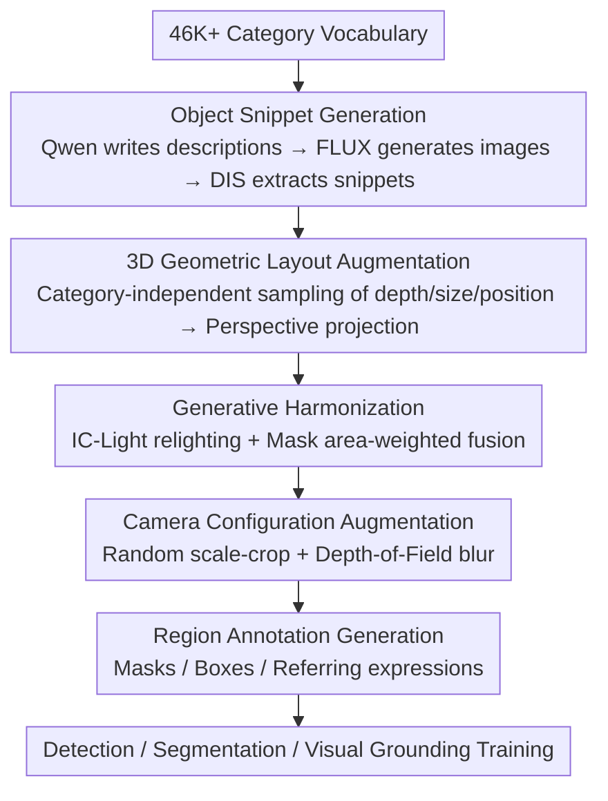

# Synthetic Object Compositions for Scalable and Accurate Learning in Detection, Segmentation, and Grounding

**Conference**: CVPR 2026  
**Paper**: [CVF Open Access](https://openaccess.thecvf.com/content/CVPR2026/html/Huang_Synthetic_Object_Compositions_for_Scalable_and_Accurate_Learning_in_Detection_CVPR_2026_paper.html)  
**Code**: None  
**Area**: Synthetic Data / Object Detection / Instance Segmentation / Visual Grounding  
**Keywords**: Synthetic data, object compositions, 3D layout augmentation, generative harmonization, open-vocabulary detection

## TL;DR
SOC is an "object-centric" synthetic data pipeline: it first generates 20 million high-quality single-object segmented snippets using generative models, then assembles them into 2 million images using 3D geometric layout and camera configuration augmentations, accompanied by pixel-precise masks, boxes, and referring expressions. Training with only 100,000 synthetic images allows open-vocabulary detection, segmentation, and grounding to outperform real datasets like GRIT 20M and V3Det 200K (+10.9 AP on LVIS, +8.4 NAcc on gRefCOCO).

## Background & Motivation
**Background**: Performance in "visual grouping" tasks such as instance segmentation, referring grounding, and object detection relies heavily on large-scale, manually annotated datasets. Annotating just 100,000 images for COCO took 2.2 million labor hours.

**Limitations of Prior Work**: Real datasets are expensive, difficult to scale, and have biased category coverage. While synthetic data seems promising, two mainstream routes have fatal flaws: ① Simulating and rendering entire scenes provides precise dense annotations but is limited by the scarcity of 3D assets and poor object diversity, often restricted to rigid domains like indoor or driving scenes; ② Auto-labeling (pseudo-labeling, e.g., GRIT, SynGround) on real or generated images offers richer scenes and appearances but inherits dual-layer annotation noise from both the labeling model and the image generator, leading to inaccurate masks and boxes.

**Key Challenge**: Existing synthetic methods are forced to choose between "annotation precision" and "compositional diversity/controllability"—either precise but rigid like simulations, or flexible but noisy like pseudo-labeling.

**Goal**: To create a synthetic pipeline that simultaneously achieves precise region annotation, controllability, compositional flexibility, open-vocabulary coverage, and infinite scalability.

**Key Insight**: The authors take the opposite approach—instead of starting from a whole image and then labeling it, they **assemble scenes bottom-up from object snippets**. Since each object snippet is generated and extracted individually, its mask is "natural ground truth," eliminating the need for models to guess boxes or masks post-hoc.

**Core Idea**: Replace "whole-image rendering/pseudo-labeling" with "object snippet compositions"—first build a massive library of high-quality snippets, then paste them into images according to designed 3D layouts followed by generative harmonization. Annotations are automatically generated and precise upon pasting.

## Method
### Overall Architecture
SOC (Synthetic Object Compositions) deconstructs "dataset creation" into two steps: first, **offline construction of a library of 20 million single-object segmented snippets**, and second, **online composition of snippets into any number of images**, each carrying its own masks, boxes, categories, and referring expressions. The entire pipeline consists of a 5-stage serial process: ① Object snippet generation → ② 3D geometric layout placing 5–20 snippets into a "3D scene" → ③ Generative harmonization (relighting + refusion) to remove pasting artifacts → ④ Camera configuration augmentation (scaling/depth-of-field blur) to simulate real photography → ⑤ Region annotation generation derived directly from the composition relationships. Crucially, since the image is assembled from snippets with known masks, the boxes and masks are already precise after step ②. Steps ③ and ④ only make the image "look real," and step ⑤ formats the annotations for detection, segmentation, and grounding.

### Key Designs

**1. Object-Centric Snippet Generation: Turning "Labels" into "Natural Ground Truth"**

Addressing the fundamental pain point of "inaccurate boxes and masks" in pseudo-labeling, SOC does not extract objects from cluttered scenes but generates each object individually. For the 46,000+ collected categories, Qwen2.5-32B first writes text descriptions for each, which are then fed into the FLUX-1-dev text-to-image model. The model renders single-object images from random viewpoints on a **pure white background**, followed by DIS for salient object extraction to obtain precise snippets with alpha channels. The authors found that masks for single objects on white backgrounds are much cleaner than those obtained from "generating and سپس segmenting in cluttered scenes" because there is no occlusion or background interference. Ultimately, 20 million snippets were generated: 10 million covering 1.6K frequent classes from LVIS/COCO/ADE20K (200 prompts per class), and 10 million covering 40K general classes from LAION/GQA/Flickr30K (10 prompts per class), with each prompt generating 3 snippets using different random seeds. This library allows the composition of **infinite** images with precise labels.

**2. 3D Geometric Layout Augmentation: Breaking Shortcut Correlations via "Category-Independent Sampling"**

Models trained on real data often learn "spurious correlations"—for example, "cars are always large and at the bottom of the frame," relying on position/size cues rather than semantics. To break these shortcuts, SOC models each synthetic image as a 3D scene where the sampling of depth, size, and position is **independent of the object category**, i.e., $p(d_i, X_i, Y_i \mid c_i) = p(d_i, X_i, Y_i)$. Specifically: each category has a common-sense physical size range (e.g., cars 4–5m, cups 10–20cm, generated by Qwen2.5-32B); a camera focal length $f \sim U(f_{min}, f_{max})$ is sampled, the maximum depth is set as $D_{max} = \alpha \cdot f$, and depths are sampled from near/middle/far segments (following the 40%/35%/25% distribution observed in COCO/SA-1B); for each snippet, physical size $S_i \sim N(\mu_{c_i}, \sigma_{c_i})$ and 3D position are sampled uniformly, then projected to 2D using perspective projection:

$$x_i = f \cdot \frac{X_i}{d_i}, \quad y_i = f \cdot \frac{Y_i}{d_i}, \quad s_i = f \cdot \frac{S_i}{d_i}$$

where $(x_i, y_i)$ is the 2D center and $s_i$ is the pixel size. Positions and depths are resampled if a projected object is too small/large or almost entirely occludes another object ($\text{IoU}(M_i, M_j) \ge 0.9$). This ensures the same object class appears at various depths, sizes, and positions, forcing the model to learn semantics rather than location shortcuts. In ablations, this yielded 10.03 AP, significantly outperforming COCO layouts (8.60) and random 2D layouts (9.07).

**3. Generative Harmonization + Mask Area-Weighted Fusion: Eliminating "Edge Shortcuts" without Destroying Small Objects**

Pasting snippets directly onto a background leaves **unnatural sharp edges**, which segmentation models might exploit instead of learning semantics. SOC uses the diffusion model IC-Light for both background inpainting and global relighting, generating a harmonious background for pasted objects and unifying the lighting across the scene to make the image realistic. However, IC-Light can distort small object details or change object colors (e.g., blue to red), breaking consistency with the text description. To counter this, the authors **refuse the original snippet back into the harmonized image using mask area-weighted fusion**. For each mask $M_i$, a fusion weight $\alpha_i \in [0,1]$ is used, where **smaller objects receive higher $\alpha_i$** (preserving more of the original appearance). Finally, a lightweight soft matting step converts binary masks into soft alpha mattes for smooth boundaries. This fusion step brought a +2.3 AP gain on LVIS-mini-val. Ablations showed that "inpainting+relighting+fusion" improved COCO zero-shot segmentation AP from 6.28 to 12.79 (+103.7%) compared to simple pasting.

**4. Camera Configuration Augmentation: Decoupling Object Scale from Category Cues**

After layout and lighting, SOC applies camera augmentations to further decouple object appearance from semantics. First is **random scale-crop**: starting from the focal length $f$ sampled in the layout stage, the image is zoomed by $s \sim U(1.0, 4.0)$ (equivalent to changing focal length to $f' = s \cdot f$) and cropped back to original size. This simulates camera zooming, ensuring that object scale is no longer a reliable cue for category identification. Second is **Depth-of-Field (DoF) blur**: a focal plane depth $d_{focal}$ and an aperture f-number $N \sim U(1.4, 16)$ are randomly sampled. A blur kernel is calculated for each object at depth $d$ using the circle of confusion formula:

$$\sigma(d) = \frac{f^2}{N \cdot d_{focal}} \cdot \frac{|d - d_{focal}|}{d}$$

Objects near the focal plane remain sharp ($\sigma \approx 0$), while those further away become blurrier. Small f-numbers (f/1.4) produce strong background bokeh simulating portrait photography, while large f-numbers (f/16) result in mostly sharp images simulating landscape photography. Finally, in stage ⑤, annotations are aggregated: detection/segmentation are calculated directly from composition relationships by subtracting occluded pixels; for visual grounding, the boxes, masks, categories, and generation prompts of each object are fed into QwQ-32B to produce at least 9 dense referring expressions per image across attribute and spatial dimensions.

### A Complete Example
The process of composing one image: 5–20 categories are sampled with balanced sampling from the 46K vocabulary (e.g., dog, car, cup), each retrieving a white-background snippet from the library. A physical size of 0.5m is sampled for the dog at a "near" depth, and 5m for the car at a "far" depth—notably, while the car is physically larger, it may appear smaller than the dog in the 2D frame due to its distance, **thoroughly breaking the "car = large" shortcut**. Perspective projection places them in 2D, checking for no $\ge 0.9$ total occlusion. IC-Light relights the scene and repaints the background, while the original dog and cup (high $\alpha$ for small objects) are fused back to preserve detail and color. A layer of f/2.0 DoF is applied, naturally blurring the distant car. Finally, the system outputs precise boxes+masks for the dog and car, along with referring expressions like "all dogs in the frame" and "the object on the back left." The entire annotation process involves zero human labor and zero post-hoc labeling.

## Key Experimental Results

### Main Results
Open-vocabulary detection (MM-Grounding-DINO, fine-tuned on O365+GoldG weights): Training on just 50K synthetic images outperforms GRIT 20M and matches V3Det 200K, showing complementarity with real data.

| Training Data | Scale | LVIS AP | LVIS AP_rare | OdinW-35 avg |
|:---|:---|:---|:---|:---|
| O365+GoldG (Baseline) | 1.4M | 20.1 | 10.1 | 20.3 |
| +GRIT (Model-labeled) | +20M | 27.1 | 17.3 | 22.8 |
| +V3Det (Manually labeled) | +200K | 30.6 | 21.5 | 21.4 |
| **+SOC-FC-50K** | +50K | 29.8 | 23.5 | 20.5 |
| **+SOC-FC-200K+GC-200K** | +400K | 31.4 | 27.9 | 21.2 |
| O365+GoldG+GRIT+V3Det | 21.6M | 31.9 | 23.6 | 23.2 |
| **↑ plus +SOC-100K** | +100K | **33.2** | **29.8** | 23.1 |

Visual Grounding (gRefCOCO / DoD / RefCOCO avg): Existing large datasets bring only marginal improvements due to lack of high-quality referring expressions, whereas SOC shows significantly larger gains in gRefCOCO no-target accuracy (NAcc) and DoD mAP.

| Training Data | Scale | gRefCOCO P@1 | gRefCOCO NAcc | DoD FULL mAP |
|:---|:---|:---|:---|:---|
| O365+GoldG (Baseline) | 1.4M | 39.8 | 89.3 | 15.6 |
| +GRIT | +20M | 40.7 | 89.3 | 17.0 |
| +V3Det | +200K | 40.3 | 89.3 | 16.7 |
| **+SOC-FC-100K** | +100K | **41.3** | **97.7** | **19.4** |

### Ablation Study
COCO zero-shot instance segmentation AP (Sec 4.7), validating the four major designs:

| Configuration | AP | Description |
|:---|:---|:---|
| COCO Layout | 8.60 | Using statistics from real datasets |
| Random 2D Layout | 9.07 | Random 2D placement |
| **3D Geometric Layout Aug** | **10.03 (+16.6%)** | Category-independent 3D sampling to break shortcuts |
| w/o Camera Config Aug | 10.03 | — |
| **w/ Camera Config Aug** | **10.58 (+5.5%)** | Adding scaling/DoF |
| w/o Generative Harmonization | 6.28 | Direct pasting, leaving edge artifacts |
| w/ Inpainting + Relighting | 10.58 | IC-Light |
| **w/ Inpainting + Relighting + Fusion** | **12.79 (+103.7%)** | Mask area-weighted fusion |
| Real Snippets Only | 7.03 | — |
| **Real + SOC Synthetic Snippets** | **12.79 (+81.9%)** | Significant gains from synthetic snippets |

### Key Findings
- **Generative harmonization (especially fusion) provides the largest contribution**: Removing it causes AP to drop from 12.79 to 6.28, almost a 50% decrease. This indicates that "edge shortcuts" are the primary reason synthetic data can degrade models, and area-weighted fusion (to preserve small objects) is the critical patch for suppressing the side effects of relighting.
- **Rare classes see the most gain**: 50K SOC images increased LVIS rare-class AP from 10.1 to 23.5 (+13.4), significantly exceeding GRIT's +7.0 gain. The controllability of synthesis perfectly complements real data gaps in long-tail categories.
- **Gains are amplified with minimal real data**: Adding SOC snippets to only 1% of COCO data resulted in a +6.59 AP gain, much higher than the ~3% gain with full data, suggesting synthetic snippets do not just supplement but "amplify" real annotations when data is scarce.
- **3D Layout > Real Layout**: Category-independent 3D sampling (10.03) outperformed copying the COCO real layout distribution (8.60), confirming that "deliberately breaking spurious correlations" is more beneficial for learning semantics than "mimicking real distributions."

## Highlights & Insights
- **Paradigm Inversion of "Annotation as Natural Ground Truth"**: By having precise snippets first and then composing images, annotations are automatically generated, bypassing the noise issues inherent in all pseudo-labeling routes. This is the fundamental reason SOC can outperform real data.
- **Data Augmentation as "Anti-Shortcut Engineering"**: The 3D layout, camera augmentation, and generative harmonization are designed not just for "realism" but to **actively dismantle every shortcut the model might exploit** (position, scale, and edge shortcuts). This target-oriented design perspective is highly valuable.
- **Controllability enabling diagnostic capabilities**: Since the system can precisely control "multiple objects of the same class with different attributes," the authors proposed the Intra-Class Referring (ICR) diagnostic task to measure whether models can distinguish between objects of the same class based on fine-grained attributes.

## Limitations & Future Work
- The pipeline relies heavily on multiple large models (Qwen2.5-32B, FLUX, IC-Light, QwQ-32B, DIS). Computational costs and inherited biases from these models were not fully quantified. ⚠️
- While single-object snippets are clean, **realistic interaction/contact relationships** between objects (e.g., a hand holding a cup, a person sitting on a chair) are difficult to synthesize, potentially leaving a gap for tasks requiring relational reasoning.
- Although the snippets are high-quality, the "assembled world" is essentially a random placement of objects. Long-range scene semantics and common-sense layouts (e.g., what belongs in a kitchen) are less natural than in real images, which may limit tasks requiring scene-level priors.
- Future directions: Incorporating "relationships/interactions" into controllable generation, using more lightweight harmonization models to reduce cost, and exploring adaptive expansion of snippet libraries based on tasks.

## Related Work & Insights
- **vs. Copy-Paste / X-Paste**: These also paste snippets but rely on objects extracted from real images, lack 3D layout control, and copy backgrounds directly. SOC uses generative snippets + 3D geometric layout + generative harmonization, leading by +36.1% / +36.0% on COCO instance segmentation.
- **vs. SynGround / SegGen etc. (Diffusion + Pseudo-labeling)**: These generate entire images from masks/layouts and then label them with models, leading to inaccurate labels. SOC labels are the natural ground truth of composition, leading by +24.1% / +28.5% on COCO.
- **vs. GRIT / V3Det Real Datasets**: GRIT has scale (20M) but contains only boxes and is noisy; V3Det is precise but expensive and limited in categories. SOC matches or exceeds them with only 50–100K images and shows additive gains (+6.2 rare AP), proving it introduces new vocabulary and compositions not covered by real data.

## Rating
- Novelty: ⭐⭐⭐⭐⭐ The object-centric composition paradigm where "snippets come first and labeling is natural GT" is a true inversion of the synthetic data generation route.
- Experimental Thoroughness: ⭐⭐⭐⭐⭐ Covers three tasks (detection/segmentation/grounding), multiple benchmarks, low-data/closed-vocabulary/ICR diagnosis, and four clean ablations.
- Writing Quality: ⭐⭐⭐⭐ Clear multi-stage methodology; formulas align with ablations.
- Value: ⭐⭐⭐⭐⭐ The first large-scale synthetic data to systematically outperform real datasets across multiple tasks and models, with an open, controllable, and scalable framework.

<!-- RELATED:START -->

## Related Papers

- [\[CVPR 2026\] Conversational Image Segmentation: Grounding Abstract Concepts with Scalable Supervision](conversational_image_segmentation_grounding_abstract_concepts_with_scalable_supe.md)
- [\[CVPR 2026\] AFRO: Bootstrap Dynamic-Aware 3D Visual Representation for Scalable Robot Learning](bootstrap_dynamic-aware_3d_visual_representation_for_scalable_robot_learning.md)
- [\[ICCV 2025\] LEGION: Learning to Ground and Explain for Synthetic Image Detection](../../ICCV2025/segmentation/legion_learning_to_ground_and_explain_for_synthetic_image_detection.md)
- [\[CVPR 2026\] Beyond Appearance: Camouflaged Object Detection via Geometric Structure](beyond_appearance_camouflaged_object_detection_via_geometric_structure.md)
- [\[CVPR 2026\] RAVEN: Radar Adaptive Vision Encoders for Efficient Chirp-wise Object Detection and Segmentation](raven_radar_adaptive_vision_encoders_for_efficient_chirp-wise_object_detection_a.md)

<!-- RELATED:END -->
