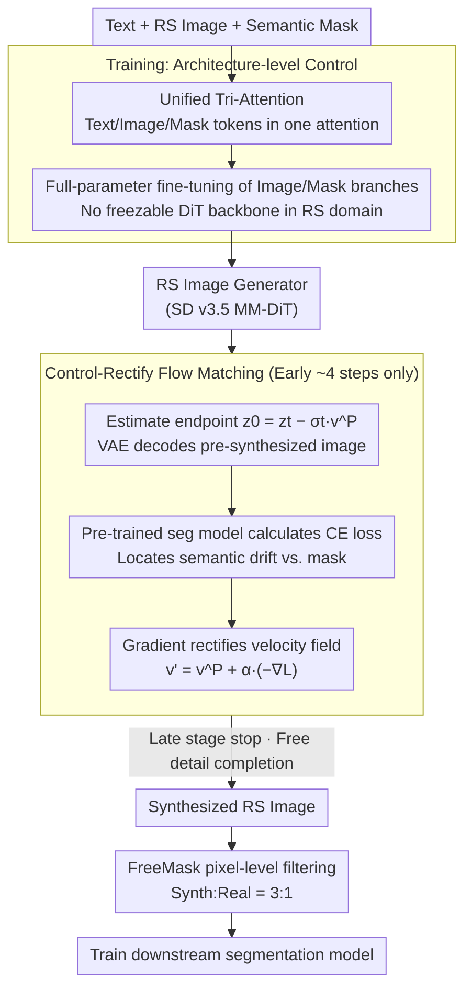

# Task-Oriented Data Synthesis and Control-Rectify Sampling for Remote Sensing Semantic Segmentation

**Conference**: CVPR 2026  
**arXiv**: [2512.16740](https://arxiv.org/abs/2512.16740)  
**Code**: [GitHub](https://github.com/Yunkai-Yang/crfm)  
**Area**: Segmentation / Remote Sensing Images  
**Keywords**: Remote sensing semantic segmentation, data synthesis, controllable generation, diffusion models, flow matching

## TL;DR

This paper proposes the TODSynth framework, which achieves text-image-mask joint-controlled remote sensing image synthesis via the unified tri-modal attention of MM-DiT. It innovatively introduces the Control-Rectify Flow Matching (CRFM) method, which utilizes the semantic loss of a downstream segmentation model during the sampling stage to dynamically adjust the generation trajectory. This approach improves mIoU by 4.14% and 2.08% on FUSU-4k and LoveDA, respectively.

## Background & Motivation

**Background**: Remote sensing semantic segmentation is a fundamental task for land use classification and environmental monitoring, but constructing large-scale pixel-level annotated datasets is extremely costly. Recently, diffusion-based data synthesis has become a promising solution for training set augmentation, with methods like ControlNet generating corresponding images from semantic masks.

**Limitations of Prior Work**: (1) **Immature control schemes**: Generative models based on the DiT architecture (e.g., SD v3.5) significantly outperform UNet architectures, but how to effectively inject semantic mask control into DiT remains an open problem. Adapter-style cross-attention control is inefficient and suffers from modal conflicts. (2) **Unstable sampling quality**: Even with a reasonable control scheme, the randomness of the diffusion/flow matching sampling process can cause generated images to deviate from mask constraints in local regions (semantic drift), reducing the utility of synthetic data for downstream tasks. (3) **Limited post-processing solutions**: Existing methods (e.g., CLIP scoring, FreeMask adaptive filtering) are post-generation remedies. In complex scenes or for few-shot categories, strict filtering discards potentially useful annotations.

**Key Challenge**: The contradiction between the randomness of generative models and the deterministic semantic control required by downstream tasks. This is further exacerbated by large domain gaps in remote sensing, the lack of pre-trained DiT models, and the scarcity of fine-grained text descriptions.

**Goal**: (1) Identify a DiT control scheme suitable for remote sensing M2I (mask-to-image) tasks; (2) Correct semantic drift during the sampling process (rather than post-generation) to enhance the task-relevance of synthetic data.

**Key Insight**: The authors observe that directly optimizing the latent variable $z_t$ leads to mode collapse, while optimizing the velocity field $v_\Theta$ provides stable continuous correction. Based on this, gradient signals from a downstream segmentation model are injected during the early high-plasticity stage of flow matching to rectify the generation trajectory.

**Core Idea**: Utilizing unified tri-modal attention for architecture-level control and employing downstream segmentation loss gradients for velocity field correction (CRFM) during early sampling to achieve task-oriented remote sensing data synthesis.

## Method

### Overall Architecture

TODSynth addresses the problem of "how to synthesize remote sensing images that truly benefit downstream segmentation." It divides the workflow into two connected stages: During training, it incorporates text, image, and mask modalities into a single attention mechanism (Unified Tri-Attention) within SD v3.5, performing full-parameter fine-tuning on the image/mask branches to learn a remote sensing image generator that respects mask constraints. During sampling, instead of allowing the generator free rein followed by post-hoc filtering, it uses an off-the-shelf segmentation model as a "judge" during the first few steps of trajectory expansion. It uses the semantic loss gradient to steer the velocity field toward a "more mask-compliant" direction (Control-Rectify Flow Matching, CRFM). Finally, the synthesized images are pixel-level filtered via FreeMask and mixed with real data at a 3:1 ratio to train the segmentation model. In essence, control is embedded in the architecture, and rectification is performed during sampling, both centered on the goal of "downstream task utility."

### Key Designs

**1. Unified Tri-Attention: Treating the mask as a modality equal to text**

The immaturity of control schemes is the first pain point: DiT has surpassed UNet, but there is no definitive answer for injecting mask control into DiT. Existing paths have flaws—mask-adapters treat the mask as a separate cross-attention path where it fails to fuse with text and remains static during denoising, underutilizing semantic information. Siamese dual-tower M2I branches lack local text descriptions, weakening the benefits of decoupling. The authors' approach is direct: in the original text-image dual-modal joint attention of MM-DiT, an additional mask sequence $h^m$ is added. All three branches carry independent $W_q, W_k, W_v$, and tokens are concatenated in the same attention calculation: $h_o^t, h_o^z, h_o^m = \text{Attn}([h^t W_q^t, h^z W_q^z, h^m W_q^m], ...)$. This allows the mask to interact directly with text embeddings for stronger global semantic understanding at the low cost of an additional projection path.

**2. Control-Rectify Flow Matching (CRFM): Mid-sampling correction via downstream gradients**

The second pain point is that sampling randomness causes local regions to deviate from the mask (semantic drift), and post-processing like CLIP scoring or FreeMask only rectifies this after generation. CRFM moves correction into the sampling process: at an early step, the current state $z_t$ and predicted velocity field $v^P$ are used to estimate the endpoint $z_0^t = z_t - \sigma_t v^P$. This is decoded via VAE into a pre-synthesized image $x_0^t$, which is fed into a pre-trained segmentation network to calculate cross-entropy $\mathcal{L}_{CE}(\mathcal{S}(x_0^t), C^m)$. The gradient of the velocity field is then taken to obtain the rectification vector $v_{rec}' = -\nabla_{v_t} \mathcal{L}_{CE}$, resulting in:

$$v' = v^P + \alpha \cdot v_{rec}'$$

Two key choices were made here. First, the rectification target: the authors found that directly modifying the latent variable $z_t$ leads to mode collapse (loss of diversity), whereas modifying the velocity field updates $z_t$ indirectly through ODE integration, providing smoother and more stable correction. Second, the timing: rectification is only performed during early steps. Early stages have high randomness and plasticity; even if the segmentation model's prediction is slightly inaccurate, the impact under coarse-grained adjustment is controllable. In later stages, the image structure is fixed, and rectification at that point amplifies segmentation model errors, leading to adversarial perturbations and degraded image quality.

**3. Full-parameter fine-tuning of image and mask branches**

The "frozen backbone + adapter" approach used for natural images works because the backbone is pre-trained on the same domain. However, remote sensing images are top-down with spectral characteristics and scales far removed from natural images, and there are no pre-trained DiT generative models for remote sensing. Consequently, the authors abandoned lightweight adapters in favor of full-parameter fine-tuning for the image and mask branches, allowing the model to fully absorb the distribution characteristics of remote sensing imagery.

### A Complete Example: How CRFM Corrects a Single Sampling Step

Suppose the total sampling steps are 23, and CRFM is active for the first 4 steps (the optimal configuration). At an early step state $z_t$, the generator provides the velocity field $v^P$:

1.  **Estimate Endpoint**: Calculate $z_0^t = z_t - \sigma_t v^P$, representing "what we would get if we followed this velocity to the end," then decode $x_0^t$ with VAE;
2.  **Judge Scoring**: Feed $x_0^t$ into the pre-trained segmentation network $\mathcal{S}$ and compare it with the given mask $C^m$ to calculate $\mathcal{L}_{CE}$—e.g., if a region that should be "building" is generated as "bare land," the loss is high;
3.  **Backprop to Velocity Field**: Compute the gradient $v_{rec}' = -\nabla_{v_t}\mathcal{L}_{CE}$, which points in the direction that "makes that region look more like a building";
4.  **Gentle Nudge**: Update to $v' = v^P + \alpha\, v_{rec}'$ and take this step according to the rectified velocity.

Iterating this for the first 4 steps pulls the unformed semantics back toward the mask; after step 5, the process stops, allowing the generator to freely complete details without destroying image quality. This "early correction, late release" rhythm explains why 4 steps are optimal while 6 steps cause the FID to spike to 66.95.

### Loss & Training

The training phase uses the standard Rectified Flow loss (MSE of velocity field prediction). The correction intensity during sampling is controlled by the hyperparameter $\alpha$, with CRFM active only for the first few steps. Post-processing combines pixel-level filtering from FreeMask, with a synthetic-to-real data ratio of 3:1. The model was trained for 200K steps on 8×RTX 4090 at 512×512 resolution using the AdamW optimizer with a learning rate of $10^{-5}$.

## Key Experimental Results

### Main Results

| Method | Post-processing | Synth/Real | FUSU-4k OA | FUSU-4k mIoU | FUSU-4k mAcc |
| :--- | :--- | :--- | :--- | :--- | :--- |
| Baseline (Real only) | - | - | 74.27 | 45.27 | 56.44 |
| ControlNet (SD v1.5) | × | ×10 | 73.85 | 45.13 | 56.77 |
| FreeMask | FM | ×5 | 74.23 | 45.83 | 56.29 |
| SynthEarth | CLIP | ×5 | 75.35 | 47.53 | 58.91 |
| SD v3.5 (Tri-Attn) | FM | ×3 | 75.41 | 48.57 | 61.67 |
| **TODSynth (Ours)** | FM | **×3** | **75.66** | **49.41** | **63.27** |

On the LoveDA dataset, TODSynth achieved gains of +1.60% OA / +2.08% mIoU / +2.22% mAcc compared to the baseline.

### Ablation Study

Comparison of control strategies (FUSU-4k):

| Method | OA | mIoU | mAcc |
| :--- | :--- | :--- | :--- |
| ControlNet (SD v1.5) | 73.85 | 45.13 | 56.77 |
| Mask-adapter | 74.94 | 47.41 | 59.62 |
| Siamese MM-attention | 74.94 | 48.46 | 61.44 |
| **Tri-Attention** | **75.41** | **48.57** | **61.67** |

Ablation of CRFM steps (total steps=23):

| CRFM Steps | mIoU | mAcc | FID |
| :--- | :--- | :--- | :--- |
| 0 (No correction) | 48.57 | 61.67 | 35.85 |
| 2 | 48.80 | 61.05 | 34.86 |
| **4** | **49.41** | **63.27** | 38.65 |
| 6 | 48.74 | 61.30 | 66.95 |

### Key Findings
- **DiT >> UNet**: For controllable generation, the MM-DiT approach significantly outperforms UNet-based ControlNet and FreeMask, even though SynthEarth is a specialized foundation model for remote sensing generation.
- **CRFM is effective but requires step control**: 4-step correction is optimal for mIoU/mAcc; excessive steps (6 steps) lead to a sharp increase in FID (66.95), indicating that over-correction damages image quality.
- **Pixel-level > Image-level filtering**: FreeMask's pixel-level filtering is significantly better than CLIP's image-level filtering, as finer screening is better suited for segmentation tasks.
- TODSynth achieves better results with **less synthetic data** (×3 vs. ×5/×10), demonstrating the efficiency of task-oriented synthesis.
- Directly optimizing latent variables leads to mode collapse, validating the necessity of correcting the velocity field instead.

## Highlights & Insights
- **Velocity field correction vs. Latent variable optimization**: This is the core insight. In the flow matching framework, optimizing the velocity field rather than directly modifying the latent variables avoids mode collapse and provides stable trajectory correction. This can be generalized to other conditional generation tasks.
- **Task-feedback-driven sampling**: Unlike traditional methods that filter post-generation, this method uses downstream task signals to guide sampling during the process—a paradigm shift from "selection after generation" to "rectification during generation."
- **Early plasticity window**: The discovery that the early steps of flow matching are the optimal window for correction. Late-stage correction is harmful, consistent with the observation in diffusion models that "early steps determine semantics, while late steps determine details."
- The simple implementation of Tri-modal Attention proves that "unified fusion is superior to decoupled processing" for remote sensing M2I scenarios.

## Limitations & Future Work
- CRFM depends on the quality of the pre-trained segmentation model—if the model performs poorly on the target domain, the correction signal may be inaccurate.
- Currently, $\alpha$ and the number of CRFM steps require manual tuning; adaptive adjustment strategies might be more robust.
- Validated only on two remote sensing datasets; effectiveness in other label-scarce domains like medical imaging remains to be seen.
- 512×512 resolution may be insufficient for high-resolution remote sensing; higher-resolution generation schemes need to be explored.
- Full-parameter fine-tuning is computationally expensive (8×4090); the comparison with lightweight schemes like LoRA is missing.

## Related Work & Insights
- **vs. ControlNet**: A UNet-based control scheme with limited effectiveness in the remote sensing domain. This paper's DiT-based Tri-Attention is significantly superior.
- **vs. FreeMask**: A post-processing filtering scheme complementary to CRFM. This paper proves that stacking CRFM on top of FreeMask yields further improvements.
- **vs. SynthEarth**: A foundation model for remote sensing generation using CLIP scoring for filtering. This paper achieves better results with less data (×3 vs. ×5).
- **vs. Training-free L2I editing**: Methods that directly optimize latent variables lead to mode collapse. This paper's velocity field correction provides a superior alternative.

## Rating
- Novelty: ⭐⭐⭐⭐ The CRFM velocity field correction is an innovative idea; the "rectification during generation" paradigm is noteworthy.
- Experimental Thoroughness: ⭐⭐⭐⭐ Ablations for control strategies and CRFM hyperparameters are thorough, though verification on only two datasets is a slight limitation.
- Writing Quality: ⭐⭐⭐⭐ Clear theoretical derivation and comprehensive experimental framework.
- Value: ⭐⭐⭐⭐ Highly practical for remote sensing data synthesis; the CRFM concept is generalizable to other domains.

<!-- RELATED:START -->

## Related Papers

- [\[CVPR 2026\] MatchMask: Mask-Centric Generative Data Augmentation for Label-Scarce Semantic Segmentation](matchmask_mask-centric_generative_data_augmentation_for_label-scarce_semantic_se.md)
- [\[NeurIPS 2025\] FAST: Foreground-aware Diffusion with Accelerated Sampling Trajectory for Segmentation-oriented Anomaly Synthesis](../../NeurIPS2025/segmentation/fast_foreground-aware_diffusion_with_accelerated_sampling_trajectory_for_segment.md)
- [\[CVPR 2026\] HySeg: Learning Generative Priors for Structure-Aware Remote Sensing Segmentation](hyseg_learning_generative_priors_for_structure-aware_remote_sensing_segmentation.md)
- [\[CVPR 2026\] F2Net: A Frequency-Fused Network for Ultra-High Resolution Remote Sensing Segmentation](f2net_a_frequency-fused_network_for_ultra-high_resolution_remote_sensing_segment.md)
- [\[CVPR 2026\] Test-Time Multi-Prompt Adaptation for Open-Vocabulary Remote Sensing Image Segmentation](test-time_multi-prompt_adaptation_for_open-vocabulary_remote_sensing_image_segme.md)

<!-- RELATED:END -->
