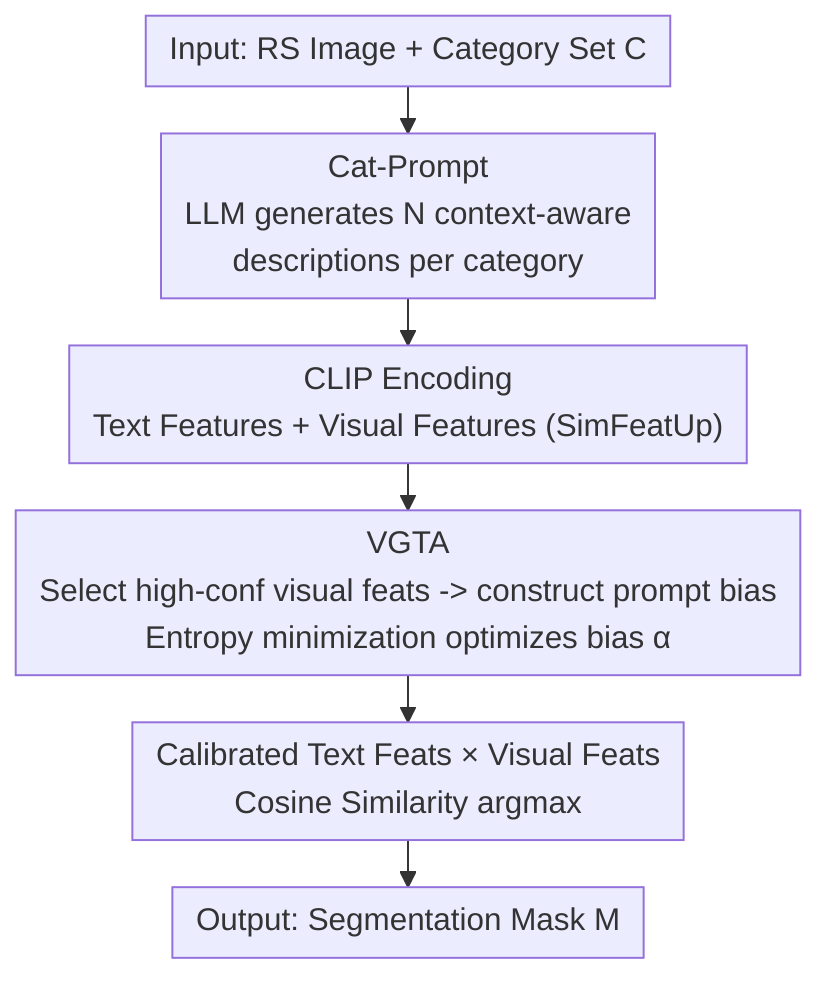

# Test-Time Multi-Prompt Adaptation for Open-Vocabulary Remote Sensing Image Segmentation

**Conference**: CVPR 2026  
**Paper**: [CVF Open Access](https://openaccess.thecvf.com/content/CVPR2026/html/Yang_Test-Time_Multi-Prompt_Adaptation_for_Open-Vocabulary_Remote_Sensing_Image_Segmentation_CVPR_2026_paper.html)  
**Code**: https://github.com/TiY68/TMPA  
**Area**: Semantic Segmentation / Open-Vocabulary / Remote Sensing  
**Keywords**: Open-vocabulary segmentation, remote sensing, test-time adaptation, textual ambiguity, CLIP

## TL;DR
Addressing the overlooked "textual ambiguity" problem in open-vocabulary remote sensing image segmentation (OVRSIS), this paper proposes the plug-and-play TMPA: it first utilizes an LLM to expand naive category names into multiple context-aware descriptions, and then calibrates text embeddings during inference guided by high-confidence visual features, achieving an average gain of 4.6% for SegEarth-OV across 17 remote sensing datasets.

## Background & Motivation
**Background**: Semantic segmentation of remote sensing images has long followed a closed-set setting, capable only of identifying pre-defined fixed categories, which fails when encountering new infrastructure or evolving geographic features. To break this limitation, recent works have explored Open-Vocabulary Remote Sensing Image Segmentation (OVRSIS) using Vision-Language Models (VLM) like CLIP: labeling each pixel with arbitrary text descriptions. Representative works include SegEarth-OV with feature upsamplers for refining low-resolution features, OVRS with rotation-aggregated similarity computation, and RSKT-Seg with DINO for enhanced spatial representation.

**Limitations of Prior Work**: These methods exclusively focus on "enhancing visual representation," largely ignoring the text side. The authors identify a critical overlooked issue in OVRSIS—**textual ambiguity**: ① synonymy, where visually similar geographic features are labeled with different names ("cropland" vs "agricultural"); ② polysemy, where the same category name corresponds to entirely different visual content across tasks (e.g., "background" having completely different meanings in different datasets). Experiments show that simply changing the prompts of SegEarth-OV from "background" to "cluster" or "road" to "pavement" causes significant performance fluctuations, indicating extreme sensitivity to text prompts.

**Key Challenge**: OVRSIS relies on matching images and "category text descriptions" in a shared embedding space; thus, the quality of text prompts directly determines the understanding of target concepts. However, naive category names are naturally ambiguous due to inconsistent labeling standards and lexical variants (synonymy/polysemy), disrupting image-text alignment. Meanwhile, methods like OVRS and RSKT-Seg follow a domain adaptation route requiring training on annotated benchmarks, risking overfitting to the source domain and limited scalability.

**Goal**: To alleviate textual ambiguity from the text side without requiring annotations or retraining, and to strengthen matching in high-uncertainty regions caused by "image-text misalignment."

**Key Insight**: The authors observe a usable signal—mispredicted regions are often accompanied by high entropy (high uncertainty), while correctly predicted regions have low entropy (high confidence). High-confidence visual features from the same category can thus be used to "pull" the text representations of high-entropy regions to rectify image-text alignment.

**Core Idea**: Utilizing "multiple context-aware text descriptions + test-time visual-guided text embedding calibration" to replace "single naive category names," specifically targeting textual ambiguity in OVRSIS.

## Method

### Overall Architecture
TMPA is a plug-and-play module compatible with existing OVRSIS methods (e.g., SegEarth-OV, CASS, ClearCLIP). Given a remote sensing image $X \in \mathbb{R}^{H\times W\times 3}$ and a set of natural language concepts $C=\{C_1,\dots,C_K\}$, the goal is to output a pixel-wise semantic mask $M$. The pipeline consists of two steps: First, **Cat-Prompt** offline expands each category name into $N$ diverse, context-aware descriptions (replacing naive category names) to mitigate the ambiguity of the names themselves. Second, **VGTA** dynamically calibrates these text embeddings during inference—it selects high-confidence visual features from the current image to construct a "prompt bias" added to the text embeddings, and optimizes only this bias using a pixel-wise entropy minimization loss (with the base model fully frozen). Finally, the calibrated text features $\tilde{F}^t_{\text{clip}}$ and upsampled visual features $F^v_{\text{up}}$ are used to compute cosine similarity, with the argmax yielding the mask: $M=\arg\max_k \operatorname{softmax}(\operatorname{sim}(F^v_{\text{up}}, \tilde{F}^t_{\text{clip}}))$.

### Key Designs

**1. Cat-Prompt: Task-Driven Prompts for LLM Expansion of Naive Category Names**

Naive category names are ambiguous (synonymy/polysemy), causing misalignment when matched directly with visual features. Cat-Prompt constructs a structured, task-driven prompt for an LLM (e.g., Gemini) to generate $N$ (default 5) diverse, detailed, and visually grounded one-sentence descriptions for each category, serving as "textual prototypes." This prompt consists of three parts: **System Prompt** defines the task goal and output format, guiding the LLM toward structured, task-relevant answers; **Dataset Description** provides domain-level and scene-level context to align descriptions with the dataset's visual characteristics; **Visual Feature Diversity Constraints** require each description to emphasize different aspects (color, shape, size, texture, seasonal changes) without repetitive phrasing. Taking "building" from WHUAerial as an example: a pure direct prompt provides a generic dictionary definition that fails to match remote sensing imagery; adding only visual constraints generates descriptions like "circular/curved" or "white" that mismatch Wuhan's actual buildings; only combining visual constraints with dataset descriptions (scene-aware text) accurately captures visual patterns and spatial layouts. This step is offline and annotation-free.

**2. VGTA: Constructing Prompt Bias via High-Confidence Visual Features for Test-Time Calibration**

While pre-generated multi-prompts mitigate name ambiguity, image-text misalignment persists during scene/task transitions, especially for visually similar features. The authors observe that **correctly predicted regions exhibit low entropy, while incorrectly predicted regions exhibit high entropy**. VGTA thus matches "visual features of high-uncertainty regions" with "visual features of high-confidence regions of the same category" to refine text representations. Specifically: the CLIP visual features and text embeddings first compute pixel-wise category probabilities $\hat{P}=\operatorname{softmax}(F^v_{\text{clip}}(F^t_{\text{clip}})^\top)$, then pixel-wise entropy $U_{x,y}=-\sum_k \hat{P}_{x,y,k}\log\hat{P}_{x,y,k}$ serves as uncertainty. For category $k$, Top-$n$ lowest entropy positions are selected from pixels predicted as $k$ whose entropy is below the global mean $\bar{U}$, and the mean of their visual features $\overline{f}_k$ is taken as the high-confidence prototype. This is injected into the text embedding for calibration:

$$\tilde{F}^t_{\text{clip}}(\alpha) = (1-\alpha)\odot F^t_{\text{clip}} + \alpha\odot\overline{F}$$

where $\overline{F}$ is a matrix repeating the mean visual features to match the size of $F^t_{\text{clip}}$, and $\alpha\in[0,1]^{KN}$ is a per-description, zero-initialized learnable intensity matrix. $\alpha\odot\overline{F}$ represents the "visual-guided prompt bias." During inference, only $\alpha$ is optimized (base model frozen) via pixel-wise entropy minimization: $\min_\alpha \frac{1}{H'W'}\sum_{x,y} P_{x,y}^\top(\alpha)\log P_{x,y}(\alpha)$, where $P(\alpha)=\operatorname{softmax}(F^v_{\text{up}}(\tilde{F}^t_{\text{clip}}(\alpha))^\top)$. This approach uses entropy as an unsupervised signal and high-confidence visual features as "anchors" to pull text embeddings, correcting image-text matching in high-uncertainty regions without any labels. Zero-initialization ensures the starting point is the original text embedding, preserving aligned parts and injecting visual bias only where necessary.

### Loss & Training
The sole optimization objective is the pixel-wise entropy minimization loss mentioned above, updating only the prompt bias parameters $\alpha$; the base model (vision/text encoders of SegEarth-OV, CLIP ViT-B/16) remains entirely frozen. Each test image requires only 3 steps of Adam optimization. The long edge of the input is resized to 448, with $224\times224$ sliding window inference at a stride of 112.

## Key Experimental Results

### Main Results
Evaluation across 17 remote sensing datasets (8 multi-class semantic segmentation + 9 single-class feature extraction) using SegEarth-OV as the base. mIoU for multi-class segmentation:

| Dataset | SegEarth-OV | CASS | MLMP | TMPA (Ours) | Gain vs SegEarth-OV |
|--------|------|------|------|------|------|
| OpenEarthMap | 39.8 | 38.2 | 35.5 | **42.2** | ↑2.4 |
| LoveDA | 36.9 | 37.0 | 30.4 | **39.7** | ↑2.8 |
| iSAID | 21.7 | 20.7 | 17.9 | **26.2** | ↑4.5 |
| Potsdam | 47.1 | 43.8 | 37.6 | **51.1** | ↑4.0 |
| Vaihingen | 29.1 | 33.5 | 27.3 | **43.4** | ↑14.3 |
| VDD | 45.3 | 42.0 | 37.56 | **49.0** | ↑3.7 |
| **Mean** | 39.1 | 37.4 | 33.1 | **43.7** | **↑4.6** |

Average gain of 4.6%, with a significant 14.3% jump on Vaihingen (9.9% higher than CASS); 10.6% higher than MLMP (designed for natural image TTA), highlighting the domain gap. Single-class extraction also achieves comprehensive SOTA, with greater gains when resolution increases from 448 to 896 (Building +7.9%, Flood +8.6%).

### Ablation Study
Ablation on Vaihingen / WHUAerial (DD=Dataset Description, VF=Visual Feature constructed bias):

| Configuration | Vaihingen | WHUAerial | Description |
|------|------|------|------|
| Baseline (SegEarth-OV) | 29.1 | 49.2 | Naive category names only |
| + Cat-Prompt (w/o DD) | 32.1 | 50.4 | Descriptions only, no dataset context |
| + Cat-Prompt (w/ DD) | 35.9 | 52.4 | DD adds +3.8/+2.0 |
| + VGTA (w/o VF) | 41.3 | 54.5 | Learning zero-init vector directly |
| Full (w/ VF) | **43.4**| **55.6** | VF bias adds +2.1/+1.1 |

Scanning the number of text descriptions: Performance increases from 0→1→3→5, peaking at 5 (Vaihingen +6.8% over naive names), while 7 slightly decreases due to redundancy/noise; thus 5 is the default.

### Key Findings
- **VGTA contributes most**: Built upon Cat-Prompt, VGTA adds another 7.5%/3.2% on Vaihingen/WHUAerial, yielding the highest single-component gain.
- **Dataset Description (DD) is effective**: Removing DD drops performance by 3.8%/2.0%, proving scene-level context aligns generated descriptions with visual reality.
- **Visual feature-based bias outperforms blind learning**: w/ VF is 2.1%/1.1% higher than w/o VF (direct zero-init vector learning), validating "high-confidence visual anchors" as effective guidance.
- **Plug-and-play generalization**: Consistent gains when applied to SCLIP / ClearCLIP / CASS, e.g., +9.5% / +10.5% / +18.5% on WHUAerial.

## Highlights & Insights
- **First to treat "textual ambiguity" as a primary issue in OVRSIS**: While prior works focused on visual representation, this paper identifies the text side as the overlooked bottleneck, validating the problem through experiments where performance fluctuates with synonyms.
- **Entropy as unsupervised signal, visual features as anchors**: Utilizing the nearly free statistical regularity of "high entropy for errors / low entropy for correct predictions," the method uses high-confidence visual features as anchors to calibrate text embeddings, cleverly fixing image-text alignment without labels.
- **Zero-init + Bias-only learning**: Zero-initialization of $\alpha$ ensures the calibration starts from the original text embeddings, injecting visual bias only where needed. This preserves aligned parts and converges in just 3 steps per image, ensuring low overhead.
- **Transferability**: The approach of "LLM-expanded descriptions + test-time entropy-driven calibration" is not limited to remote sensing and can be generalized to open-vocabulary detection and scene parsing.

## Limitations & Future Work
- **Dependency on external LLMs**: The quality of Cat-Prompt depends on the LLM (Gemini) and prompt templates; description quality directly affects segmentation. Robustness to LLM choice/failure modes is not deeply explored. ⚠️ Descriptions require offline pre-generation; new datasets still require manual dataset context.
- **Inherent risks of entropy minimization**: Entropy minimization might amplify existing high-confidence mispredictions (confidently wrong). High-confidence pixels are selected by being below mean entropy to mitigate this, but robustness under extreme domain shifts is not fully verified.
- **Test-time overhead**: Although only 3 optimization steps, each image requires forward entropy calculation, Top-$n$ selection, and backpropagation for $\alpha$, adding latency compared to pure forward inference.
- **Future Directions**: Exploring "pseudo-label filtering" instead of entropy thresholds for anchor selection, or performing automatic quality filtering of LLM descriptions to reduce noise.

## Related Work & Insights
- **vs SegEarth-OV / OVRS / RSKT-Seg**: These focus on visual enhancement (upsampling, rotation aggregation, DINO). TMPA is orthogonal, focusing on the text side, and provides additional gains when plugged into these models. Unlike OVRS/RSKT-Seg, TMPA requires no labeled training.
- **vs TPT / DiffTPT / CLIP-OT**: These are test-time prompt optimizations for classification, relying on consistency across augmented views to minimize marginal entropy. TMPA is designed for pixel-level segmentation and uniquely uses high-confidence visual features to construct prompt biases.
- **vs MLMP**: MLMP extends TTA to OVSS by fusing multi-layer visual features and fine-tuning LN layers of the vision encoder. TMPA freezes the vision encoder and focuses on text embeddings, outperforming MLMP by 10.6% in remote sensing, highlighting the domain gap for natural image methods.

## Rating
- Novelty: ⭐⭐⭐⭐ First to highlight textual ambiguity as a core OVRSIS problem; novel combination of text-side entry + visual anchor calibration.
- Experimental Thoroughness: ⭐⭐⭐⭐⭐ 17 datasets, generalization across multiple bases, thorough component/description count ablations.
- Writing Quality: ⭐⭐⭐⭐ Motivations clarified with comparative experiments, complete formulas; some English phrasing is slightly circuitous.
- Value: ⭐⭐⭐⭐ High practical value for OVRSIS due to being plug-and-play, annotation-free, and providing stable gains.

<!-- RELATED:START -->

## Related Papers

- [\[CVPR 2026\] ReAttnCLIP: Training-Free Open-Vocabulary Remote Sensing Image Segmentation via Re-defined Attention in CLIP](reattnclip_training-free_open-vocabulary_remote_sensing_image_segmentation_via_r.md)
- [\[CVPR 2026\] Mixture of Prototypes for Test-time Adaptive Segmentation](mixture_of_prototypes_for_test-time_adaptive_segmentation.md)
- [\[CVPR 2026\] The Golden Subspace: Where Efficiency Meets Generalization in Continual Test-Time Adaptation](the_golden_subspace_where_efficiency_meets_generalization_in_continual_test-time.md)
- [\[CVPR 2026\] MARIS: Marine Open-Vocabulary Instance Segmentation](maris_marine_open-vocabulary_instance_segmentation.md)
- [\[CVPR 2026\] BiPA: Bilevel Prompt Adaptation for Underwater Instance Segmentation](bipa_bilevel_prompt_adaptation_for_underwater_instance_segmentation.md)

<!-- RELATED:END -->
