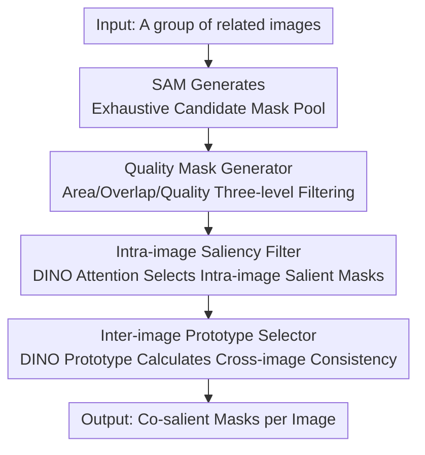

# TF-SSD: A Strong Pipeline via Synergic Mask Filter for Training-free Co-salient Object Detection

**Conference**: CVPR 2026  
**Paper**: [CVF Open Access](https://openaccess.thecvf.com/content/CVPR2026/html/He_TF-SSD_A_Strong_Pipeline_via_Synergic_Mask_Filter_for_Training-free_CVPR_2026_paper.html)  
**Code**: https://github.com/hzz-yy/TF-SSD  
**Area**: Co-salient Object Detection / Visual Foundation Models  
**Keywords**: Co-salient detection, training-free, SAM, DINO, mask filtering

## TL;DR
Without training any network, this method treats massive candidate masks generated by SAM as a "raw material pool." It employs three-level quality filtering, intra-image saliency via DINO attention, and cross-image semantic consistency via DINO prototypes to progressively converge masks into co-salient predictions. It achieves a 13.7% higher F-measure on CoCA compared to the previous training-free SOTA.

## Background & Motivation
**Background**: Co-salient Object Detection (CoSOD) aims to segment the "repeatedly co-occurring salient object" within a set of related images—for instance, extracting the accordion from a group of images all containing accordions. The mainstream approach is training-based: supervised training of a consensus extraction network on annotated closed-set data.

**Limitations of Prior Work**: Supervised methods are restricted by closed-set datasets, leading to limited generalization and a tendency to overfit the category bias of the training set. However, the essence of CoSOD is the "discovery of generalizable visual consensus," creating a fundamental mismatch. The authors also observed that Visual Foundation Models (VFMs) have rarely been systematically explored for CoSOD.

**Key Challenge**: The authors conducted a crucial oracle experiment—if GT is used to guide the selection of the best mask from SAM's top-10 candidates, the segmentation performance on CoCA exceeds all existing SOTA (including fully supervised methods). This indicates that **SAM's segmentation capability is inherently sufficient; the bottleneck is not "segmentation precision" but SAM's lack of semantic understanding to identify which mask represents the cross-image shared salient object.**

**Key Insight**: SAM and DINO are naturally complementary—SAM provides precise boundaries but generates many semanticless fragments, while DINO's self-supervised features/attention maps possess strong semantic consistency for salient objects but offer coarse localization. By combining them, DINO’s semantic guidance resolves SAM’s randomness, while SAM’s precise boundaries refine DINO’s coarse localization.

**Core Idea**: A training-free approach that treats SAM's exhaustive masks as a candidate pool, utilizing DINO-guided progressive filtering across two levels (intra-image visual saliency + inter-image semantic consistency) to obtain co-salient masks.

## Method

### Overall Architecture
TF-SSD is a pure inference progressive pipeline: for each image $I_n$ in a group, SAM (ViT-H) first generates exhaustive candidate masks $M^{raw}_n$, which are then narrowed down through three components. The **Quality Mask Generator (QMG)** reduces hundreds of fragments to a refined set $M^{refine}_n$ (~10) using intrinsic properties like area, overlap, and quality score. The **Intra-image Saliency Filter (ISF)** leverages DINO's [CLS] attention maps to select truly "salient" masks $M^{salient}_n$ (~6) within a single image. Finally, the **Inter-image Prototype Selector (IPS)** extracts a semantic prototype for each mask using DINO, calculates similarity across the entire image group, and selects the mask that "has a counterpart in other images" as the final co-salient prediction $Y$. The chain can be summarized as: candidate explosion → slimming via intrinsic mask attributes → slimming via intra-image saliency → finalization via inter-image consensus.

### Key Designs

**1. Quality Mask Generator (QMG): Removing 90% of noise using intrinsic mask attributes**

SAM produces many tiny, overlapping, and disproportionately sized masks for a single foreground object, most of which are irrelevant to co-saliency. QMG performs three-level progressive filtering based solely on geometric properties without introducing semantics. Level 1 **SAM-based Screening**: Calculates the area ratio $r^{area}_{n,t}=\frac{|m^{raw}_{n,t}|}{H\times W}$ and discards "trivial masks" where $r^{area}_{n,t}<\tau_{area}$ ($\tau_{area}=0.01$). Level 2 **Overlap Filtering**: Sorts masks by area in ascending order and calculates the overlap ratio $\rho_{i\to j}=\frac{|m_{n,i}\cap m_{n,j}|}{|m_{n,j}|}$ for each small mask against larger ones; if the ratio exceeds $\tau_{con}=0.85$, the small mask is removed to avoid redundant representations. Level 3 **Quality Assessment**: Combines SAM's predicted IoU score $IoU^{pred}_{n,t}$ with an area score—since salient objects are typically "medium-sized"—defined as:

$$S^{area}_{n,t}=\begin{cases}1.0 & r_{min}\le r^{area}_{n,t}\le r_{max}\\ r^{area}_{n,t}/r_{min} & r^{area}_{n,t}<r_{min}\\ P(r^{area}_{n,t}) & r^{area}_{n,t}>r_{max}\end{cases}$$

where $P(r^{area}_{n,t})=\max(\sigma,\,1.0-(r^{area}_{n,t}-r_{max})\times\gamma)$ penalizes oversized masks ($[r_{min},r_{max}]=[0.15,0.7]$, $\sigma=0.7,\gamma=1.5$). These are weighted as $S^{ba}_{n,t}=\alpha\cdot IoU^{pred}_{n,t}+\beta\cdot S^{area}_{n,t}$ ($\alpha=0.7,\beta=0.3$), and the top $T_r=10$ masks proceed. This step narrows candidates significantly based solely on "what the mask looks like."

**2. Intra-image Saliency Filter (ISF): Adding "saliency semantics" missing in SAM via DINO attention**

While QMG-filtered masks are high-quality, SAM cannot distinguish "prominent" objects from background fragments. The authors utilize the proven phenomenon that DINO's [CLS] token attention maps highlight salient objects without supervision. Specifically, attention maps $A_n\in[0,1]^{h\times w}$ are extracted from the DINO ViT encoder. For each candidate $m^{refine}_{n,t}$, the saliency score is calculated as the mean response in high-attention regions:

$$s^{sal}_{n,t}=\frac{1}{|m^{refine}_{n,t}|}\sum A_n(x,y)\odot m^{refine}_{n,t}(x,y)$$

Higher overlap with salient regions yields a higher score. The top $T=6$ masks are kept as $M^{salient}_n$. This step upgrades "geometrically clean" masks to "semantically prominent" ones.

**3. Inter-image Prototype Selector (IPS): Finalizing "what is shared" via cross-image prototype similarity**

ISF identifies prominence within a single image, but an image may contain multiple salient objects. IPS determines the "shared" object using consensus across the image group. It extracts semantic prototypes $p_{n,t}=F(I_n\odot m_{n,t})$ (using DINO [CLS] tokens) into $P\in\mathbb{R}^{NT\times d}$ and computes a pairwise cosine similarity matrix $C=\frac{PP^\top}{\|P\|^2}$. The scoring mechanism **excludes intra-image similarities** and, for each prototype, computes the **maximum** similarity in every other image, summing these $N-1$ values for the co-saliency score $s^{co}=\sum_{n=1}^{N-1}C_{N-1max}[:,n]$. Using "maximum" instead of "average" ensures that a strong match with a similar object in another image confirms semantic relevance, whereas an average would be diluted by irrelevant masks.

## Key Experimental Results

### Main Results
Evaluated on three benchmarks (CoCA / CoSal2015 / CoSOD3k) against Supervised (S), Unsupervised (U), and Training-free (TF) methods.

| Method | Type | CoCA $F_\beta$↑ | CoCA $S_\alpha$↑ | CoSal2015 $F_\beta$↑ | CoSal2015 $S_\alpha$↑ |
|------|------|------|------|------|------|
| GCoNet+ (TPAMI23) | S | 0.637 | 0.738 | 0.891 | 0.881 |
| VCP (CVPR25) | S | 0.680 | 0.774 | 0.920 | 0.911 |
| SCoSPARC (ECCV24) | U | 0.614 | 0.711 | 0.869 | 0.851 |
| ZS-CoSOD (ICASSP24) | TF | 0.549 | 0.667 | 0.799 | 0.785 |
| **TF-SSD (Ours)** | TF | **0.686** | **0.763** | **0.899** | **0.890** |

Compared to previous training-free SOTA (ZS-CoSOD), TF-SSD improves $F^{max}_\beta$ by +13.7% on CoCA. It also matches or exceeds some fully supervised methods.

### Ablation Study
Component-wise ablation on CoCA (baseline = QMG-1 + IPS).

| Configuration | CoCA $F_\beta$↑ | CoCA $S_\alpha$↑ | Description |
|------|------|------|------|
| QMG-1 + IPS | 0.447 | 0.578 | SAM noise is too high with only initial screening |
| + QMG-2 | 0.497 | 0.650 | Added overlap filtering to remove redundancy |
| + QMG-3 | 0.522 | 0.634 | Added quality assessment |
| + ISF (Full) | **0.686** | **0.763** | DINO saliency boosts performance to SOTA |

### Key Findings
- **ISF (DINO attention) provides the largest single gain**: It improves $F^{max}_\beta$ by 16.4% on CoCA, confirming that DINO compensates for SAM's lack of saliency semantics.
- **The "Max" strategy in IPS is critical**: Using maximum similarity instead of average is vital for semantic matching (+12.4% $F_\beta$ on CoSal2015).
- **$T=6$ is the sweet spot**: Too many masks introduce noise, while too few cause over-filtering, representing a typical recall/noise trade-off.
- The pipeline requires no training and runs on a single RTX 4090.

## Highlights & Insights
- **Goal-oriented design through Oracle experiments**: By proving SAM's upper bound exceeds SOTA, the authors redefined the problem from "how to segment" to "how to select," leading to a logical and effective design.
- **Complementary VFM Paradigm**: Combining SAM for boundaries and DINO for semantics into a training-free pipeline outperforms supervised methods, showcasing that the synergy of foundation models can surpass task-specific training.
- **Progressive Tri-level Filtering**: Geometry → Saliency → Consensus. Each level uses distinct information sources to narrow the search space, a strategy applicable to other tasks involving "candidate explosion."

## Limitations & Future Work
- The performance ceiling is locked by SAM/DINO; if SAM fails to generate the co-salient object, the pipeline cannot recover it.
- Numerous manual hyperparameters (e.g., $\tau_{area}, \tau_{con}, r_{min}, r_{max}, T$). Their robustness across datasets requires further exploration.
- IPS assumes a single shared category per group; its performance in scenarios with multiple co-occurring categories is unverified.
- Inference requires running SAM and DINO per image, which involves significant computational overhead despite the lack of training.

## Related Work & Insights
- **vs. ZS-CoSOD (ICASSP24, TF)**: ZS-CoSOD uses VFMs to generate group prompts for SAM; TF-SSD reverses this by letting SAM exhaustive search and using DINO for filtering. Placing semantic understanding at the filtering stage proves more effective (+13.7% $F_\beta$ on CoCA).
- **vs. VCP (CVPR25, Supervised)**: VCP requires parameter-efficient fine-tuning; TF-SSD approaches its performance without any training.
- **vs. SCoSPARC (ECCV24, Unsupervised)**: While neither uses labels, SCoSPARC requires two-stage self-supervised training; TF-SSD eliminates training entirely.

## Rating
- Novelty: ⭐⭐⭐⭐ (Redefining the problem via oracle experiments + SAM/DINO complementary paradigm)
- Experimental Thoroughness: ⭐⭐⭐⭐ (Three benchmarks and comprehensive ablations)
- Writing Quality: ⭐⭐⭐⭐ (Clear motivation and logical derivation)
- Value: ⭐⭐⭐⭐ (High practicality as a strong training-free baseline)

<!-- RELATED:START -->

## Related Papers

- [\[CVPR 2026\] Generalizable Co-Salient Object Detection via Mixed Content-Style Modulation](generalizable_co-salient_object_detection_via_mixed_content-style_modulation.md)
- [\[CVPR 2026\] Training-Free Open-Vocabulary Camouflaged Object Segmentation via Fine-Grained Object Binding and Adaptive Hybrid Prompt](training-free_open-vocabulary_camouflaged_object_segmentation_via_fine-grained_o.md)
- [\[CVPR 2026\] INSID3: Training-Free In-Context Segmentation with DINOv3](insid3_training-free_in-context_segmentation_with_dinov3.md)
- [\[CVPR 2026\] Uncertainty-Aware Modality Fusion for Unaligned RGB-T Salient Object Detection](uncertainty-aware_modality_fusion_for_unaligned_rgb-t_salient_object_detection.md)
- [\[CVPR 2025\] Visual Consensus Prompting for Co-Salient Object Detection](../../CVPR2025/segmentation/visual_consensus_prompting_for_co-salient_object_detection.md)

<!-- RELATED:END -->
