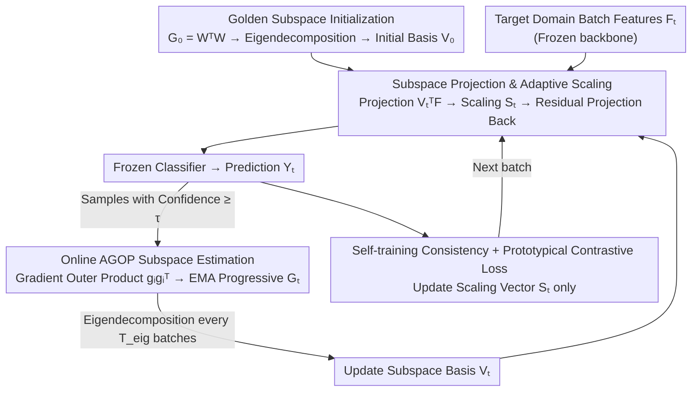

# The Golden Subspace: Where Efficiency Meets Generalization in Continual Test-Time Adaptation

**Conference**: CVPR 2026  
**arXiv**: [2603.21928](https://arxiv.org/abs/2603.21928)  
**Code**: [https://github.com/AIGNLAI/GOLD](https://github.com/AIGNLAI/GOLD)  
**Area**: Continual Test-Time Adaptation / Domain Adaptation  
**Keywords**: Continual Test-Time Adaptation, Golden Subspace, AGOP, Low-Rank Adaptation, Classifier Row Space

## TL;DR

The GOLD framework is proposed for Continual Test-Time Adaptation (CTTA). The core discovery is that the minimal feature update subspace ("Golden Subspace") aligns with the row space of classifier weights and is naturally low-rank. By estimating this subspace online via Average Gradient Outer Product (AGOP) and performing feature adaptation with lightweight scaling vectors, the method achieves SOTA performance on classification and segmentation benchmarks with extremely low computational overhead.

## Background & Motivation

**Background**: Continual Test-Time Adaptation (CTTA) requires models to continuously adapt online to an evolving stream of unlabeled target data during deployment, without revisited access to source data. Representative methods include CoTTA (teacher-student framework + random weight restoration), PETAL (parameter restoration regularization), RMT/SANTA (feature-level consistency), and DSS (pseudo-label filtering).

**Limitations of Prior Work**: CTTA faces a fundamental trade-off between efficiency and generalization. While updating more parameters enhances adaptation capability, it significantly degrades online inference efficiency and amplifies pseudo-label noise and parameter drift. As shown in Fig. 1(b), existing methods experience significant performance drops ("golden-shaded intervals") upon the arrival of new domains, failing to adapt rapidly while maintaining generalization.

**Key Challenge**: The ideal goal is to achieve the required output changes within a feature subspace (ensuring generalization) while minimizing the magnitude of updates (ensuring efficiency). The key questions are: Does this "minimal subspace" exist? How can it be defined and maintained?

**Goal**: (1) Prove the existence of the "Golden Subspace"—where the minimal feature update subspace coincides with the classifier weight row space and is low-rank; (2) Identify a method to estimate this subspace online without retraining the classifier; (3) Design a practical lightweight adaptation framework.

**Key Insight**: The authors conduct an algebraic analysis of the optimal solution for single-step adaptation. For a frozen classifier $W$ and desired output correction $\Delta Y$, the solution for the minimal-norm feature update is $\Delta F^* = \Delta Y (W^\top)^\dagger$, whose rank is constrained by $\text{rank}(W^\top W)$. In classification tasks, this equals the number of classes, which is much smaller than the feature dimension. This implies that only a few directions defined by the classifier are sufficient to modify the entire batch's predictions.

**Core Idea**: The low-rank row space in the feature space defined by classifier weights is the minimal effective adaptation subspace (Golden Subspace), which can be estimated online using AGOP and maintained efficiently.

## Method

### Overall Architecture

GOLD aims to answer a very specific question: in CTTA, in which direction and by how much should the model be updated to track the new domain without compromising online efficiency? Its answer is to constrain all updates within a low-rank subspace determined by the classifier geometry. The framework is built upon a **frozen** pre-trained feature extractor. For each incoming target domain batch, it alternates between two steps: first, fine-tuning the current batch features within the "Golden Subspace" using a minimal scaling vector (Adapt), and then online refinement of the subspace estimation itself using high-confidence samples from the batch (Update). The former handles real-time adaptation, while the latter allows the subspace to gradually shift towards the target domain. Both steps proceed iteratively without modifying the backbone or retraining the classifier.

### Key Designs

**1. Theoretical Proof and Initialization of the Golden Subspace: Dimensioning the "Minimal Effective Update Direction"**

The core dilemma of CTTA is that more updates allow for better adaptation but lead to worse efficiency and larger drift. The authors reverse-engineer this by identifying the "most economical update." Given a frozen classifier $W \in \mathbb{R}^{C \times L}$, the analytical solution for the minimal-norm feature update required to achieve an output correction $\Delta Y$ is $\Delta F^* = \Delta Y (W^\top)^\dagger$. By performing SVD on $W^\top = V \Sigma U^\top$, it is evident that this optimal update is strictly confined within the subspace spanned by the lead eigenvectors of $W$, where $\text{rank}(\Delta F^*) \leq \text{rank}(W^\top W)$. In classification, this rank equals the number of classes $C$, which is typically much smaller than the feature dimension $L$. Consequently, pushing features along these few directions defined by the classifier suffices to rewrite predictions for the whole batch, rendering full-parameter updates unnecessary. This establishes a theoretical foundation for the "Golden Subspace" and explains why such a constraint naturally suppresses parameter drift and pseudo-label noise. In practice, the auxiliary matrix is initialized as $G_0 = W^\top W$, starting the subspace from the source domain geometry of the classifier.

**2. AGOP Online Subspace Estimation: Tracking Subspace Drift Without Classifier Retraining**

Relying solely on the source $W^\top W$ is insufficient, as it only encodes source information and misses "confusing" new directions introduced by the target domain. Since the classifier is frozen, it cannot be updated via retraining. The authors leverage the AGOP theorem: in trained networks, the spectral structure of layer weights is proportional to the mean of the gradient outer products of samples. Thus, the geometry can be approximated using gradient outer products. In CTTA, a gradient proxy $g_i = \nabla_{f_i}(\max_c h_\psi(f_i)_c)$ is calculated only for high-confidence samples ($\max_c \text{Softmax}(Y)_{i,c} \geq \tau$), forming the batch AGOP:

$$\hat{G}_t^{(b)} = \frac{1}{|\mathcal{M}_t|} \sum_{i \in \mathcal{M}_t} g_i g_i^\top,$$

This is integrated with historical estimates via EMA: $G_t = (1-\alpha) G_{t-1} + \alpha \hat{G}_t^{(b)}$. Every $T_\text{eig}$ batches, an eigendecomposition is performed to extract the top $r$ eigenvectors as the current subspace basis $V_t$. Thus, gradient directions serve as an unsupervised proxy for the classifier, reflecting the response directions of target samples and implicitly re-injecting target domain information into the subspace.

**3. Subspace Projection and Adaptive Scaling: Compressing Learnable Parameters to $r$**

With the subspace basis $V_t$, feature adaptation becomes extremely lightweight. For a feature $f \in \mathbb{R}^L$, it is first projected into the subspace to obtain coordinates $u = V_t^\top f \in \mathbb{R}^r$. Element-wise scaling is applied to each coordinate, followed by a residual mapping back to the original space:

$$\mathcal{A}(f) = f + V_t\big(S_t \odot (V_t^\top f)\big),$$

In matrix form for a batch: $F_t^\text{adapt} = F_t + (S_t \odot (F_t V_t)) V_t^\top$. The only learnable parameters are the scaling vector $S_t \in \mathbb{R}^r$ (typically $r = 64$ in experiments). This design offers three benefits: when $S_t = 0$, the transformation defaults to an identity mapping, ensuring adaptation starts from a safe baseline; having only $r$ parameters (compared to thousands in BN or millions in full networks) virtually eliminates overfitting and drift; and the projection operation ensures all updates occur within the theoretical Golden Subspace.

### Loss & Training

The total loss is $\mathcal{L} = \lambda_\text{trg} \mathcal{L}_\text{st} + \lambda_\text{cont} \mathcal{L}_\text{cont}$:

- **Self-training Consistency Loss**: Uses an EMA teacher model to calculate SCE loss for both the original and augmented views: $\mathcal{L}_\text{st} = \frac{1}{2} \text{SCE}(Y_t, Y_t^\text{ema}) + \frac{1}{2} \text{SCE}(Y_t^+, Y_t^\text{ema})$.
- **Prototypical Contrastive Loss**: Source domain class prototypes $P_c$ are pre-computed and frozen. For each sample, the nearest prototype is identified, and an InfoNCE loss is used to pull both original and augmented features toward the corresponding prototype: $\mathcal{L}_\text{cont} = -\frac{1}{2|\mathcal{B}|} \sum_{i} [\log \frac{\exp(\text{sim}(f_i, P_{k(i)})/\kappa)}{\sum_c \exp(\text{sim}(f_i, P_c)/\kappa)} + \text{augmented view term}]$.
- Gradients only update the scaling vector $S_t$ and a small number of BN parameters.

## Key Experimental Results

### Main Results

Online classification error rates (%) for CIFAR10/100-C and ImageNet-C (severity 5):

| Method | CIFAR10-C | CIFAR100-C | ImageNet-C |
|--------|-----------|------------|------------|
| TENT | 20.7 | 60.9 | 62.6 |
| CoTTA | 16.2 | 32.5 | 62.7 |
| SANTA | 16.1 | 30.4 | 60.1 |
| OBAO | 14.6 | 29.5 | 59.6 |
| **GOLD** | **14.1** | **28.6** | **59.3** |

mIoU (%) on CarlaTTA semantic segmentation:

| Method | day2night | clear2fog | clear2rain | highway |
|--------|-----------|-----------|------------|---------|
| Source | 58.4 | 52.8 | 71.8 | 24.7 |
| CoTTA | 61.4 | 56.8 | 70.7 | 33.8 |
| **GOLD** | **61.8** | **57.1** | 71.0 | **34.5** |

### Ablation Study

| $W^\top W$ Init | AGOP Update | $\mathcal{L}_\text{cont}$ | CIFAR10-C | CIFAR100-C | ImageNet-C |
|:---:|:---:|:---:|-----------|------------|------------|
| - | - | - | 16.24 | 29.87 | 62.45 |
| ✓ | - | - | 15.11 | 29.15 | 60.24 |
| ✓ | ✓ | - | 15.06 | 28.77 | 59.87 |
| - | ✓ | ✓ | 14.32 | 28.61 | 59.52 |
| ✓ | ✓ | ✓ | **14.12** | **28.56** | **59.32** |

### Key Findings

- **$W^\top W$ initialization provides significant gains**: CIFAR10-C error dropped from 16.24 to 15.11, validating that the classifier row space is an effective adaptation direction.
- **AGOP online updates provide further improvements**, complementing the initialization by injecting target domain information.
- **Contrastive loss contribution is most notable on CIFAR10-C** (15.06 → 14.12), indicating that prototypical anchoring is crucial for preventing drift on small datasets.
- **Spectral energy of AGOP is highly concentrated**: The top 64-128 eigenvectors capture >99% of the energy, confirming the low-rank nature of the Golden Subspace.
- **Inference Efficiency is extremely high**: GOLD processes batches in ~0.25s, comparable to the fastest SANTA method but with significantly better performance.
- **Effectiveness in segmentation**: GOLD outperforms CoTTA by 0.7% in the CarlaTTA "highway" scenario, which involves both covariate and label distribution shifts.

## Highlights & Insights

- **Theory-driven algorithm design**: Starting from the proof of a "low-rank Golden Subspace" and using AGOP to estimate it online, the framework is logically consistent, blending theory with practice seamlessly.
- **Only 64 learnable parameters for adaptation**: Using $S_t \in \mathbb{R}^{64}$ makes GOLD one of the methods with the fewest parameters in CTTA while achieving peak performance. This "constraint as regularization" approach naturally prevents overfitting and drift.
- **AGOP as an unsupervised proxy for the classifier** is a major methodological contribution. it provides a way to implicitly capture the geometric structure of classifier weights from gradient information without labels.
- **Residual scaling design**: The logic ensures that at $S_t = 0$, the model performs as the identity, guaranteeing that adaptation does not degrade performance relative to the non-adapted baseline in the worst case.

## Limitations & Future Work

- Computational overhead of eigendecomposition every $T_\text{eig}$ steps needs further analysis for cases where feature dimension $L$ is very large.
- Experiments focus on severity 5; performance under lower severities has not been reported to verify advantages in mild domain shifts.
- Frozen source prototypes $P_c$ may not serve as ideal anchors if target domain label distributions shift severely.
- Comparisons with prompt-based adaptation methods (e.g., VPT, Adapter-TTA) are missing.
- AGOP relies on high-confidence samples, which may fail in cases of extreme domain shift where all samples are low-confidence.

## Related Work & Insights

- **vs CoTTA**: While CoTTA uses teacher-student setups and random restoration to prevent forgetting, updating the entire network is inefficient and prone to drift. GOLD's theoretical constraint to a low-rank subspace offers better stability and efficiency.
- **vs TENT/EATA/SAR**: These methods adapt via entropy minimization or BN statistics but lack theoretical guidance on which directions to update. GOLD's subspace directly identifies target directions.
- **vs RFM/AGOP Theoretical Work**: AGOP was originally used for interpretability in feature learning; GOLD is the first to apply it to online TTA, linking gradient outer products with classifier geometry.

## Rating

- Novelty: ⭐⭐⭐⭐⭐ The formalization of the "Golden Subspace" combined with AGOP estimation is highly original.
- Experimental Thoroughness: ⭐⭐⭐⭐ Covers multiple classification and segmentation benchmarks with ablation, though missing diverse severity levels.
- Writing Quality: ⭐⭐⭐⭐⭐ Extremely fluid narrative from theory to design to verification.
- Value: ⭐⭐⭐⭐⭐ Provides both a theoretical foundation and a highly efficient practical solution for CTTA.

<!-- RELATED:START -->

## Related Papers

- [\[CVPR 2026\] Test-Time Multi-Prompt Adaptation for Open-Vocabulary Remote Sensing Image Segmentation](test-time_multi-prompt_adaptation_for_open-vocabulary_remote_sensing_image_segme.md)
- [\[CVPR 2026\] Mixture of Prototypes for Test-time Adaptive Segmentation](mixture_of_prototypes_for_test-time_adaptive_segmentation.md)
- [\[ICCV 2025\] Hybrid-TTA: Continual Test-time Adaptation via Dynamic Domain Shift Detection](../../ICCV2025/segmentation/hybrid-tta_continual_test-time_adaptation_via_dynamic_domain_shift_detection.md)
- [\[ICCV 2025\] TopoTTA: Topology-Enhanced Test-Time Adaptation for Tubular Structure Segmentation](../../ICCV2025/segmentation/topotta_topology-enhanced_test-time_adaptation_for_tubular_structure_segmentatio.md)
- [\[CVPR 2026\] BiPA: Bilevel Prompt Adaptation for Underwater Instance Segmentation](bipa_bilevel_prompt_adaptation_for_underwater_instance_segmentation.md)

<!-- RELATED:END -->
