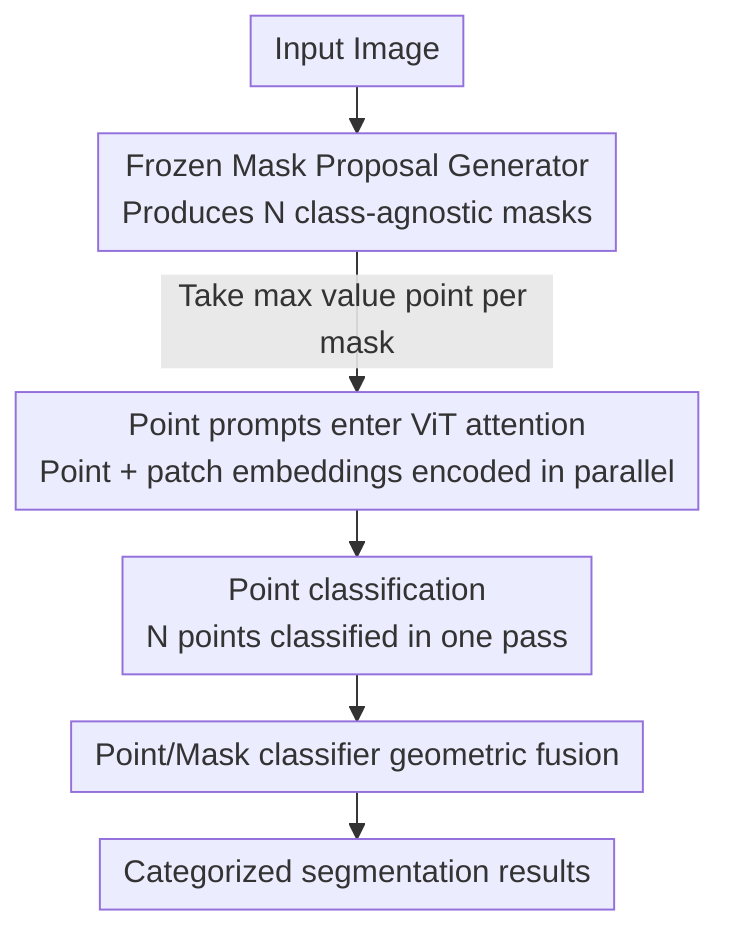

# The Missing Point in Vision Transformers for Universal Image Segmentation

**Conference**: CVPR 2026  
**Paper**: [CVF Open Access](https://openaccess.thecvf.com/content/CVPR2026/html/Shahabodini_The_Missing_Point_in_Vision_Transformers_for_Universal_Image_Segmentation_CVPR_2026_paper.html)  
**Code**: https://github.com/sajjad-sh33/ViT-P  
**Area**: Universal Image Segmentation  
**Keywords**: Universal Segmentation, Mask Classification, ViT Adapter, Point Prompt, Labeling Cost

## TL;DR
This paper argues that the bottleneck of current mask segmentation models (Mask2Former/OneFormer, etc.) lies in mask classification rather than mask generation. It proposes ViT-P—a two-stage framework that decouples mask generation from classification: a frozen proposal generator produces class-agnostic masks, and a ViT-based "point classifier" classifies the maximum value point of each mask. It achieves SOTA on multiple benchmarks, including 54.0 PQ on ADE20K Panoptic and 87.4 mIoU on Cityscapes Semantic.

## Background & Motivation
**Background**: Since MaskFormer, the dominant segmentation paradigm has shifted from "per-pixel classification" to "mask classification"—where the model predicts a set of binary masks, each assigned a category label. Models like Mask2Former, OneFormer, and InternImage have iteratively improved this path, achieving high mask quality.

**Limitations of Prior Work**: The authors observe a widely overlooked fact—these models "generate masks well but classify them incorrectly." When object boundaries are blurry or class distributions are imbalanced, masks are frequently mislabeled, which directly degrades overall segmentation metrics. The paper provides a compelling figure: InternImage achieves only 62.9% mIoU on ADE20K semantic segmentation, but if its generated masks are "perfectly classified" (upper bound) using ground-truth labels, the mIoU jumps to 87%. This 24-point gap stems almost entirely from classification rather than the masks themselves.

**Key Challenge**: Existing mask segmentation models use the same per-segment embedding for both mask generation and category prediction, forcing two tasks into a single transformer decoder. Since mask generation requires spatial detail and classification requires semantic discrimination, the classification capability is suppressed when sharing representations—this is the bottleneck referred to as "The Missing Point."

**Key Insight**: Instead of classifying the entire mask, it is better to focus on a single pixel—the "maximum value point" inside the mask. This point typically resides near the object center, far from blurry boundaries, making it more reliable for classification. If this point is correctly classified, the category of the entire mask is usually correct. Upper bound experiments confirmed that using the label of the maximum value point in ground-truth masks achieves the upper bound, proving it is indeed a "decisive point."

**Core Idea**: Completely decouple mask generation and classification. The first stage uses a frozen proposal generator to produce class-agnostic masks. The second stage uses a dedicated, ViT-based point classifier (ViT-P) to classify the maximum value point of each mask. This acts as a plug-and-play, training-free adapter specifically targeting the "missing classification point."

## Method

### Overall Architecture
ViT-P is a two-stage universal segmentation framework. The **input** is an image, and the **output** is a set of categorized segmentation masks (unified for semantic/instance/panoptic). In the first stage, a **frozen mask proposal generator** (e.g., OneFormer or InternImage) produces $N$ class-agnostic mask proposals; the coordinates of the "maximum value point" are extracted for each mask. In the second stage, the **ViT-P point classifier** takes these $N$ point locations as input prompts, processing them alongside image patches in a standard ViT encoder to output categories for the $N$ points (and thus $N$ masks) in a single parallel pass. During inference, the classification probabilities from ViT-P and the original mask generator are fused geometrically.

The essence of the framework is that the mask generator remains frozen, while ViT-P acts as a **pre-training-free adapter** to repair the classification link.

### Key Designs

**1. Decoupling Mask Generation and Point Classification: Preventing Classification from being Dragged Down**

This design directly addresses the "good masks, bad classification" pain point. Traditional models use per-segment embeddings for both tasks; ViT-P isolates classification and narrows the target from the "entire mask" to the "maximum value point" pixel inside the mask. Why the maximum value point? Because in pixel-wise score maps, this point almost always falls at the object center, far from boundaries, representing the purest semantic location. Ablation studies (Table 4b) show that classifying random points yields only 58.7 mIoU, while central or maximum value points reach 59.7 mIoU, with the latter avoiding extra "center-finding" calculations.

**2. ViT-P Point Prompt Architecture: Parallel Classification of N Masks via Attention**

Standard ViT outputs a single category for an entire image, which cannot directly label $N$ points. ViT-P prepends $N$ **point embeddings** to the patch embedding sequence. The image is patched into $x_I \in \mathbb{R}^{N'\times D}$, and normalized point coordinates are mapped via a linear point encoder to $x_p \in \mathbb{R}^{N\times D}$. These are concatenated into a sequence $z = [x_p^1;\dots;x_p^N;\,x_I^1;\dots;x_I^{N'}]$. Point embeddings participate in global attention, allowing them to perceive global context while remaining distinct. The output features for each point are passed through an MLP head to obtain probabilities $C_p \in \mathbb{R}^{N\times K}$. This allows a single forward pass to classify all $N$ masks efficiently.

Crucially, it is a **pre-training-free adapter**: except for the point embedding layer and MLP head, all parameters are inherited from off-the-shelf pre-trained ViTs. Even the position embeddings of the CLS token are reused for point tokens. This means any advanced ViT can be integrated into dense prediction tasks without architectural changes or massive point-annotated data. Ablations (Table 4c) show DINOv2 performs best (59.7 mIoU), but even plain ViT reaches 58.8, demonstrating strong adaptability.

**3. Synergistic Training with Three Annotation Types: Enhancing Classification with Cheap Labels**

Fine-grained annotation of an object takes 1–2 minutes, which is extremely expensive, yet classification does not require such precise boundaries. The authors designed a synergy of three annotation levels: **fine annotations** use ground-truth masks for precise point sampling; **coarse annotations** use rough regions and are much faster; **box annotations** are the fastest (~10s per object) and are used only for pre-training. In pre-training, box coordinates $[x,y,w,h]$ are fed to learn object location and scale. The workflow is "pre-train with boxes, then fine-tune with points (fine or coarse)." To bridge the input format gap, points $(x,y)$ are represented as $[x,y,0,0]$ (degenerate boxes with zero width/height) during fine-tuning. On Cityscapes, "fine + coarse" annotations (Table 4d) outperformed "fine only" by 0.5 mIoU, proving cheap labels can improve classification at almost no cost.

**4. Geometric Fusion of Point/Mask Classifiers: Best of Both Worlds**

ViT-P and the original mask generator have complementary strengths. The authors found that fusing them is the most robust approach. During inference, the category probability $C_m$ from the mask generator (after removing "no object" $\varnothing$) and $C_p$ from ViT-P are integrated:

$$C_{\text{fuse}} = C_m^{(1-\alpha)} \cdot C_p^{\alpha}$$

where $\alpha$ (0.4 in experiments) balances the weights. The $\varnothing$ token is appended back after fusion to maintain compatibility with dropping invalid masks in instance/panoptic segmentation. This ensures ViT-P supplements rather than simply replaces the original head.

### Loss & Training
Training uses SGD + 1000-step warmup + cosine schedule, learning rate $1\times10^{-2}$, and gradient clipping with a norm of 1. COCO is trained for 30 epochs, while ADE20K/Cityscapes are trained for 60 epochs. Crop sizes are $518\times518$ for COCO/ADE20K and $518\times1036$ for Cityscapes. The mask generator is **frozen** throughout, and only ViT-P is trained. Notably, **random points** are sampled inside masks during training for robustness, whereas maximum value points are used only during inference.

## Key Experimental Results

### Main Results
Validated on ADE20K, Cityscapes, and COCO/COCO-Stuff-164K across semantic, instance, and panoptic tasks. Selected results (gains after adding ViT-P):

| Dataset / Task | Metric | Mask Generator | Before ViT-P | After ViT-P | Gain |
|--------------|------|-----------|------------|------------|------|
| ADE20K Panoptic | PQ | OneFormer†(DiNAT-L) | 53.4 | 54.0 | +0.6 |
| ADE20K Semantic (m.s.) | mIoU | OneFormer†(DiNAT-L) | 58.8 | 59.9 | +1.1 |
| ADE20K Semantic (best) | mIoU | Mask2Former†(InternImage-H) | 62.9 | 63.6 | +0.7 |
| Cityscapes Semantic (m.s.) | mIoU | Mask2Former†(InternImage-H) | 87.0 | 87.4 | +0.4 |
| Cityscapes Instance | AP | OneFormer†(ConvNeXt-L) | 48.7 | 49.0 | +0.3 |
| COCO-Stuff-164K Semantic | mIoU | Mask2Former(InternImage-H) | 52.6 | 53.5 | +0.9 |

ViT-P sets new SOTA benchmarks (e.g., 54.0 PQ on ADE20K, 87.4 mIoU on Cityscapes) and provides consistent gains across various mask generators.

### Ablation Study

| Configuration | Key Metric (ADE20K, OneFormer) | Description |
|------|------|------|
| Full Model (N=250, Max Point, DINOv2) | 54.0 PQ / 40.7 AP / 59.7 mIoU | Default settings |
| Random points for inference | 53.4 PQ / 40.4 AP / 58.7 mIoU | Drops 1.0 mIoU without max point |
| Center points for inference | 54.0 PQ / 40.6 AP / 59.7 mIoU | Parity with max point but costlier |
| Backbone: plain ViT | 53.4 PQ / 40.2 AP / 58.8 mIoU | Still effective but weaker than DINOv2 |
| N=50 (fewer points) | 53.4 PQ / 40.3 AP / 58.6 mIoU | Reduced training quality |
| Cityscapes: Fine annotations only | 69.8 PQ / 48.5 AP / 84.4 mIoU | 0.5 mIoU lower than "Fine+Coarse" |

### Key Findings
- **Classification is the bottleneck**: The upper bound experiment (62.9 → 87 mIoU) reveals a ~24-point "classification gap," which is the most striking discovery and explains why fixing classification alone yields significant gains.
- **Point selection matters**: Random points underperform max/center points by 1.0 mIoU, indicating that "which point to classify" is more important than classifying the whole mask.
- **Free gains from coarse labels**: "Fine + Coarse" on Cityscapes outperforms "Fine only" by 0.5 mIoU, even though coarse/box labels take a fraction of the time.
- **Saturation of input points**: Gains plateau beyond N=250, suggesting that this number is sufficient for mask coverage.

## Highlights & Insights
- **Redefining the bottleneck**: The biggest "Aha!" moment is the simple upper bound experiment that redirects community attention from "mask quality" back to "mask classification"—framing the problem this way is arguably more valuable than the method itself.
- **Max value point as a cheap and accurate proxy**: Compressing mask classification to the single most "pure" pixel reduces computation while avoiding boundary ambiguity.
- **Engineering-friendly adapter**: By freezing the mask generator and reusing CLS position embeddings, ViT-P allows any new, powerful ViT backbone to improve legacy segmentation models with minimal friction.
- **Labeling cost perspective**: The trick of unifying box and point annotations via $[x,y,0,0]$ allows cheap labels to meaningfully contribute to high-end performance, which is highly practical for industrial budgets.

## Limitations & Future Work
- **Dependency on the mask generator**: ViT-P only fixes classification; mask quality is still limited by the frozen generator. Errors like misses or boundary mistakes cannot be corrected.
- **Two-stage inference overhead**: Adding ViT-P increases parameter count (~90M for OneFormer+ViT-P) and FLOPs. ⚠️ End-to-end latency benchmarks are missing.
- **Sensitivity of $\alpha$**: The fusion weight $\alpha=0.4$ was determined experimentally; its optimality across all tasks/datasets was not deeply explored.
- **Moderate gains**: While consistent, most improvements are between +0.3 and +1.3 points, still far from closing the massive 24-point gap identified in the upper bound.

## Related Work & Insights
- **vs Mask2Former / MaskFormer**: These treat segmentation as "mask classification" in a coupled transformer decoder. ViT-P identifies this coupling as a weakness and decouples it with a point-based classifier.
- **vs OneFormer**: ViT-P uses OneFormer as a frozen component, acting as an enhancement layer rather than a competitor.
- **vs Mask-DINO / OpenSeeD**: These use boxes to improve mask generation. ViT-P instead uses boxes/coarse labels to enhance **classification** and lower costs.
- **vs ViT-Adapter**: While both add capabilities to ViT for dense prediction, ViT-Adapter focuses on spatial priors in features, while ViT-P uses point prompts for classification with a focus on being pre-training-free.

## Rating
- Novelty: ⭐⭐⭐⭐ Reframing the bottleneck and using point prompts for mask classification is a novel perspective; the components themselves are elegant and simple.
- Experimental Thoroughness: ⭐⭐⭐⭐ Strong coverage across tasks/datasets, though lacks inference latency comparisons.
- Writing Quality: ⭐⭐⭐⭐ Clear motivation, very persuasive use of upper bound analysis.
- Value: ⭐⭐⭐⭐ Plug-and-play and label-cost friendly, offering direct utility for enhancing existing models.

<!-- RELATED:START -->

## Related Papers

- [\[CVPR 2026\] MPM: Mutual Pair Merging for Efficient Vision Transformers](mpm_mutual_pair_merging_for_efficient_vision_transformers.md)
- [\[CVPR 2026\] GeomPrompt: Geometric Prompt Learning for RGB-D Semantic Segmentation Under Missing and Degraded Depth](geomprompt_rgbd_segmentation.md)
- [\[ECCV 2024\] UniFS: Universal Few-Shot Instance Perception with Point Representations](../../ECCV2024/segmentation/unifs_universal_few-shot_instance_perception_with_point_representations.md)
- [\[ICLR 2026\] Revisiting \[CLS\] and Patch Token Interaction in Vision Transformers](../../ICLR2026/segmentation/revisiting_cls_and_patch_token_interaction_in_vision_transformers.md)
- [\[CVPR 2026\] ReSAM: Refine, Requery, and Reinforce: Self-Prompting Point-Supervised Segmentation for Remote Sensing Images](resam_refine_requery_and_reinforce_self-prompting_point-supervised_segmentation_.md)

<!-- RELATED:END -->
