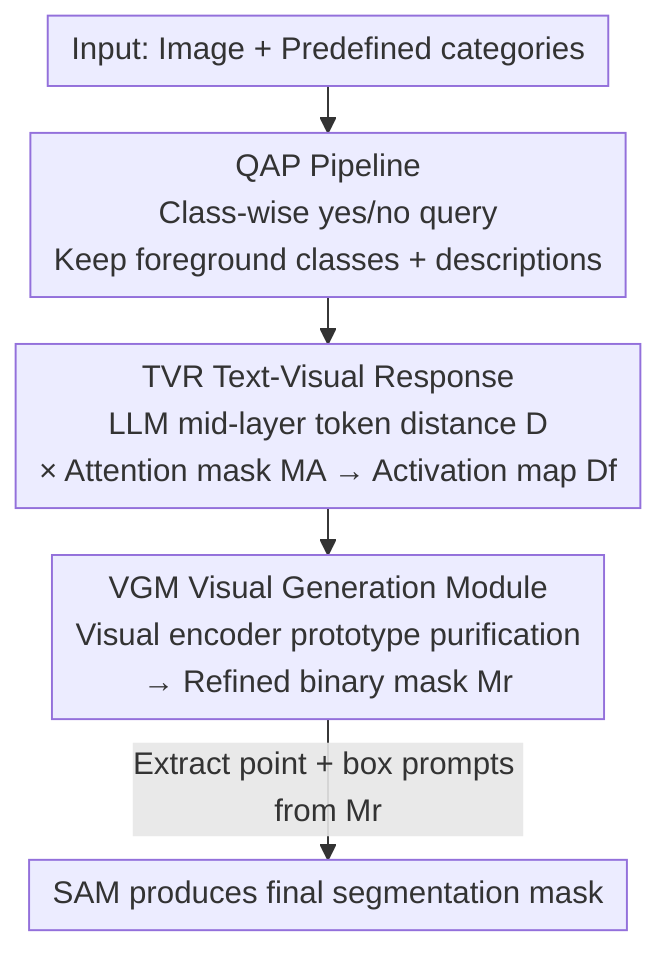

# The Power of Prior: Training-Free Open-Vocabulary Semantic Segmentation with LLaVA

**Conference**: CVPR 2026  
**Paper**: [CVF Open Access](https://openaccess.thecvf.com/content/CVPR2026/html/Zhang_The_Power_of_Prior_Training-Free_Open-Vocabulary_Semantic_Segmentation_with_LLaVA_CVPR_2026_paper.html)  
**Code**: https://github.com/zbf1991/FSeg-LLaVA  
**Area**: Open-Vocabulary Segmentation / Multimodal VLM  
**Keywords**: Training-free, Open-vocabulary semantic segmentation, MLLM Prior, LLaVA, SAM Prompting

## TL;DR
Treating a frozen LLaVA as a segmenter: through structured question-answering, it is prompted to "acknowledge" which classes are present in the image. Activation regions are then back-traced from the visual-category token distances in the LLM's intermediate layers. Finally, high-confidence regions purified by prototypes are fed as point/box prompts to SAM. Without any training, this method establishes a new SOTA on VOC21 (68.0% mIoU) and COCO-Object (42.0%).

## Background & Motivation
**Background**: Training-free open-vocabulary semantic segmentation (OVSS) is currently dominated by the CLIP family of methods. These approach the task by calculating the embedding distance between image patches and category text sequences using a frozen CLIP, assigning patches to the closest category, and then employing various techniques (re-calibrating patch self-correlation, introducing external visual priors like DINO/SAM) to enhance patch representations.

**Limitations of Prior Work**: The CLIP-based route faces two inherent flaws. First, to distinguish foreground from background, one must **explicitly provide background sub-class names** (e.g., "sky", "wall", "floor"...), but defining and collecting these sub-classes for realistic scenes is ambiguous and difficult. Second, since predictions rely on the distance between "patch embeddings vs. all predefined category embeddings," patches are often assigned to a class that **looks similar but is not present in the image** (false positive).

**Key Challenge**: The authors attribute the root cause to the architecture—CLIP uses an **encoder-only** discriminative architecture. It only performs "one-of-N selection among given classes" and inherently lacks the generative capability to judge "whether a class exists in this image at all," forcing it into background enumeration and hard selection.

**Goal**: To adopt a **non-discriminative** architecture for OVSS that can independently judge the presence of a category and localize it to pixels, thereby eliminating background sub-class enumeration and false activations.

**Key Insight**: Most Multimodal Large Language Models (MLLMs) use a **decoder-only generative** architecture, where the LLM component possesses massive prior knowledge and instruction-following capabilities. The authors make a key observation (see Fig. 1 in the paper): when an image and a simple instruction are fed into LLaVA to obtain a text answer, and the features of "category text tokens" and "image patch tokens" are extracted from the LLM, their cosine distance reveals a "visual-category activation map" that highlights target objects. Furthermore, **activations in intermediate layers (e.g., layers 7, 11) are more precise than in shallow layers (layer 3) or deep layers (layers 19, 30)**—shallow layers are diffuse, deep layers contain fragmented noise, and the deepest layers may cover the entire image.

**Core Idea**: Instead of fine-tuning, the method "squeezes" the existing priors in LLaVA. Generative question-answering is used to confirm categories, intermediate layer visual-category token distances are used to trace activation regions, and these are then purified into reliable prompts for SAM to generate the final masks.

## Method

### Overall Architecture
FSeg-LLaVA is a pure inference pipeline consisting of **three serial modules followed by SAM**, requiring zero training and zero gradients. The input is an image $I$ and a predefined category set, and the output is a segmentation mask for each category. The three steps are: ① **QAP** (Question-Answering Pipeline), which asks LLaVA "is this category in the image" for each class, retaining only foreground classes confirmed as "yes" and obtaining a category description; ② **TVR** (Text-Visual Response), which extracts features and attention from LLaVA's LLM intermediate layers to calculate a "reliable visual-category activation map" $D_f$; ③ **VGM** (Visual Generation Module), which uses features from the LLaVA **visual encoder** to create foreground/background prototypes, further purifying noise in the activation map into high-confidence but often fragmented regions. These regions are used to extract point and box prompts for **SAM** to produce the final masks.

### Key Designs

**1. QAP Pipeline: Converting class existence into a yes/no signal via generative QA**

CLIP-based routes are forced to enumerate backgrounds and make hard selections because they lack the ability to judge whether a class is actually present. QAP leverages LLaVA's generative capability to fill this gap: for **each** category name $c_{name}$ (e.g., bird) in the set, LLaVA is queried with a fixed-format prompt—"Does the image contain {$c_{name}$}? Answer only yes/no; if no, just say 'No.'; if yes, you must answer with two sentences: first, 'yes, it contains a {$c_{name}$}.', and second, describe this {$c_{name}$}." LLaVA returns a text output $T^c_{output}=(S_0,S_1)$. By checking if the first token of $S_0$ is "yes", the presence of the class is determined (the second sentence $S_1$ is only generated if present). This provides two benefits: first, it retains only "yes" classes as foreground, **obviating the need for any background sub-class names** and bypassing CLIP's background enumeration problem; second, $S_0$ explicitly contains the class name and $S_1$ provides fine-grained descriptions, both of which are used later for category token retrieval and attention cues to facilitate localization.

**2. TVR Text-Visual Response: Multiplying "category-visual distance" and "attention" from LLM intermediate layers for clean activation maps**

Confirming "there is a bird" is insufficient; the model must localize pixels. The key insight of TVR is that LLM intermediate layer features in LLaVA carry localization information. It takes the features of the category token $t^0_c$ in $S_0$ from layers $l_s$ to $l_e$ (layers 7–13 are optimal in practice) and calculates the layer-wise cosine distance with each image token $v_i$, averaging them to get an initial distance map $\tilde D(v_i, t^0_c)=\frac{1}{l_e-l_s+1}\sum_{l=l_s}^{l_e}\cos(F^l(v_i),F^l(t^0_c))$. To handle noise in $\tilde D$, a **dynamic threshold** $\tau=\min(\alpha\cdot\max(\tilde D),\beta)$ is used to zero out low-confidence regions, resulting in a high-confidence distance map $D$. Simultaneously, it utilizes the **cross-modal attention** between text tokens of the description $S_1$ and visual tokens, taking the top-$K$ average by spatial entropy to get $A_v$, which is thresholded by its own mean into a binary attention mask $M_A$. Finally, the two paths are **multiplied element-wise**: $D_f^c = D\cdot M_A$. Here, $D$ provides semantic distance while $M_A$ filters noise regions, yielding a reliable activation map for the class. Ablations (Table 5) show: $D$ alone reaches 67.3%, $M_A$ alone drops to 27.3%, and their product reaches 68.0%, indicating $D$ is the primary localization driver while $M_A$ serves as a de-noising aid. The background is implicitly constructed as $D_f^{bg}=\min(\alpha\cdot\max(\{D_f^c\}),\beta)$, still requiring no background class names.

**3. Visual Generation Module (VGM) + SAM: Purifying fragmented regions with visual encoder prototypes for SAM prompting**

Activation maps from TVR originate from the LLM, which is a generative model not inherently optimized for dense spatial prediction; thus, $D_f$ still lacks fine-grained spatial awareness. VGM instead exploits the part of LLaVA responsible for vision—the **visual encoder** $\phi_v$. It first merges category activation maps into a semantic guidance map $\hat M_f(i,j)=\arg\max_c D_f^c(i,j)$, and uses visual features $F_v$ under the supervision of this map to calculate **foreground prototypes** $p_c^+$ and **background prototypes** $p_c^-$ for each class (mean features belonging to the class vs. mean of all other features). It then compares each position's proximity to these prototypes to obtain a prototype mask $M_v^c(i,j)=\mathbb{1}[\cos(F_v,p_c^+)>\cos(F_v,p_c^-)]$, which is multiplied by the guidance map to produce a refined binary mask $M_r^c=M_v^c\cdot\hat M_f^c$. Regions in $M_r$ are typically high-confidence but **fragmented, discontinuous, and do not cover the full object**—precisely the kind of strong prompts SAM requires. Morphological de-noising is applied to $M_r$ to find connected components, where centroids serve as **positive point prompts** and the overall minimum bounding box serves as a **box prompt**, fed into ViT-H SAM to produce the final mask $M_{sam}^c=\phi_{sam}(I\mid S_p,S_b)$. Ablations (Table 4) show point prompts (61.4%) are more accurate than box prompts (57.8%), while achieving the best result (68.0%) when combined, indicating complementary spatial cues are beneficial.

## Key Experimental Results

### Main Results
mIoU comparisons are conducted across 5 datasets (VOC21/Context60/Object including background, Stuff/ADE excluding background). FSeg-LLaVA **does not require background class definitions**, whereas all competitors do.

| Method | Backbone | VOC21 | Object | Context60 | Stuff | ADE | Avg. |
|------|------|-------|--------|-----------|-------|-----|------|
| SCLIP (ECCV'24) | CLIP | 61.7 | 32.1 | 31.5 | 23.9 | 17.8 | 33.4 |
| ProxyCLIP (ECCV'24) | CLIP+DINO | 61.3 | 37.5 | 35.3 | 26.5 | 20.2 | 36.2 |
| FreeCP (ICCV'25) | CLIP | 65.8 | 37.2 | 35.3 | 24.9 | 18.4 | 36.3 |
| **FSeg-LLaVA1.5** | Vicuna-7B | **68.0** | **42.0** | 30.6 | 21.2 | 16.9 | 35.7 |
| **FSeg-LLaVA1.6** | Vicuna-7B | 65.9 | 41.6 | 33.4 | 23.1 | 20.0 | **36.8** |

The method sets a new SOTA on the two "Thing" (foreground object) datasets, VOC21 and COCO-Object, by a significant margin (VOC21 is 2.2 higher than FreeCP; Object is 4.5 higher than ProxyCLIP). On datasets with large-scale or complex "Stuff" classes (e.g., sky, ground), it remains competitive, as point/box prompts struggle to cover large non-object regions. Notably, **switching to a larger model (Vicuna-13B) decreases performance** (Avg. 35.6), suggesting that LLaVA's localization capability does not scale monotonically with size.

### Ablation Study
Conducted on VOC21 using LLaVA1.5 / LLaVA1.6 (Vicuna-7B) configurations.

| Configuration | Key Metric (1.5) | Description |
|------|--------------|------|
| LLM Layers 7–13 | **68.0** | Optimal range; shallow layers are diffuse, deep layers are noisy |
| Layers 15–22 | 49.1 | Abstract semantics, lost spatial details, sharp drop |
| Layers 22–30 | 15.2 | Nearly loses localization capability |
| $D_f=D$ (Distance only) | 67.3 | LLM features contain rich segmentation semantics |
| $D_f=M_A$ (Attention only) | 27.3 | Poor localization with attention alone |
| $D_f=D\cdot M_A$ (Full) | **68.0** | $M_A$ de-noising + $D$ localization is optimal |
| Point only / Box only | 61.4 / 57.8 | Point prompts are more accurate |
| Point + Box prompts | **68.0** | Complementary cues are best |
| $M_r=M_v$ (Prototype only) | 48.4 | Prototypes alone are unstable |
| $M_r=\hat M_f$ (Distance only) | 67.3 | Visual-text distance is key to localization |
| $M_r=M_v\cdot\hat M_f$ (Full) | **68.0** | Prototype purification adds a boost |

### Key Findings
- **Layer Selection is Critical**: LLaVA's LLM intermediate layers (7–13) perform far better for dense prediction than shallow or deep layers. Shallow layers have diffuse activations, deep layers introduce significant noise, and the deepest (layer 30) can cover the whole image. This reveals a non-trivial phenomenon regarding "which layer understands space" within MLLMs.
- **Denoising is Auxiliary; Localization relies on Distance**: $M_A$ alone yields only 27.3%, while $\hat M_f$ (distance-guided) yields 67.3%, showing that the cosine distance between category and visual tokens in the LLM is the primary localization driver, with attention and prototypes serving as refinements.
- **Large Models $\neq$ Strong Localization**: The 13B model performs worse than the 7B model, suggesting that localization priors in MLLMs are decoupled from linguistic scale.

## Highlights & Insights
- **Dual use of generative MLLM as Discriminator and Localizer**: Use yes/no QA to solve "class presence" (bypassing background enumeration) and intermediate layer token distance to solve "localization." Both major challenges are addressed simultaneously with a **frozen, zero-training** model. This is a clean example of explicitly extracting implicit spatial priors from MLLMs.
- **Counter-intuitive discovery (Intermediate Layers > Deep Layers)**: It is common to assume deeper layers have stronger semantics for segmentation, but this work proves intermediate layers are most accurate for localization, while deep layers lose spatial detail due to semantic abstraction. This provides transferable empirical knowledge for dense tasks.
- **$D\cdot M_A$ Dual-path Purification**: The strategy of element-wise multiplication between "semantic distance maps" and "binary attention masks" for mutual error correction is transferable to any localization scenario with a noisy primary signal and a weaker secondary cue.
- **Fragmented high-confidence regions $\rightarrow$ SAM prompts**: Instead of forcing the model to produce complete masks, it provides a few highly reliable points/boxes and "outsources" the completion of continuous objects to SAM—a practical division of labor for training-free pipelines.

## Limitations & Future Work
- The authors acknowledge that performance on datasets containing large/complex "Stuff" classes (sky, ground, etc.) is only at a competitive level, as point/box prompts are inherently difficult to apply to large non-object regions; the method is fundamentally biased towards "Thing" classes.
- The pipeline requires querying LLaVA and running TVR/VGM **separately for each class**, meaning inference cost grows linearly with the number of categories (⚠️ Inference time per image is not provided, this is inferred by the reviewer).
- Strong reliance on three hyperparameters (layer range $l_s, l_e$ and thresholds $\alpha, \beta$), with values varying across LLM backbones (e.g., $l_e$ is 13/13/23 for Vicuna-7B/Mistral-7B/Vicuna-13B, respectively), requiring re-tuning for new backbones.
- Future directions: Designing region-level (rather than point/box) prompts for "Stuff" classes; exploring multi-class single-forward passes to reduce cost; automated layer selection.

## Related Work & Insights
- **vs. CLIP-based (SCLIP / ProxyCLIP / FreeCP)**: These use encoder-only CLIP for discriminative selection via patch-text embedding distance, necessitating background enumeration and risking false positives for similar classes. This work uses decoder-only generative LLaVA to first confirm existence and then trace activations, **eliminating the need for background class names** and significantly improving accuracy on "Thing" classes.
- **vs. Methods with external visual priors (Trident / CorrCLIP using SAM to constrain CLIP)**: These still rely on CLIP as the primary driver with SAM as a corrector. This work places SAM at the end solely for "prompt-to-mask" geometric completion, entrusting semantic judgment and localization to LLaVA's implicit prior—shifting the approach from "patching" to "replacing the engine."
- **vs. PnP-OVSS (BLIP-based generative)**: While both use generative MLLMs, this work systematically reveals the localization advantages of LLaVA **intermediate layers** and designs TVR accordingly, leading to higher localization quality and interpretability.

## Rating
- Novelty: ⭐⭐⭐⭐⭐ First to systematically use frozen LLaVA intermediate layer priors for training-free OVSS; highly novel perspective.
- Experimental Thoroughness: ⭐⭐⭐⭐ 5 datasets + 3 model variants + 6 ablation tables, though missing inference cost analysis.
- Writing Quality: ⭐⭐⭐⭐ Clear motivation, rich illustrations, though math notation is slightly dense.
- Value: ⭐⭐⭐⭐ Reveals implicit spatial priors in MLLMs with transferable insights on layer selection for dense tasks.

<!-- RELATED:START -->

## Related Papers

- [\[CVPR 2026\] PEARL: Geometry Aligns Semantics for Training-Free Open-Vocabulary Semantic Segmentation](pearl_geometry_aligns_semantics_for_training-free_open-vocabulary_semantic_segme.md)
- [\[CVPR 2026\] Direct Segmentation without Logits Optimization for Training-Free Open-Vocabulary Semantic Segmentation](direct_segmentation_without_logits_optimization_for_training-free_open-vocabular.md)
- [\[CVPR 2026\] Looking Beyond the Window: Global-Local Aligned CLIP for Training-free Open-Vocabulary Semantic Segmentation](looking_beyond_the_window_global-local_aligned_clip_for_training-free_open-vocab.md)
- [\[CVPR 2026\] ReAttnCLIP: Training-Free Open-Vocabulary Remote Sensing Image Segmentation via Re-defined Attention in CLIP](reattnclip_training-free_open-vocabulary_remote_sensing_image_segmentation_via_r.md)
- [\[ICCV 2025\] Training-Free Class Purification for Open-Vocabulary Semantic Segmentation](../../ICCV2025/segmentation/training-free_class_purification_for_open-vocabulary_semantic_segmentation.md)

<!-- RELATED:END -->
