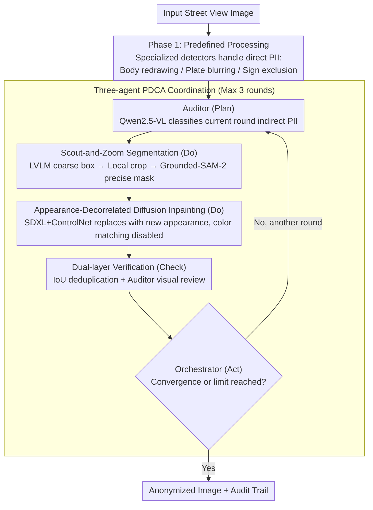

# Towards Context-Aware Image Anonymization with Multi-Agent Reasoning

**Conference**: CVPR 2026  
**arXiv**: [2603.27817](https://arxiv.org/abs/2603.27817)  
**Code**: None  
**Area**: Image Segmentation  
**Keywords**: Image anonymization, Multi-agent reasoning, Diffusion model inpainting, Privacy protection, GDPR compliance

## TL;DR

This paper proposes CAIAMAR, a multi-agent framework that combines predefined high-confidence direct PII (human bodies, license plates) processing with context-aware reasoning based on Large Vision-Language Models (LVLMs). Through a PDCA iterative optimization loop, it detects indirect privacy identifiers and performs appearance-decorrelated inpainting using diffusion models. It reduces person re-identification risk by 73% on CUHK03-NP while maintaining high image quality with an FID of 9.1 on CityScapes.

## Background & Motivation

1. **Background**: Street view images are widely used for navigation, urban planning, and autonomous driving datasets, but they contain substantial Personally Identifiable Information (PII). Existing anonymization methods primarily handle direct identifiers such as faces and license plates.
2. **Limitations of Prior Work**: (1) Traditional blurring methods (e.g., Gaussian blur) degrade downstream task performance (CityScapes instance segmentation AP drops by 5.3%) and are vulnerable to recovery via inversion attacks (95.9% identity recovery rate on CelebA-HQ). (2) Existing generative methods (DeepPrivacy2, FADM, etc.) focus only on bodies/faces, ignoring indirect identifiers (clothing, accessories, contextual objects). (3) State-of-the-art LVLMs can infer private attributes from contextual clues (achieving 76.4% accuracy), and models like o3 can achieve 99% city-level geolocation from casual photos.
3. **Key Challenge**: Effective anonymization must address context-dependent indirect identifiers in addition to direct PII. However, the semantic diversity of indirect PII makes it difficult for fixed detectors and rigid category rules to provide full coverage.
4. **Goal**: Can multi-agent collaboration achieve context-aware image anonymization while maintaining data utility and providing explainable audit trails?
5. **Key Insight**: Decompose the task into auditing (PII classification), generation (inpainting), and coordination (workflow management) using a multi-agent system. Optimize via iterative PDCA loops rather than a single-pass detection-inpainting process.
6. **Core Idea**: A two-phase architecture—Phase 1 handles direct PII using specialized models, while Phase 2 utilizes multi-agent + LVLM reasoning to handle context-dependent indirect identifiers.

## Method

### Overall Architecture

The core problem this paper addresses is that true privacy leaks in street view images stem not only from faces and license plates but also from numerous indirect identifiers that are "sensitive only within a specific context"—such as clothing color schemes, personal belongings, shop signs, and wall graffiti. Fixed detectors and rigid category rules cannot enumerate these items. Therefore, the authors split anonymization into two phases and introduce reasoning agents in the second phase to capture these omissions.

**Mechanism**: Images first enter **Phase 1 (Predefined Processing)**, where high-confidence direct PII is handled by specialized detectors. YOLOv8 detects human bodies, which are then redrawn by SDXL+OpenPose ControlNet; YOLOv8s detects license plates for Gaussian blurring; and YOLO-TS detects traffic signs to generate exclusion masks (as signs are public information and must be protected from accidental modification). The processed images then move to **Phase 2 (Multi-agent Collaboration)**, where three agents with distinct roles collaborate within the AutoGen framework in a fixed rotation. They execute a bounded PDCA iterative loop: each round discovers a batch of indirect PII, repairs them, and then re-checks for omissions until convergence or reaching the iteration limit. The boundary between the two phases is essentially: "if it can be reliably handled by a specialized model, do not burden the LVLM; the rest requiring contextual judgment goes to reasoning."

### Key Designs

**1. Three-agent PDCA Coordination Mechanism: Turning "Detection-Processing-Verification" into a convergent closed loop.**

A single-pass detection is destined to miss indirect PII due to the complexity and semantic noise of the scene. The authors adopt the PDCA (Plan-Do-Check-Act) quality management cycle, where three agents rotate in a fixed order: the Auditor (Qwen2.5-VL-32B) performs the Plan to classify PII instances for the current round; the Generative Agent performs the Do, executing segmentation and inpainting; the Check phase involves dual-layer verification—the Generative Agent uses IoU deduplication to prevent redundant processing, and the Auditor performs an independent visual check to confirm the repair is clean; finally, the Orchestrator (Act) decides whether to start another round or finish. The loop has a hard limit of $n_{\max}=3$ to avoid infinite loops from agent disagreement. This design allows "missed detections" to be completed gradually across rounds while controlling overhead—results show 76% of images converge within 2 rounds, with agent communication overhead accounting for only 7.4% of the total time.

**2. Scout-and-Zoom Segmentation: Leveraging LVLMs for regional proposals and segmentation models for precise extraction.**

This step addresses the respective shortcomings of LVLMs and segmentation models: LVLMs understand semantics and can judge if graffiti constitutes a privacy risk, but their bounding boxes are often coarse; models like Grounded-SAM-2 provide precise edges but lacks semantic reasoning. Drawing inspiration from Faster R-CNN's "region proposal followed by refinement," the authors link them together. Qwen2.5-VL-32B generates coarse bboxes as candidate regions, the image is cropped to these bboxes, Grounded-SAM-2 is run on the crops to obtain precise masks, and the local mask coordinates are mapped back to the full image. The "zoom-in and segment" approach ensures the segmentation model is less distracted by background noise, improving positioning accuracy. To handle redundant detections across rounds, a 30% IoU deduplication threshold is applied—e.g., if a region in `berlin_000002` is re-detected in round 2 with an IoU of 0.88, it is skipped.

**3. Appearance-Decorrelated Diffusion Inpainting: Replacing with entirely new appearances to break the Re-ID feature chain.**

Traditional Gaussian blurring retains structural information, which can be recovered by inversion attacks (95.9% identity recovery on CelebA-HQ is evidence of this), while GAN-based inpainting lacks diversity and controllability. The authors switch to generative redrawing using SDXL+ControlNet: human bodies use OpenPose ControlNet (condition scale 0.8, strength 0.9) to preserve poses and shapes useful for downstream tasks; the LVLM generates clothing descriptions by randomly sampling from 20 colors $\times$ 10 brightness levels, transforming the subject into "still a person, but not the original person." Objects and text use Canny ControlNet to maintain edge geometry. Crucially, color matching is completely disabled (luminance=0.0, chrominance=0.0)—while standard inpainting tries to match the tone of the original image, this reintroduces appearance correlation. The authors prefer that the repaired area looks "mismatched" to ensure that the new appearance is statistically independent of the original, thereby cutting off all appearance clues for Re-ID models.

### Key Experimental Results

#### Main Results

| Method | CUHK03 R1↓ | CUHK03 mAP↓ | CityScapes KID↓ | CityScapes FID↓ |
|------|-----------|-------------|-----------------|-----------------|
| Original (No Anonymization) | 62.4% | 66.0% | - | - |
| Gauss. Blur | 9.4% | 6.4% | 0.224 | 178.5 |
| DeepPrivacy2 | **8.6%** | **4.4%** | 0.066 | 59.7 |
| FADM | 33.4% | 32.9% | 0.032 | 33.3 |
| **CAIAMAR (Ours)** | 16.9% | 13.7% | **0.001** | **9.1** |

#### Ablation Study

| Configuration | Indirect PII Detections | Time/Image | Description |
|------|-------------|---------|------|
| Phase 1 only | 0 | 67.8s | Direct PII only |
| Full pipeline | 1,107 | 133.5s | Covers 54 indirect PII classes |
| Downstream mIoU (Ours) | 0.877 (-0.123) | - | Semantic segmentation maintained |
| Downstream mIoU (SVIA) | 0.478 (-0.522) | - | Severe degradation |

### Key Findings

- Re-ID risk was reduced by 73% (R1: 62.4% → 16.9%), while image quality far exceeded brute-force methods (FID 9.1 vs. Blur 178.5).
- Phase 2 detected an additional 1,107 indirect PII instances across 54 object categories (Vehicle markings 57.4%, Text elements 37.8%).
- Privacy-Utility Trade-off: Stronger privacy protection than FADM (49% R1 reduction) with better distribution preservation (56% KID reduction).
- Downstream semantic segmentation mIoU dropped by only 0.123 (vs. 0.522 for SVIA), with static categories virtually unaffected (road -0.005, sky -0.005).
- 76% of images converged within 2 PDCA rounds, with agent communication representing only 7.4% of overhead.

## Highlights & Insights

- **From "What is PII" to "What is PII in this context"**: This represents a paradigm shift in anonymization thinking. Vehicle markings on a private driveway are PII, while those in a public parking lot are not—context determines privacy sensitivity, requiring reasoning rather than fixed rules.
- **Dual-layer verification prevents omission and redundancy**: The Generative Agent’s IoU deduplication prevents redundant processing (efficiency), while the Auditor Agent’s independent visual check ensures quality. These complementary design patterns are highly valuable.
- **Full local deployment + Audit trailing**: Uses open-source models (Qwen2.5-VL, SDXL, Grounded-SAM-2) throughout, complying with GDPR data sovereignty. The generated structural audit trails support transparency and explainability.

## Limitations & Future Work

- Processing speed is slow (133.5s/image), unsuitable for real-time deployment and restricted to offline batch processing.
- Zero-shot PII detection performs poorly in fine-grained localization (Dice score of only 25.78% on Visual Redactions Dataset).
- Lack of comparison with single-agent solutions (missing ablation to prove the multi-agent vs. single LVLM advantage).
- Lack of systematic hyperparameter ablation ($n_{\max}$, IoU thresholds, ControlNet condition scales, etc.).
- Inherent LLM issues like "declining to execute" and inconsistent formatting are mitigated but not fundamentally solved.
- Could explore hybrid architectures using specialized detectors for high-frequency classes (faces/bodies) and LVLMs for low-frequency open-vocabulary categories.

## Related Work & Insights

- **vs. DeepPrivacy2**: DP2 is GAN-based, providing stronger privacy (R1 8.6%) but severely damaging image quality (SSIM 0.443, KID 0.066); CAIAMAR maintains 73% Re-ID reduction with significantly higher image quality.
- **vs. FADM**: FADM only performs full-body anonymization and ignores indirect identifiers; CAIAMAR discovers an additional 1,107 indirect PII instances.
- **vs. SVIA**: SVIA anonymizes large areas like buildings and roads, leading to catastrophic quality loss (FID 44.3 vs. 9.1, mIoU 0.478 vs. 0.877).

## Rating

- Novelty: ⭐⭐⭐⭐ The system design using multi-agent + PDCA cycles for anonymization is novel; context-aware PII classification goes beyond traditional methods.
- Experimental Thoroughness: ⭐⭐⭐ Re-ID and image quality evaluations are comprehensive, but key ablations (multi-agent vs. single-agent, LVLM comparisons) are missing.
- Writing Quality: ⭐⭐⭐⭐ The system architecture is clearly described with detailed tables and case analyses, though implementation details in the main text are somewhat lengthy.
- Value: ⭐⭐⭐⭐ Proposes a practical, GDPR-compliant anonymization solution that systematically addresses indirect PII for the first time, offering significant utility for industry.

<!-- RELATED:START -->

## Related Papers

- [\[AAAI 2026\] Guideline-Consistent Segmentation via Multi-Agent Refinement](../../AAAI2026/segmentation/guideline-consistent_segmentation_via_multi-agent_refinement.md)
- [\[CVPR 2026\] Test-Time Multi-Prompt Adaptation for Open-Vocabulary Remote Sensing Image Segmentation](test-time_multi-prompt_adaptation_for_open-vocabulary_remote_sensing_image_segme.md)
- [\[CVPR 2026\] INSID3: Training-Free In-Context Segmentation with DINOv3](insid3_training-free_in-context_segmentation_with_dinov3.md)
- [\[ICLR 2026\] VINCIE: Unlocking In-context Image Editing from Video](../../ICLR2026/segmentation/vincie_unlocking_in-context_image_editing_from_video.md)
- [\[ICLR 2026\] RegionReasoner: Region-Grounded Multi-Round Visual Reasoning](../../ICLR2026/segmentation/regionreasoner_region-grounded_multi-round_visual_reasoning.md)

<!-- RELATED:END -->
