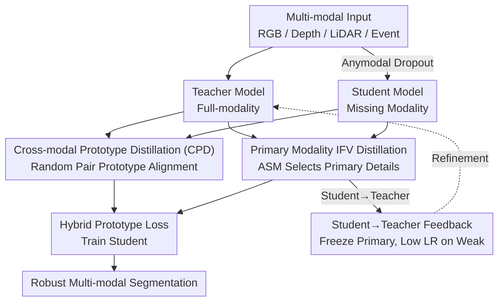

# Towards Robust Multi-Modal Semantic Segmentation with Teacher-Student Framework and Hybrid Prototype Distillation

**Conference**: CVPR 2026  
**Paper**: [CVF Open Access](https://openaccess.thecvf.com/content/CVPR2026/html/Tan_Towards_Robust_Multi-Modal_Semantic_Segmentation_with_Teacher-Student_Framework_and_Hybrid_CVPR_2026_paper.html)  
**Keywords**: Multi-modal semantic segmentation, missing modality robustness, self-distillation, prototype distillation, teacher-student feedback

## TL;DR
RobustSeg is proposed—a teacher-student self-distillation framework with a feedback loop. Using a "cross-modal prototype distillation + primary modality IFV distillation" hybrid strategy (HPD), the model maintains robustness during sensor loss or degradation while incurring almost no loss in full-modality accuracy (+2.40% mIoU on DeLiVER for missing modalities, and only -0.1% for full modalities).

## Background & Motivation
**Background**: Multi-modal semantic segmentation (MMSS) fuses complementary sensors like RGB, depth, LiDAR point clouds, and event streams to compensate for single-modality weaknesses such as missing geometric cues or sensitivity to lighting and weather. Mainstream fusion paradigms fall into three categories: RGB-dominant fusion, equal-level concatenation, and context-based adaptive selection.

**Limitations of Prior Work**: Most existing methods assume all modalities are online during both training and inference. Once a sensor degrades or fails in real-world scenarios, performance drops catastrophically—for instance, CMNeXt falls from 66.30% mIoU in the ideal RDEL setting to 22.92% in the degraded REL setting.

**Key Challenge**: Performance degradation stems from two root causes. First, the **complete modality hypothesis** leads models to overfit to ideal inputs. Second, **modal imbalance** occurs because varying information density across modalities causes models to rely excessively on easy-to-learn primary modalities (e.g., RGB), creating single-modality bias and resulting in sub-optimal fusion and weak robustness. Existing self-distillation or modality masking methods use "frozen teacher + masked student" to improve missing-modality robustness, but bring two new issues: a significant drop in full-modality accuracy (a trade-off between robustness and precision) and the fact that these pipelines are mostly **single-modality distillation**, which transfers fine-grained details while copying the teacher's modal bias to the student, amplifying inter-modal imbalance.

**Goal**: To improve robustness under missing modalities while preserving full-modality accuracy without adding parameters or introducing external data.

**Key Insight**: The authors observe a contradiction between "detail transfer" and "cross-modal alignment." Directly performing cross-modal distillation with fine-grained IFV (Intra-class Feature Variation) maps introduces modal-specific noise, causing information confusion (full-modality performance dropped 8.55% in experiments). In contrast, high-level semantic prototypes excel at cross-modal alignment but lose detail. Therefore, the two are decoupled: prototypes handle cross-modal semantics, and IFV handles intra-modal details.

**Core Idea**: A hybrid distillation approach combining "cross-modal prototype distillation for bias reduction + primary modality IFV distillation for detail replenishment," supplemented by a "student-to-teacher feedback" closed loop, allowing the teacher to become more balanced by learning from the student's weak modality information.

## Method

### Overall Architecture
RobustSeg is a teacher-student self-distillation framework. The teacher receives **full-modality** inputs, while the student receives inputs with **randomly missing modalities** via Anymodal Dropout. The student learns to approximate full-modality performance under the dual supervision of the teacher and ground truth. Given $M$ modality inputs $x_m$, individual encoders extract features across four stages $f^1_m, \dots, f^4_m$. The teacher feeds full-modality features into a segmentation head for dense prediction, while the student approximates the teacher under missing modality conditions.

Knowledge transfer from teacher to student occurs through three paths: ① Standard logits distillation $L_{KL}$ + supervised segmentation $L_{CE}$; ② The core **Hybrid Prototype Distillation (HPD)**, which bridges "Cross-modal Prototype Distillation (CPD)" and "Primary Modality IFV Distillation" in parallel; ③ Feedback Loop—the student feeds back non-primary modality IFV to the teacher. The teacher fine-tunes non-primary modality encoders at a low learning rate, gradually producing more balanced representations.

### Key Designs

**1. Cross-modal Prototype Distillation (CPD): Aligning with semantic prototypes rather than detail maps to avoid bias transfer**

Using IFV maps (fine-grained intra-class feature distribution) for cross-modal distillation is problematic—t-SNE shows LiDAR features become more separable, but RGB features collapse due to LiDAR interference, dropping full-modality performance by 8.55% due to modal-specific noise. CPD uses **class-level semantic prototypes** as proxies. Ground truth labels are nearest-neighbor interpolated to the feature map size $l'$, and average pooling with label masking is applied to each modality at each stage to obtain prototypes $p=[p_0, \dots, p_C]$:

$$p_c = \frac{\sum_j f^{i,j}_m \,\mathbf{1}[l'_j = c]}{\sum_j \mathbf{1}[l'_j = c]}$$

The key technique is **random modality permutation matching**: the sample-level modality order is shuffled before calculating prototypes. The student prototype $p_{\pi(m)}$ matches the teacher's prototype $g_m$ from a different modality:

$$L_{cp} = \frac{1}{N}\sum_{n=1}^{N}\sum_{i=1}^{4}\sum_{m=1}^{M} \mathrm{KL}\big(p^{n,i}_{\pi(m)},\, g^{n,i}_m\big)$$

This forces each modality to align with the semantic strengths of others, reducing modal bias at a global semantic level without confusing pixels.

**2. Primary Modality IFV Distillation: Recovering fine-grained structure via "Primary Modalities" only**

Prototypes lose details essential for segmentation, so a parallel single-modality IFV channel is used. A Center Feature Map (CFM) is constructed by replacing every pixel with its class prototype:

$$\mathrm{CFM} = \sum_{c=0}^{C-1} p_c \otimes \mathbf{1}[l'=c]$$

The cosine similarity between the CFM and original features $f$ yields the IFV map $M$. Crucially, **only primary modality IFVs are distilled**. The ASM (Arbitrary-Modal Selection Module) identifies primary modalities by calculating the cosine similarity between single-modality and fused features. This avoids unreliable details from weak modalities:

$$L_{ifv} = \frac{1}{N}\sum_{n=1}^{N}\sum_{i=1}^{4}\sum_{m=1}^{M'} \mathrm{KL}\big(M^{n,i,m}_s,\, M^{n,i,m}_t\big)$$

**3. Student→Teacher Feedback: Breaking the "Teacher is Always Better" assumption**

Traditional KD assumes a superior teacher. However, a multi-modal teacher inherently possesses modal bias. The feedback mechanism allows the teacher to learn from the student's weak modality cues. ASM identifies non-primary modalities; to maintain primary modality perception, the primary ViT encoders and fusion blocks are **frozen**. Only non-primary ViT encoders are trained with a low learning rate ($6\times10^{-6}$):

$$L_{feedback} = L_{CE} + L_{ifv}$$

Experimental results showed the teacher's performance on the Event+LiDAR combination surged from 1.57% to 27.28%, with the student's EMM rising to 49.91% (+0.81).

### Loss & Training
The basic self-distillation loss is $L_{origin}=L_{CE}+\lambda L_{KL}$. The student training uses the hybrid prototype loss $L_{hp}=L_{origin}+\alpha L_{cp}+\beta L_{ifv}$. The teacher feedback loop uses $L_{feedback}=L_{CE}+L_{ifv}$. Hyperparameters are set via search to $\lambda=50, \alpha=100, \beta=12$. Both models are initialized identically and trained for 120 epochs using AdamW at $1024\times 1024$ resolution.

## Key Experimental Results

### Main Results
Evaluation of all modality combinations on DeLiVER (MiT-B0 backbone), mean of 15 combinations:

| Method | Full-modality RDEL | Weak Combination EL | Mean of All Combos |
| :--- | :--- | :--- | :--- |
| CMNeXt | 60.59 | 4.97 | 34.09 |
| MAGIC | 63.40 | 0.26 | 40.49 |
| M-SegFormer | 61.92 | 1.57 | 39.36 |
| AnySeg (Prev. SOTA) | 59.41 | 27.57 | 47.51 |
| **RobustSeg (Ours)** | **61.85** | **33.01** | **49.91 (+2.40)** |

Robustness evaluation across three datasets (MiT-B2 backbone):

| Dataset | Prev. SOTA | Prev. SOTA Avg | Ours Avg |
| :--- | :--- | :--- | :--- |
| DeLiVER | AnySeg | 41.46 | **45.16** |
| MUSES | MAGIC++ | 27.00 | **32.58** |
| MCubeS | MAGIC++ | 25.25 | **29.19** |

### Ablation Study
Ablation of HPD components (MiT-B0, Baseline is full-modality pre-training):

| Config | EMM | Full-modality | Note |
| :--- | :--- | :--- | :--- |
| Baseline | 39.36 | 61.92 | No distillation |
| Basic-distillation | 46.42 | 61.34 | Only $L_{origin}$ |
| Single-modal IFV | 47.51 | 59.71 | Good details but full-modality -2.21 |
| Cross-modal IFV | 43.42 | 53.38 | Catastrophic drop of -8.54 |
| Cross-modal Prototype (CPD) | 49.06 | 60.11 | Strong alignment |
| **Primary IFV + CPD (Full HPD)** | **49.10** | **61.26** | Full-modality only -0.66 |

### Key Findings
- **Proxy choice for cross-modal transfer is the decisive factor**: Cross-modal IFV crashes performance, whereas cross-modal prototypes facilitate alignment without transferring noise.
- **Detail channels must select primary modalities**: Including weak modality noise drags robustness down from 49.06% to 48.63%. ASM selection recovers this.
- **Feedback should transfer features, not logits**: Students under robust training produce weaker logits than the teacher; hence, feature-based feedback (+ frozen primary parameters) is required to refine the teacher without damaging primary perception.

## Highlights & Insights
- **Decoupling cross-modal alignment from intra-modal details**: By assigning different proxies (prototypes vs. IFV) to different tasks, the model avoids the internal conflict of a single objective trying to achieve both.
- **Learnable teacher closed-loop**: Challenges the "teacher is always better" assumption in KD. The loop enables a biased teacher to self-correct using student cues.
- **Zero extra parameters**: The use of label-masked pooling and modality matching is a lightweight way to compress dense knowledge into semantic centers.

## Limitations & Future Work
- **Strong dependency on ground truth labels**: Constructing prototypes requires GT for pixel selection, which is not directly applicable in semi-supervised or unsupervised settings.
- **ASM-based modality partitioning**: The hard split of modalities based on cosine similarity might be too coarse when modality counts are high or information density is nearly equal.
- **Training overhead**: Details on training stability and efficiency are relegated to the supplementary material; the actual sensitivity to learning rates in the feedback loop is not fully explored in the main text.

## Related Work & Insights
- **vs AnySeg**: AnySeg uses single-modality distillation, transferring bias alongside details. RobustSeg uses prototypes for cross-modal alignment to explicitly reduce bias.
- **vs MAGIC / MAGIC++**: These focus on robust fusion modules. RobustSeg achieves superior results across different backbones without modifying the fusion structure or adding parameters.
- **vs Traditional IFV**: IFV was originally for isomorphic teacher-student detail transfer. This work identifies the noise issue in cross-modal IFV and restricts it to intra-modal use.

## Rating
- Novelty: ⭐⭐⭐⭐ The decoupling of alignment/details and the teacher-feedback loop are innovative and driven by clear empirical evidence.
- Experimental Thoroughness: ⭐⭐⭐⭐ Extensive testing across three datasets and two backbones, though efficiency details are missing from the main text.
- Writing Quality: ⭐⭐⭐⭐ Logical flow from motivation to design is clear; Figure 1-3 effectively illustrate why cross-modal IFV fails.
- Value: ⭐⭐⭐⭐ High practical value for improving robustness in missing-modality scenarios without increasing inference deployment costs.

<!-- RELATED:START -->

## Related Papers

- [\[CVPR 2026\] Brewing Stronger Features: Dual-Teacher Distillation for Multispectral Earth Observation](brewing_stronger_features_dual-teacher_distillation_for_multispectral_earth_obse.md)
- [\[NeurIPS 2025\] OmniSegmentor: A Flexible Multi-Modal Learning Framework for Semantic Segmentation](../../NeurIPS2025/segmentation/omnisegmentor_a_flexible_multi-modal_learning_framework_for_semantic_segmentatio.md)
- [\[CVPR 2026\] GKD: Generalizable Knowledge Distillation from Vision Foundation Models for Semantic Segmentation](gkd_generalizable_knowledge_distillation_vfm.md)
- [\[CVPR 2026\] 3M-TI: High-Quality Mobile Thermal Imaging via Calibration-free Multi-Camera Cross-Modal Diffusion](3m-ti_high-quality_mobile_thermal_imaging_via_calibration-free_multi-camera_cros.md)
- [\[CVPR 2026\] Denoise and Align: Towards Source-Free UDA for Robust Panoramic Semantic Segmentation](denoise_and_align_towards_source-free_uda_for_robust_panoramic_semantic_segmenta.md)

<!-- RELATED:END -->
