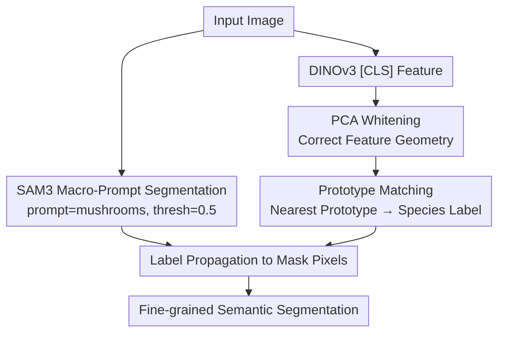

# Training-Free Fine-Grained Semantic Segmentations in Low Data Regimes: A FungiTastic Baseline

**Conference**: CVPR 2026 (Workshop)  
**arXiv**: [2605.22492](https://arxiv.org/abs/2605.22492)  
**Code**: None  
**Area**: Semantic Segmentation / Fine-grained Recognition / Foundation Models / Few-shot  
**Keywords**: training-free segmentation, fine-grained, prototype matching, PCA whitening, SAM3, DINOv3  

## TL;DR
Addressing fungi fine-grained segmentation—a scenario characterized by "many classes, few samples, long-tail distributions, and noisy acquisition conditions"—this paper proposes a **completely training-free** two-stage pipeline. It first utilizes SAM3 with a macro-prompt ("mushrooms") to obtain class-agnostic masks, then applies DINOv3 features for prototype matching to assign fine-grained labels. The authors discover that performing **PCA whitening** on DINOv3 features boosts prototype classification accuracy from approximately 30% to 55%, establishing the first low-data fine-grained segmentation baseline for FungiTastic.

## Background & Motivation
**Background**: Fine-grained semantic segmentation requires both "precise localization" and "differentiation of visually similar classes." This problem is particularly challenging in mycology, where species within the same genus look nearly identical, intra-class variation is high, and categories follow a severe long-tail distribution. The FungiTastic dataset further introduces massive variations in background, lighting, and scale.

**Limitations of Prior Work**: Dense pixel-level annotations are extremely costly, and practically no segmentation supervision exists in such specialized domains. Thus, low-data/training-free pipelines are highly attractive. While SAM3 exhibits strong "class-agnostic" segmentation capabilities, producing **semantic** segmentation requires class-specific prompting. However, the correct species label is unknown during inference; exhaustive prompting would require 194 forward passes (one per class) per image, making the cost scale linearly with the number of classes and rendering it non-scalable.

**Key Challenge**: The premise of SAM3 providing semantic masks (knowing the class prompt) conflicts with the premise of fine-grained inference (the class itself is the unknown to be predicted). Coupling "segmentation" and "classification" either requires an oracle class or results in explosive computational costs.

**Goal**: To achieve scalable, low-cost fine-grained semantic segmentation without any segmentation supervision—using only image-level labels—and to establish it as a reproducible baseline in the low-data regime.

**Key Insight**: The authors hypothesize that the segmentation step does not actually require knowledge of the fine-grained class. By using a **macro-taxonomic** concept ("mushrooms") to extract the mushroom as a whole, the segmentation cost becomes independent of the number of classes. The fine-grained classification is then handled by an independent, training-free classifier based on DINOv3 features.

**Core Idea**: **Decoupled Segmentation and Classification**—SAM3 is responsible for "bounding the mushroom" (class-agnostic, macro-prompt), while DINOv3 prototype matching determines "which species it is," followed by label propagation to mask pixels. PCA whitening is employed to correct DINOv3 feature geometry, making prototype comparison more reliable.

## Method

### Overall Architecture
The method is a **training-free, two-stage, dual-branch pipeline**. It takes a mushroom image as input and outputs a fine-grained (species-level) semantic segmentation mask without any task-specific training.

Two branches run in parallel: The **segmentation branch** feeds the image into SAM3 using the macro-prompt "mushrooms" with a 0.5 threshold to obtain a **class-agnostic** mask (cost is constant and independent of the 194 classes). The **classification branch** feeds the same image into a frozen DINOv3, extracts the `[CLS]` token as the image-level feature, performs a PCA + whitening transform, and finds the nearest class prototype in the transformed space to obtain the fine-grained species label. Finally, **Fusion**: The predicted species label is propagated to all pixels within the mask, transforming class-agnostic regions into class-specific fine-grained segmentations.

The authors verified the **execution order**: while it is theoretically possible to classify first and then prompt SAM3 with the species name, Table 1 shows that "segmentation then classification" yields higher accuracy (and avoids 194 prompts). Prototypes are pre-computed offline during the "prototype construction phase" by extracting DINOv3 features for each training sample, applying PCA whitening, and taking the class-wise mean of normalized features.

### Key Designs

**1. Decoupled Two-Stage Framework: Separating "Segmentation" from "Classification" to make segmentation cost class-independent.**

The pain point stems directly from SAM3: semantic masks require class prompts, but classes are unknown at inference, and exhaustive prompting leads to $O(C)$ complexity. The authors' approach is to **avoid introducing fine-grained classes during the segmentation stage**. By using only the **macro-taxonomic** concept "mushrooms," SAM3 extracts the overall mushroom. Thus, segmentation complexity remains constant and decoupled from the label space. Fine-grained discrimination is delegated to the independent classification branch. This ensures scalability and keeps the most expensive segmentation step as a one-time, low-cost operation. Table 1 confirms this: macro-prompt segmentation (mIoU 0.8937) significantly outperforms prompting SAM3 with fine-grained species names even when an oracle class is assumed (mIoU 0.5522). This suggests that SAM3's confidence is lower for specific species names, supporting the "use macro-prompts for segmentation" design.

**2. Training-Free Fine-Grained Classification via DINOv3 Prototype Matching.**

The classification branch must distinguish 194 similar-looking species without training. The authors use a frozen DINOv3 backbone, treating the `[CLS]` token as the image-level representation and following a classic prototype approach: the prototype for each class is the mean of the normalized features of its training samples, $\mathbf{p}_c = \frac{1}{|S_c|}\sum_{x\in S_c}\hat{f}(x)$. During inference, the **nearest prototype** is selected based on cosine similarity in the (transformed) space. This approach naturally fits the low-data regime: prototypes can be constructed from just a few images per class. The authors evaluated settings for $k=5, 10, 20, 50, 100, 200$ images per class, averaging results over 20 random seeds.

**3. PCA Whitening: Correcting DINOv3 Feature Geometry is the Real Performance Turning Point.**

This is the most critical and counter-intuitive discovery of the paper. In FungiTastic, **nuisance factors** such as background, lighting, and scale dominate the geometric structure of DINOv3 `[CLS]` embeddings, causing directions truly useful for fine-grained discrimination to be overwhelmed by high-variance noise. Consequently, direct normalization or standard PCA in the original 4096-dimensional space **fails to separate classes**—the metric structure required for prototype comparison does not match the structure of the pre-trained embedding space. The PCA whitening fix involves projecting features onto principal component axes and then **dividing each retained component by its own standard deviation** to re-scale to unit variance. This balances the directions and suppresses high-variance nuisance-dominated directions, allowing class-relevant information to contribute to cosine comparisons. The effect is decisive: mAcc improves from ~30% with raw normalized features to ~50% (peaking at 0.55) with whitening, whereas standard PCA provides almost no gain. The authors conclude that **in low-data fine-grained scenarios, representation preprocessing can be as important as the choice of the foundation model itself**.

### Loss & Training
The method is **completely training-free** and has no loss function. The only "fitting" involved is the offline computation of class means for prototypes and the estimation of the PCA whitening projection matrix on the training subset. To simulate the low-data regime, the authors uniformly sampled multiple subsets from the training set and repeated experiments across $n=20$ random seeds. The SAM3 macro-prompt threshold was set to 0.5, while the fine-grained oracle comparison used 0.3 (due to lower confidence in species-specific prompts).

## Key Experimental Results

The dataset is a subset of FungiTastic with segmentation masks: approximately 13k train images and 9k test images covering 194 classes. Evaluation metrics include image-level mean class accuracy (mAcc) and segmentation mean IoU (mIoU), both averaged over 20 runs on the test set.

Definitions of core metrics (averaged over classes, where $C$ is the number of classes, and $M^I, M^P$ are image-level and pixel-level confusion matrices respectively, with $M_{ij}$ representing samples of ground truth class $i$ predicted as class $j$):

$$\mathrm{mAcc}=\frac{1}{C}\sum_{i=1}^{C}\frac{M^{I}_{ii}}{\sum_{j=1}^{C}M^{I}_{ij}}, \qquad \mathrm{mIoU}=\frac{1}{C}\sum_{i=1}^{C}\frac{M^{P}_{ii}}{\sum_{j=1}^{C}M^{P}_{ii}+\sum_{j=1}^{C}M^{P}_{ij}+\sum_{j=1}^{C}M^{P}_{ji}}$$

### Main Results

**Comparison of Prompting Strategies (Table 1, including Oracle Upper Bound)**:

| Prompting Strategy | mIoU | Non-empty/Total Images | Notes |
|----------|------|---------------|------|
| Macro-prompt (mushrooms) + Oracle Classification | **0.8937** | 9643/9763 | Upper bound of SAM3 mask quality |
| Oracle Fine-grained Species Name Prompt | 0.5522 | 6341/9763 | Specific species names perform worse |

Key Conclusion: Macro-prompt segmentation (0.8937) is significantly better than fine-grained species name prompting (0.5522), proving that "segmentation via macro-prompting while delegating fine-grained details to a subsequent step" is the correct approach.

### Ablation Study

**Feature Preprocessing vs. Samples per Class $k$ (Table 2, Mean of 20 Seeds, Max Std Dev ≤ 0.01)**:

| Configuration | mAcc (k=5) | mAcc (k=20) | mAcc (k=50→200) | mIoU (k=50) |
|------|-----------|-------------|-----------------|-------------|
| Norm. cosine (Raw) | 0.24 | 0.31 | 0.32→0.33 | 0.15 |
| PCA cosine (Standard PCA) | 0.23 | 0.30 | 0.32→0.32 | 0.14 |
| **PCA white cosine (Whitening)** | **0.33** | **0.51** | **0.55→0.55** | **0.31** |

### Key Findings
- **PCA whitening is the only factor that creates a significant gap**: mAcc rises from ~0.33 to 0.55 (+20 percentage points), and mIoU doubles from ~0.15 to 0.31. Standard PCA is almost identical to no preprocessing, highlighting that the benefit comes from "standard deviation scaling" rather than dimensionality reduction.
- **Small subsets cover most variations**: both mAcc and mIoU saturate after approximately 40–60 images per class (Figure 1). At 50 images/class, mIoU reaches a peak of ~30%, with diminishing returns beyond that.
- **Final performance is constrained by SAM3 masks and the prototype classifier**: even with perfect classification, the segmentation upper bound is capped by the SAM3 macro-mask quality (0.8937).

## Highlights & Insights
- **"Decoupling segmentation cost from class count" is a practical engineering insight**: transforming expensive SAM3 calls into a single macro-prompt avoids the 194x overhead of per-class exhaustive prompting. This paradigm of "coarse-prompting + post-hoc fine-grained discrimination" is transferable to any scenario involving foundation segmentation models and large label spaces.
- **The power of PCA whitening is the "Aha!" moment**: a classic preprocessing technique provides a +20% accuracy boost on DINOv3 features, an improvement that might not be achieved even by switching to a stronger backbone. "Repairing feature geometry" can be more cost-effective than "replacing foundation models."
- **Counter-intuitive conclusion in Table 1**: prompting SAM3 with more precise species names leads to worse segmentation (0.55 vs 0.89). SAM3 has lower confidence for specific fine-grained concepts; it is more important to feed foundation models the granularity they are "comfortable" with.

## Limitations & Future Work
- **Reliance on global `[CLS]` descriptors**: this ignores local information from `[PATCH]` tokens, limiting representational power in scenes with multiple specimens, occlusions, or co-occurring classes.
- **Low absolute accuracy**: with an mAcc of 0.55 and mIoU of 0.31, it serves as a "first baseline" but is far from practical application, reflecting the extreme difficulty of the FungiTastic task.
- **Segmentation bottleneck**: the macro-mask mIoU of 0.8937 is a hard ceiling; no improvement in classification can surpass it.
- **Single-class assumption**: the current setup handles "mushroom vs. background" style single-foreground segmentation. Multi-class co-occurrence segmentation has not been evaluated.

## Related Work & Insights
- **vs. Fine-grained few-shot classification (e.g., FungiCLEF solutions [4][8])**: these methods focus on feature engineering and lightweight finetuning for long-tail **classification** without a segmentation component. This work establishes the first fine-grained **segmentation** baseline.
- **vs. Class-conditional prompting in SAM3**: standard usage requires class prompts for semantic masks, which is non-scalable ($194\times$ cost). Macro-prompting offers a constant-cost alternative.
- **vs. Standard Prototypes / PCA**: this work follows prototype learning but highlights that in noisy low-data regimes, DINOv3 feature geometry is mismatched with prototype metrics, necessitating PCA whitening to suppress nuisance factors.

## Rating
- Novelty: ⭐⭐⭐ Combines existing modules (SAM3+DINOv3+PCA whitening) rather than proposing a new method, yet the "decoupling + macro-prompt + whitening" recipe and the first low-data fine-grained baseline are valuable.
- Experimental Thoroughness: ⭐⭐⭐ 20 seeds, multiple $k$ settings, and oracle bounds, though validated only on a single dataset/backbone combination.
- Writing Quality: ⭐⭐⭐⭐ Concise and clear; motivations and findings are well-articulated. Tables 1/2 are highly informative.
- Value: ⭐⭐⭐⭐ Establishes a reproducible baseline for an unexplored problem (low-data fine-grained segmentation) and provides the practical insight that "fixing feature geometry ≈ upgrading models."

<!-- RELATED:START -->

## Related Papers

- [\[CVPR 2026\] Training-Free Open-Vocabulary Camouflaged Object Segmentation via Fine-Grained Object Binding and Adaptive Hybrid Prompt](training-free_open-vocabulary_camouflaged_object_segmentation_via_fine-grained_o.md)
- [\[CVPR 2026\] INSID3: Training-Free In-Context Segmentation with DINOv3](insid3_training-free_in-context_segmentation_with_dinov3.md)
- [\[CVPR 2026\] The Power of Prior: Training-Free Open-Vocabulary Semantic Segmentation with LLaVA](the_power_of_prior_training-free_open-vocabulary_semantic_segmentation_with_llav.md)
- [\[CVPR 2026\] PEARL: Geometry Aligns Semantics for Training-Free Open-Vocabulary Semantic Segmentation](pearl_geometry_aligns_semantics_for_training-free_open-vocabulary_semantic_segme.md)
- [\[CVPR 2026\] Direct Segmentation without Logits Optimization for Training-Free Open-Vocabulary Semantic Segmentation](direct_segmentation_without_logits_optimization_for_training-free_open-vocabular.md)

<!-- RELATED:END -->
