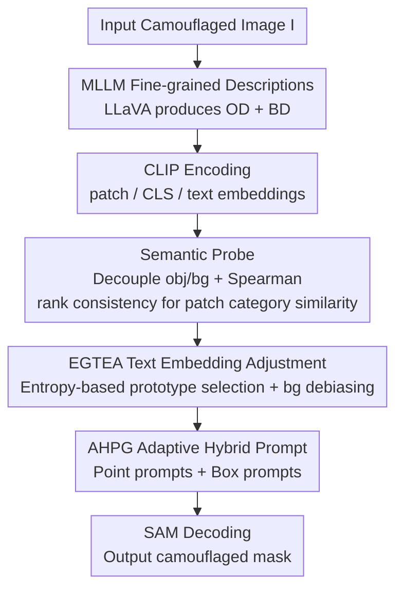

# Training-Free Open-Vocabulary Camouflaged Object Segmentation via Fine-Grained Object Binding and Adaptive Hybrid Prompt

**Conference**: CVPR 2026  
**Paper**: [CVF Open Access](https://openaccess.thecvf.com/content/CVPR2026/html/Ren_Training-Free_Open-Vocabulary_Camouflaged_Object_Segmentation_via_Fine-Grained_Object_Binding_and_CVPR_2026_paper.html)  
**Area**: Semantic Segmentation / Open-Vocabulary / Camouflaged Object Segmentation  
**Keywords**: Camouflaged Object Segmentation, Open-Vocabulary, Training-Free, Object Binding, CLIP+SAM

## TL;DR
This paper proposes a **completely training-free** open-vocabulary camouflaged object segmentation (OVCOS) framework. It utilizes MLLMs to generate fine-grained "object descriptions + background descriptions" to supplement sparse text semantics. A Semantic Probe is then used to decouple object/background features and model category similarity between patches via Spearman rank consistency for precise "object binding." Combined with Entropy-Guided Text Embedding Adjustment (EGTEA) and Adaptive Hybrid Prompt Generation (AHPG) to drive SAM, the method significantly outperforms the previous strongest training-free method, ResCLIP, on OVCamo (average +16.8% across six metrics).

## Background & Motivation

**Background**: Camouflaged Object Segmentation (COS) aims to segment objects that are highly similar to their backgrounds and difficult to identify with the naked eye (e.g., stick insects on dry branches, nightjars in grass). The open-vocabulary version (OVCOS) further requires the model to segment **unseen camouflaged categories** during training. Existing OVCOS methods (OVCoser, SuCLIP) follow a fully supervised route, relying on pixel-level mask annotations for training.

**Limitations of Prior Work**: The fully supervised paradigm has two major drawbacks: first, it requires expensive mask annotations; second, it is prone to overfitting to seen classes, leading to significant performance drops when generalizing to new camouflaged categories. Existing **training-free** paradigms in the OVSS field (directly reusing CLIP + SAM/DINO without training) can be quickly transferred to new domains but fail in camouflaged scenarios. They generally use sparse text prompts ("a photo of a {class}") and perform segmentation using direct patch-text similarity maps, lacking the ability for precise "object binding" (accurate mapping between text prompts and specific visual objects).

**Key Challenge**: The authors attribute the failure of training-free methods in camouflaged scenarios to two points. ① **Sparse Text Semantics**: A single prompt "a photo of a {class}" only provides the category name, missing fine-grained attributes (color, texture, shape) and background semantic descriptions, making the model susceptible to background interference. ② **Ignoring Inter-patch Category Similarity**: Existing methods use individual patch similarities directly. In camouflaged scenes, local visual features of objects and backgrounds are extremely similar, and single-patch text similarity is easily distorted by the background. However, different patches belonging to the same camouflaged object should have highly correlated category distributions—this correlation is not modeled, further hindering accurate binding.

**Goal & Core Idea**: Restore object binding capability without training or annotations by "**completing text semantics + explicitly modeling inter-patch category consistency**." Specifically, use fine-grained descriptions generated by an MLLM as text priors, use a Semantic Probe with Spearman rank consistency to refine binding, apply entropy-guided adjustment to text embeddings to suppress background bias, and finally generate hybrid prompts to drive SAM for mask generation.

## Method

### Overall Architecture
The entire framework is a **fully frozen, zero-training** serial pipeline: it takes a camouflaged image as input and outputs the segmentation mask and its open-vocabulary category. All large model (CLIP ViT-L/14, SAM ViT-H, LLaVA-1.5-7B) parameters remain fixed. The process is: LLaVA generates Object Descriptions (OD) and Background Descriptions (BD) offline to expand "single-sentence category names" into fine-grained text priors. CLIP encoders extract patch features $F_{patch}$, [CLS] features $F_{cls}$, and text embeddings. The Semantic Probe uses OD/BD embeddings to decouple object and background, calculates inter-patch category similarity using Spearman rank consistency, and re-weights patch features to obtain refined object/background similarity maps $S_o^*$ and $S_b^*$. EGTEA filters object/background prototypes based on entropy and debiases by removing the projection of text embeddings in the background direction. AHPG generates point and box prompts from the refined similarity maps. Finally, hybrid prompts are sent to SAM to decode the final mask.

Regarding engineering details: Since CLIP's local representation is weak, this work follows ResCLIP by removing the residual connection and FFN in the last layer of ViT, using middle-layer attention features to refine the final visual features to preserve local details for dense prediction.

### Key Designs

**1. MLLM Fine-grained Object/Background Descriptions: Expanding Sparse Names into Rich Semantic Priors**

To address "sparse text semantics," the authors no longer use generic prompts like "a photo of a {class}." Instead, LLaVA-1.5 generates two text segments for **each input image**: Object Description (OD) focuses on discriminative attributes (color, texture, shape, e.g., "grey-white feathers, slender neck, pointed beak, difficult to spot at first glance") and Background Description (BD) focuses on scene attributes (texture, spatial distribution, e.g., "dense high grass and reed beds, mixed green and brown"). These are encoded by CLIP into $F_t^{od}\in\mathbb{R}^{C\times D}$ and $F_t^{bd}\in\mathbb{R}^{C\times D}$, forming the Semantic Probe $SP_t=[F_t^{od}, F_t^{bd}]$. This provides "how the object looks" vs. "how the background looks" as comparative priors, mitigating background interference. For efficiency, OD/BD are generated **offline**.

**2. Semantic Probe + Spearman Rank Consistency: Explicitly Modeling Inter-patch Category Similarity for Object Binding**

This is the core of the paper, addressing "ignoring inter-patch category similarity." First, compute $S=\cos(F_{patch}, F_t)$ between each patch and $2C$ semantic probes to get a score matrix $Score(n,m)\in\mathbb{R}^{N\times L\times 2C}$, then split into object similarity map $S_o$ and background similarity map $S_b$:

$$S_o = \frac{1}{C}\sum_{m=1}^{C}Score(n,m),\qquad S_b = \frac{1}{C}\sum_{m=C+1}^{2C}Score(n,m)$$

The crucial step is **not using absolute similarity directly**. Instead, the scores $Score(n,:)$ for each patch are ranked to obtain a rank vector $R(n,m)$, and Spearman correlation is used to measure category similarity $Sim_{class}(n_1,n_2)\in[0,1]$ between any two patches:

$$Sim_{class}(n_1,n_2) = 1 - \frac{\sum_{m=1}^{2C}\big(R(n_1,m)-R(n_2,m)\big)^2}{M(M^2-1)}$$

Where $M$ is the number of probes. **Why use ranking instead of absolute values**: In camouflaged scenes, absolute response values of object and background converge due to visual ambiguity. Metrics like KL/JS divergence would misjudge them as "distributionally similar." Spearman correlation focuses on the relationship between semantic rank vectors—patches of the same camouflaged object maintain a highly consistent category ranking pattern even when visually confused with the background, enabling robust binding. Finally, $Scale_o = Sim_{class} \cdot S_o$ and $Scale_b = Sim_{class} \cdot S_b$ are used to weight $F_{patch}$ to get refined maps $S_o^*$ and $S_b^*$.

**3. Entropy-Guided Text Embedding Adjustment (EGTEA): Suppressing Background Bias and Correcting Category Prediction**

After initial binding, high object-background similarity still causes category prediction bias. EGTEA uses **entropy** to locate reliable prototypes: it calculates the entropy $H=-\sum_c Probs_{i,c}\log Probs_{i,c}$ for each patch based on $S_o^*$. Patches with the **highest** entropy (most uncertain ≈ most entangled with background) are selected as camouflaged object candidates, while the **lowest** entropy patches are chosen as background candidates. This yields visual prototypes $\varepsilon_o, \varepsilon_b$ and text prototype $\varepsilon_t$. The text embedding is then debiased by subtracting its projection onto the background direction:

$$A_{anchor} = \alpha\cdot\varepsilon_o + \varepsilon_t,\quad \dot{F}_t = \varepsilon_t - \Big(\varepsilon_t\cdot\frac{\varepsilon_b}{\lVert\varepsilon_b\rVert^2}\Big)\cdot\frac{\varepsilon_b}{\lVert\varepsilon_b\rVert^2}$$

$$F_t^* = \gamma\cdot A_{anchor} + (1-\gamma)\cdot\dot{F}_t$$

Essentially, this "erases" background semantic components and "injects" object visual evidence into the text embedding.

**4. Adaptive Hybrid Prompt Generation (AHPG): Point + Box Prompts for SAM**

AHPG generates prompts based on $S_o^*$ and $S_b^*$. It selects the optimal foreground/background classes, derives single-channel similarity maps, and uses a threshold $\tau_m=0.8$ to extract candidate points $P_{fg}, P_{bg}$ for point prompts $P$. To improve stability, it computes the minimum bounding box from foreground points and expands it by $\delta$ to avoid zero-area boxes:

$$B_{final} = [B_{min}-\delta,\; B_{max}+\delta]$$

Point prompts provide localization while box prompts constrain the complete range, and their complementarity ensures complete segmentation.

### Loss & Training
The method is **completely training-free**, with no loss functions or parameter updates. CLIP ViT-L/14, SAM ViT-H, and LLaVA-1.5-7B are all frozen. Images are resized to $336\times336$, and inference can be performed on a single NVIDIA A40.

## Key Experimental Results

### Main Results
On the OVCamo benchmark (61 novel camouflaged categories), using six metrics: cSm / cF$^\omega_\beta$ / cMAE / cFβ / cEm / cIoU.

| Model | Setting | cSm↑ | cF$^\omega_\beta$↑ | cMAE↓ | cIoU↑ |
|------|------|------|------|------|------|
| ResCLIP (CVPR25) | Training-free ViT-L/14 | 0.326 | 0.156 | 0.508 | 0.144 |
| CASS (CVPR25) | Training-free ViT-B/16 | 0.328 | 0.128 | 0.424 | 0.097 |
| OVCoser (ECCV24) | Supervised | 0.579 | 0.490 | 0.336 | 0.443 |
| SuCLIP (ICCV25) | Supervised | 0.667 | 0.594 | 0.242 | 0.540 |
| **Ours** | Training-free ViT-B/16 | 0.371 | 0.294 | 0.399 | 0.243 |
| **Ours** | Training-free ViT-L/14 | **0.502** | **0.418** | **0.379** | **0.371** |

In the training-free track, the proposed ViT-L/14 outperforms ResCLIP by **+16.8%** on average across six metrics, with cIoU increasing from 0.144 to 0.371. While supervised methods perform better, they require mask annotations.

### Ablation Study
Stepwise addition of components (Baseline: CLIP ViT-L/14):

| Config | Memory(G) | Speed(FPS) | cSm↑ | cIoU↑ | Description |
|------|------|------|------|------|------|
| #1 Baseline | 4.58 | 65.1 | 0.248 | 0.041 | Pure CLIP dense inference |
| #2 +SP | 4.58 | 55.3 | 0.416 | 0.270 | Semantic Probe, +15.1% avg. |
| #3 +SP+SAM | 8.26 | 42.8 | 0.447 | 0.308 | SAM introduction, +2.6% |
| #4 +SP+SAM+AHPG | 8.26 | 36.7 | 0.493 | 0.356 | Hybrid prompts, +3.9% |
| #5 +Full+EGTEA | 8.26 | 30.2 | **0.502** | **0.371** | Full model, optimal |

### Key Findings
- **Semantic Probe is the major contributor**: Adding SP alone increases the six-metric average by +15.1%, far exceeding the marginal contributions of SAM or AHPG.
- **Rank metrics excel in ambiguity**: Spearman only considers rank relations and is unaffected by absolute response convergence, making it more robust than KL/JS divergence in camouflaged scenes.
- **Efficiency is acceptable**: 30.2 FPS with 8.26G VRAM. Offline OD/BD generation avoids real-time MLLM overhead.

## Highlights & Insights
- **Perspective shift from "Absolute Similarity" to "Rank Consistency"**: Camouflage essentially involves convergence of object/background absolute responses. Bypassing absolute values and using Spearman rank correlation to measure inter-patch similarity effectively addresses this core difficulty.
- **Using entropy to locate camouflaged objects**: Treating "highest entropy = highest uncertainty = most likely camouflaged object" as a criterion for prototype selection is a lightweight trick to correct text embedding bias without training.
- **Competitive performance without training**: Roughly 2.6x increase in cIoU compared to previous training-free SOTA, making it attractive for practical deployment on unseen camouflaged data.

## Limitations & Future Work
- **Heavy reliance on MLLM quality**: If LLaVA-1.5's descriptions are inaccurate, the binding will fail.
- **Gap with supervised methods remains**: cIoU 0.371 vs. 0.540 (SuCLIP). The upper bound of training-free paradigms is still limited.
- **Hand-tuned hyperparameters**: Multiple static constants ($\alpha, \gamma, \tau_m$, etc.) are used; their robustness across different datasets is not fully discussed.

## Related Work & Insights
- **Comparison with ResCLIP / CASS**: These methods ignore inter-patch category relationships; this work complements fine-grained descriptions and uses Spearman rank consistency to model category similarity.
- **Comparison with supervised OVCOS**: While supervised methods are more accurate, they risk overfitting and require masks; this work offers zero-annotation plug-and-play capability.

## Rating
- Novelty: ⭐⭐⭐⭐
- Experimental Thoroughness: ⭐⭐⭐⭐
- Writing Quality: ⭐⭐⭐⭐
- Value: ⭐⭐⭐⭐

<!-- RELATED:START -->

## Related Papers

- [\[CVPR 2026\] Seeing Both Sides: Towards Bidirectional Semantic Alignment for Open-Vocabulary Camouflaged Object Segmentation](seeing_both_sides_towards_bidirectional_semantic_alignment_for_open-vocabulary_c.md)
- [\[CVPR 2026\] SDDF: Specificity-Driven Dynamic Focusing for Open-Vocabulary Camouflaged Object Detection](sddf_specificity-driven_dynamic_focusing_for_open-vocabulary_camouflaged_object.md)
- [\[CVPR 2026\] The Power of Prior: Training-Free Open-Vocabulary Semantic Segmentation with LLaVA](the_power_of_prior_training-free_open-vocabulary_semantic_segmentation_with_llav.md)
- [\[CVPR 2026\] PEARL: Geometry Aligns Semantics for Training-Free Open-Vocabulary Semantic Segmentation](pearl_geometry_aligns_semantics_for_training-free_open-vocabulary_semantic_segme.md)
- [\[CVPR 2026\] Direct Segmentation without Logits Optimization for Training-Free Open-Vocabulary Semantic Segmentation](direct_segmentation_without_logits_optimization_for_training-free_open-vocabular.md)

<!-- RELATED:END -->
