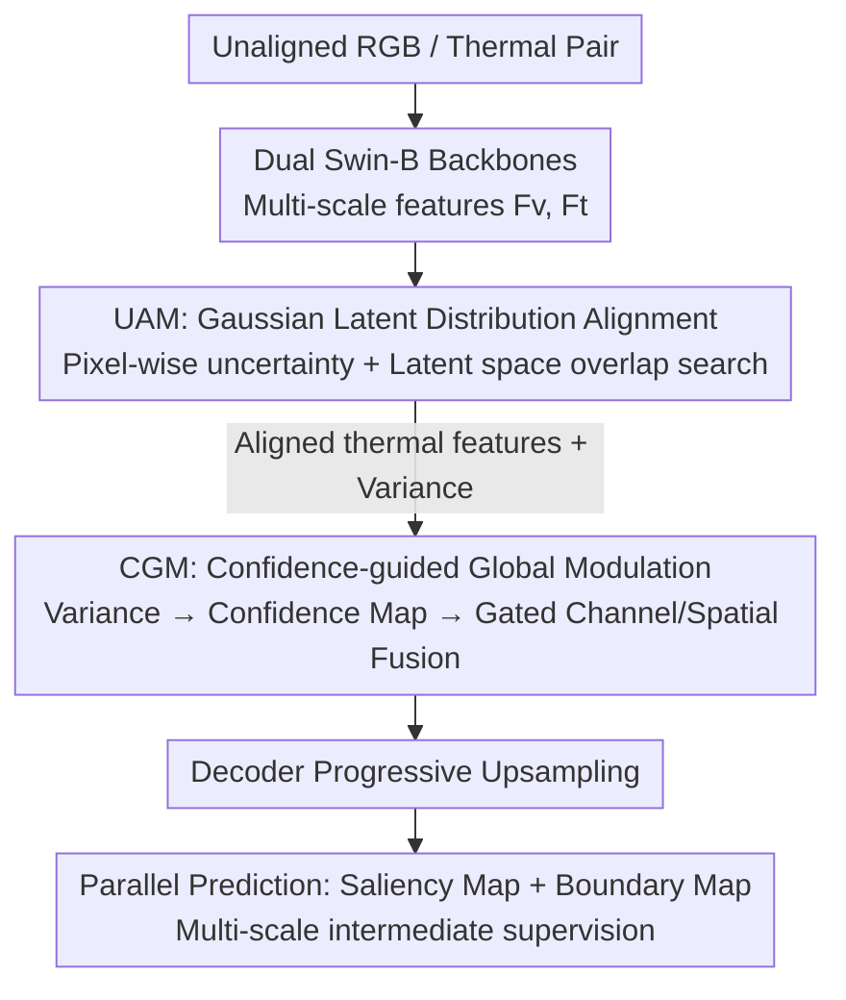

# Uncertainty-Aware Modality Fusion for Unaligned RGB-T Salient Object Detection

**Conference**: CVPR 2026  
**Paper**: [CVF Open Access](https://openaccess.thecvf.com/content/CVPR2026/html/Wang_Uncertainty-Aware_Modality_Fusion_for_Unaligned_RGB-T_Salient_Object_Detection_CVPR_2026_paper.html)  
**Area**: Salient Object Detection / Multimodal Fusion  
**Keywords**: RGB-T Salient Object Detection, Cross-modal Alignment, Uncertainty Modeling, Probabilistic Feature Space, Confidence-Guided Fusion

## TL;DR
Addressing salient object detection with spatially unaligned RGB and thermal images, UMFNet reformulates "alignment" from explicit geometric registration to **uncertainty representation learning** in feature space. It uses pixel-wise Gaussian distributions to implicitly find cross-modal consistent regions and gated fusion guided by uncertainty-derived confidence maps, achieving SOTA across 5 unaligned and 3 aligned benchmarks with better efficiency than registration-based methods.

## Background & Motivation

**Background**: RGB-T Salient Object Detection (SOD) aims to utilize stable structural cues from thermal infrared images under low-light or foggy conditions to compensate for RGB failure in adverse lighting. Mainstream approaches use two-stream encoders to extract RGB/thermal features and fuse them via attention or intermediate interactions, evolving from CNNs to Transformers (e.g., SwinNet, HRTransNet) for global dependency modeling.

**Limitations of Prior Work**: Nearly all these methods rely on an ideal assumption—**strict pixel-level alignment** between RGB and thermal images. However, in real-world systems (especially platforms like UAVs), differences in imaging mechanisms and physical positions of the two sensors lead to varying degrees of spatial misalignment caused by registration errors, parallax, and occlusions. Once misaligned, pixel-wise fusion forces semantically inconsistent content together, leading to feature distortion, noise injection, and performance degradation.

**Key Challenge**: To handle misalignment, one category of methods follows "explicit geometric registration" (affine transformation prediction, deformable convolutions for object-level alignment). However, registration modules are computationally heavy and extremely sensitive to parallax, occlusion, and modal degradation, showing poor robustness. Another category uses "soft alignment" (semantic guidance, cross-modal attention, local window matching), but these still fail to solve pixel-level consistency in **pixel-wise** tasks like SOD, especially when semantics are ambiguous. Worse, even if thermal features are aligned, their spatial **reliability is non-uniform**—some regions provide useful thermal information, while others contain noise from modal conflicts or degradation. Unconditional fusion pollutes the clean RGB features.

**Goal**: Split into two sub-problems: (1) How to learn aligned, robust thermal representations under misalignment without explicit registration; (2) How to dynamically evaluate the local reliability of aligned thermal features during the fusion stage to suppress unreliable noise.

**Key Insight**: The key observation is that misalignment exists at the "pixel coordinate" level, but if the feature of each pixel is modeled as a **locally continuous probability distribution** instead of a deterministic point, their corresponding Gaussian distributions in feature space may still **overlap** even if pixel coordinates are offset. Overlapping regions represent semantically/structurally consistent areas, transforming "alignment" into "finding distribution overlaps in latent space," which naturally eliminates the need for geometric registration.

**Core Idea**: Reformulate unaligned RGB-T fusion as **uncertainty-aware representation learning**—using pixel-wise Gaussian latent variables for implicit alignment (UAM) and confidence maps derived from distribution variance for gated fusion (CGM).

## Method

### Overall Architecture
UMFNet is an encoder-decoder network. The input is a pair of **unaligned** visible and thermal images, with dual parallel Swin-B backbones extracting multi-scale features. Fusion occurs on the encoder side: first, the **UAM (Uncertainty Alignment Module)** reconstructs visible and thermal features into Gaussian latent distributions with pixel-wise uncertainty to find cross-modal consistent regions in latent space, outputting the "aligned thermal feature" $\tilde{F}_t$. Then, the **CGM (Confidence-guided Global Modulation Module)** generates confidence maps from the variances estimated by UAM to perform dual-channel and spatial modulation on RGB and aligned thermal features before fusion. The fused multi-scale features are progressively upsampled in the decoder, with parallel prediction of saliency maps and boundary maps supported by multi-scale intermediate supervision.

### Key Designs

**1. UAM Uncertainty Alignment: Replacing "Geometric Registration" with "Latent Space Distribution Overlap"**

Addressing Limitations of Prior Work (1)—explicit registration is expensive and fragile. UAM stops predicting pixel shifts and instead builds a Gaussian distribution for each pixel $p$ of each modality $M\in\{F_v, F_t\}$:

$$z_M(p)\sim\mathcal{N}\!\left(\mu_M(p),\,\sigma_M^2(p)\right)$$

The mean $\mu_M(p)$ inherits the semantics of the original features, while the variance $\sigma_M^2(p)$ represents the uncertainty of the estimation, both learned adaptively via light-weight attention. This creates a **locally continuous latent feature space** within each modality: even if pixels are spatially offset, their Gaussian distributions in feature space may overlap. Alignment thus becomes "finding overlap" rather than "calculating displacement." To obtain interactable latent representations, reparameterized sampling is used: $\tilde{z}_M(p)=\mu_M(p)+\sigma_M(p)\odot\varepsilon(p),\ \varepsilon\sim\mathcal{N}(0,I)$, making estimations in complex regions more reliable.

To prevent distribution "overconfidence" leading to alignment drift, UAM adds KL regularization to pull the latent distribution of each modality towards a standard normal:

$$D_{\mathrm{KL}}=\tfrac{1}{2}\left(\sigma_M^2+\mu_M^2-1-\log\sigma_M^2\right)$$

Pixel-averaged modality-level regularization loss is calculated to suppress unstable activations in low-confidence regions. Finally, UAM uses light-weight attention to jointly derive a **conditional fusion distribution** $\tilde{z}_{F_{vt}}$ from $\tilde{z}_{F_v}$ and $\tilde{z}_{F_t}$—modeling the alignment relationship rather than single-modality structure. Feeding the thermal latent representation $\tilde{z}_{F_t}$ and this consistency representation $\tilde{z}_{F_{vt}}$ into a mapping function generates the aligned thermal feature map $\tilde{F}_t$. This mechanism shifts alignment from "pixel-level spatial registration" to "latent space probabilistic alignment," bypassing issues of geometric differences and modal heterogeneity.

**2. CGM Confidence-guided Global Modulation: "Trust the Reliable, Suppress the Unreliable"**

Addressing Limitations of Prior Work (2)—the reliability of aligned thermal features is spatially non-uniform, and traditional attention cannot distinguish what to trust. CGM reuses the variance $\sigma_M^2(p)$ calculated by UAM as an uncertainty prior, first converting it into a **reliability map** $\mathrm{InvU}_M(p)$ for each modality: applying Softplus smoothing to log-variance, followed by exponential transformation and channel-wise averaging:

$$\mathrm{InvU}_M(p)^{-1}=\frac{1}{C}\sum_{c=1}^{C}\exp\!\big(\mathrm{s}(\log\sigma_{M,c}^2(p))\big)+\epsilon$$

Higher $\mathrm{InvU}_M(p)$ signifies a more trustworthy estimation. Visible and thermal reliability maps are concatenated and passed through a light-weight pixel-wise convolution $h(\cdot)$, divided by a learnable scaling factor $T$, and normalized via Sigmoid to $[0,1]$ to obtain the confidence map $\mathrm{Conf}(p)=\sigma\!\left(\frac{1}{T}h([\mathrm{InvU}_{F_v}(p),\mathrm{InvU}_{F_t}(p)])\right)$.

This confidence map serves as a gating signal for **channel and spatial** modulation. Channel-level: aligned thermal features $\tilde{F}_t$ undergo global average pooling and non-linear transformation to generate channel scales/biases $\gamma_t,\beta_t$, combined with the broadcasted confidence map: $F_m=(\gamma_t\cdot F_v+\beta_t)\cdot\mathrm{Conf}$. Spatial-level: a spatial prior map $P_t$ is predicted from $\tilde{F}_t$ and element-wise multiplied by the confidence map to get the fusion mask $\tilde{P}_t=P_t\cdot\mathrm{Conf}$. The final output is written in residual form:

$$F_{\mathrm{fused}}=F_v+\tilde{P}_t\cdot(F_m-F_v)$$

This formulation is numerically stable and adaptive: when confidence is low ($\tilde{P}_t\to 0$), it effectively reverts to clean RGB features $F_v$, blocking unreliable thermal information. High confidence allows full injection of thermal cues. Unlike one-size-fits-all attention fusion, CGM allocates fusion intensity based on reliability.

### Loss & Training
A unified multi-task loss jointly optimizes structural modeling, cross-modal alignment, and semantic fusion:

$$\mathcal{L}_{\mathrm{total}}=\lambda_1\mathcal{L}_{\mathrm{sal}}+\lambda_2\mathcal{L}_{\mathrm{bd}}+\lambda_3\left(\overline{D}_{\mathrm{KL}}^{F_v}+\overline{D}_{\mathrm{KL}}^{F_t}\right)$$

- **Saliency Branch** $\mathcal{L}_{\mathrm{sal}}$: Dual cross-entropy supervision on four multi-scale predictions and the final fusion output.
- **Boundary Branch** $\mathcal{L}_{\mathrm{bd}}$: Combination of BCE, Dice, and a "Tolerance Dice" loss. Tolerance Dice applies max pooling to GT boundary maps to relax strict pixel-wise alignment, alleviating edge blurring in real scenes.
- **Regularization Branch**: Incorporates KL regularization of UAM latent distributions into the total objective to stabilize distributions and suppress over-activation in low-confidence regions.

Implementation: PyTorch, 4×GTX3090; Swin-B backbone initialized with pre-trained weights; input resized to $384\times384$; Adam optimizer, batch 64, initial learning rate $5\times10^{-5}$ with 10x decay every 100 epochs, trained for 200 epochs.

## Key Experimental Results

### Main Results
Compared against 12 SOTA methods (including those specifically designed for misalignment: DCNet/SACNet/PCNet) on 5 unaligned/weakly-aligned and 3 aligned benchmarks. Metrics: S-measure ($S_\alpha$), E-measure ($E_S$), weighted F-measure ($F_\beta^w$). UMFNet achieved SOTA on almost all metrics across the 5 unaligned/weakly-aligned datasets.

| Dataset (Condition) | Metric | UMFNet | Prev. SOTA | Gain |
|--------|------|------|----------|------|
| UVT20K (Hardest/Unaligned) | $S_\alpha$ / $E_S$ / $F_\beta^w$ | 0.890 / 0.918 / 0.836 | PCNet 0.871 / 0.911 / 0.808 | +1.9 / +0.7 / +2.8 pt |
| UVT2000 (Unaligned) | $S_\alpha$ / $E_S$ / $F_\beta^w$ | 0.837 / 0.855 / 0.708 | PCNet 0.819 / 0.862 / 0.679 | $F_\beta^w$ +2.9 pt |
| un-VT5000 (Weakly Aligned) | $F_\beta^w$ | 0.887 | SACNet 0.799 | +8.3 pt (Original report) |
| un-VT1000 (Weakly Aligned) | $S_\alpha$ / $E_S$ / $F_\beta^w$ | 0.941 / 0.972 / 0.927 | PCNet 0.922 / 0.964 / 0.904 | +1.9 / +0.8 / +2.3 pt |
| VT821 (Aligned/Standard) | $S_\alpha$ / $E_S$ / $F_\beta^w$ | 0.930 / 0.960 / 0.907 | PCNet 0.915 / 0.945 / 0.873 | +1.5 / +1.5 / +3.4 pt |

> ⚠️ The original paper claims an 8.3% $F_\beta^w$ gain over SACNet on un-VT5000, although the table shows UMFNet at 0.887 and SACNet at 0.799 (an 8.8 pt difference); the original report is followed. UMFNet also leads on 3 **standard aligned** benchmarks (VT5000/VT1000/VT821), proving it is effective for aligned scenarios as well.

### Efficiency Comparison
Ours achieves superior accuracy while maintaining significantly lower computational costs than other specialized unaligned methods:

| Method | GFLOPs | Params (M) | FPS |
|------|--------|-----------|-----|
| Baseline | 126.38 | 213.18 | 24.76 |
| **UMFNet** | **126.10** | 217.60 | 22.16 |
| SACNet | 143.33 | 300.12 | 22.85 |
| PCNet | 148.36 | 291.75 | 11.31 |

UAM/CGM add almost no FLOPs compared to the baseline (126.10 vs 126.38), with only +4M parameters and a slight FPS decrease to 22.16. In contrast, PCNet slows to 11.31 FPS, and SACNet has much larger parameters/FLOPs. The two modules provide significant gains with nearly zero extra overhead.

### Ablation Study
> ⚠️ Note: Due to potential OCR misalignments in the source table values for Tables 3/4, only **qualitative conclusions** from the authors are provided below.

| Configuration | Qualitative Conclusion |
|------|---------|
| baseline (w/o UAM+CGM) | Lowest performance, proving simple fusion cannot handle unaligned inputs. |
| w/o UAM (keeping CGM, disabling probabilistic alignment) | Target drop; Gaussian latent representation is critical for cross-modal consistency. |
| w/o CGM (using aligned features but removing confidence fusion) | Significant degradation in noisy/unreliable thermal scenarios. |
| w/o $D_{\mathrm{KL}}$ | Clear performance drop; KL regularization is necessary to stabilize latent distributions. |
| w/o Conf | Decreased robustness and weakened ability to suppress noise in uncertain regions. |
| w/o CAM (Channel Modulation) | Reduced semantic discriminative power across channels. |
| w/o SAM (Spatial Modulation) | Decreased spatial localization precision. |
| w/o $\mathcal{L}_{\mathrm{bd}}$ | Worse object contours, validating the role of boundary supervision. |

### Key Findings
- **Shallow Fusion is Most Effective**: Inserting UAM/CGM at shallow layers is better than deep layers. Shallow features have higher cross-modal heterogeneity, so early alignment resolves differences more effectively. Deep features already have convergent semantics, reducing alignment demand.
- **UAM and CGM are Complementary**: UAM handles semantic alignment while CGM ensures fusion robustness; their synergy provides stability under both misalignment and modal variations.
- **Qualitative Scenes**: Ours correctly suppresses misleading regions and preserves boundaries/details in five difficult scenarios: false targets (thermal almost invalid), complex backgrounds, multiple objects, small objects, and low light.

## Highlights & Insights
- **Elegant Paradigm Shift**: Moving "alignment" from coordinate-space geometric registration to feature-space "distribution overlap" is the most impressive "Aha!" moment. Replacing fragile registration with "pixel misalignment but Gaussian overlap" is insightful.
- **Efficient Uncertainty Utilization**: The variance estimated by UAM is used both for KL regularization to stabilize alignment and as a confidence prior for CGM gated fusion. This unified use of uncertainty across "alignment" and "fusion" is very economical.
- **Numerical Stability of Residual Gating**: $F_{\mathrm{fused}}=F_v+\tilde{P}_t\cdot(F_m-F_v)$ automatically reverts to pure RGB when confidence is low, acting as a safety valve. This trick is transferable to any fusion scenario with non-uniform modality reliability (e.g., RGB-D, RGB-Event).
- **Accuracy-Efficiency Win**: Doubling down on probabilistic alignment outperformed heavy registration methods with nearly zero extra FLOPs, proving that probabilistic alignment is more efficient than geometric registration.

## Limitations & Future Work
- **Reliance on Gaussian/Local Continuity Assumptions**: When misalignment is extreme or semantic content is entirely different (e.g., thermal completely fails on a false target), reliable overlap in latent space may not exist. The impact of misalignment magnitude on performance was not quantified.
- **Ablation Data Uncertainty**: Precise drop magnitudes for modules could not be verified due to data discrepancies in the source, relying instead on qualitative conclusions.
- **Large Parameter Count**: 217.6M parameters (mostly from Swin-B) is still heavy for edge/UAV deployment. Light-weight backbones combined with probabilistic alignment should be explored.
- **Generalizability**: While the philosophy is general, it was only validated on RGB-T SOD, not on other unaligned tasks like RGB-T object detection or semantic segmentation.

## Related Work & Insights
- **vs. Explicit Geometric Registration (DCNet / SACNet / PCNet etc.)**: These use affine prediction or deformable convolutions for coordinate alignment, which are computationally heavy and sensitive to parallax. UMFNet skips geometric registration entirely, using implicit alignment via distribution overlap, proving faster and more stable.
- **vs. Attention Soft Alignment / Cross-modal Fusion**: Traditional attention assumes thermal features are equally reliable everywhere. CGM uses uncertainty-derived confidence maps for regional gating, solving the problem of "non-uniform pixel-level reliability" that soft alignment often ignores.
- **vs. Uncertainty Representation Learning**: This work applies VAE-style tools (Gaussian latent variables, reparameterization, KL regularization) specifically to **cross-modal alignment**. It shows that uncertainty is not just a measure of confidence but can serve as a direct signal for alignment and gating.

## Rating
- Novelty: ⭐⭐⭐⭐⭐ "Implicit alignment via distribution overlap" reformulates the unaligned fusion paradigm elegantly.
- Experimental Thoroughness: ⭐⭐⭐⭐☆ Solid results across 8 benchmarks and 12 SOTA methods, though ablation data discrepancies are a minor issue.
- Writing Quality: ⭐⭐⭐⭐☆ Clear motivation, complete formulas, and highly readable (though dense) architecture diagrams.
- Value: ⭐⭐⭐⭐⭐ Surpassing heavy registration methods with zero extra cost and providing a transferable residual confidence gate makes this highly practical.

<!-- RELATED:START -->

## Related Papers

- [\[CVPR 2026\] M4-SAM: Multi-Modal Mixture-of-Experts with Memory-Augmented SAM for RGB-D Video Salient Object Detection](m4-sam_multi-modal_mixture-of-experts_with_memory-augmented_sam_for_rgb-d_video_.md)
- [\[CVPR 2026\] Generalizable Co-Salient Object Detection via Mixed Content-Style Modulation](generalizable_co-salient_object_detection_via_mixed_content-style_modulation.md)
- [\[CVPR 2026\] RDNet: Region Proportion-Aware Dynamic Adaptive Salient Object Detection Network in Optical Remote Sensing Images](rdnet_region_proportion-aware_dynamic_adaptive_salient_object_detection_network_.md)
- [\[CVPR 2026\] TF-SSD: A Strong Pipeline via Synergic Mask Filter for Training-free Co-salient Object Detection](tf-ssd_a_strong_pipeline_via_synergic_mask_filter_for_training-free_co-salient_o.md)
- [\[CVPR 2025\] G2HFNet: GeoGran-Aware Hierarchical Feature Fusion Network for Salient Object Detection in Optical Remote Sensing Images](../../CVPR2025/segmentation/binwang2hfnet_geogran-aware_hierarchical_feature_fusion_network_for_salient_obje.md)

<!-- RELATED:END -->
