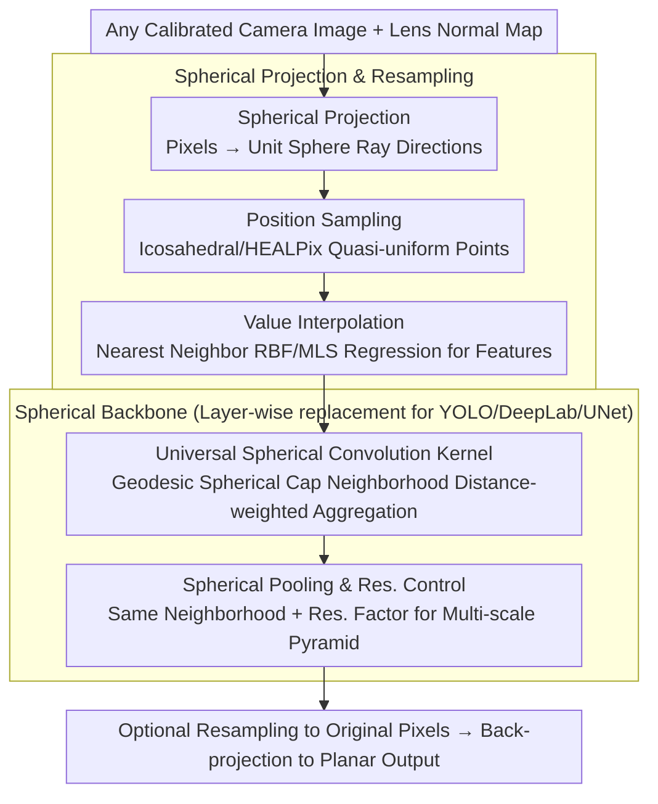

# Unified Spherical Frontend: Learning Rotation-Equivariant Representations of Spherical Images from Any Camera

**Conference**: CVPR 2026  
**arXiv**: [2511.18174](https://arxiv.org/abs/2511.18174)  
**Code**: [https://tomnotch.com/USF](https://tomnotch.com/USF) (Project Page)  
**Area**: Image Segmentation  
**Keywords**: Spherical Convolution, Rotation Equivariance, Wide-angle Cameras, Panoramic Images, Lens-agnostic

## TL;DR
USF proposes a modular, lens-agnostic spherical vision frontend. By projecting arbitrary calibrated camera images onto a unit sphere and performing spatial-domain spherical resampling, convolution, and pooling, it naturally guarantees rotation equivariance using only distance-weighted kernels. It demonstrates zero-shot generalization robustness to random rotations and cross-lens scenarios in classification, detection, and segmentation tasks.

## Background & Motivation

1. **Background**: Modern perception systems increasingly use wide-angle cameras like fisheye and panoramic lenses. However, mainstream CNN pipelines still assume the pinhole camera model, performing convolutions on 2D image grids.

2. **Limitations of Prior Work**: (a) When wide-angle images are fed directly into planar CNNs, adjacent pixels in image space do not reflect physical adjacency (e.g., pixels near poles in equirectangular projections are distant on the image but physically adjacent), causing the spatial assumptions of convolution kernels to fail. (b) Planar kernels are fixed to the image coordinate system and are sensitive to global rotations. (c) Traditional spherical CNNs (e.g., S2CNN) require expensive spherical harmonic transforms, limiting resolution and efficiency.

3. **Key Challenge**: According to the *Theorema Egregium*, no 2D projection can preserve the intrinsic curvature of a sphere—any planar representation inevitably introduces distortion. Thus, it is necessary to operate directly on the sphere. However, existing spherical CNNs either rely on specific grids/topologies (e.g., polyhedral subdivision, HEALPix) or require computationally intensive spherical harmonic domain transforms.

4. **Goal**: (a) How to obtain distortion-free spherical signals from arbitrary calibrated cameras? (b) How to perform efficient spherical convolutions without spherical harmonic transforms? (c) How to ensure rotation equivariance? (d) How to make the solution plug-and-play with existing architectures (YOLO, DeepLab, UNet)?

5. **Key Insight**: Pixels on the sphere are treated as unordered point sets rather than structured grids. Non-uniform density is handled by decoupling position sampling and value interpolation, and rotation equivariance is guaranteed through weight functions solely dependent on geodesic distance.

6. **Core Idea**: Project arbitrary camera images to the sphere $\rightarrow$ Uniform resampling $\rightarrow$ Perform spherical convolution in the spatial domain with pure distance-weighted kernels. This is naturally equivariant, lens-agnostic, and plug-and-play.

## Method

### Overall Architecture
The USF pipeline consists of six stages: (i) Combining planar images with lens normal maps to form spherical images; (ii) Handling varying pixel densities on the sphere produced by different lenses; (iii) Uniform spherical resampling; (iv) Feeding into a backbone composed of spherical convolution and pooling layers; (v) Optionally resampling back to original spherical pixel positions; (vi) Back-projecting to planar images. Each stage is fully decoupled and independently configurable.

### Key Designs

**1. Spherical Projection & Resampling: Converting arbitrary camera images into quasi-uniform unordered point sets on the sphere**

The fundamental issue with feeding wide-angle images directly into planar CNNs is that adjacent pixels on the image grid may not be physically adjacent (especially near poles in equirectangular projections). USF first maps each image coordinate $\mathbf{u} \in \mathbb{R}^2$ via a lens normal map to a ray direction $\mathbf{p}_\mathbf{u} \in \mathbb{S}^2$, returning pixels to their true spherical positions. Since projection density is non-uniform (e.g., fisheyes are dense at poles), a layer of quasi-uniform sampling points is placed on the sphere. "Position" and "Value" are decoupled: position sampling places uniform points (using Icosahedral Goldberg polyhedra, HEALPix, Fibonacci grids, or quasi-random sampling), while value interpolation aggregates features from $N$-nearest neighbors or spherical cap neighborhoods using RBF kernels or MLS regression. Using "unordered point sets" instead of fixed grid structures allows the method to handle partial FoV coverage—common in real wide-angle cameras—without being tied to specific topologies.

**2. Universal Spherical Convolution Kernel: Achieving natural rotation equivariance via geodesic distance**

To avoid the $O(\ell^3)$ complexity of spherical harmonic transforms in traditional spherical CNNs, USF defines spherical convolution as weighted aggregation over local spherical cap neighborhoods:

$$x_o = \frac{1}{|\mathcal{N}(\mathbf{p}_o)|}\sum_{k \in \mathcal{N}(\mathbf{p}_o)} x_k \prod_m f_{weight}^{(m)}(\mathcal{M}_m(\mathbf{p}_k, \mathbf{p}_o))$$

The neighborhood $\mathcal{N}(\mathbf{p}_o)$ includes all points within a geodesic distance $d(\mathbf{p}_k, \mathbf{p}_o) \leq r$. The weights are decoupled into distance and direction components. If only the distance component is used (zonal/radial filter), the kernel is **naturally** rotation-equivariant because geodesic distance is invariant under $SO(3)$ rotations. Adding the direction component introduces gauge dependence and breaks equivariance but increases expressive power (e.g., distinguishing "6" from "9"). This decoupling serves as a "knob" to balance rotation robustness and expressivity.

**3. Spherical Pooling & Resolution Control: Multi-scale processing on the sphere**

To replace multi-scale backbones like YOLO or UNet, USF implements spherical pooling using the same geodesic neighborhood: $x_o = f_{pool}(x_k: k \in \mathcal{N}(\mathbf{p}_o))$. Output point positions are controlled by a resolution factor in the position sampler to build a multi-scale pyramid. Since coordinates are fixed per layer for a given camera, all neighborhood structures and geometric measurements are cached after the first forward pass, ensuring zero additional geometric overhead during inference.

### Loss & Training
Standard loss functions are used for each downstream task. The core strategy is to replace planar layers with spherical layers while keeping all other training settings identical for fair comparison. Rotation testing is implemented by rotating spherical vectors and resampling.

## Key Experimental Results

### Main Results

| Task | Model | Training | NR (No Rotation) | RR (Random Rotation) |
|------|------|------|-------------|--------------|
| MNIST Classification | Planar CNN | NR | 98.45% | 41.08% |
| | S2CNN (Harmonic) | NR | 96% | 94% |
| | SO(3) CNN (Harmonic) | NR | 98.7% | 98.1% |
| | **Spherical Dis PWC×3** | **NR** | 87.18% | **85.43%** |
| | Spherical Dis×Dir MLP | NR | 98.28% | 43.54% |
| Object Detection (PANDORA) | Planar YOLOv11 | NR | mAP10=39.65% | mAP10=12.71% |
| | Planar YOLOv11 | RR | mAP10=27.76% | mAP10=28.01% |
| | **Spherical YOLOv11** | **NR** | mAP10=29.54% | **29.59%** |
| Sem. Seg. (Stanford 2D-3D-S) | Planar DeepLab v3 | NR | mIoU=35.01% | mIoU=12.11% |
| | Planar DeepLab v3 | RR | mIoU=32.29% | mIoU=38.30% |
| | **Spherical DeepLab v3** | **NR** | mIoU=28.78% | **28.09%** |

### Ablation Study (Semantic Segmentation DeepLab v3)

| Position Sampler | Distance Bins | NR mIoU | RR mIoU | Description |
|-----------|---------|---------|---------|------|
| **Icosahedron** | **3** | 28.78% | **28.09%** | Best equivariance preservation |
| Icosahedron | 4 | 27.99% | 23.50% | Overfitting with more bins |
| Icosahedron | 5 | 29.66% | 22.82% | NR increases, RR drops significantly |
| Fibonacci | 3 | 31.69% | 12.60% | Non-uniformity breaks equivariance |
| HEALPix | 3 | 29.59% | 13.87% | Similar to Fibonacci |
| Equirectangular | 3 | 30.25% | 12.87% | Severe distortion at poles |

### Key Findings
- **Distance-only kernels ensure rotation robustness**: Without rotation augmentation, spherical models show <1% performance drop under random rotation (e.g., MNIST 87.18%$\rightarrow$85.43%), whereas planar models collapse (98.45%$\rightarrow$41.08%).
- **Equivariance vs. Expressivity Trade-off**: Adding directional weights achieves NR performance close to planar CNNs but reduces RR performance, indicating introduced gauge dependence.
- **Sampler uniformity is critical**: Icosahedron is the most stable in RR tests; samplers like Fibonacci/HEALPix show higher NR but significantly lower RR.
- **Cross-lens generalization**: Spherical models significantly outperform planar models when transferring from Pinhole training to Panoramic testing (mIoU 35.62% vs 19.57%).

## Highlights & Insights
- **Distance-only Equivariance**: The insight that geodesic distance-based weights provide natural $SO(3)$ invariance is the core contribution. This is simpler than harmonic or group-equivariant methods.
- **Decoupled Modularity**: The projection, sampling, interpolation, and backbone are independent, allowing plug-and-play replacement for any planar CNN.
- **Geometric Caching**: Neighborhood structures are calculated once for a specific camera, enabling efficient real-time deployment.
- **Generalized Evidence**: Demonstration across YOLO, DeepLab, and UNet proves the architectural versatility.

## Limitations & Future Work
- Pure distance kernels present a trade-off between robustness and absolute accuracy (NR performance is slightly lower than planar models).
- Orientation-dependent targets (e.g., rotated bounding box angles) require gauge-equivariant methods.
- Not yet extended to Vision Transformers—adapting patch embeddings and positional encodings to spheres remains an open problem.
- Scalability of neighborhood searches (KNN/radius search) for very high resolutions may become a bottleneck.

## Related Work & Insights
- **vs S2CNN/SO(3) CNN**: Harmonic methods are more accurate at low resolutions but computational costs scale poorly ($O(\ell^3)$). USF operates in the spatial domain for high-resolution scalability.
- **vs SphereNet**: SphereNet samples features on tangent planes and depends on predefined sampling. USF treats data as unordered point sets, providing more flexibility.
- **vs DISCO**: DISCO uses radial-directional kernels but assumes full spherical coverage and fixed discretization. USF supports arbitrary FoV.

## Rating
- Novelty: ⭐⭐⭐⭐
- Experimental Thoroughness: ⭐⭐⭐⭐
- Writing Quality: ⭐⭐⭐⭐
- Value: ⭐⭐⭐⭐

<!-- RELATED:START -->

## Related Papers

- [\[CVPR 2026\] REL-SF4PASS: Panoramic Semantic Segmentation with REL Depth Representation and Spherical Fusion](rel-sf4pass_panoramic_semantic_segmentation_with_rel_depth_representation_and_sp.md)
- [\[CVPR 2026\] FoV-Net: Rotation-Invariant CAD B-rep Learning via Field-of-View Ray Casting](fov-net_rotation-invariant_cad_b-rep_learning_via_field-of-view_ray_casting.md)
- [\[CVPR 2026\] SAMTok: Representing Any Mask with Two Words](samtok_representing_any_mask_with_two_words.md)
- [\[CVPR 2026\] SPAR: Single-Pass Any-Resolution ViT for Open-Vocabulary Segmentation](spar_single-pass_any-resolution_vit_for_open-vocabulary_segmentation.md)
- [\[CVPR 2026\] 3M-TI: High-Quality Mobile Thermal Imaging via Calibration-free Multi-Camera Cross-Modal Diffusion](3m-ti_high-quality_mobile_thermal_imaging_via_calibration-free_multi-camera_cros.md)

<!-- RELATED:END -->
