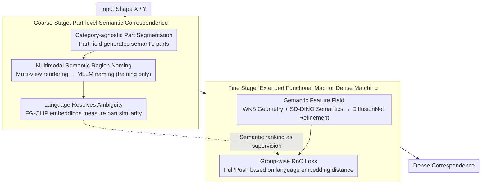

# Universal 3D Shape Matching via Coarse-to-Fine Language Guidance

**Conference**: CVPR 2026  
**arXiv**: [2602.19112](https://arxiv.org/abs/2602.19112)  
**Code**: None  
**Area**: Segmentation  
**Keywords**: 3D Shape Matching, Functional Maps, Language Guidance, Contrastive Learning, Cross-Category Correspondence  

## TL;DR

Ours proposes UniMatch, a semantic-aware coarse-to-fine 3D shape matching framework. The coarse stage establishes part-level correspondence through category-agnostic 3D segmentation, MLLM naming, and FG-CLIP language embeddings. The fine stage learns dense correspondence within an extended functional map framework using a Group-wise Ranking Contrastive (RnC) Loss, achieving universal matching for cross-category and non-isometric shapes.

## Background & Motivation

3D shape matching is a core task in computer vision and graphics, widely used in texture transfer, parametric human modeling, robotic manipulation, and shape interpolation. Current methods face three key challenges:

**Isometric assumption of functional map methods**: Classic functional maps and their deep learning variants rely on near-isometric assumptions. Performance degrades under strong non-isometric deformations or topological noise, and pure geometric cues struggle to support cross-category matching.

**Limitations of semantic methods**: Diff3F relies on diffusion models but lacks universality; DenseMatcher requires manual part annotation; ZSC needs predefined part proposals, limiting generalization to open-world objects.

**Lack of a universal solution**: Existing methods either handle only intra-category shapes or require category-specific priors, failing to process "in-the-wild" objects in a fully unsupervised setting.

The Core Idea of UniMatch: Elevating "coarse" semantic cues into "fine" correspondences—first establishing part-level semantic associations via language, then driving dense matching through ranking contrastive learning.

## Method

### Overall Architecture

UniMatch aims to solve the universal matching problem where points must be aligned even if shapes are from different categories or are non-isometric. The Mechanism follows a coarse-to-fine strategy: the coarse stage does not directly address vertex correspondence but segments the shape into semantic parts, using natural language to link cross-category parts (e.g., a "human mouth" and a "dog muzzle") to create a structured part-level association map; the fine stage then utilizes this semantic prior to learn dense vertex-wise correspondences within an extended functional map framework.

The pipeline is as follows: Input shapes are first processed by PartField for category-agnostic part segmentation, rendered into multi-view images for MLLM-based naming, and converted into language embeddings via FG-CLIP. These embeddings serve both as coarse correspondences and as supervision for subsequent ranking contrastive learning. In the fine stage, geometric descriptors and SD-DINO semantic features are concatenated and refined by DiffusionNet. Finally, the Group-wise RnC Loss compresses the ordinal relationships from language embeddings into point-wise features to achieve dense correspondence.

### Key Designs

**1. Category-agnostic Part Segmentation: Segmenting parts before matching**

A major hurdle in cross-category matching is the inability to preset part categories—humans and octopuses do not share a common part list. UniMatch uses PartField to directly output a set of non-overlapping semantic regions $\mathcal{R}_x$ from the input shape $\mathcal{X}$. It only requires the number of parts $n_\mathcal{R}$ and avoids predefined part proposals or category prompts. The Design Motivation for avoiding text-guided segmentation includes: text-referring methods fail on textureless/low-res meshes; they require predefined names which limits open-vocabulary generalization; they often fail to cover the whole shape; and PartField is more computationally efficient during feed-forward inference. This step ensures a complete, category-agnostic segmentation as a carrier for semantic alignment.

**2. Multimodal Semantic Region Naming: MLLM-based naming during training only**

Segmented parts are merely geometric blocks; cross-category association requires knowing "what" they are. UniMatch renders each 3D mask into multi-view images, overlays the 2D masks, and prompts GPT-5 to name the highlighted regions. Masks with pixel ratios below 5% are discarded as noise. The 2D names are aggregated back to the 3D domain using camera parameters. A key engineering trade-off: MLLMs are only involved during training for data processing; inference is entirely MLLM-free, avoiding the deployment burden found in methods like ZSC.

**3. Language Resolving Ambiguity: Implicit correspondence via continuous language embeddings**

Simple part names are insufficient—"mouth" and "muzzle" are different strings, and hard string matching would fail. UniMatch maps names into the FG-CLIP language embedding space $\mathcal{E} \in \mathbb{R}^{C_{\text{lang}}}$, using embedding distance to measure semantic similarity. A human "mouth" and a dog "muzzle" naturally reside near each other in this space, forming an implicit pair. Continuous embeddings handle phrasing ambiguity better than lookup tables, and the embedding distance naturally provides a semantic ranking relationship utilized by the downstream ranking contrastive loss.

**4. Semantic Feature Field: Combining geometric descriptors and SD-DINO features**

Pure geometric descriptors lack discriminative power in cross-category, non-isometric scenarios, causing functional map degradation. The fine stage builds a hybrid feature for each vertex: geometric WKS descriptors $\boldsymbol{f}_{\text{geo}}$ are concatenated with high-resolution SD-DINO semantic features $\boldsymbol{f}_{\text{sem}}$ (extracted via FeatUp) and refined through DiffusionNet:

$$\boldsymbol{f}_{\text{in}} = \text{Concat}(\boldsymbol{f}_{\text{geo}}, \boldsymbol{f}_{\text{sem}})$$

For untextured meshes, SyncMVD is used for view-consistent texture synthesis before feature extraction to prevent feature collapse in 2D foundation models. Ablations show that removing semantic features increases SNIS error from 0.19 to 0.49, proving semantic information is vital for dense matching.

**5. Group-wise Ranking Contrastive Loss (Group-wise RnC Loss): Injecting ordinal relations into features**

Standard contrastive losses are unsuitable for transferring semantic rankings because they require explicit positive/negative samples, whereas here we have continuous "near-to-far" rankings relative to an anchor. The RnC loss operates on these ordinal signals: for an anchor feature $\boldsymbol{f}_i^x$ on the source, target vertices are dynamically grouped into reference groups $\mathcal{G}_j^y$ based on language embedding distances. The "pulling probability" for a group relative to the anchor is defined as:

$$\mathbb{P}(\mathcal{G}_j^y | \boldsymbol{f}_i^x, \mathcal{S}_{i,j}) = \frac{\sum_l \exp(\text{sim}(\boldsymbol{f}_i^x, \boldsymbol{f}_l^y)/\tau)}{\sum_{\boldsymbol{f}_k^y \in \mathcal{S}_{i,j}} \exp(\text{sim}(\boldsymbol{f}_i^x, \boldsymbol{f}_k^y)/\tau)}$$

The total loss is the average negative log-likelihood across all source anchors:

$$\mathcal{L}_{\text{RnC}} = \frac{1}{n_x} \sum_{i=1}^{n_x} \ell_{\text{RnC}}^{(i)}(\mathcal{X}, \mathcal{Y})$$

This provides two benefits: first, it reduces the point-wise contrastive complexity from $O(n_x \times n_y)$ to group-wise $O(n_x \times n_R)$ where $n_R \ll n_y$; second, group partitioning is determined by language embedding distances, allowing the loss to directly model semantic hierarchies for semantically consistent matching.

### A Complete Example

Example: Matching a "Human" $\mathcal{X}$ to a "Dog" $\mathcal{Y}$. PartField segments the human into head/torso/limbs and the dog similarly. At this point, parts are just geometric blocks. After multi-view rendering, GPT-5 names the human facial region "mouth" and the dog's corresponding region "muzzle." Small fragments like nails are filtered. FG-CLIP embeddings show "mouth" is close to "muzzle" but far from "leg," establishing a coarse implicit correspondence. In the fine stage, a vertex in the human mouth acts as anchor $\boldsymbol{f}_i^x$. Dog vertices are grouped: the muzzle group is closest, other head parts are secondary, and the leg group is furthest. The RnC loss pulls the anchor toward the muzzle group and pushes it away from the leg group. After convergence, human mouth vertices stably map to the dog's muzzle despite the massive geometric difference.

### Loss & Training

The total loss combines the functional map objective and the ranking contrastive loss:

$$\mathcal{L} = \mathcal{L}_{\text{fm}} + \mathcal{L}_{\text{RnC}}$$

The functional map objective includes:
- Data preservation loss $\mathcal{L}_{\text{data}}$: To retain refined features.
- Regularization loss $\mathcal{L}_{\text{reg}}$: To ensure bijectivity and orthogonality.
- Coupling loss $\mathcal{L}_{\text{couple}}$: To ensure consistency between soft correspondence and the functional map.

The refiner uses DiffusionNet based on the URSSM framework. MLLM prompts are used only during training.

## Key Experimental Results

### Main Results

**Cross-category Shape Matching** (Mean Geodesic Error, lower is better):

| Method | SNIS | TOSCA | SHREC07 |
|------|------|-------|---------|
| ZoomOut | 0.51 | 0.55 | 0.57 |
| URSSM | 0.49 | 0.53 | 0.49 |
| Diff3F | 0.57 | 0.45 | 0.50 |
| ZSC | 0.36 | 0.56 | 0.60 |
| DenseMatcher | 0.28 | 0.30 | 0.39 |
| **Ours** | **0.19** | **0.23** | **0.37** |

**Non-isometric Shape Matching** (Mean Geodesic Error x100):

| Method | SMAL | TOPKIDS |
|------|------|---------|
| URSSM | 6.0 | 8.9 |
| DenseMatcher | 4.7 | 6.2 |
| **Ours** | **4.8** | **5.9** |

**Near-isometric Shape Matching** (Mean Geodesic Error x100):

| Method | FAUST | SCAPE | SHREC19 |
|------|-------|-------|---------|
| URSSM | 1.6 | 1.9 | 5.7 |
| DenseMatcher | 1.6 | 2.0 | 3.1 |
| **Ours** | **1.6** | **1.9** | **3.2** |

### Ablation Study

| Variant | SNIS | TOSCA | SHREC07 |
|------|------|-------|---------|
| **Language Embedding Model** | | | |
| CLIP | 0.21 | 0.26 | 0.37 |
| SigLip | 0.19 | 0.24 | 0.37 |
| FG-CLIP (Ours) | **0.19** | **0.23** | **0.37** |
| **Semantic Feature Field** | | | |
| Geo features only | 0.49 | 0.53 | 0.49 |
| Geo + Sem (Ours) | 0.22 | 0.26 | 0.39 |
| **Contrastive Loss** | | | |
| SupCon loss | 0.21 | 0.29 | 0.40 |
| No contrastive loss | 0.22 | 0.26 | 0.39 |
| Group-wise RnC (Ours) | **0.19** | **0.23** | **0.37** |

### Key Findings

1. Huge advantage in cross-category matching: Reduced error from DenseMatcher's 0.28 to 0.19 on SNIS, a 32% Gain.
2. Semantic feature field is critical: Without it, error jumps from 0.19 to 0.49 (SNIS), showing geometric descriptors are insufficient for semantic matching.
3. Group-wise RnC outperforms SupCon: SupCon relies on discrete positive samples and cannot consume the continuous semantic relations provided by language embeddings.
4. FG-CLIP outperforms standard CLIP, especially on TOSCA (0.23 vs 0.26), confirming the importance of fine-grained embeddings.
5. Ours achieves SOTA or comparable performance across near-isometric, non-isometric, and cross-category settings, achieving true "universality."
6. Learned features exhibit emergent semantically consistent co-segmentation capabilities.

## Highlights & Insights

- **Language as a Universal Semantic Bridge**: Using natural language embeddings to solve semantic alignment in cross-category matching is elegant—"mouth" and "muzzle" naturally associate in continuous space.
- **Coarse-to-fine Cascade Design** avoids the difficulties of cross-modal alignment in end-to-end training. The coarse stage provides structured supervision, while the fine stage focuses on refinement.
- **Group-wise RnC Loss** is a core innovation: It reduces $O(n^2)$ point-wise contrast to $O(n \times n_R)$ and leverages semantic ranking instead of binary positive/negative labels.
- MLLMs are used only for training data processing, eliminating large model calls during inference for better deployment.

## Limitations & Future Work

- Misalignment of identical parts (e.g., all chair legs named "leg") requires incorporating object orientation info.
- Dependency on PartField segmentation quality—errors here propagate downstream.
- Textureless shapes require SyncMVD synthesis, introducing computational overhead and potential artifacts.
- End-to-end efficiency (PartField + GPT-5 + SD-DINO) has not been fully evaluated.
- Matching remains challenging for extreme topological differences (e.g., octopus vs. table).

## Rating

- **Novelty**: ⭐⭐⭐⭐⭐ — First systematic introduction of language guidance to 3D shape matching; coarse-to-fine framework and RnC Loss are original contributions.
- **Experimental Thoroughness**: ⭐⭐⭐⭐⭐ — Covers six benchmarks across three settings with comprehensive ablations and generalization demos.
- **Writing Quality**: ⭐⭐⭐⭐ — Clear methodology and rich illustrations, though some MLLM prompt details are in the appendix.
- **Value**: ⭐⭐⭐⭐⭐ — Establishes a new paradigm for universal 3D shape matching with broad impact on graphics and robotics.

## Related Papers

- [\[CVPR 2026\] MV3DIS: Multi-View Mask Matching via 3D Guides for Zero-Shot 3D Instance Segmentation](mv3dis_multi-view_mask_matching_via_3d_guides_for_zero-shot_3d_instance_segmenta.md)
- [\[CVPR 2026\] SegGBC: Justifiable Coarse-to-Fine Granular-Ball Computing for Enhancing Clustering Image Segmentation](seggbc_justifiable_coarse-to-fine_granular-ball_computing_for_enhancing_clusteri.md)
- [\[CVPR 2026\] FlowDIS: Language-Guided Dichotomous Image Segmentation with Flow Matching](flowdis_language-guided_dichotomous_image_segmentation_with_flow_matching.md)
- [\[CVPR 2026\] GeoGuide: Hierarchical Geometric Guidance for Open-Vocabulary 3D Semantic Segmentation](geoguide_hierarchical_geometric_guidance_for_open-vocabulary_3d_semantic_segment.md)
- [\[ECCV 2024\] Active Coarse-to-Fine Segmentation of Moveable Parts from Real Images](../../ECCV2024/segmentation/active_coarsetofine_segmentation_of_moveable_parts_from_real.md)

<!-- RELATED:END -->

<!-- RELATED:START -->

## Related Papers

- [\[CVPR 2026\] SegGBC: Justifiable Coarse-to-Fine Granular-Ball Computing for Enhancing Clustering Image Segmentation](seggbc_justifiable_coarse-to-fine_granular-ball_computing_for_enhancing_clusteri.md)
- [\[CVPR 2026\] FlowDIS: Language-Guided Dichotomous Image Segmentation with Flow Matching](flowdis_language-guided_dichotomous_image_segmentation_with_flow_matching.md)
- [\[CVPR 2026\] MV3DIS: Multi-View Mask Matching via 3D Guides for Zero-Shot 3D Instance Segmentation](mv3dis_multi-view_mask_matching_via_3d_guides_for_zero-shot_3d_instance_segmenta.md)
- [\[CVPR 2026\] GeoGuide: Hierarchical Geometric Guidance for Open-Vocabulary 3D Semantic Segmentation](geoguide_hierarchical_geometric_guidance_for_open-vocabulary_3d_semantic_segment.md)
- [\[CVPR 2026\] The Missing Point in Vision Transformers for Universal Image Segmentation](the_missing_point_in_vision_transformers_for_universal_image_segmentation.md)

<!-- RELATED:END -->
