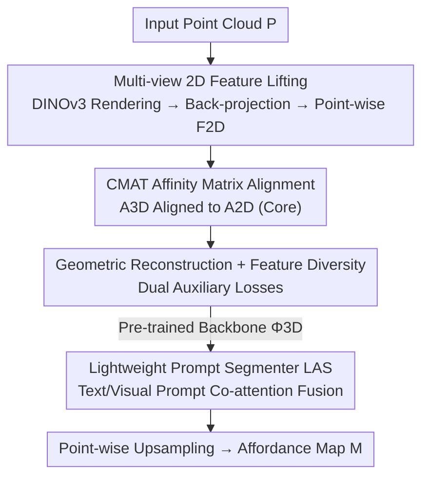

# Unlocking 3D Affordance Segmentation with 2D Semantic Knowledge

**Conference**: CVPR 2026  
**Paper**: [CVF Open Access](https://openaccess.thecvf.com/content/CVPR2026/html/Huang_Unlocking_3D_Affordance_Segmentation_with_2D_Semantic_Knowledge_CVPR_2026_paper.html)  
**Code**: TBC  
**Area**: 3D Vision / Affordance Segmentation  
**Keywords**: 3D Affordance Segmentation, Cross-modal Knowledge Transfer, 2D Visual Foundation Models, Affinity Matrix Alignment, DINOv3

## TL;DR
To address the lack of functional semantics in 3D encoders and insufficient geometric cues in sparse point clouds, this paper leverages semantic knowledge from 2D visual foundation models (e.g., DINOv3). Through "Cross-Modal Affinity Transfer" (CMAT) pre-training, the 3D encoder is aligned with the inter-patch relationship structure of 2D features. Combined with a lightweight prompt segmenter, the method achieves SOTA performance on PIAD/PIADv2/LASO using significantly fewer parameters than MLLM-based approaches.

## Background & Motivation
**Background**: 3D affordance segmentation aims to decompose a 3D object into parts based on their **functional roles**—for instance, dividing a chair into a seat, backrest, and legs—enabling agents to not only "recognize the object" but also reason "how to interact with it." Prevailing approaches fall into two categories: those following the 3D semantic segmentation paradigm using point cloud encoders (PointNet++, PointMAE, etc.) to predict labels based purely on geometry, and prompt-based methods that use text instructions or visual examples (sometimes via MLLMs) to guide interaction region prediction.

**Limitations of Prior Work**: Many affordances are **not uniquely determined by local geometry**. For example, the graspable handle and the rim of a mug often share similar geometric features, and surfaces for "support" or "contact" are frequently smooth, symmetrical shapes. When scans are sparse, occluded, or noisy, purely geometric models yield unstable and coarse functional boundaries. Meanwhile, prompt-based methods offer limited improvements despite complex prompt processing modules.

**Key Challenge**: The authors argue that the bottleneck of prompt-based methods **lies not in the prompts but in the 3D encoder**—which is still treated as a purely geometric feature extractor. Sparse point clouds naturally lack functional cues; without a "semantic-aware structure" in the feature space, even sophisticated prompts cannot reliably inject semantics. Thus, the problem should be reframed as "how to learn 3D features" rather than simply enriching prompt modalities.

**Key Insight**: 2D visual foundation models (VFMs, like DINOv3) trained on massive image datasets naturally learn **well-structured semantic organizations**. As shown in Fig.1 of the paper, DINOv3 features naturally cluster into functionally consistent groups like "handles" or "seats," which are far more organized than pure geometric 3D embeddings. Existing works often "lift" multi-view 2D features to point clouds for dense supervision, but they mostly align **single-point features** or ensure broad consistency without explicitly modeling the **relational structure** between parts, leading to fragmented representations.

**Core Idea**: Supervise the 3D encoder using the **relational structure** (affinity matrix between patches) of 2D VFMs instead of single-point features. The proposed Cross-Modal Affinity Transfer (CMAT) pre-training forces 3D patch affinity matrices to align with 2D patch affinity matrices, internalizing "part-to-whole" functional relationships into 3D representations. These clean semantics are then utilized by a lightweight prompt segmenter.

## Method

### Overall Architecture
The framework is a three-stage serial pipeline aimed at taking a semantically deficient sparse point cloud $P=\{p_i\in\mathbb{R}^3\}_{i=1}^N$ and producing a dense prompt-conditioned affordance map $M\in\mathbb{R}^N$. **Stage 0** "lifts" 2D semantics to 3D: multi-view rendering + frozen DINOv3 feature extraction + back-projection lifting generates a 2D semantic descriptor $F^{2D}$ for each point as a supervision signal. **Stage 1 (CMAT, Core)** uses $F^{2D}$ to pre-train a 3D backbone $\Phi^{3D}$, aligning 3D feature affinity matrices with 2D ones. **Stage 2** integrates the pre-trained $\Phi^{3D}$ into a Lightweight Affordance Segmenter (LAS), performing cross-attention fusion with text/visual prompts to output $M$ at point-wise resolution.

### Key Designs

**1. Multi-view 2D Feature Lifting: Injecting DINOv3 Semantics into 3D Points**

Point clouds lack functional semantics, necessitating a high-quality "teacher signal." The authors build a pre-training set of over 10,000 3D models (from Objaverse, Behavior-1K, covering 101 categories). Each model is rendered from $V=12$ viewpoints into 224×224 RGB images, processed by a **frozen** DINOv3 (ViT-Large) for dense feature maps, and back-projected onto 3D points via nearest-neighbor interpolation to obtain point-wise semantic descriptors $F^{2D}=\{f^{2D}_i\in\mathbb{R}^{d_{2D}}\}_{i=1}^N$. Multi-view design ensures consistent semantics for both visible and occluded surfaces.

**2. CMAT Affinity Matrix Alignment: Transferring "Relational Structure"**

This is the core of the paper. Unlike standard 2D→3D transfers that align single-point features, CMAT aligns **affinity matrices**. The 3D backbone uses a PointMAE-style transformer to partition the point cloud into $m$ patch tokens. Point-level features are averaged into patch-level features $\bar f^{2D}_j$ and $\bar f^{3D}_j$. Teacher (2D) and student (3D) affinity matrices are constructed, where elements represent cosine similarity between patch pairs:

$$A^{2D}_{jk}=\frac{\bar f^{2D}_j\cdot\bar f^{2D}_k}{\|\bar f^{2D}_j\|\,\|\bar f^{2D}_k\|},\qquad A^{3D}_{jk} \text{ computed similarly via } \bar f^{3D}$$

The affinity matrix encodes **part-to-whole relationships** (e.g., which patches are functionally similar). The semantic alignment loss $\ell_{aff}$ minimizes the mean squared error between matrices:

$$\ell_{aff}=\frac{1}{m^2}\sum_{j=1}^{m}\sum_{k=1}^{m}\big(A^{3D}_{jk}-A^{2D}_{jk}\big)^2$$

This forces the 3D feature space to replicate the "inter-part semantic relations" of the 2D space **without requiring explicit semantic labels**.

**3. Geometric Reconstruction + Feature Diversity: Dual Auxiliary Losses**

To prevent loss of geometric structure and feature collapse, two auxiliary objectives are added. The reconstruction loss $\ell_{rec}$ follows PointMAE’s masked autoencoding strategy (60% masking ratio). The feature diversity loss $\ell_{div}$ uses the KoLeo regularizer to penalize small nearest-neighbor distances in the embedding space, maximizing entropy and discriminative power. The pre-training objective is:

$$\ell_{pretrain}=\lambda_{aff}\ell_{aff}+\lambda_{rec}\ell_{rec}+\lambda_{div}\ell_{div}$$

Weights are set to $\lambda_{rec}=1.0, \lambda_{aff}=0.1, \lambda_{div}=0.2$.

**4. Lightweight Prompt Segmenter (LAS): Prompt Injection via Co-attention**

Traditional prompt-based methods often use large MLLMs to "translate" intentions, which is heavy and may pollute clean semantics. Stage 2 uses the pre-trained $\Phi^{3D}$ to extract geometric tokens $F^{3D}$. Text prompts are encoded by a frozen RoBERTa-base ($F_{text}$), and visual examples by a frozen DINOv3 ($F_{img}$). All are projected into a shared space with learnable modal embeddings:

$$T_P=\mathrm{Proj}_{3D}(F^{3D})+E_{point},\quad T_{text}=\mathrm{Proj}_{text}(F_{text})+E_{text},\quad T_{img}=\mathrm{Proj}_{img}(F_{img})+E_{img}$$

Prompt tokens $T_Q$ and geometric tokens $T_P$ are concatenated $[T_Q;T_P]$ and processed by $L=6$ co-attentional transformer layers. A final MLP head performs point-wise segmentation.

### Loss & Training
- **Pre-training (Stage 1)**: 150 epochs, batch 128, AdamW, LR 1e-4 with 15-epoch warmup and cosine decay. 64 patches per point cloud, 60% mask ratio.
- **Fine-tuning (Stage 2)**: Discriminative LR (1e-5 for backbone $\Phi^{3D}$, 1e-4 for new modules); $\lambda_{focal}=\lambda_{dice}=1.0$; 100 epochs, batch 16, 2048 points. Training completed on 4×RTX 3090.

## Key Experimental Results

### Main Results
Comparison with SOTA on PIAD/PIADv2 (selected metrics: aIoU and SIM):

| Dataset / Split | Metric | Ours (w/ CMAT) | Prev. Best | Gain |
| :--- | :--- | :--- | :--- | :--- |
| PIAD Seen | SIM ↑ | 0.725 | 0.590 (LASO) | +22.9% (Rel.) |
| PIADv2 Seen | aIoU ↑ | 44.88 | 38.03 (GREAT) | +6.85 |
| PIADv2 Unseen | aIoU ↑ | 27.40 | 20.16 (GREAT) | +7.24 |

Efficiency comparison against MLLM-based solutions:

| Model | Parameters | Memory | PIADv2 Seen aIoU |
| :--- | :--- | :--- | :--- |
| IAGNet (ICCV23) | 30M | 0.8–2.0 GB | 34.29 |
| LASO (CVPR24) | 130M | 2.0–3.5 GB | 34.88 |
| GREAT† (CVPR25, MLLM) | 4B | 16–30 GB | 38.03 |
| **Ours** | **300M** | **4–8 GB** | **44.88** |

### Ablation Study (PIADv2 Seen Split)
| Configuration | aIoU (%) ↑ | Description |
| :--- | :--- | :--- |
| $\ell_{rec}$ only | 39.27 | Pure geometric reconstruction |
| $\ell_{rec}+\ell_{aff}$ | 44.13 | Core affinity alignment (+4.86) |
| Full $\ell_{rec}+\ell_{aff}+\ell_{div}$ | 44.88 | Diversity added (+0.75) |
| Teacher = DINOv2 | 43.26 | Performance drop with weaker teacher |

### Key Findings
- **Affinity Alignment is Critical**: Adding $\ell_{aff}$ to $\ell_{rec}$ accounts for almost all performance gains, proving that transferring "relational structures" is more effective than pure geometric self-supervision.
- **CMAT vs. Standard Initialization**: PointMAE/PointNet++ trained from scratch only reach 37–38% aIoU, while CMAT reaches 44.88%, highlighting the importance of "semantic organization."
- **Small Models Outperform MLLMs**: With 300M parameters, the model exceeds the 4B-parameter GREAT by 6.85 aIoU, suggesting affordance understanding does not strictly require ultra-large language models.

## Highlights & Insights
- **Upgrade from Point Features to Affinity Matrices**: Affordance is inherently a relational property between parts and the whole. Using affinity matrices as the transfer target aligns perfectly with this.
- **Accurate Bottleneck Diagnosis**: The authors focus on the "semantic capacity of the 3D encoder" rather than flashier prompts, a decision validated by the 6-7 point gain over from-scratch training.
- **Decoupled Pre-training**: CMAT doesn't require affordance labels (self-supervised alignment). The pre-trained backbone can be repurposed for other fine-grained tasks like 3D segmentation or detection.

## Limitations & Future Work
- **True Multi-modal Prompting**: While the framework supports simultaneous text+visual prompts, current benchmarks only test single modalities.
- **Pre-training Pipeline Overheads**: Stage 0 requires significant rendering and lifting compute for thousands of models. Sensitivity to lifting errors was not analyzed in depth.
- **Teacher Ceiling**: Performance is tied to the strength of the 2D VFM; rare or abstract functional parts not covered by the VFM may still pose challenges.

## Related Work & Insights
- **vs. Geometric Segmentation (PointNet++, etc.)**: Purely geometric models struggle with functional boundaries; this work补足 (supplements) functional semantics at the backbone level.
- **vs. Prompt-driven/MLLM (LASO, GREAT)**: This work achieves better results with 1/10th the size of MLLM approaches by fixing the encoder bottleneck.
- **vs. Feature Lifting**: Standard lifting often results in fragmented representations; CMAT preserves part-level relations via affinity alignment.

## Rating
- Novelty: ⭐⭐⭐⭐ Shifting from point-wise features to affinity-based relationship structures is a tailored and effective innovation.
- Experimental Thoroughness: ⭐⭐⭐⭐ Solid results across three benchmarks with extensive ablations and efficiency analysis.
- Writing Quality: ⭐⭐⭐⭐ Logical flow from motivation to diagnosis to solution.
- Value: ⭐⭐⭐⭐ Proves small models can outperform MLLMs in this domain; provides a reusable pre-training paradigm.

<!-- RELATED:START -->

## Related Papers

- [\[CVPR 2026\] From 2D Alignment to 3D Plausibility: Unifying Heterogeneous 2D Priors and Penetration-Free Diffusion for Occlusion-Robust Two-Hand Reconstruction](from_2d_alignment_to_3d_plausibility_unifying_heterogeneous_2d_priors_and_penetr.md)
- [\[CVPR 2026\] GKD: Generalizable Knowledge Distillation from Vision Foundation Models for Semantic Segmentation](gkd_generalizable_knowledge_distillation_vfm.md)
- [\[CVPR 2026\] SAQN: Semantic-based Adaptive Query Network for 3D Referring Expression Segmentation](saqn_semantic-based_adaptive_query_network_for_3d_referring_expression_segmentat.md)
- [\[CVPR 2026\] GeoGuide: Hierarchical Geometric Guidance for Open-Vocabulary 3D Semantic Segmentation](geoguide_hierarchical_geometric_guidance_for_open-vocabulary_3d_semantic_segment.md)
- [\[ECCV 2024\] PartSTAD: 2D-to-3D Part Segmentation Task Adaptation](../../ECCV2024/segmentation/partstad_2d-to-3d_part_segmentation_task_adaptation.md)

<!-- RELATED:END -->
