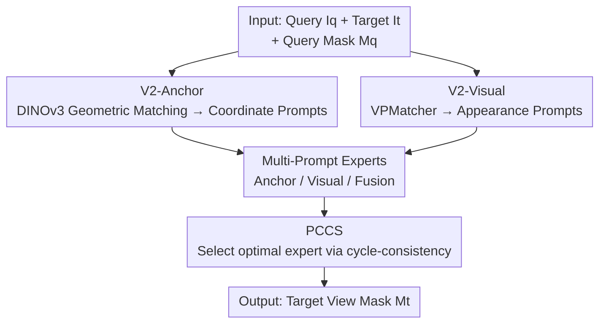

# V²-SAM: Marrying SAM2 with Multi-Prompt Experts for Cross-View Object Correspondence

**Conference**: CVPR 2026  
**Paper**: [CVF Open Access](https://openaccess.thecvf.com/content/CVPR2026/html/Pan_V2-SAM_Marrying_SAM2_with_Multi-Prompt_Experts_for_Cross-View_Object_Correspondence_CVPR_2026_paper.html)  
**Code**: To be released (as promised in the paper)  
**Area**: Segmentation / Cross-View Correspondence  
**Keywords**: SAM2, Cross-View Correspondence, Ego-Exo, Coordinate Prompts, Multi-Expert MoE

## TL;DR
V²-SAM transforms the single-view segmentation foundation model SAM2 into a cross-view object correspondence framework. It employs a geometry-aware coordinate prompt generator (V2-Anchor) and an appearance-aware visual prompt generator (V2-Visual) to address "where the target is" and "what the target looks like," respectively. A three-expert MoE architecture coupled with a Posterior Cycle-Consistency Selector (PCCS) adaptively identifies the most reliable prediction, achieving new SOTA results on Ego-Exo4D, DAVIS-17, and HANDAL-X.

## Background & Motivation

**Background**: Cross-view object correspondence aims to segment the same object in a target view given its mask annotation in a query view. A representative and challenging instance is ego–exo correspondence, where the same object is simultaneously observed by a mobile first-person (ego) camera and a static third-person (exo) camera. This is a fundamental capability for multi-view scene understanding, video perception, and embodied AI.

**Limitations of Prior Work**: Single-view segmentation has achieved high performance with foundation models like SAM2, which rely on **spatially anchored prompts** (coordinates, boxes) to condition the decoder. In cross-view scenarios, object positions can vary drastically between views, making direct coordinate transfer from the query view to the target view invalid. Existing referring-based adaptations (e.g., Ref-SAM) replace positional prompts with visual guidance, but introduce two new issues: ① failure under drastic appearance changes across views; ② the loss of spatial prompts effectively disables SAM2's strongest localization capabilities.

**Key Challenge**: Cross-view correspondence requires both "localization" (where is the target in the target view) and "appearance association" (which region looks like the same object). Current methods either retain only visual cues (losing localization) or rely on external segmentation models for mask matching (where learning and generalization are limited by external proposals). Spatial and appearance cues are used in isolation, and no existing work integrates them within the SAM2 framework.

**Goal**: ① Can SAM2's spatial prompting capability be unlocked in cross-view scenarios? ② If so, can spatial and visual prompts complement each other to further enhance performance?

**Key Insight**: The authors observe that the patch-level feature space of DINOv3 is **geometry-aware**—patches of the same object across views remain matchable in the feature space. Thus, feature matching can be used to recover a reliable coordinate in the target view to serve as a SAM2 point prompt. Empirically, it is found that anchor prompts excel at "knowing where," while visual prompts excel at "knowing what," making them naturally suited for multi-expert fusion.

**Core Idea**: DINOv3 geometric matching is used to "create" coordinate prompts for SAM2 in cross-view settings. This is paired with a cross-view visual prompt matcher and a three-expert MoE system with cycle-consistency selection to combine their complementary advantages.

## Method

### Overall Architecture

The input consists of a time-aligned query–target image pair $(I_q, I_t)$ and the query view object mask $M_q$; the output is the predicted mask $\hat{M}_t$ in the target view. The framework is built upon SAM2, retaining its image encoder $\phi(\cdot)$, prompt encoder, and mask decoder, while **discarding memory-related modules** (focusing on frame-level correspondence to allow seamless transfer between image and video tasks).

The pipeline involves three steps: First, two prompt generators transfer object information from the query to the target view. V2-Anchor establishes geometric correspondence via DINOv3 features to produce coordinate prompts $P^{q2t}_{anchor}$. V2-Visual performs region pooling on SAM2 features and maps them across views via VPMatcher to produce appearance prompts $P^{q2t}_{visual}$. Second, three experts (Anchor, Visual, and Fusion) are constructed using these prompts, sharing the same decoder architecture but with independent parameters to predict candidate masks. Finally, PCCS non-parametrically selects the most reliable prediction using cycle consistency.

### Key Designs

**1. V2-Anchor: Synthesizing Coordinate Prompts for SAM2 via DINOv3 Matching**

To solve the dilemma where SAM2 fails without spatial prompts but cross-view positions do not align, the authors propose a **non-learning** four-step process: (a) Feature matching—computing cosine similarity heatmaps between query and target patches:

$$\mathbf{H}_{ij} = \frac{\varphi(I_q)_i^{\top}\,\varphi(I_t)_j}{\|\varphi(I_q)_i\|_2\,\|\varphi(I_t)_j\|_2}$$

where $\mathbf{H}\in\mathbb{R}^{(H_qW_q)\times(H_tW_t)}$. For each query patch, $j^*=\arg\max_j \mathbf{H}_{ij}$ is selected as the best match. Foreground patches $P_q=\{i\mid (x_i,y_i)\in M_q\}$ are used to suppress background noise. (b) Point stratification—to avoid redundant or clustered points, stratified sampling enforces a minimum distance $\tau$:

$$\mathcal{P}'_t = \{p_i \mid \|p_i - p_j\|_2 > \tau,\ \forall j<i\}$$

(c) Coordinate transformation—mapping $\mathcal{P}'_t$ to SAM2's canonical coordinate space via deterministic projection $\Pi(\cdot)$. (d) Prompt encoding—feeding coordinates into the prompt encoder to get $P^{q2t}_{anchor}$. This is the "first" time SAM2 uses coordinate prompts in cross-view scenarios, restoring its localization strength. Since it is non-learning and outputs native SAM2 prompts, the Anchor Expert can be **entirely training-free**.

**2. V2-Visual: Bridging the Cross-View Appearance Gap via VPMatcher**

V2-Visual handles "what the target looks like." Features $\phi(I_q), \phi(I_t)$ are extracted, and mask pooling yields region features $\mathbf{v}_q=\mathrm{MaskP}(\phi(I_q),M_q)$. The VPMatcher contains two complementary branches:

**Feature Mapping Branch**: Uses the fusion prompt $p_f=\mathbf{v}_q+F_{mask}(M_q)$ as a query and target features as key/value for cross-attention $\alpha=\mathrm{Softmax}(qk^\top/\sqrt{D_e})$. Spatial gating suppresses background noise, followed by Transformer layers and a residual MLP to get the predicted embedding $\hat{\mathbf{v}}_c$ (learning semantic consistency). **Structure Mapping Branch**: Reconstructs the target mask from a coarse geometric prior: $M_q$ is downsampled to $\mathbf{m}_{prior}$, and semantic conditions are injected via FiLM:

$$\tilde{\mathbf{m}} = \mathbf{m}_{prior}\odot(1+\tanh(\gamma)) + \beta + F_{mask}(M_q)$$

The decoder yields a predicted mask $\hat{M}_c$ (learning structural coherence). The final appearance prompt $P^{q2t}_{visual}=\mathrm{MLP}([\hat{\mathbf{v}}_c, \mathbf{v}_{c'}])$ combines both perspectives, surmounting the appearance gap better than raw feature transfer.

**3. Multi-Prompt Experts: Distributing Tasks to Three Specialized Experts**

Anchor prompts excel in structured, static scenes (e.g., cooking) but degrade under large motion. Visual prompts excel in dynamic, human-centric scenes (e.g., basketball). Inspired by MoE, three experts are trained: Anchor Expert (geometric prompts only), Visual Expert (visual prompts only), and Fusion Expert (fused embeddings). They share architecture but have independent parameters. The Anchor Expert is **training-free**, while Visual and Fusion Experts require training for VPMatcher (SAM2 encoder remains frozen).

**4. PCCS: Posterior Cycle-Consistency Selector for Point-Level Validation**

To select the best candidate, PCCS leverages **bidirectional cycle consistency**: the prediction $\hat{M}_{t_k}$ from the $k$-th expert is mapped back to the query view via V2-Anchor:

$$P^{t2q}_k = \mathrm{V^2\text{-}Anchor}(I_t, I_q; \hat{M}_{t_k})$$

The average distance between these back-projected points and the original query reference points serves as a proxy score. Smaller distances indicate higher self-consistency. Unlike prior methods that reconstruct an entire query mask, PCCS operates at the **point level**, saving decoding overhead while maintaining selection accuracy.

### Loss & Training

The total loss is a weighted sum of three terms (training only Visual and Fusion Experts):

$$\mathcal{L} = \lambda_1\mathcal{L}_v(\hat{\mathbf{v}}_c, \mathbf{v}_t) + \lambda_2\mathcal{L}_s(\hat{M}_c, M_t) + \lambda_3\mathcal{L}_m(\hat{M}_t, M_t)$$

$\mathcal{L}_v$ is a visual contrastive loss (InfoNCE); $\mathcal{L}_m$ is the mask prediction loss (CE + Dice); $\mathcal{L}_s$ is the structural constraint loss. Backbone: SAM2-Hiera-Large + DINOv3 ViT-L/16. Trained on 8 GPUs, batch size 128, learning rate $4\times10^{-5}$, weights $\lambda_1:\lambda_2:\lambda_3=1:1:10$.

## Key Experimental Results

### Main Results

Ego-Exo4D Correspondences v2 Test Set (IoU↑):

| Method | Ego2Exo IoU | Exo2Ego IoU | Total IoU | Trainable Params (M) |
|------|------|------|------|------|
| ObjectRelator | 35.3 | 40.3 | 37.8 | 1587.3 |
| Ref-SAM* | 29.2 | 42.2 | 37.8 | 4.3 |
| O-MaMa | 42.6 | 44.1 | 43.4 | 11.6 |
| **V2-SAM (Single-Expert)** | 44.5 | 47.3 | 45.9 | 7.6 |
| **V2-SAM (Multi-Experts)** | **46.3** | **49.6** | **48.0** | 15.3 |

V2-SAM outperforms O-MaMa by +4.6 IoU with only 15M trainable parameters (~1% of ObjectRelator's 1.6B parameters).

Cross-benchmark generalization (DAVIS-17 and HANDAL-X Zero-Shot):

| Benchmark | Metric | Prev. Best | V2-SAM | Gain |
|------|------|------|------|------|
| DAVIS-17 | J&Fm↑ | 70.2 (PCC) | **78.8** | +8.6 |
| HANDAL-X (ZSL) | IoU↑ | 42.8 (ObjectRelator) | **77.2** | +34.4 |

### Ablation Study

Component ablation (Total IoU):

| Config | Total IoU | Description |
|------|------|------|
| Anchor Expert w/o V2-Anchor | 1.5 | Using $M_q$ centroid as prompt → failure |
| Anchor Expert w/ V2-Anchor | 40.1 | Cross-view localization unlocked |
| Visual Expert w/o V2-Visual | 3.0 | Direct query feature transfer → failure |
| Visual Expert w/ V2-Visual | 41.4 | VPMatcher bridges appearance gap |

### Key Findings

- **Prompt generators are critical**: Removing V2-Anchor or V2-Visual causes their respective experts to collapse. They are "binary switches" for cross-view feasibility.
- **Expert complementarity is significant**: Combining all three experts (A+B+C) achieves the best result (48.0), proving PCCS effectively selects based on scenario strengths.
- **Scenario specialization**: Anchor performs best in structured scenes; Visual performs best in dynamic human-centric scenes.

## Highlights & Insights
- **"Geometric matching for coordinates" is the key**: Instead of abandoning spatial prompts, using DINOv3 to synthesize a coordinate restores SAM2's strongest capability in a training-free manner.
- **Efficiency of PCCS**: Operating at the point level for cycle-consistency avoids the overhead of mask reconstruction, providing a lightweight inference-time verification mechanism.
- **Parameter Efficiency**: Surpassing a 1.6B model with 15M trainable parameters suggests that the bottleneck in cross-view correspondence is not model capacity, but the effective utilization of spatial and appearance cues.

## Limitations & Future Work
- **Dependency on DINOv3**: If appearance changes are so extreme that geometric matching fails, V2-Anchor degrades.
- **Inference Cost**: Parallelizing three experts alongside DINOv3 and SAM2-Large entails significant computational overhead.
- **PCCS Granularity**: Selection is instance-level; regional or pixel-level hybrid selection could be a future direction.
- **Memory Removal**: Discarding SAM2's memory module might limit long-term temporal consistency in video tasks.

## Related Work & Insights
- **vs O-MaMa / DOMR**: These rely on post-hoc matching of external proposals. V2-SAM is a learnable model-based approach that integrates coordination cues directly, achieving higher performance with fewer parameters.
- **vs ObjectRelator**: While both are learnable, ObjectRelator uses 1.6B parameters. V2-SAM proves that the "Coordinate + Visual" multi-expert design is more parameter-efficient.
- **vs Ref-SAM / ViRefSAM**: These focus on intra-view referring; V2-SAM extends visual reference segmentation to cross-view and embodied perception by re-integrating spatial cues.

## Rating
- Novelty: ⭐⭐⭐⭐⭐ 
- Experimental Thoroughness: ⭐⭐⭐⭐⭐ 
- Writing Quality: ⭐⭐⭐⭐ 
- Value: ⭐⭐⭐⭐⭐ 

<!-- RELATED:START -->

## Related Papers

- [\[CVPR 2026\] Learning Cross-View Object Correspondence via Cycle-Consistent Mask Prediction](learning_cross-view_object_correspondence_via_cycle-consistent_mask_prediction.md)
- [\[CVPR 2026\] VGGT-Segmentor: Geometry-Enhanced Cross-View Segmentation](vggt-segmentor_geometry-enhanced_cross-view_segmentation.md)
- [\[CVPR 2026\] Cross-Domain Few-Shot Segmentation via Multi-view Progressive Adaptation](cross-domain_few-shot_segmentation_via_multi-view_progressive_adaptation.md)
- [\[NeurIPS 2025\] Vanish into Thin Air: Cross-prompt Universal Adversarial Attacks for SAM2](../../NeurIPS2025/segmentation/vanish_into_thin_air_cross-prompt_universal_adversarial_attacks_for_sam2.md)
- [\[CVPR 2026\] SAMIX: Reinforcing SAM2 with Semantic Adapter and Reference Selecting Policy for Mix-Supervised Segmentation](samix_reinforcing_sam2_with_semantic_adapter_and_reference_selecting_policy_for_.md)

<!-- RELATED:END -->
