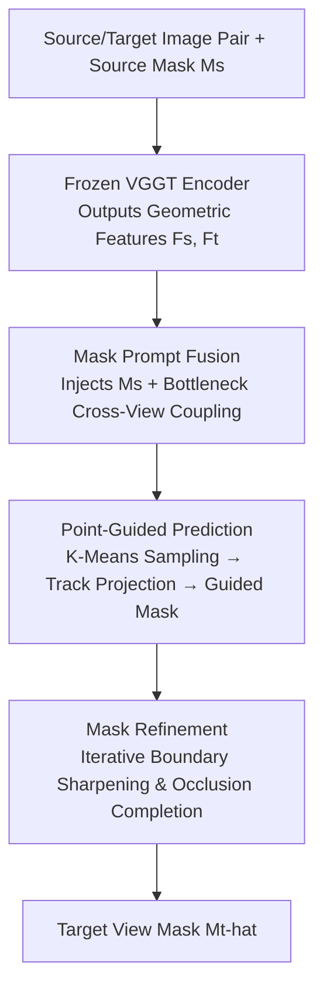

# VGGT-Segmentor: Geometry-Enhanced Cross-View Segmentation

**Conference**: CVPR 2026  
**Paper**: [CVF Open Access](https://openaccess.thecvf.com/content/CVPR2026/html/Gao_VGGT-Segmentor_Geometry-Enhanced_Cross-View_Segmentation_CVPR_2026_paper.html)  
**Area**: Cross-view segmentation / 3D Computer Vision  
**Keywords**: Cross-view segmentation, ego-exo, VGGT, geometry prior, self-supervised

## TL;DR
VGGT-Segmentor (VGGT-S) utilizes the multi-view geometry foundation model VGGT as a frozen backbone, appending a three-stage "Union Segmentation Head." It translates VGGT's reliable object-level feature alignment into pixel-level masks and eliminates the need for paired annotations through single-image self-supervised training. It achieves an average IoU of 67.7%/68.0% on Ego–Exo4D cross-view segmentation, outperforming the previous SOTA by 18.0%/12.8%.

## Background & Motivation

**Background**: Identifying and segmenting instance-level cross-view correspondences between first-person (ego, camera worn by the operator) and third-person (exo, bystander camera) views is a critical capability for embodied AI and remote collaboration—for example, synchronizing the tool held by the operator in an external view for a collaborator. The release of the Ego–Exo4D dataset established a systematic basis for this task: given an object mask in one view as a query, the goal is to localize and segment the same object in another view.

**Limitations of Prior Work**: Discrepancies in scale, viewpoint, and occlusion between the two views are extreme—ego cameras are close to the hands, often obstructed by tools, while exo cameras are distant with cluttered backgrounds. This makes direct pixel-level matching highly unstable. Early methods relied either on semantic consistency or context understanding from large language models (e.g., PSALM, ObjectRelator), but they **ignored geometric structures and spatial relationships**, leading to frequent matching failures under large viewpoint variations.

**Key Challenge**: Geometry-aware models like VGGT are promising foundations, as they jointly infer multi-view depth, camera parameters, and point maps, providing cross-view consistent features. However, the authors observed a critical phenomenon: when using VGGT directly for dense segmentation, its **pixel-level point projections exhibit systematic drift** (especially under severe ego-exo occlusion and view changes), yet its **internal object-level attention remains reliable**, consistently focusing on the general region of the target object. In other words, while VGGT's "high-level feature alignment" is correct, its "pixel-wise point correspondence" is flawed, creating a performance gap.

**Goal**: To translate VGGT’s reliable high-level feature alignment into pixel-accurate segmentation masks by leveraging its geometric priors while bypassing its point projection drift. Furthermore, the objective is to eliminate the need for expensive paired annotations to achieve strong generalization.

**Key Insight**: Freeze VGGT and train only a lightweight "Union Segmentation Head" that injects the object mask as an explicit query. Use **sparse, geometry-aware point prompts** (rather than dense pixel matching) to guide mask prediction, followed by iterative boundary refinement. On the training side, use single-image augmentation to construct pseudo-pairs, removing dependency on cross-view labels.

## Method

### Overall Architecture
The input to VGGT-S is a pair of source-target images $(I_s, I_t)$ (e.g., Exo→Ego) and a source object mask $M_s$. The output is the mask $\hat{M}_t$ of the same object in the target view. The pipeline consists of two main components: a **frozen VGGT encoder** that encodes both images into geometrically aligned dense features $F_s, F_t$, and a lightweight **Union Segmentation Head** translates these cross-view geometric cues into the target mask. During training, VGGT remains frozen, and only the segmentation head is optimized, maintaining end-to-end training while minimizing memory and compute overhead.

The Union Segmentation Head consists of three serial stages: **Mask Prompt Fusion** injects the source mask into the features and performs cross-view coupling; **Point-Guided Prediction** uses sparse anchor points tracked by VGGT to guide the initial mask; and **Mask Refinement** iteratively sharpens boundaries and completes occluded regions. The complete data flow is illustrated below:

### Key Designs

**1. Mask Prompt Fusion: Explicitly encoding "which object to segment"**

VGGT provides generic geometric features but does not know which object is being searched for. Initially, the source mask $M_s$ is only associated with the source features. This design uses a convolution to encode the source mask into a high-dimensional embedding $E_m = \text{Conv}(M_s)$, which is added to the source features $F'_s = F_s + E_m$ to provide "identity" information. To ensure $M_s$ is coupled with $F_t$, a **Bottleneck Fusion module** is introduced: $F'_s$ and $F_t$ are downsampled to $\tilde{F}_s, \tilde{F}_t$, concatenated, processed through self-attention and an FFN, and then upsampled:

$$\dot{F}_s, \dot{F}_t = \text{FFN}\big(\text{SelfAttn}([\tilde{F}_s, \tilde{F}_t])\big), \quad F^\star = [U_r(\dot{F}_s), U_r(\dot{F}_t)]$$

The bottleneck structure (default $37\times37$) is crucial to handle the quadratic complexity of self-attention at original resolutions, allowing the views to "see" each other and propagate spatial priors. Ablations show this step alone increases IoU from 35.5/37.1 (Plain Head) to 50.2/52.3.

**2. Point-Guided Prediction: Bypassing VGGT drift with sparse geometric anchors**

This is the core insight: while VGGT's dense pixel-wise projection drifts, its projection of a **few representative points** is much more stable. The method performs K-Means on the source mask foreground $\Omega = \{(x,y)\mid M_s(x,y)=1\}$ to extract $K_{pt}$ representative points $P_s = \text{kmeans}(\Omega, K_{pt})$ (default 5), then projects them to the target frame $P_t = T(P_s; I_s, I_t)$ using VGGT's track head. These points, along with sampled point features $E_p$ and a learnable output mask token $O$, form the prompt query $Q_0 = [E_p, E_s, E_t, O]$. This is passed through $L$ lightweight decoding blocks performing self-attention and bidirectional cross-attention:

$$\bar{Q}_\ell = \text{SelfAttn}(Q_{\ell-1}),\quad Q_\ell = \text{CrossAttn}_{P\to I}(\bar{Q}_\ell, F^\star_\ell),\quad H_\ell = \text{CrossAttn}_{I\to P}(F^\star_\ell, Q_\ell)$$

The final refined token $O_L$ interacts with $H_t$ via point-to-image cross-attention, followed by a pixel-wise dot product and sigmoid to obtain the initial mask $\hat{M}^{(0)}_t(x,y) = \sigma\big((W\tilde{O}+b)^\top f_t(x,y)\big)$. Sparse points are naturally robust to perspective and scale changes; increasing points from 1 to 5 improved IoU by 6.2%/4.6%.

**3. Mask Refinement: Iterative sharpening and completion**

Initial masks are often blurry at boundaries and occlusions. A lightweight mask decoder $\Psi$ performs iterative refinement: $\hat{M}^{(k+1)}_t = \Psi(F_s, M_s, F_t, \hat{M}^{(k)}_t, Q)$. To optimize training, gradients are only backpropagated through the **last iteration**, and only half of the samples in a batch undergo refinement to prevent overfitting. Two refinement iterations increased IoU from 62.2→67.7 and 63.5→68.0 with minimal latency increase (153.2ms to 161.4ms).

**4. Single-Image Self-Supervised Training: Decoupling from paired annotations**

Paired ego-exo labels are extremely expensive. Inspired by MASA augmentations, this design uses any single image $I$: it generates a pseudo-mask $M$ using an offline segmenter (SAM) and applies augmentations to $I$ to create $I'$, requiring the model to predict $\hat{M}'$. Augmentations are split into two groups: **VGGT-adaptive** (scaling, slight rotation, cropping), which preserves VGGT's point mapping, and **VGGT-non-adaptive** (large rotation, horizontal flip), which breaks cross-view alignment. In the latter, views are encoded independently, and target points are perturbed to synthesize prompts. A "correspondence-free" variant pre-trained on 1/20 of SA-1B outperformed supervised DOMR in zero-shot Ego–Exo4D evaluations.

### Loss & Training
The model uses a linear combination of focal loss and dice loss (20:1 ratio) to supervise mask prediction. It is optimized with AdamW (initial LR $5\times10^{-5}$, weight decay $1\times10^{-4}$) for 12 epochs, with LR decays at epochs 8 and 11. VGGT patch size is 14, bottleneck fusion resolution is $37\times37$, and 5 points are used for guidance. Training was performed on 4×RTX 4090 with a batch size of 8.

## Key Experimental Results

### Main Results

Cross-view segmentation on Ego–Exo4D (Mean IoU %):

| Setting | Method | Ego→Exo IoU | Exo→Ego IoU |
|------|------|------|------|
| Supervised | XView-XMem + XSegTx | 36.9 | 36.1 |
| Supervised | PSALM | 41.3 | 47.3 |
| Supervised | ObjectRelator | 45.4 | 50.9 |
| Supervised | DOMR (Prev. SOTA) | 49.7 | 55.2 |
| Supervised | **VGGT-S (Ours)** | **67.7** | **68.0** |
| Zero-shot | XView-XMem | 16.2 | 13.5 |
| Zero-shot | SSCC | 38.4 | 43.7 |
| Zero-shot | **VGGT-S (Ours)** | **54.1** | **58.4** |

The supervised version outperforms DOMR by 18.0%/12.8%. Notably, the **correspondence-free zero-shot variant (54.1/58.4) outperforms supervised DOMR (49.7/55.2)**. When fine-tuned on MvMHAT for 1 epoch, the AP reached 80.7%, 9.6% higher than DOMR (71.1).

### Ablation Study

Progressive addition of components (Table 3, IoU% / Latency ms):

| Configuration | Ego→Exo | Exo→Ego | Time(ms) | Description |
|------|---------|---------|----------|------|
| Plain Head | 35.5 | 37.1 | 105.8 | Baseline with mask encoding + token |
| + Bottleneck Fusion | 50.2 | 52.3 | 107.4 | Cross-view aggregation |
| + Point-Guided Prediction | 62.2 | 63.5 | 153.2 | Sparse geometry anchor guidance |
| + Mask Refinement | **67.7** | **68.0** | 161.4 | Complete model |

### Key Findings
- **Synergy of components**: Bottleneck Fusion addresses missing cross-view coupling (+~15 IoU); Point-Guided Prediction overcomes VGGT pixel drift (+~12 IoU); Mask Refinement fixes blurry boundaries (+~5 IoU).
- **Sparse points are highly efficient**: Five K-Means anchors capture most of the performance gain, proving more robust and efficient than dense matching.
- **Geometry + Self-supervision = Generalization**: The model's zero-shot performance and rapid fine-tuning on MvMHAT demonstrate that geometry-aware representations effectively mitigate the need for paired data.

## Highlights & Insights
- **Explicit diagnosis of "Correct alignment, Wrong projection"**: Instead of treating VGGT as a black box, the authors identified its reliable object-level attention vs. unstable pixel-level projection, leading to the sparse point anchor solution.
- **Frozen Backbone Efficiency**: Keeping VGGT frozen saves VRAM and preserves geometric priors from being corrupted by small downstream datasets.
- **Dual-group augmentations**: Categorizing augmentations by whether they preserve VGGT point mappings effectively simulates real-world scenarios where geometric correspondence may or may not be available.

## Limitations & Future Work
- **Backbone Dependency**: The performance relies heavily on VGGT's geometric representation quality; failure cases in textureless or non-rigid scenes are not fully explored.
- **Lack of Temporal Consistency**: The method is currently image-level. While it outperforms video-based models like XView-XMem, it doesn't explicitly exploit temporal consistency to handle tracking drift.
- **Precision-Efficiency Trade-off**: Bottleneck resolution and iterations were chosen manually; higher resolutions cause OOM, requiring further efficiency optimization for real-time deployment.
- **Zero-shot Gap**: A ~10–13 point gap remains between zero-shot and full supervision, indicating that the upper bound for unsupervised cross-view segmentation has not been reached.

## Related Work & Insights
- **vs. DOMR**: DOMR uses dense object matching. Ours uses sparse geometric anchors and outperforms it by over 12% IoU.
- **vs. ObjectRelator / PSALM**: These rely on LLM semantic understanding and ignore geometry. Ours is more accurate and faster by explicitly utilizing geometric structures.
- **vs. MASA**: Inspired by MASA's bootstrap association from single images, this work adapts the concept into adaptive/non-adaptive augmentation groups to serve cross-view mask generation.

## Rating
- Novelty: ⭐⭐⭐⭐⭐ The diagnosis of VGGT's internal contradiction and the sparse anchor remedy represent a clean solution for using foundation models in dense prediction.
- Experimental Thoroughness: ⭐⭐⭐⭐⭐ Comprehensive coverage across main results, zero-shot, across datasets, and six ablation tables.
- Writing Quality: ⭐⭐⭐⭐ Clear logic from motivation to diagnosis; some engineering details are relegated to the supplement.
- Value: ⭐⭐⭐⭐⭐ Significant SOTA improvement on Ego–Exo4D and strong zero-shot results provide high utility for embodied AI.

<!-- RELATED:START -->

## Related Papers

- [\[CVPR 2026\] V²-SAM: Marrying SAM2 with Multi-Prompt Experts for Cross-View Object Correspondence](v2-sam_marrying_sam2_with_multi-prompt_experts_for_cross-view_object_corresponde.md)
- [\[CVPR 2026\] Cross-Domain Few-Shot Segmentation via Multi-view Progressive Adaptation](cross-domain_few-shot_segmentation_via_multi-view_progressive_adaptation.md)
- [\[CVPR 2026\] Learning Cross-View Object Correspondence via Cycle-Consistent Mask Prediction](learning_cross-view_object_correspondence_via_cycle-consistent_mask_prediction.md)
- [\[CVPR 2026\] GeoMotion: Rethinking Motion Segmentation via Latent 4D Geometry](geomotion_rethinking_motion_segmentation_via_latent_4d_geometry.md)
- [\[CVPR 2026\] GeCo: Geometry-Consistent Regularization for Domain Generalized Semantic Segmentation](geco_geometry-consistent_regularization_for_domain_generalized_semantic_segmenta.md)

<!-- RELATED:END -->
