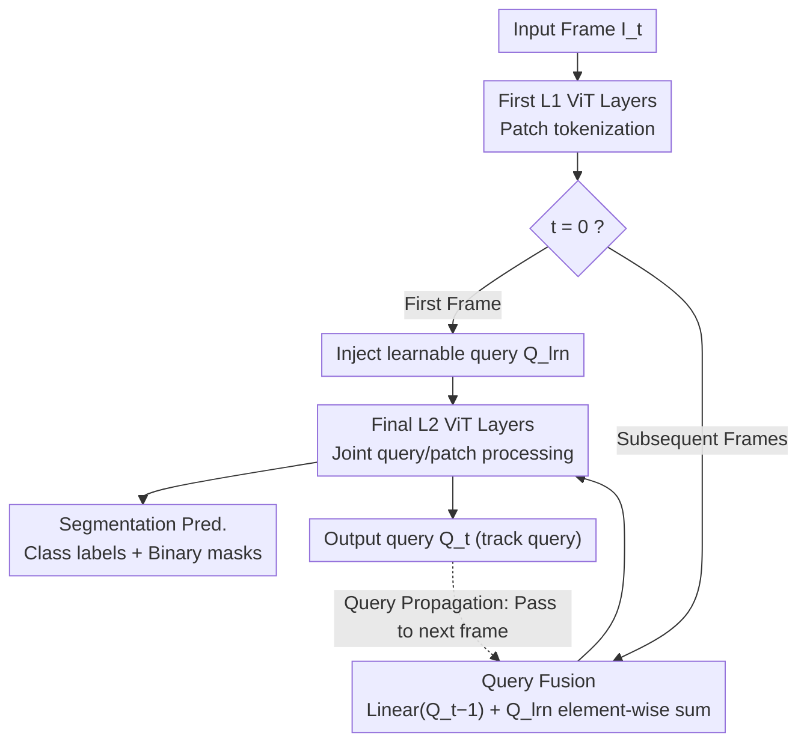

# VidEoMT: Your ViT is Secretly Also a Video Segmentation Model

**Conference**: CVPR2026  
**arXiv**: [2602.17807](https://arxiv.org/abs/2602.17807)  
**Code**: [tue-mps.org/videomt](https://www.tue-mps.org/videomt/)  
**Area**: Video Segmentation  
**Keywords**: encoder-only, ViT, video instance segmentation, video panoptic segmentation, query propagation, query fusion, DINOv2

## TL;DR

VidEoMT is proposed as an encoder-only video segmentation architecture that unifies segmentation and temporal association within a single ViT encoder through query propagation and query fusion. It achieves a 5×–10× speedup (reaching 160 FPS with ViT-L) while maintaining accuracy comparable to the SOTA.

## Background & Motivation

1.  **Excessive Complexity of Existing Methods**: Current online video segmentation SOTA models (e.g., CAVIS, DVIS++, DVIS-DAQ) decouple the pipeline into a segmenter and a tracker. Each module contains numerous specialized components (ViT-Adapter, Mask2Former pixel decoder, Transformer decoder, context-aware features, Re-ID layers, etc.), leading to bloated architectures and slow inference.
2.  **Underutilized Potential of VFM Pre-training**: Visual Foundation Models (VFMs) like DINOv2 have learned cross-view consistent feature representations through large-scale pre-training. Theoretically, these are sufficient for both instance-level segmentation and temporal tracking, yet existing methods still stack redundant components on top of them.
3.  **Proven Feasibility of Encoder-only Image Segmentation by EoMT**: EoMT demonstrated that SOTA image segmentation can be achieved by injecting learnable queries into the final layers of a pre-trained ViT without a dedicated decoder, providing direct inspiration for simplification in the video domain.
4.  **DINO-style Pre-training Targets Facilitate Tracking**: The training objectives of DINO/DINOv2 encourage consistent features for the same object across different views, which is precisely the key capability required for tracking, making the ViT encoder naturally suitable for video segmentation.
5.  **Inference Speed is Critical for Video Applications**: Online video processing requires real-time or faster inference speeds. Existing SOTA methods (e.g., CAVIS at only 15 FPS) fall far short of meeting actual deployment requirements.
6.  **Core Problem**: Is it possible to remove all specialized tracking modules and allow a sufficiently large pre-trained ViT encoder to simultaneously perform segmentation and temporal association?

## Method

### Overall Architecture

The starting point of VidEoMT is that current online video segmentation SOTA (CAVIS, DVIS++, DVIS-DAQ) split the pipeline into "segmenter + tracker," with each containing redundant components. Following the encoder-only paradigm of EoMT, VidEoMT injects learnable queries directly into the last $L_2$ layers of a pre-trained ViT encoder to be processed alongside patch tokens. The primary innovations are the lightweight query propagation and query fusion mechanisms, which allow temporal association to be completed within the encoder, entirely eliminating the independent tracker with only 2M additional parameters. For each frame: the input frame passes through the first $L_1$ layers of ViT to be split into patch tokens; for the first frame ($t=0$), learnable queries are injected for standard EoMT; for subsequent frames ($t>0$), the output queries from the previous frame are merged with learnable queries via query fusion before injection. The final $L_2$ layers process queries and patch tokens jointly to output segmentation predictions and queries for the next frame.

### Key Designs

**1. Query Propagation: Using previous frame output queries as current frame inputs**

To perform tracking within an encoder-only framework, the most direct approach is to pass query identities across frames. The first frame $t=0$ follows standard EoMT: learnable queries $Q^{\text{lrn}}$ are injected into the final $L_2$ layers of ViT to produce object queries $Q_0^S$ and segmentation predictions. For subsequent frames $t>0$, the output query $Q_{t-1}^S$ from the previous frame is used directly as the input, carrying the identity of the same object with zero extra computation. However, a side effect is that over many frames, the influence of learnable queries is diluted, and the model gradually fails to recognize newly appearing objects.

**2. Query Fusion: Summing propagation queries and learnable queries**

To address the "failure to recognize new objects," query fusion employs a lightweight fusion step:
$$\mathbf{Q}_t^{\mathcal{F}} = \text{Linear}(\mathbf{Q}_{t-1}^{\mathcal{S}}) + \mathbf{Q}^{\text{lrn}}$$
After passing the previous frame's query through a linear layer, it is added element-wise to the learnable query. Thus, the propagated query handles temporal continuity while the learnable query handles perception of new objects. This element-wise addition is effective when combined with a supervision strategy that maintains query order consistency across frames. This step recovers the AP from 63.9 to 68.6, which otherwise drops significantly when degraded to frame-by-frame EoMT.

### A Complete Example: Deconstructing CAVIS to VidEoMT

The design of VidEoMT was driven by iteratively removing modules and observing the impact on accuracy and speed. This path illustrates the utility of each component:

1.  Replace the ViT-Adapter + Mask2Former segmenter in CAVIS with EoMT—FPS increases from 15 to 42, while AP only drops by 0.8.
2.  Remove context-aware features (Laplacian boundaries + average pool filtering)—FPS reaches 72, and AP actually increases.
3.  Remove the Re-identification layer (Contrastive learning MLP)—FPS reaches 74, and AP remains largely stable.
4.  Remove the tracker (degrading to frame-by-frame EoMT)—FPS jumps to 162, but AP drops sharply by 7.6 to 61.3.
5.  Add back Query Propagation—AP recovers to 63.9, while FPS stays at 162.
6.  Add Query Fusion to complete VidEoMT—AP reaches 68.6 at 160 FPS.

This process demonstrates that most specialized components are redundant, except for temporal association, which can be handled by propagation + fusion with only 2M parameters.

### Loss & Training

The loss functions are consistent with Mask2Former: cross-entropy for classification and BCE + Dice for segmentation. GT matching follows the temporal consistency strategy of DVIS++, where objects are matched using the Hungarian algorithm only in their first appearance frame, and query correspondences are maintained in subsequent frames. The AdamW optimizer is used with lr=1e-4, Layer-wise Learning Rate Decay (LLRD) with a factor of 0.6, and polynomial lr decay (power=0.9).

## Key Experimental Results

### Main Results: YouTube-VIS 2019 val (VIS)

| Method | Backbone | AP | GFLOPs | FPS |
|------|----------|-----|--------|-----|
| CAVIS | ViT-L/DINOv2 | **68.9** | 838 | 15 |
| DVIS-DAQ | ViT-L/DINOv2 | 68.3 | 851 | 10 |
| DVIS++ | ViT-L/DINOv2 | 67.7 | 846 | 18 |
| **VidEoMT** | ViT-L/DINOv2 | 68.6 | **566** | **160** |

### Cross-task Generalization

| Task/Dataset | VidEoMT Metric | CAVIS Metric | VidEoMT FPS | CAVIS FPS |
|-------------|-------------|-----------|-------------|-----------|
| VPS / VIPSeg | VPQ=55.2 | VPQ=**56.9** | **75** | 10 |
| VSS / VSPW | mIoU=**64.9** | — | **73** | — |
| VIS / OVIS | AP=52.5 | AP=**53.2** | **115** | 15 |
| VIS / YT-VIS 2022 | AP=**42.6** | AP=39.5 | **161** | 15 |

### Ablation Study: Progressive Module Removal

| Step | Change | AP | FPS |
|------|------|-----|-----|
| (0) CAVIS Baseline | — | 68.9 | 15 |
| (1) Replace segmenter with EoMT | ↓0.8 | 42 |
| (2) Remove context-aware features | 68.4 | 72 |
| (3) Remove Re-ID layer | 68.0 | 74 |
| (4) Remove tracker (EoMT) | 61.3 | 162 |
| (5) + Query Propagation | 63.9 | 162 |
| (6) + Query Fusion = VidEoMT | **68.6** | **160** |

### Impact of Pre-training and Model Scale

-   **Pre-training**: Under DINOv2/DINOv3, the gap between VidEoMT and CAVIS is only 0.3 AP; under IN1K, the gap widens to 2.7 AP → Large-scale pre-training is key.
-   **Model Scale**: ViT-L gap is 0.3 AP → ViT-B gap 1.3 AP → ViT-S gap 2.7 AP. However, VidEoMT ViT-L (160 FPS) is 8× faster and 13+ AP higher than CAVIS ViT-S (19 FPS).

## Highlights

1.  **Extreme Simplicity**: Simplifies video segmentation from a complex multi-module pipeline into a single ViT encoder + lightweight query fusion, adding only 2M parameters.
2.  **Order of Magnitude Speedup**: Reaches 160 FPS with ViT-L, over 10× faster than CAVIS, benefiting from the pure Transformer architecture's ability to utilize hardware/software optimizations like FlashAttention and torch.compile.
3.  **Progressive Hypothesis Validation**: Clearly demonstrates the redundancy of specialized components through a 6-step ablation, making the experimental design convincing.
4.  **Cross-task Versatility**: Performs excellently across VIS, VPS, and VSS tasks/six benchmarks, notably surpassing all existing methods on VSPW VSS.

## Limitations & Future Work

1.  **Dependency on Large-scale Pre-training**: Accuracy drops significantly under small-scale pre-training (2.7 AP gap with CAVIS), showing strong dependency on VFMs.
2.  **Performance Drop in Small Models**: On ViT-S, the gap reaches 2.7 AP; the advantage of the encoder-only paradigm weakens in small models.
3.  **Gap on VIPSeg**: In the VPS task, VPQ lags behind CAVIS by 1.7 and DVIS-DAQ by 2.2, suggesting room for improvement in tracking for panoptic scenes.
4.  **Challenging Scenarios in OVIS**: Lags behind DVIS-DAQ by 1.8 AP on the heavily occluded OVIS dataset; pure query propagation may be insufficient under extreme occlusion.
5.  **Online Mode Only**: Does not explore the possibility of using future frame information in offline or semi-online modes.
6.  **Query Fusion Uses Single-frame History**: Only propagates the previous frame's query; hasn't explored multi-frame aggregation or memory mechanisms.

## Related Work & Insights

-   **EoMT**: Direct predecessor of VidEoMT, supporting only image segmentation; VidEoMT extends it to the video domain via query propagation + fusion, recovering AP from 61.3 to 68.6.
-   **CAVIS**: Current VIS SOTA, containing numerous components like ViT-Adapter, Mask2Former decoder, and a Transformer tracker; VidEoMT maintains comparable accuracy while removing all these components.
-   **DVIS / DVIS++ / DVIS-DAQ**: Also decoupled segmentation+tracking paradigms; VidEoMT offers similar or better accuracy on most benchmarks while being 5×–14× faster.
-   **MinVIS**: Also pursues simplicity and efficiency but still uses Swin-L + Mask2Former decoder; VidEoMT is simpler, faster, and more accurate.
-   **TrackFormer**: Used query propagation in detection+tracking; VidEoMT migrates this idea to an encoder-only segmentation framework and improves it with query fusion.

## Rating

- Novelty: ⭐⭐⭐⭐ — The encoder-only video segmentation approach is novel, and the progressive module removal validation is convincing.
- Experimental Thoroughness: ⭐⭐⭐⭐⭐ — Covers 6 benchmarks, 3 tasks, detailed ablations, and analyses of pre-training and model scale.
- Writing Quality: ⭐⭐⭐⭐⭐ — Clear logic with a hypothesis-validation-conclusion structure; excellent chart design.
- Value: ⭐⭐⭐⭐ — The 10× speedup is highly significant for practical real-time video segmentation deployment.

<!-- RELATED:START -->

## Related Papers

- [\[CVPR 2025\] Your ViT is Secretly an Image Segmentation Model](../../CVPR2025/segmentation/your_vit_is_secretly_an_image_segmentation_model.md)
- [\[ICLR 2026\] TRACE: Your Diffusion Model is Secretly an Instance Edge Detector](../../ICLR2026/segmentation/trace_your_diffusion_model_is_secretly_an_instance_edge_detector.md)
- [\[CVPR 2026\] RobotSeg: A Model and Dataset for Segmenting Robots in Image and Video](robotseg_a_model_and_dataset_for_segmenting_robots_in_image_and_video.md)
- [\[CVPR 2026\] SPAR: Single-Pass Any-Resolution ViT for Open-Vocabulary Segmentation](spar_single-pass_any-resolution_vit_for_open-vocabulary_segmentation.md)
- [\[CVPR 2026\] RS-SSM: Refining Forgotten Specifics in State Space Model for Video Semantic Segmentation](rs-ssm_refining_forgotten_specifics_in_state_space_model_for_video_semantic_segm.md)

<!-- RELATED:END -->
