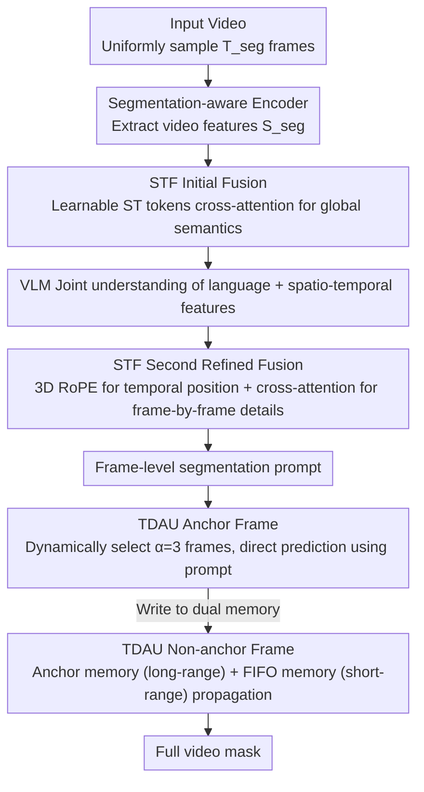

# VIRST: Video-Instructed Reasoning Assistant for SpatioTemporal Segmentation

**Conference**: CVPR 2026  
**arXiv**: [2603.27060](https://arxiv.org/abs/2603.27060)  
**Code**: [https://github.com/AIDASLab/VIRST](https://github.com/AIDASLab/VIRST)  
**Area**: Segmentation  
**Keywords**: Video Object Segmentation, RVOS, Vision-Language Models, Spatio-temporal Fusion, Dynamic Anchors, Reasoning Segmentation

## TL;DR

VIRST proposes an end-to-end framework that unifies global video reasoning and pixel-level mask prediction within a single Vision-Language Model (VLM). By incorporating Spatio-Temporal Fusion (STF) and a Temporal Dynamic Anchor Updater (TDAU), it achieves spatio-temporally consistent video segmentation. VIRST reaches 70.8 J&F on ReVOS (+7.5 over SOTA) and 62.9 on MeViS (+9.2), while maintaining an inference speed of 5.1 FPS (1.3x faster than VRS-HQ).

## Background & Motivation

1. **Background**: Referring Video Object Segmentation (RVOS) requires segmenting target objects based on linguistic descriptions. Recently, VLM-based methods (VISA, VRS-HQ, HyperSeg) have achieved significant progress by integrating segmentation decoders into Large Language Models.
2. **Limitations of Prior Work**: (1) Keyframe-based methods predict masks only on a few frames and then propagate them, but propagation drifts when encountering occlusions or appearance changes; (2) Full-frame prediction methods consume massive memory and cannot handle long videos; (3) Existing VLM segmentation models exhibit insufficient fusion between video features and semantic features.
3. **Key Challenge**: The model must both "understand" complex linguistic reasoning (e.g., "the person dancing the longest on the left") and "precisely" segment frame-by-frame—the former requiring global video understanding and the latter requiring frame-level pixel precision.
4. **Goal**: Unify global semantic reasoning and local spatio-temporal segmentation within a single model.
5. **Key Insight**: Keyframe (anchor) mechanism—performing precise predictions on dynamically selected anchor frames rather than all frames, then propagating to other frames via the memory mechanism of SAM2.
6. **Core Idea**: Two-stage Spatio-Temporal Fusion (STF) injects segmentation-aware video features into the VLM's semantic space; the Temporal Dynamic Anchor Updater (TDAU) performs direct prediction on anchor frames and propagation on non-anchor frames using hybrid memory.

## Method

### Overall Architecture

VIRST aims to resolve two typically conflicting tasks within one model: understanding global video reasoning descriptions like "the person dancing the longest on the left" while providing pixel-accurate masks for every frame. It integrates global semantic reasoning and local spatio-temporal segmentation into the same VLM. For a given video, $T_{seg}$ frames are uniformly sampled, and video features $S_{seg}$ are extracted by a segmentation-aware encoder. STF (Spatio-Temporal Fusion) injects these features into the VLM’s semantic space in two steps, enabling the VLM to "perceive" frame-by-frame spatio-temporal details while understanding the language, eventually outputting a segmentation prompt for each frame. Finally, the TDAU (Temporal Dynamic Anchor Updater) performs direct mask prediction only on a few dynamically selected anchor frames, while other frames rely on the SAM2 memory mechanism for propagation to assemble the final video mask. This avoids expensive full prediction on every frame while ensuring that reasoning results drive the segmentation.

> The three-stage progressive training (Design 3) is a training strategy integrated throughout the pipeline rather than a separate data flow stage, thus it is not depicted in the diagram above.

### Key Designs

**1. Spatio-Temporal Fusion (STF): Injecting segmentation features into VLM semantic space with frame-level refinement**

A common limitation in existing VLM segmentation models is the one-time fusion of video features, which results in the VLM receiving flattened global semantics and losing frame-by-frame spatio-temporal details, leading to errors in complex motion descriptions. STF addresses this with two stages. In the initial fusion stage, a set of learnable [ST] tokens aggregates video features via cross-attention, $F_{Init} = \text{CrossAttn}(E_{ST}, S_{down})$, providing the VLM with global semantics. After VLM processing, a second refined fusion stage begins: 3D RoPE is applied to add temporal positional information, followed by another cross-attention step, $\tilde{F}_{ST} = \text{CrossAttn}(F'_{ST}, S'_{down})$, to "retrieve" individual spatio-temporal details for each frame, resulting in the final frame-level segmentation prompt. This two-step process is effective because the first step handles semantic understanding while the second ensures per-frame alignment. Ablation studies show that two-stage fusion outperforms single-stage by 3.5 J&F, and replacing the second fusion with an MLP results in a drop to 59.4, indicating the necessity of the refinement step.

**2. Temporal Dynamic Anchor Updater (TDAU): Precise anchor prediction and dual-memory propagation**

Predicting masks for every frame is memory-intensive and unmanageable for long videos, yet pure propagation suffers from drift during occlusions or sudden appearance changes. TDAU compromises between these extremes: it uniformly selects $\alpha=3$ anchor frames and uses the STF-generated prompts for direct, precise mask prediction as reliable "reference points." Non-anchor frames do not undergo re-reasoning; instead, they utilize a dual-memory system. The Anchor Memory stores embeddings from the $\alpha$ most recent anchors to provide semantically stable long-range references, while the FIFO Memory stores embeddings from the $P$ most recent frames to provide short-range motion continuity. These are combined and fed into the SAM2 decoder to predict masks. For example, frame 1 is an anchor, generating a mask and writing to both memories; subsequent non-anchor frames retrieve semantic cues from anchor memory and motion cues from the FIFO memory for propagation until the next anchor frame recalibrates the process, preventing error accumulation. Since anchors are selected "dynamically and uniformly" rather than just using the first frame, the model can recover targets after occlusions. Ablation results show dynamic anchors outperform first-frame anchors by 5.0 J&F and are superior to CLIP-guided selection (59.3). Increasing the anchor count from 3 to 8 only yields a 0.3 improvement, suggesting saturation at 3 anchors.

**3. Three-stage Progressive Training: Gradual unfreezing from image to video level**

Training this system end-to-end is inherently unstable because video-level loss signals are sparse. To mitigate this, training is split into three steps: Stage 1 freezes SAM2 and trains only STF and LoRA to align segmentation features with the VLM semantic space. Stage 2 unfreezes the mask decoder and memory modules to train the segmentation head on image-level tasks. Stage 3 involves full unfreezing for true anchor-based propagation training. This "align, then segment, then propagate" pathway ensures dense supervision at each step, reserving the most difficult propagation training for when the model is already stable. Ablation studies confirm this: the full three-stage training reaches 72.6 on MeViS, while skipping Stage 1's alignment results in 65.8, a 6.8 J&F deficit.

### Loss & Training

The total loss is defined as $L_{total} = \lambda_{bce} L_{bce} + \lambda_{dice} L_{dice} + \lambda_{token} L_{token} + \lambda_{occ} L_{occ} + \lambda_{iou} L_{iou}$, with $\lambda$ values set at 1.0, 1.0, 1.0, 0.05, and 0.05 respectively. Training uses bfloat16 precision, a micro-batch size of 1, and 16-step gradient accumulation. The model was trained on 8×H100 GPUs for 3 days.

## Key Experimental Results

### Main Results

| Method | ReVOS-Ref J&F | ReVOS-Reason J&F | MeViS J&F | Ref-DAVIS17 J&F |
|------|--------------|-------------------|-----------|-----------------|
| VISA-13B | 57.4 | 44.3 | 44.5 | 70.4 |
| HyperSeg | 58.5 | 53.0 | - | - |
| VRS-HQ-13B | 63.3 | 56.8 | 50.9 | 76.0 |
| RGA3-7B | 60.5 | 55.4 | - | - |
| **Ours (VIRST)** | **70.8** | **66.1** | **62.9** | **79.5** |

### Ablation Study

| Configuration | MeViS J&F | Description |
|------|-----------|------|
| Initial ST-Fusion only | 59.7 | Lacks frame-level refinement |
| w/o Second ST-Fusion (MLP) | 59.4 | MLP replacement performs poorly |
| **Two-stage STF** | **62.9** | Complete design |
| First-frame anchor | 57.9 | -5.0 vs. Dynamic |
| CLIP-guided selection | 59.3 | Inferior to uniform sampling |
| **Dynamic Anchor** | **62.9** | Optimal |
| Training Stage 1+2+3 | 72.6 | Full progressive training |
| Training Stage 2+3 | 65.8 | Skip alignment loss (-6.8) |

### Key Findings

- Significant gains in the ReVOS Reasoning task (+9.3 vs. VRS-HQ) indicate that the two-stage STF fusion is particularly helpful for complex reasoning queries.
- Inference speed is 5.1 FPS, which is 34% faster than VRS-HQ (3.81 FPS), while achieving significantly higher accuracy.
- Image segmentation also reaches SOTA (90.7 on RefCOCO testA), proving that video capabilities do not compromise image performance.
- In the three-stage training, Stage 3 (propagation training) contributes most (+8.2 J&F) and is critical for video performance.

## Highlights & Insights

- **End-to-End Unified Design**: VIRST eliminates the intermediate information bottleneck of "understand then segment" by having the VLM directly output segmentation prompts.
- **Dynamic Anchors > Fixed Anchors**: Uniformly sampling 3 anchors achieves near-optimal results (vs. $\alpha=8$ with only 0.3 difference), significantly reducing complexity.
- **Engineering Value of Progressive Training**: The strategy of progressive unfreezing from image to video tasks is transferable to other video VLM tasks.

## Limitations & Future Work

- Still prone to errors in scenes with many visually similar distractors.
- Performance on queries requiring multi-step semantic reasoning (e.g., counting objects with specific attributes) remains suboptimal.
- Mask drift persists under continuous occlusion; the anchor mechanism mitigates but does not fully solve this.
- Memory constraints limit performance on ultra-long videos (>10 minutes).
- Performance on fine-grained part segmentation (e.g., fingers) is limited.

## Related Work & Insights

- **vs. VISA/VRS-HQ**: Keyframe propagation schemes exhibit severe drift in occlusion scenarios. VIRST improves robustness through the TDAU dual-memory mechanism.
- **vs. SAM2**: VIRST can be viewed as a video-language extension of SAM2—retaining the efficient propagation of SAM2 while adding the semantic reasoning capabilities of a VLM.
- **vs. VideoGLaMM**: VideoGLaMM lacks spatio-temporal fusion, showing a significant performance gap on complex motion descriptions (MeViS: 45.2 vs. 62.9).

## Rating

- Novelty: ⭐⭐⭐⭐ The two-stage STF fusion and TDAU anchor strategy are cleverly designed.
- Experimental Thoroughness: ⭐⭐⭐⭐⭐ 6+ RVOS benchmarks, image segmentation, detailed ablations, and efficiency analysis.
- Writing Quality: ⭐⭐⭐⭐ Clear method description and comprehensive experiments.
- Value: ⭐⭐⭐⭐⭐ Substantial SOTA in the RVOS field, open-source, and practical speed.

<!-- RELATED:START -->

## Related Papers

- [\[CVPR 2026\] SPOT: Spatiotemporal Prompt Optimization for Motion-Stabilized MLLM-Guided Video Segmentation](spot_spatiotemporal_prompt_optimization_for_motion-stabilized_mllm-guided_video_.md)
- [\[CVPR 2026\] Fast Reasoning Segmentation for Images and Videos](fast_reasoning_segmentation_for_images_and_videos.md)
- [\[CVPR 2026\] SegCompass: Exploring Interpretable Alignment with Sparse Autoencoders for Enhanced Reasoning Segmentation](segcompass_exploring_interpretable_alignment_with_sparse_autoencoders_for_enhanc.md)
- [\[CVPR 2026\] DPAD: Discriminative Perception via Anchored Description for Reasoning Segmentation](discriminative_perception_via_anchored_description_for_reasoning_segmentation.md)
- [\[CVPR 2026\] Efficient Video Object Segmentation and Tracking with Recurrent Dynamic Submodel](efficient_video_object_segmentation_and_tracking_with_recurrent_dynamic_submodel.md)

<!-- RELATED:END -->
