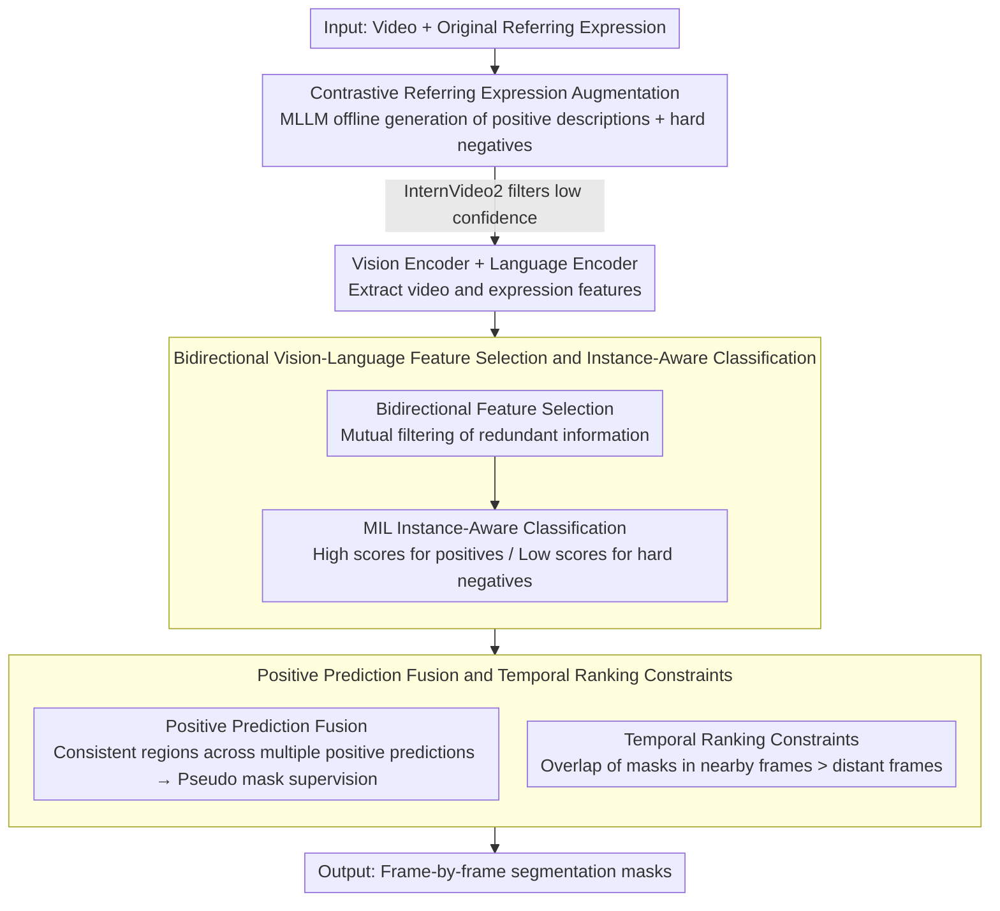

# Weakly-Supervised Referring Video Object Segmentation through Text Supervision

**Conference**: CVPR 2026 Findings  
**arXiv**: [2604.17797](https://arxiv.org/abs/2604.17797)  
**Code**: [https://github.com/viscom-tongji/WSRVOS](https://github.com/viscom-tongji/WSRVOS)  
**Area**: Segmentation  
**Keywords**: Weakly-supervised, Video object segmentation, Referring expressions, Text supervision, Multimodal alignment

## TL;DR

Ours proposes WSRVOS, the first weakly-supervised referring video object segmentation framework using only text expressions as supervision signals. Through MLLM-driven contrastive expression augmentation, bidirectional vision-language feature selection, instance-aware expression classification, and temporal segment ranking constraints, it significantly reduces reliance on pixel-level annotations.

## Background & Motivation

**Background**: Referring Video Object Segmentation (RVOS) segments target instances in a video based on a text expression. Mainstream methods (e.g., ReferFormer, SAMWISE) rely on pixel-level mask annotations for supervised learning, achieving excellent results but at extremely high annotation costs.

**Limitations of Prior Work**: Exploration of weakly-supervised RVOS is still in its infancy—existing work such as WRVOS uses a first-frame mask + subsequent frame bboxes, while OCPG uses bbox/point annotations to generate pseudo masks. However, bbox and point annotations still require substantial frame-by-frame manual labor, which remains expensive for long videos.

**Key Challenge**: How to enable a model to learn to localize and segment target instances in a video using only text expressions as supervision, without any provided spatial annotations (masks, bboxes, points)? The challenges lie in: (1) the heterogeneity of vision and language features making semantic alignment difficult; (2) the temporal dynamics and occlusions in videos further complicating the alignment process.

**Goal**: Design an end-to-end weakly-supervised RVOS framework that uses only text expressions as supervision signals during training, requiring no spatial annotations whatsoever.

**Key Insight**: The captioning capabilities of Multimodal Large Language Models (MLLMs) such as Qwen3-VL can generate rich positive and negative text descriptions for a video, providing supervision signals that far exceed the original brief expressions. Through contrastive learning, the model is taught to distinguish between correct and incorrect descriptions, thereby indirectly learning localization capabilities.

**Core Idea**: Utilize an MLLM to generate contrastive expression augmentation data (rich positive descriptions + hard negative descriptions), then train the segmentation model through instance-aware classification and pseudo mask fusion. No spatial annotations are used throughout the entire process.

## Method

### Overall Architecture

WSRVOS aims to answer a seemingly impossible question: can a model learn to segment targets in a video if it is given zero masks, zero bboxes, and zero points during training, but only a single referring text? Its solution is to transform "weak" supervision into "rich" supervision—using an MLLM offline to expand a dry referring expression into a set of detailed positive descriptions and hard negative descriptions. The model then learns to distinguish "which description truly corresponds to the target in the video." Once the model can reliably match positive descriptions to the correct visual regions, it fuses individual predictions from multiple positive descriptions into a pseudo mask to provide the missing spatial supervision for the segmentation head, with temporal constraints added to ensure inter-frame smoothness. The entire pipeline is "Text Augmentation → Bidirectional Feature Alignment and Classification → Pseudo Mask Self-Supervision → Temporal Regularization," without any manual spatial annotations.

### Key Designs

**1. Contrastive Referring Expression Augmentation: Expanding a single-sentence reference into positive-negative contrastive supervision**

Expressions in original RVOS datasets often contain only a few words like "the person in red," providing thin semantics that are insufficient for training alignment or teaching discriminative features. Here, Qwen3-VL is utilized offline: given the video and original expression, it generates $P$ finer positive descriptions covering appearance, actions, and interactions. InternVideo2 is then used to calculate video-text similarity to filter out descriptions with low confidence ($c^k < 0.8$), while the remaining ones are concatenated with the original expression to preserve the original meaning. For the negative side, Qwen3-VL balances the data by intentionally tampering with categories, attributes, or actions to create hard negatives that are "semantically plausible but point to different instances." Positives provide denser alignment signals, while hard negatives push the decision boundary—forcing the model to distinguish not just "a person," but specifically the one in red who is currently running. Crucially, the MLLM is only used during data preprocessing, and is entirely absent during inference, adding no online cost.

**2. Bidirectional Vision-Language Feature Selection and Instance-Aware Classification: Filtering irrelevant information before alignment**

The vast majority of pixels in a video are irrelevant to the reference, and the text contains non-informative words like prepositions and articles. Direct alignment amounts to finding correlations in noise. This step performs bidirectional selection: picking subsets of features on both visual and linguistic sides that are highly correlated with each other, mutually filtering out redundancy to leave a concise and alignment-friendly representation. A Multiple Instance Learning (MIL) framework is applied on top of this for proposal aggregation and expression matching—teaching the model to assign high scores to positive expressions and low scores to hard negatives. In the absence of mask supervision, this classification signal assumes the task of "teaching the model to localize": stable distinction between positive and negative text implies that the model has implicitly found the correct visual evidence within the instance.

**3. Positive Prediction Fusion and Temporal Ranking Constraints: Using consistency for pseudo masks and continuity for stability**

With only classification loss, localization remains blurred—it tells the model "it is this instance" without specifying the "boundaries." Ours uses a clever design: if the model's predictions for multiple positive descriptions of the same target are highly consistent, those consistently hit regions are likely the ground truth target. Multiple positive expression predictions are fused into a pseudo mask, which is fed back to the segmentation head as spatial supervision, distilling the fuzzy classification signal into a pixel-level target. On the temporal side, a ranking constraint leverages the continuity prior of videos: masks in frames closer in time should have higher overlap, i.e.,

$$\text{IoU}(m_t, m_{t+\delta_1}) > \text{IoU}(m_t, m_{t+\delta_2}) \quad \text{when} \ \delta_1 < \delta_2$$

This does not require precise frame-to-frame mask propagation but imposes a soft "near frames are more similar" constraint, which encourages temporal smoothness while avoiding the introduction of cumulative tracking errors.

### Loss & Training

The training objective is composed of three parts: instance-aware expression classification loss for distinguishing positive and negative text (implicit localization supervision), pseudo mask supervision loss for pixel-level spatial constraints, and temporal segment ranking loss for maintaining inter-frame consistency. MLLM and InternVideo2 only participate offline during data preprocessing and are not required during training or inference.

## Key Experimental Results

### Main Results

| Dataset | Metric | WSRVOS (Ours) | OCPG (Point Supervision) | Gain |
|--------|------|-------------|-------------|------|
| A2D-Sentences | mAP | **Best** | Baseline | Significantly Outperforms |
| J-HMDB Sentences | J&F | **Best** | Baseline | Significantly Outperforms |
| Ref-YouTube-VOS | J&F | **Best** | Baseline | Significantly Outperforms |
| Ref-DAVIS17 | J&F | **Best** | Baseline | Significantly Outperforms |

### Ablation Study

| Configuration | Performance Change | Description |
|------|---------|------|
| Full WSRVOS | **Best** | Complete Model |
| w/o Contrastive Expression Augmentation | Decrease | Insufficient supervision signals |
| w/o Bidirectional Feature Selection | Decrease | Reduced alignment precision |
| w/o Positive Prediction Fusion | Decrease | Lack of spatial supervision signals |
| w/o Temporal Ranking Constraints | Decrease | Degraded temporal consistency |

### Key Findings

- WSRVOS, using only text supervision, surpasses the weakly-supervised method OCPG which uses bbox/point annotations, indicating that rich text supervision signals can be more effective than sparse spatial annotations.
- Contrastive expression augmentation contributes the most—both the discriminativeness of hard negatives and the richness of positives are critical.
- Temporal ranking constraints are more effective on long videos; in short videos, the contribution is limited because differences between adjacent frames are minimal.

## Highlights & Insights

- The setting of "no spatial annotations whatsoever" represents a significant leap in the RVOS field. Utilizing MLLM descriptive capabilities to transform text from "weak supervision" to "rich supervision" is a very forward-looking approach.
- The positive prediction fusion strategy is ingenious: if predictions for multiple correct descriptions are highly consistent, those regions are likely the target—using "prediction consistency" as a reliability metric for pseudo labels.
- The temporal ranking constraint design is simple yet effective; it requires no precise frame-to-frame mask propagation, only a soft constraint of "nearer frames being more similar."

## Limitations & Future Work

- Reliance on the quality of expressions generated by the MLLM (Qwen3-VL); errors in MLLM video understanding can introduce noise.
- The InternVideo2 filtering threshold of 0.8 is manually set and may require adjustment for different domains.
- In scenarios with small target instances or heavy occlusion, the localization capability of pure text supervision may be insufficient.
- Future work could explore adaptive expression generation and filtering strategies, or combine with vision grounding pre-training to enhance localization.

## Related Work & Insights

- **vs WRVOS**: Requires first-frame masks + bboxes; WSRVOS requires no spatial annotations at all.
- **vs OCPG**: Uses bbox/point to generate pseudo masks, yet WSRVOS achieves better performance using only text.
- **vs TRIS/PCNet (Image-level)**: These are image-level weakly-supervised referring segmentation methods; WSRVOS extends this to more difficult video scenarios.

## Rating

- Novelty: ⭐⭐⭐⭐⭐ First pure text-supervised RVOS method; a paradigm innovation.
- Experimental Thoroughness: ⭐⭐⭐⭐ Validated on four datasets with comprehensive ablations.
- Writing Quality: ⭐⭐⭐⭐ Clear problem definition and systematic method description.
- Value: ⭐⭐⭐⭐⭐ Significantly reduces annotation costs for RVOS; extremely high practical value.

<!-- RELATED:START -->

## Related Papers

- [\[CVPR 2026\] Rethinking Box Supervision: Bias-Free Weakly Supervised Medical Segmentation](rethinking_box_supervision_bias-free_weakly_supervised_medical_segmentation.md)
- [\[CVPR 2026\] FCL-COD: Weakly Supervised Camouflaged Object Detection with Frequency-aware and Contrastive Learning](fcl-cod_weakly_supervised_camouflaged_object_detection_with_frequency-aware_and_.md)
- [\[CVPR 2026\] InterRVOS: Interaction-Aware Referring Video Object Segmentation](interrvos_interaction-aware_referring_video_object_segmentation.md)
- [\[CVPR 2026\] Beyond Text: Visual Description Assembly by Probabilistic Model for CLIP-based Weakly Supervised Semantic Segmentation](beyond_text_visual_description_assembly_by_probabilistic_model_for_clip-based_we.md)
- [\[CVPR 2026\] Frequency-Aware Affinity for Weakly Supervised Semantic Segmentation](frequency-aware_affinity_for_weakly_supervised_semantic_segmentation.md)

<!-- RELATED:END -->
