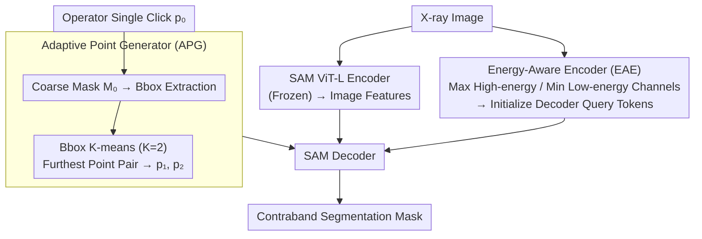

# XSeg: A Large-scale X-ray Contraband Segmentation Benchmark for Real-World Security Screening

**Conference**: CVPR 2026  
**arXiv**: [2604.03706](https://arxiv.org/abs/2604.03706)  
**Code**: None  
**Area**: Semantic Segmentation  
**Keywords**: X-ray contraband segmentation, security screening datasets, SAM adaptation, dual-energy encoder, adaptive point prompts

## TL;DR

This study constructs XSeg, the largest X-ray contraband segmentation dataset to date (98,644 images, 295,932 instance masks, 30 fine-grained categories), and proposes APSAM. By leveraging X-ray dual-energy physical properties via an Energy-Aware Encoder and intelligently expanding user clicks with an Adaptive Point Generator, APSAM achieves 72.83% mIoU, outperforming SAM fine-tuning by 4.96%.

## Background & Motivation

1. **Background**: Contraband detection in X-ray security screening is a critical security requirement for airports, subways, and logistics centers. Existing X-ray datasets (SIXray, PIXray, PIDray) are small-scale (< 50,000 images), cover few categories (< 15), and primarily provide detection boxes rather than segmentation masks.
2. **Limitations of Prior Work**: (1) Data scarcity—even the largest PIDray has only 47K images and 12 categories; (2) Poor transfer of general segmentation models like SAM—the color gamut and texture of X-ray images differ significantly from natural images; (3) Single-point prompts are uninformative in complex overlapping scenarios—items in security images are highly occluded.
3. **Key Challenge**: Accurate segmentation in X-ray security screening requires large-scale high-quality annotated data and domain-adapted methods, both of which are severely lacking.
4. **Goal**: Address both data and methodology bottlenecks by constructing a large-scale segmentation benchmark and designing a domain-specific SAM adaptation scheme.
5. **Key Insight**: Physical properties of X-ray imaging provide unique signals—dual-energy channels (high/low energy) can distinguish different materials, a domain prior absent in RGB images.
6. **Core Idea**: The Energy-Aware Encoder (EAE) utilizes X-ray max/min channels to extract dual-energy features for decoder query initialization; the Adaptive Point Generator (APG) expands a single user click into two informative prompt points.

## Method

### Overall Architecture

This paper addresses two major gaps: the lack of large-scale data for X-ray contraband segmentation and the poor performance of general models like SAM in the X-ray domain. On the data side, the XSeg dataset is produced; on the methodological side, the domain-specific APSAM model is proposed. The mechanism involves freezing SAM and inserting two lightweight modules to enable the model to "understand X-ray physics" and "optimize user clicks."

During inference, the pipeline is as follows: The X-ray image passes through SAM's frozen ViT-L encoder to obtain image features. Simultaneously, the EAE extracts dual-energy physical priors to initialize the decoder's query tokens. An operator provides a single click $p_0$, which the APG uses to estimate a coarse mask and extract two representative points $(p_1, p_2)$ to replace the single point. Finally, the SAM decoder uses the enhanced prompts and physical-prior-initialized tokens to predict the final mask.

### Key Designs

**1. Energy-Aware Encoder (EAE): Injecting X-ray Dual-Energy Physical Signals for Decoder Initialization**

SAM is pre-trained on natural images, and its decoder queries are randomly initialized, lacking priors for X-ray images with distinct gamuts and textures. The EAE leverages the physical characteristics of X-ray imaging: image channels encode transmission information at different energy levels. Attenuation differences between metal, plastic, and organic materials at high vs. low energy provide material cues missing in RGB images. EAE extracts the high-energy channel $I_H = \max_c I(\cdot,\cdot,c)$ and low-energy channel $I_L = \min_c I(\cdot,\cdot,c)$, encodes them via three layers of Conv+LayerNorm+GELU+MaxPool, and uses channel-wise attention and top-k feature selection to generate initialization queries. This replaces SAM's original random tokens, allowing the decoder to start with a "material-aware" judgment, contributing +3.02 mIoU in ablation.

**2. Adaptive Point Generator (APG): Expanding Single Clicks into Informative Multi-Point Prompts**

In security scenarios, items are highly overlapped, and operators typically only provide a single click. A single point often fails to define the target's boundary, causing SAM to include backgrounds or adjacent objects. APG generates an initial soft mask $M_0$ from the single point $p_0$, extracts a bounding box with random scaling ($s \sim \mathcal{U}(0.9, 1.1)$) for robustness, and performs K-means ($K=2$) clustering within the box. The furthest point pair $(p_1^*, p_2^*)$ between the clusters is used as the new prompt. If cluster centers are too close, it reverts to random sampling as a fallback. These points represent the most spatially disparate parts of the target. Ablation shows that APG selection outperforms two random points by 1.59 mIoU (71.90 vs. 70.31).

**3. XSeg Dataset Construction: Scaling up with Semi-Automatic Closed-Loop Annotation**

Existing datasets like SIXray or PIDray are either small or poorly categorized. XSeg integrates 114Xray, PIXray, PIDray, and real security images. After filtering for resolution and clarity, 98,644 images were selected. A closed-loop strategy using MobileSAM-assisted generation followed by manual verification by security experts was used. After 5 iterations, the final dataset provides 295,932 instance masks across 30 fine-grained categories (e.g., distinguishing metal vs. plastic handles of scissors), facilitating the material-distinguishing goal of the EAE.

### Loss & Training

Standard SAM training loss (Dice + Cross-Entropy) is used. The model employs a ViT-L/14 backbone with $512 \times 512$ input. Optimization uses AdamW, $lr=1e-5$, batch size 16, for 12 epochs. Most parameters are frozen; only EAE, APG, and adapters (11.91M trainable parameters) are trained.

## Key Experimental Results

### Main Results

| Method | Backbone | mIoU↑ | Dice↑ | Trainable Params |
|------|----------|-------|-------|-----------|
| DeepLabV3+ | ResNet101 | 57.29 | 72.84 | 60.21M |
| Mask2former | Swin-L | 69.59 | 81.44 | 144.85M |
| SAM (frozen) | ViT-L | 53.82 | 64.99 | 0M |
| SAM (finetune) | ViT-L | 67.87 | 77.45 | 10.06M |
| SAMUS | ViT-L | 68.56 | 78.46 | 43.21M |
| **APSAM** | **ViT-L** | **72.83** | **82.31** | **11.91M** |

### Ablation Study

| Configuration | mIoU↑ | Dice↑ | Description |
|------|-------|-------|------|
| w/o EAE & APG (SAM FT) | 67.87 | 77.45 | Baseline |
| w/o APG | 70.89 | 79.50 | EAE Gain: +3.02 |
| w/o EAE | 71.90 | 81.62 | APG Gain: +4.03 |
| **Full (EAE + APG)** | **72.83** | **82.31** | Complementary |
| 1 Random Point | 67.87 | 77.45 | Baseline |
| 2 Random Points | 70.31 | 80.18 | Multi-point advantage |
| **APG 2 Points** | **71.90** | **81.62** | Intelligent selection superior |

### Key Findings

- The APG contribution (+4.03 mIoU) is greater than the EAE (+3.02), indicating prompt quality is more critical than query initialization for SAM.
- Strong cross-domain generalization: Achieved 71.23% and 83.61% mIoU on PIDray and PIXray respectively, surpassing SAMUS by 4.22% and 3.70%.
- Zero-shot SAM performance is only 53.82% mIoU, highlighting the massive domain gap.
- APSAM outperforms Mask2former (72.83 vs 69.59) while using significantly fewer parameters (11.91M vs 144.85M).

## Highlights & Insights

- **Clever Use of Physical Priors**: X-ray dual-energy channels are not just RGB decompositions but physical signals carrying material information. EAE's max/min operations are simple yet effective.
- **Practicality of APG**: In real security settings, operators only have time for a single click. APG's ability to expand this into an informative two-point prompt reduces manual burden during deployment.
- **Long-term Value of the Dataset**: 98K images and 30 fine-grained categories fill a major gap in the security segmentation field.

## Limitations & Future Work

- Data sources are primarily from Chinese security systems; color gamut differences in X-ray equipment from other regions/manufacturers may impact generalization.
- 30 categories may still be insufficient; more contraband types (e.g., liquids, powders) exist in real-world scenarios.
- Despite 5 iterations of closed-loop annotation, quality in extremely overlapped scenes remains difficult to guarantee.
- APG's K-means clustering might fail on extremely elongated objects (both points might align in one direction).
- From a security standpoint, the false negative rate is more critical than IoU, yet this was not the primary focus of analysis.

## Related Work & Insights

- **vs SAMUS**: Also a domain adaptation method for SAM, but SAMUS uses 43.21M trainable parameters and ignores X-ray physical properties. APSAM achieves better results with only 11.91M.
- **vs Mask2former**: Fully supervised methods require ~145M parameters but achieve lower mIoU, suggesting SAM-based semi-supervised adaptation is a more efficient path.
- **vs PIDray/PIXray**: XSeg is twice the size and 2.5 times the category granularity of these benchmarks combined.

## Rating

- Novelty: ⭐⭐⭐⭐ (EAE and APG designs are novel, though not revolutionary)
- Experimental Thoroughness: ⭐⭐⭐⭐⭐ (Complete ablation, cross-domain, multi-framework, and prompt strategy comparisons)
- Writing Quality: ⭐⭐⭐⭐ (Clear descriptions of dataset and methodology)
- Value: ⭐⭐⭐⭐⭐ (Dataset contribution has a long-term impact on the security field)

<!-- RELATED:START -->

## Related Papers

- [\[CVPR 2026\] RealVLG-R1: A Large-Scale Real-World Visual-Language Grounding Benchmark for Robotic Perception and Manipulation](realvlg-r1_a_large-scale_real-world_visual-language_grounding_benchmark_for_robo.md)
- [\[CVPR 2026\] CLP: A Real-World Dataset of Contaminated Lens Protectors for Robust Semantic Segmentation](clp_a_real-world_dataset_of_contaminated_lens_protectors_for_robust_semantic_seg.md)
- [\[ICCV 2025\] RAGNet: Large-scale Reasoning-based Affordance Segmentation Benchmark towards General Grasping](../../ICCV2025/segmentation/ragnet_large-scale_reasoning-based_affordance_segmentation_benchmark_towards_gen.md)
- [\[CVPR 2026\] PRUE: A Practical Recipe for Field Boundary Segmentation at Scale](prue_a_practical_recipe_for_field_boundary_segmentation_at_scale.md)
- [\[CVPR 2026\] Exploring the Underwater World Segmentation without Extra Training](exploring_the_underwater_world_segmentation_without_extra_training.md)

<!-- RELATED:END -->
