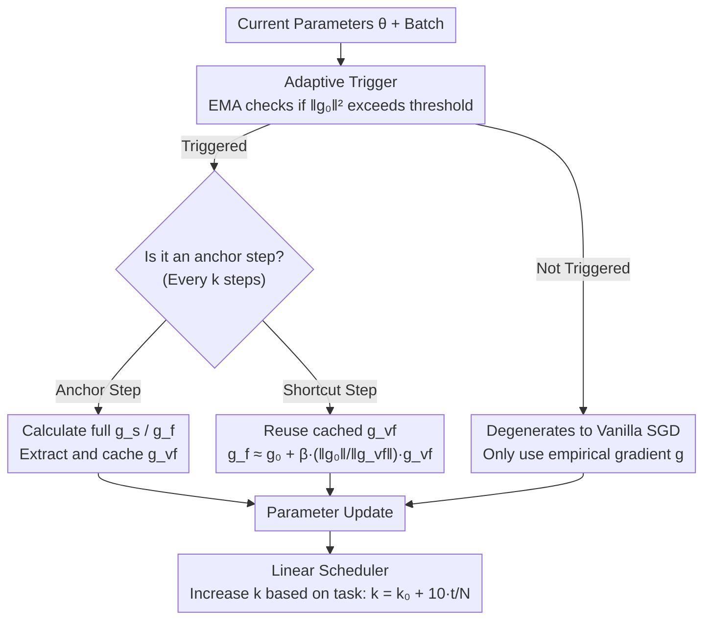

# A Faster Path to Continual Learning

**Conference**: CVPR 2026  
**Code**: Not yet public (implemented based on PILOT / C-Flat repositories)  
**Area**: Continual Learning / Optimizer / Flat Minima  
**Keywords**: Continual Learning, C-Flat, Sharpness-Aware Minimization, Direction-Invariant Gradient, Adaptive Triggering

## TL;DR
To address the issue of the C-Flat optimizer being too slow due to calculating three additional gradients per step, this paper identifies "direction-invariant" components within the first-order flatness gradients. These components are cached and reused in subsequent steps to skip redundant perturbation gradient calculations. Combined with a linear scheduler that gradually increases the skip interval as tasks progress and an adaptive trigger based on gradient statistics, C-Flat Turbo achieves 1.0×~1.25× speedup over C-Flat (recovering throughput from ~27% to ~60%) while maintaining or even slightly improving accuracy.

## Background & Motivation

**Background**: Continual Learning (CL) requires models to learn on a continuous stream of tasks without forgetting old knowledge. Besides mainstream approaches like rehearsal, regularization, architectural expansion, and Pre-trained Models (PTM), recent work focusing on "optimization geometry" has been active. Extensive evidence suggests that pushing models toward **flat minima** significantly alleviates catastrophic forgetting because flat regions are insensitive to parameter perturbations, preventing new task updates from easily destroying solutions learned for old tasks. C-Flat is a representative work in this line: it is a plug-and-play optimizer that simultaneously optimizes zero-order sharpness and first-order flatness, encouraging the model to converge to "uniformly low-loss, low-curvature" regions in the joint space of new and old tasks.

**Limitations of Prior Work**: The flatness alignment mechanism of C-Flat is very expensive. In the C-Flat objective $\min_{\boldsymbol\theta}\ \mathcal L(\boldsymbol\theta)+R^0_\rho(\boldsymbol\theta)+\lambda\,R^1_\rho(\boldsymbol\theta)$, every iteration requires, in addition to the standard empirical gradient $\boldsymbol g=\nabla\mathcal L(\boldsymbol\theta)$: (i) a zero-order sharpness gradient $\boldsymbol g_s$ at an adversarial perturbation point, requiring one extra backpropagation; (ii) a first-order flatness gradient $\boldsymbol g_f$, which requires computing gradient norms for both the proxy model and its perturbed state, adding two more backpropagations. Calculating 3-4 backpropagations per step multiplies the total cost. Experimental data shows that C-Flat drops throughput from 100% (vanilla) to only about 26%~34%, an overhead that is particularly fatal in long task sequences and large-scale PTM scenarios.

**Key Challenge**: There is a sharp trade-off between "pursuing flatter minima" and "maintaining training efficiency." Most sharpness-aware CL methods directly adopt the full computational overhead of SAM. No one has asked: must those extra gradients calculated for flatness be recomputed from scratch at every single step?

**Goal**: To eliminate a large portion of the redundant gradient calculations without sacrificing the flattening effect of C-Flat, making it run at speeds close to or even faster than SAM.

**Key Insight**: The authors observe a key phenomenon—after performing an orthogonal decomposition of the SAM gradient along the direction of the main gradient, the **orthogonal component changes much slower than the main gradient** (an insight from LookSAM). The authors further investigate: do such "direction-invariant, slowly-changing" components also exist in the first-order flatness gradient? Experiments provide an affirmative answer, showing that the orthogonal component of flatness $\boldsymbol g_{vf}$ changes even **slower** than the sharpness component $\boldsymbol g_{vs}$. Since this direction remains nearly constant over several steps, there is no need to recompute it every step; it can be cached and reused.

**Core Idea**: Replace "recomputing sharpness/flatness gradients at every step" with "caching direction-invariant flatness components + periodic reuse," while allowing the reuse interval to adaptively increase as tasks progress.

## Method

### Overall Architecture
C-Flat Turbo does not change the optimization objective of C-Flat; it only changes **how to compute these regularized gradients efficiently**. Its core mechanism is a cycle that "performs a full calculation every $k$ steps and takes a shortcut for the remaining $k-1$ steps": at step 1 (the anchor step), the full sharpness gradient $\boldsymbol g_s$ and flatness gradient $\boldsymbol g_f$ are computed, and the direction-invariant component $\boldsymbol g_{vf}$ is extracted and cached. In the following $k-1$ steps, the cached $\boldsymbol g_{vf}$ is directly added to the current proxy gradient to approximate the flatness update, skipping those two expensive backpropagations. On top of this, two layers of dynamic control are added: a **linear scheduler** that increases the interval $k$ based on the task index (earlier tasks have high gradient jitter and small $k$ for frequent calculation; later tasks have stable gradients and large $k$ for more savings), and an **adaptive trigger** that decides whether to apply C-Flat regularization at all based on gradient norm statistics, reverting to pure SGD when regularization is not deemed necessary.

### Key Designs

**1. Shortcut via Direction-Invariant Components: Replacing "Per-step Flatness Recomputation" with "Cache and Reuse"**

This is the main engine for time savings, targeting the two most expensive backpropagations in C-Flat. The authors first review the LookSAM approach: decomposing the SAM gradient orthogonally to the empirical gradient $\boldsymbol g$ to obtain the direction-invariant sharpness component $\boldsymbol g_{vs}:=\boldsymbol g_s-\frac{\langle\boldsymbol g_s,\boldsymbol g\rangle}{\|\boldsymbol g\|^2}\boldsymbol g$. Because it changes slowly, it can be cached. This paper applies the same logic to first-order flatness: noting that the perturbation point $\boldsymbol\theta_p=\boldsymbol\theta+\boldsymbol\epsilon^*_1$ in the $R^1_\rho$ approximation naturally serves as a "proxy model," the flatness gradient $\boldsymbol g_f$ is orthogonally decomposed relative to the **proxy gradient** $\boldsymbol g_0=\nabla\mathcal L(\boldsymbol\theta+\boldsymbol\epsilon^*_1)$ to extract the direction-invariant flatness component:

$$\boldsymbol g_{vf}:=\boldsymbol g_f-\frac{\langle\boldsymbol g_f,\boldsymbol g_0\rangle}{\|\boldsymbol g_0\|^2}\boldsymbol g_0.$$

A key empirical finding (Fig. 3) is that while the proxy gradient $\boldsymbol g_0$ itself jitters significantly due to being in a high-curvature region, the orthogonal component $\boldsymbol g_{vf}$ is surprisingly stable—even more stable than $\boldsymbol g_{vs}$ in LookSAM. When measured by the "L2 distance to the gradient five steps prior," the curve for $\boldsymbol g_{vf}$ remains very low. Since this direction is nearly constant over several consecutive steps, recomputing $\boldsymbol g_1$ every step is unnecessary. Specifically, after computing and caching $\boldsymbol g_{vf}$ at an anchor step, the subsequent $k-1$ steps approximate the flatness update as:

$$\boldsymbol g_f\approx \boldsymbol g_0+\beta\,\frac{\|\boldsymbol g_0\|}{\|\boldsymbol g_{vf}\|}\,\boldsymbol g_{vf}$$

(where $\beta$ is a scaling factor, set to 0.8 in experiments), thus avoiding the recomputation of $\boldsymbol g_1$ and saving one expensive backpropagation. This is the source of the "Turbo" speed: replacing true recomputation with a linear extrapolation of the cached direction.

**2. Phased Linear Scheduler: Dynamically Increasing Skip Intervals with Task Progress**

A fixed interval $k$ is sub-optimal because the stability of the gradient changes over time. The authors observe (Fig. 4a/4b) that sharpness and flatness gradients jitter violently during the early stages of each task but stabilize as training progresses. Furthermore, this stabilization occurs **across tasks**—later tasks exist in a generally flatter parameter space where classes are better separated, leading to more stable gradients. Since later gradients are more stable and cached directions are more reliable, one can "save more" in later stages. Thus, a linear scheduler is introduced to grow the interval with the task index $t$:

$$k_t = k_0 + 10\cdot t/N,$$

where $k_0$ is the initial interval and $N$ is the total number of tasks. Earlier tasks use a small $k$ to ensure accuracy through frequent updates, while later tasks use a large $k$ to maximize speed through reuse. The authors note that this scheduler is insensitive to $N$; even if $N$ is estimated incorrectly or unknown, the gradual increase of $k_t$ ensures that deviations in later tasks have minimal impact on results. In experiments, this scheduler provided an additional ~15% speedup for MEMO and ~30% for EASE with negligible accuracy loss.

**3. Adaptive Triggering: Deciding "Whether to Use C-Flat" via Gradient Norm Statistics**

Beyond saving recomputations, some steps may not need C-Flat regularization at all, in which case the optimizer should revert to vanilla SGD. Approaches like SS-SAM and AE-SAM exist for zero-order sharpness, but first-order flatness has been largely ignored. Through Q-Q plots (Fig. 4c/4d), the authors find that $\|\boldsymbol g\|^2$ and $\|\boldsymbol g_0\|^2$ approach a normal distribution during training. They use Exponential Moving Average (EMA) to estimate the mean and dispersion of the proxy gradient norm $\|\boldsymbol g_0\|^2$ online:

$$\mu_{f,j}=\delta\mu_{f,j-1}+(1-\delta)\|\boldsymbol g_{0j}\|^2,\qquad \sigma_{f,j}=\delta\sigma_{f,j-1}+(1-\delta)\big(\|\boldsymbol g_{0j}\|^2-\mu_{f,j}\big)^2$$

($\delta=0.9$ is the decay factor). Flatness regularization is triggered only when $\|\boldsymbol g_{0j}\|^2 > \mu_{f,j}+\sigma_{f,j}$, i.e., when current curvature is significantly high and the model is in a region that "truly needs to be flattened"; otherwise, the step proceeds with pure SGD. This focuses computation where it is most needed, further reducing the average per-step cost.

### Loss & Training
The optimization objective follows C-Flat: $\mathcal L(\boldsymbol\theta)+R^0_\rho(\boldsymbol\theta)+\lambda R^1_\rho(\boldsymbol\theta)$. No new loss terms are introduced; the focus is solely on the efficient approximation of regularized gradients. Key hyperparameters: neighborhood radius $\rho=0.05$, balance coefficient $\lambda=0.2$, scaling factor $\beta=0.8$, sampling interval $k$ (evaluated at 2/5/10), EMA decay $\delta=0.9$. The authors provide a convergence proof sketch for Turbo in the appendix: since C-Flat itself is proven to converge, one only needs to bound the additional approximation error introduced by the $k-1$ "proxy gradient substitute steps."

## Key Experimental Results

### Main Results (PTM backbone, ViT-B/16-IN1K)
C-Flat/C-Flat Turbo compared across five SOTA CL methods. Img/s percentages indicate throughput relative to vanilla (higher is faster).

| Method | CIFAR100 Avg/Last | IN-R Avg/Last | ObjNet Avg/Last | Img/s (Ratio) |
|------|------|------|------|------|
| EASE | 91.91 / 87.30 | 80.49 / 75.05 | 64.38 / 52.02 | 166.67 (100%) |
| +C-Flat | 92.05 / 87.91 | 80.97 / 75.64 | 64.89 / 52.47 | 44.25 (**26.5%**) |
| +C-Flat Turbo | **92.36 / 87.96** | **81.18 / 75.76** | **64.96 / 52.61** | 102.74 (**61.6%**) |
| Ranpac | 94.32 / 90.72 | 82.07 / 76.80 | 71.66 / 60.17 | 154.64 (100%) |
| +C-Flat | 94.41 / 90.70 | 82.66 / 77.25 | 72.15 / 60.33 | 42.98 (27.8%) |
| +C-Flat Turbo | **94.45 / 90.74** | **83.13 / 77.83** | 72.16 / 60.33 | 94.34 (61.0%) |
| iCaRL | 77.83 / 66.64 | 72.13 / 61.62 | 48.06 / 28.20 | 73.35 (100%) |
| +C-Flat | 79.72 / 67.15 | 72.92 / 62.35 | 49.59 / 29.03 | 19.72 (26.9%) |
| +C-Flat Turbo | **79.82 / 68.54** | **73.11 / 62.38** | **50.49 / 29.30** | 45.89 (62.6%) |

Key takeaway: While maintaining or slightly improving accuracy (Last accuracy generally +0.1~1.4), the throughput—previously slashed to ~27% by C-Flat—is restored to ~60%. This equates to training approximately 2× faster than C-Flat and 0.6× as fast as vanilla.

### Training from Scratch (ResNet, no PTM)

| Method | ResNet-18 Avg/Last | Img/s (Ratio) | ResNet-34 Avg/Last |
|------|------|------|------|
| MEMO | 48.63 / 29.19 | 2413.8 (100%) | 68.49 / 57.05 |
| +C-Flat | 49.98 / 30.76 | 886.1 (36.7%) | 69.00 / 59.29 |
| +C-Flat Turbo | **50.51 / 32.24** | 1891.9 (**78.4%**) | **69.48 / 59.33** |
| iCaRL +Turbo | 59.84 / 42.84 | 1750.1 (75.0%) | 59.75 / 42.34 |

MEMO on ResNet-18 saw a Last accuracy gain of **+3.05%** and +2.28% on ResNet-34, with less forgetting than C-Flat. The authors hypothesize that architectural expansion methods (like MEMO) involve more frequent module updates and less stability, making them benefit most from the "softer" sharpness constraints of Turbo.

## Highlights & Insights
- **Reusing "Direction-Invariant Components" for first-order flatness is the soul of the paper**: Transferring the LookSAM insight that "orthogonal components change slowly" from zero-order sharpness to first-order flatness led to a counter-intuitive discovery: despite the proxy gradient $\boldsymbol g_0$ being jittery, its orthogonal component $\boldsymbol g_{vf}$ is more stable than the sharpness component, providing the empirical foundation for cache reuse.
- **Cross-task gradient stabilization directly informs the linear scheduler**: The concept of "saving more as tasks progress" is implemented via $k_t=k_0+10t/N$, which is easy to use and insensitive to $N$, making it engineering-friendly.
- **Three layers of efficiency are orthogonal**: Direction reuse (saving recomputation), the scheduler (dynamic intervals), and adaptive triggering (targeted application) address different sources of redundancy and are stackable. This logic of "deconstructing which parts of the oracle gradient can be saved" can be transferred to any expensive SAM/GAM-style regularized optimizer beyond CL.
- **Plug-and-play**: By not altering the C-Flat objective, the method can be applied consistently to various CL approaches (exemplar-based, PTM-based, expansion-based) with stability.

## Limitations & Future Work
- **Conservative wording on speedup (1.0×~1.25×)**: While the title mentions 1.0×~1.25× faster than C-Flat, the tables show throughput ratios improving from ~27% to ~60%, which is closer to a 2× wall-clock speedup. Speedup is highly dependent on backbone, method, and sequence.
- **Reliance on a core empirical assumption**: The prerequisite for the shortcut is that $\boldsymbol g_{vf}$ is "stable enough" within $k-1$ steps. While validated on PTM/ViT and ResNet, the cached direction might fail in scenarios with violent gradient shifts (e.g., extreme task distribution shifts or long sequences from scratch without strong priors).
- **Rigid adaptive trigger threshold**: The use of a single $\mu+\sigma$ threshold with EMA assumes $\|\boldsymbol g_0\|^2$ is approximately normal. Whether jitter near the threshold causes frequent triggering shifts that affect stability was not investigated in detail.

## Related Work & Insights
- **vs C-Flat**: Shares the same objective. C-Flat recomputes sharpness+flatness gradients (3~4 backprops) every step; this work caches direction-invariant flatness components and adds a scheduler/trigger to double throughput with similar/better accuracy.
- **vs LookSAM**: LookSAM only reuses the direction-invariant component $\boldsymbol g_{vs}$ for zero-order sharpness and uses a simple reuse of historical gradients, which causes performance drops in EASE. This work extends the idea to first-order flatness ($\boldsymbol g_{vf}$, which is more stable) and uses progressive updates to maintain speed without dropping performance.
- **vs SS-SAM / AE-SAM**: These use Bernoulli trials or sharpness thresholds to "skip" zero-order SAM calculations. The adaptive trigger here borrows the threshold idea from AE-SAM but applies it to the proxy gradient norm of first-order flatness, filling a gap in adaptive triggering for flatness.

## Rating
- Novelty: ⭐⭐⭐⭐ Transferring direction-invariant reuse to first-order flatness with cross-task scheduling is a solid and well-supported insight.
- Experimental Thoroughness: ⭐⭐⭐⭐ Covers 5 CL methods across 4 datasets, training from scratch, optimizer comparisons, and extensive ablations.
- Writing Quality: ⭐⭐⭐⭐ Clear explanation of mechanisms; empirical support in Fig. 3/4 is convincing.
- Value: ⭐⭐⭐⭐ Plug-and-play doubling of C-Flat training speed with almost zero tuning cost is highly practical for long-sequence/large-model CL.

<!-- RELATED:START -->

## Related Papers

- [\[CVPR 2026\] Spectral Mixture-of-Experts for Continual Learning](spectral_mixture-of-experts_for_continual_learning.md)
- [\[CVPR 2026\] Exemplar-Free Continual Learning for State Space Models](exemplar-free_continual_learning_for_state_space_models.md)
- [\[CVPR 2026\] Subspace Alignment for CLIP-based Continual Learning via Canonical Correlation Analysis](subspace_alignment_for_clip-based_continual_learning_via_canonical_correlation_a.md)
- [\[CVPR 2026\] Parameter-efficient Continual Learning for Enhancing Plasticity without Forgetting under Limited Model Capacity](parameter-efficient_continual_learning_for_enhancing_plasticity_without_forgetti.md)
- [\[CVPR 2026\] AdaPrior: Bayesian-Inspired Adaptive Prior Correction for Long-Tailed Continual Learning](adaprior_bayesian-inspired_adaptive_prior_correction_for_long-tailed_continual_l.md)

<!-- RELATED:END -->
