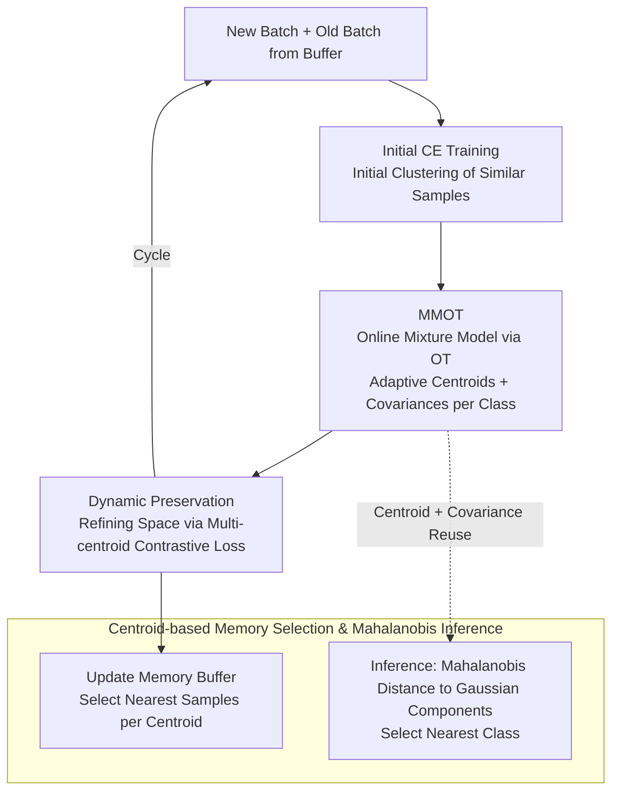

# An Optimal Transport-driven Approach for Cultivating Latent Space in Online Incremental Learning

**Conference**: CVPR 2026  
**arXiv**: [2211.16780](https://arxiv.org/abs/2211.16780)  
**Code**: None  
**Area**: Continual Learning / Online Incremental Learning  
**Keywords**: Online Class-Incremental Learning, Optimal Transport, Gaussian Mixture Model, Catastrophic Forgetting, Latent Space

## TL;DR

This paper proposes an online mixture model learning framework (MMOT) based on Optimal Transport theory. By maintaining multiple adaptive centroids for each category, it precisely characterizes the multimodal nature of online data streams. Combined with a dynamic preservation strategy to enhance category discriminability, it effectively mitigates catastrophic forgetting in Online Class-Incremental Learning (OCIL).

## Background & Motivation

Online Class-Incremental Learning (OCIL) represents one of the most challenging scenarios in continual learning: data distributions change dynamically, models can only perform a single iteration update on each arriving mini-batch, and no task IDs are available during inference. This requires models to continuously adapt to new classes while maintaining memory of old ones under extremely limited replay conditions.

Existing methods face two main **Limitations of Prior Work**. First, most approaches use a single classification head or a single prototype (centroid) to represent each class in the latent space. However, real-world data streams are naturally multimodal—a single category may consist of multiple clusters, and a single centroid fails to capture this complexity. Second, while some methods use Gaussian Mixture Models (GMM) to represent each category, their means and variances are often fixed after calculation and not updated. As the backbone continuously adapts to new data, leading to feature drift, these fixed centroids become increasingly inaccurate.

The **Key Challenge** between these issues lies in the fact that while data arrives continuously and distributions shift in OCIL, existing categorical representations are either too simplistic (single centroid) or too rigid (fixed GMM). The **Key Insight** of the authors is that by leveraging the rich mathematical tools of Optimal Transport (OT) theory, one can design a mixture model capable of incremental updates with the data stream, addressing both multimodal representation and feature drift.

**Core Idea**: Utilizing the entropy-regularized dual form of the Wasserstein distance, the GMM parameter learning is transformed into an optimization problem in expectation form. This naturally fits the mini-batch-based online update scenario in OCIL, allowing gradient descent to replace the traditional EM algorithm for the incremental update of multiple adaptive centroids.

## Method

### Overall Architecture

OTC aims to solve how to make the latent space representation of each category both capture intra-class multimodal structures and continuously calibrate with the data stream in OCIL scenarios where data arrives continuously, only one update is allowed per batch, and representations drift with the backbone. The entire pipeline simultaneously takes a new data batch and an old data batch retrieved from the memory buffer at each timestep, then "cultivates" the latent space in three steps: first, initial training using cross-entropy loss to cluster similar samples; next, using the MMOT framework to estimate a mixture model distribution for each category—learning multiple adaptive centroids and corresponding covariances; finally, executing a dynamic preservation strategy using these centroids to further tighten the representation space. After one round, the memory buffer is updated. Consequently, centroids are not byproducts of training but core carriers integrated into modeling, loss functions, memory selection, and inference.

### Key Designs

**1. MMOT: Transforming Fixed GMMs into Online Updateable Multi-centroid Models**

Existing methods either use single centroids that fail to express intra-class multimodality or use GMMs whose parameters are frozen, failing to track feature drift. MMOT maintains a Gaussian mixture $\mathbb{Q}_c = \sum_{k=1}^K \pi_{k,c} \mathcal{N}(\mu_{k,c}, \text{diag}(\sigma_{k,c}^2))$ for each category $c$ to approximate the true data distribution $\mathbb{P}_c$, learning parameters by minimizing the Wasserstein distance between them. The key step is using the entropy-regularized dual form to rewrite the WS distance as a maximization objective of the expectation of the Kantorovich potential $\phi$:

$$\max_\phi \left\{ \mathbb{E}_{\mathbb{P}_c}[\phi(z^c)] + \mathbb{E}_{\mathbb{Q}_c}[\tilde{\phi}(\tilde{z}^c)] \right\}$$

The expectation form naturally suits step-by-step estimation based on mini-batches in OCIL. Combined with Gumbel-Softmax reparameterization to make the discrete mixture proportions $\pi_{k,c}$ differentiable, all GMM parameters can be updated online via few-step gradient descent, bypassing the iterative overhead of traditional EM. OT is chosen over KL divergence because KL corresponds to the computationally expensive EM, while WS distance is continuously differentiable, remains numerically stable even when distributions have non-overlapping supports, and respects the geometric structure of the data—properties crucial for online drift scenarios.

**2. Dynamic Preservation: Injecting Multi-centroid Information into Contrastive Loss**

Since MMOT has learned multiple centroids per class, the dynamic preservation strategy uses these centroids as anchors for contrastive learning via the loss $\mathcal{L}_{DP}$ to refine the representation space. Its positive term $g_{cen}^c$ sums the similarity between sample features and all $K$ centroids of that class, pulling representations toward their respective nearest sub-cluster centroids. The negative term incorporates centroids and features from other classes to push different categories apart. Compared to single-prototype methods that provide only a coarse class center, multiple centroids offer finer boundary information—especially centroids near the boundaries, which contribute most to inter-class separation, compensating for the inability of single prototypes to represent intra-class multimodal structures.

**3. Centroid-based Memory Selection & Mahalanobis Inference: Putting Centroids to Work Beyond Training**

The same set of centroids is reused for memory management and inference. When updating the buffer, the nearest samples from the current batch are stored for each centroid, ensuring that selected samples cover multiple sub-distributions of a class and avoiding the omission of minority sub-clusters common in random selection. During inference, the Mahalanobis distance from the test sample to each Gaussian component of every class is calculated, and the class with the minimum distance is predicted. The Mahalanobis distance incorporates covariance information, better fitting class distributions of different shapes and densities than Euclidean distance, allowing a single set of centroid representations to serve modeling, memory, and classification simultaneously.

### Loss & Training

The total loss consists of three terms corresponding to the three pipeline steps: cross-entropy loss for initial separation, MMOT's Wasserstein distance loss for online GMM parameter learning, and the dynamic preservation loss $\mathcal{L}_{DP}$ for refining the latent space. Each timestep follows a sequence: initial training with CE, updating centroids via MMOT, and tightening representations with the dynamic preservation strategy.

## Key Experimental Results

### Main Results

| Dataset | Metric | OTC (Ours) | BiC+AC (Prev. SOTA) | GSA | MOSE |
|--------|------|------|----------|------|------|
| CIFAR-10 (M=0.2k) | Avg Acc↑ | **64.8** | 63.5 | 58.0 | 53.3 |
| CIFAR-10 (M=1k) | Avg Acc↑ | **76.1** | 75.8 | 69.1 | 70.7 |
| CIFAR-100 (M=2k) | Avg Acc↑ | **48.5** | 47.3 | 39.7 | 45.1 |
| CIFAR-100 (M=5k) | Avg Acc↑ | **56.5** | 54.2 | 49.7 | 54.5 |
| Tiny-ImageNet (M=2k) | Avg Acc↑ | **19.5** | 17.6 | 18.5 | 18.2 |
| Tiny-ImageNet (M=5k) | Avg Acc↑ | **31.6** | 22.6 | 26.0 | 30.9 |
| Tiny-ImageNet (M=10k) | Avg Acc↑ | **39.5** | 26.5 | 33.2 | 38.7 |

### Ablation Study

| Configuration | Avg Acc (CIFAR-10, M=1k) | Description |
|------|---------|------|
| 1 centroid + random buffer | 71.6 | Single centroid + random selection |
| 4 centroids + random buffer | 75.3 | Multi-centroid but random selection |
| 4 centroids + centroid-based buffer | **75.9** | Full model |
| 1 centroid + centroid-based buffer | 71.6 | Single centroid + centroid selection |

### Key Findings

- **Multi-centroid contribution is paramount**: Increasing from 1 to 4 centroids improved accuracy on CIFAR-10 from 71.6% to 75.9%, validating the necessity of multimodal modeling.
- **Optimal centroid count correlates with memory size**: Smaller memory requires fewer centroids (optimal $K=3$ for M=200, $K=4$ for M=1k); performance declines beyond these thresholds.
- **Significant advantage on Tiny-ImageNet**: In long-sequence learning (20 tasks), OTC outperformed the runner-up by 0.7% and 0.8% at M=5k and M=10k, respectively, demonstrating its advantage in long sequences.
- **Stable Forgetting performance**: Forgetting rates ranked in the top two for CIFAR-10/100 and top three for Tiny-ImageNet.

## Highlights & Insights

- **Using OT instead of EM for GMM learning** is the core innovation—replacing computationally heavy multi-iteration EM with few-step gradient updates is critical for online learning. The ingenuity lies in exploiting the entropy dual form of WS distance to perfectly match mini-batch updates.
- **Dual role of centroids in training and inference**: Centroids are used not only for dynamic preservation during training but also for Mahalanobis distance classification and memory selection, providing a unified representation for multiple stages.
- **Transferable multi-centroid logic**: The framework of multiple adaptive centroids + OT updates could be valuable in other scenarios involving distribution drift, such as Federated Learning or Domain Adaptation.

## Limitations & Future Work

- The number of centroids $K$ remains a manually set hyperparameter without an adaptive determination mechanism.
- Forgetting remains high on Tiny-ImageNet (16.5%), suggesting that ultra-long sequences (20 tasks) demand higher stability for centroid updates.
- The impact of the Kantorovich network $\phi$ parameters and update frequency on performance is not fully analyzed.
- Scalability has not been verified on larger datasets like ImageNet-1k.

## Related Work & Insights

- **vs CoPE**: CoPE uses a single adaptive centroid, resulting in low forgetting but poor initial accuracy; OTC achieves higher accuracy with multiple centroids, though forgetting is slightly higher. t-SNE visualizations clearly show OTC has better inter-class separation.
- **vs MOSE**: MOSE performs close to OTC with large memory but lags significantly behind in memory-constrained settings, indicating the multi-centroid strategy is more effective under resource limitations.
- **vs GSA**: GSA uses fixed GMMs + EM. OTC's adaptive GMMs + OT updates outperform GSA across all settings.

## Rating

- Novelty: ⭐⭐⭐⭐ First use of OT for online GMM parameter learning in OCIL; solid theoretical contribution.
- Experimental Thoroughness: ⭐⭐⭐⭐ Three datasets, multiple memory sizes, detailed ablations, though lacks large-scale experiments.
- Writing Quality: ⭐⭐⭐⭐ Clear theoretical derivation, complete motivation chain, rich visualizations.
- Value: ⭐⭐⭐⭐ The multi-adaptive centroid + OT paradigm is inspiring for continual learning, though actual performance gains are moderate.

<!-- RELATED:START -->

## Related Papers

- [\[CVPR 2026\] Beyond Myopic Alignment: Lookahead Optimization for Online Class-Incremental Learning](beyond_myopic_alignment_lookahead_optimization_for_online_class-incremental_lear.md)
- [\[CVPR 2026\] Shape-of-You: Fused Gromov-Wasserstein Optimal Transport for Semantic Correspondence in-the-Wild](shape-of-you_fused_gromov-wasserstein_optimal_transport_for_semantic_corresponde.md)
- [\[CVPR 2026\] Assignment-Driven Hash Learning in a Hyper-Semantic Space for On-the-Fly Category Discovery](assignment-driven_hash_learning_in_a_hyper-semantic_space_for_on-the-fly_categor.md)
- [\[CVPR 2026\] Rethinking SNN Online Training and Deployment: Gradient-Coherent Learning via Hybrid-Driven LIF Model](rethinking_snn_online_training_and_deployment_grad.md)
- [\[CVPR 2026\] Geometry-driven OOD Detectors Are Class-Incremental Learners](geometry-driven_ood_detectors_are_class-incremental_learners.md)

<!-- RELATED:END -->
