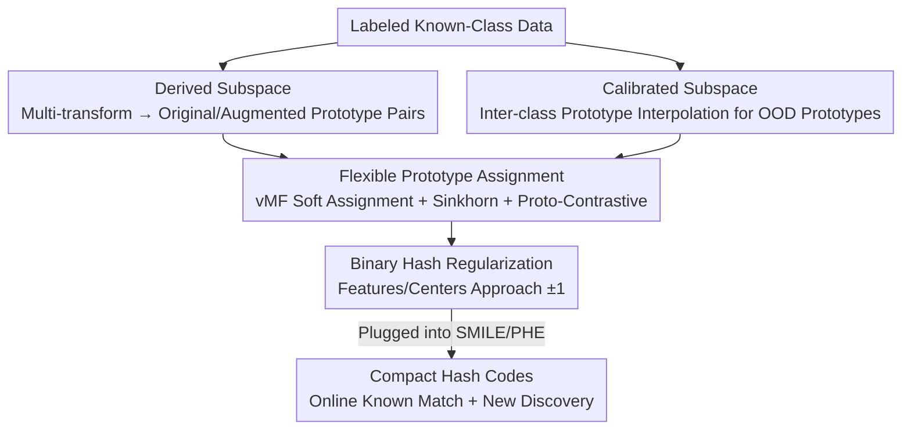

# Assignment-Driven Hash Learning in a Hyper-Semantic Space for On-the-Fly Category Discovery

**Conference**: CVPR 2026  
**Paper**: [CVF Open Access](https://openaccess.thecvf.com/content/CVPR2026/html/Yang_Assignment-Driven_Hash_Learning_in_a_Hyper-Semantic_Space_for_On-the-Fly_Category_CVPR_2026_paper.html)  
**Code**: The paper claims to be open source (marked as Code on the CVF page, though no specific repository link is provided; ⚠️ refer to the original text)  
**Area**: Self-Supervised / Representation Learning (On-the-fly Category Discovery + Hashing)  
**Keywords**: On-the-fly Category Discovery, Hash Learning, Soft Prototype Assignment, Hyper-Semantic Space, Plug-and-play  

## TL;DR
To address the critical issues of "feature-to-hash cascade degradation" and "known-class monopoly in the representation space" in On-the-fly Category Discovery (OCD), this paper constructs a hyper-semantic space comprising "derived subspaces" and "calibrated subspaces" to simultaneously characterize intra-class diversity and reserve space for new categories. Assignment-driven hash learning, featuring "soft prototype assignment + binary hash regularization," is then performed within this space. As a plug-and-play module for SMILE/PHE, it achieves an average All accuracy improvement of approximately 12.78% on six fine-grained datasets (based on SMILE).

## Background & Motivation

**Background**: Generalized Category Discovery (GCD) recognizes known classes while discovering unlabeled new classes. However, most GCD methods rely on offline inference, requiring the entire unlabeled set to be processed in batches before clustering. On-the-fly Category Discovery (OCD) removes the "predefined query set" assumption, allowing streaming samples to be encoded into compact binary hash codes for efficient known-class matching and real-time new-class discovery in the Hamming space. Representative methods include SMILE and PHE, which adds prototype-guided hash learning to SMILE.

**Limitations of Prior Work**: The authors conducted three sets of controlled experiments using alignment and uniformity metrics to reveal two neglected failures in current OCD methods. First, **feature-to-hash cascade degradation**: while intra-class alignment of known classes is inherently poor (large feature distances within the same class), this vulnerability is drastically amplified during hash quantization; even a simple geometric transform (e.g., rotation) can flip multiple bits in the hash code, resulting in an average Hamming distance $d_H \ge 7$ for same-class samples and a predicted number of categories far exceeding the ground truth. Second, **known-class monopoly**: hyperspherical uniformity analysis shows that known class features occupy most of the angular space (alignment distances of ~1.9 for SMILE and ~1.5 for PHE), pushing new classes to the boundaries or into existing regions, preventing them from forming independent peaks.

**Key Challenge**: Since only known-class supervision is available during training with no new-class samples, known classes naturally "expand" to fill the representation space. Simultaneously, hash quantization is extremely sensitive to intra-class perturbations. These two problems are coupled—intra-class instability creates redundant fragments, and spatial monopoly leaves no room for new categories.

**Goal**: Split the problem into two sub-tasks: (i) resolve intra-class sensitivity and hash quantization instability to eliminate redundancy; (ii) prevent spatial monopoly caused by the over-expansion of old class representations.

**Key Insight**: Instead of performing hard learning in the original feature space, it is better to **manually construct a geometrically constrained "hyper-semantic space"**: explicitly modeling intra-class diversity via prototype augmentation while "reserving seats" through inter-class prototype interpolation to force regions for future new classes.

**Core Idea**: Replace "direct hard-assignment hash learning in the original space" with "soft-assignment hash learning within a pre-built, geometrically restricted hyper-semantic space" to simultaneously suppress intra-class sensitivity and spatial monopoly. The entire design is a plug-and-play module.

## Method

### Overall Architecture
The method is a two-stage, plug-and-play framework built atop existing OCD methods (SMILE / PHE). **Stage 1—Hyper-Semantic Space Construction**: Using only labeled known-class data, two complementary subspaces are created. The Derived Subspace characterizes fine-grained intra-class diversity by applying multiple transformations to each image and computing "original/augmented prototype" pairs. The Calibrated Subspace synthesizes "OOD prototypes" through interpolation of different known-class prototypes to occupy semantically ambiguous blank areas, preventing known classes from collapsing and expanding. **Stage 2—Assignment-Driven Hash Learning**: Within this geometrically constrained space, Flexible Prototype Assignment (FPA) performs soft prototype assignment (building intra-class diversity + expanding inter-class separation), followed by Binary Hash Regularization (BHR) to push continuous hash features and their class centers toward $\{-1, +1\}$, yielding compact, discriminative binary codes. The two-stage losses are added to the original method's loss with coefficients $\alpha, \beta, \gamma$.

### Key Designs

**1. Derived Subspace: Characterizing Intra-class Diversity via Prototype Augmentation**

To address the issue where "poor intra-class alignment causes same-class samples to scatter and hash codes to flip under perturbation," the authors do not directly pull same-class samples together. Instead, they construct a pair of prototypes for each known class to represent its "typical form" and "variant form." Given a set of $M$ transformations $\mathcal{F}=\{f_1, \dots, f_M\}$, each labeled image $(x, y)$ is transformed into $M$ variants $x_m = f_m(x)$. For class $i$, the original sample prototype $P_i^{\text{par}}$ and augmented set prototype $P_i^{\text{aug}}$ are computed. The resulting prototype pairs $\{(P_i^{\text{par}}, P_i^{\text{aug}})\}$ constitute the Derived Subspace. Thus, the model is not forced to crush all intra-class samples into a single point but explicitly perceives diversity, providing anchors for soft assignment. Experiments show that increasing $M$ consistently improves performance, confirming that richer transformations lead to finer-grained intra-class representations.

**2. Calibrated Subspace: Inter-class Interpolation for "Space Reservation"**

To prevent known classes from naturally occupying the entire space in the absence of new-class samples, the authors synthesize OOD prototypes that are "semantically independent of any known class" via interpolation:

$$P^{\text{ood}} = \lambda_{ood}\,P_i^{\text{par}} + (1-\lambda_{ood})\,P_j^{\text{par}},\quad i\neq j,\ \lambda_{ood}\in[0,1]$$

where $\lambda_{ood}$ is randomly sampled for robustness, imposing smooth transition constraints between known class prototypes. These OOD prototypes act as "placeholders" for semantically ambiguous blank areas, reserving capacity for potential new classes. To prevent known samples from collapsing into these reserved areas, a margin separation loss is added:

$$\mathcal{L}_{\text{OOD}} = \frac{1}{B}\sum_{i=1}^{B}\max\Big(0,\ 0.5 + \max_j \text{sim}(f_i,p_j^{\text{ID}}) - \min_k \text{sim}(f_i,p_k^{\text{OOD}})\Big)$$

This pulls each sample toward its ID prototype and pushes it away from all OOD prototypes, ensuring a separation margin of at least 0.5. Ablations show that removing this (w/o $\mathcal{L}_{\text{OOD}}$) leads to an average All decrease of ~2.7% and a New decrease of ~4% across three datasets, indicating that this reserved space effectively "guards" for new classes.

**3. Flexible Prototype Assignment: Soft Assignment to Combat Intra-class Sensitivity**

Against the drawback where "hard assignment maps each sample to a single prototype, failing to express intra-class diversity and resulting in overestimated category counts," the authors maintain $K=2$ unit-norm prototypes $P^c=\{p_k^c\}_{k=1}^K$ per class. Sample embeddings $z_i$ are modeled as a von Mises–Fisher (vMF) mixture distribution with soft assignment weights $w_i^c \in \mathbb{R}^K$:

$$p(z_i \mid w_i^c, P^c, \kappa) = \sum_{k=1}^K w_{i,k}^c \, Z_D(\kappa) \exp(\kappa \, p_k^{c\top}z_i)$$

where $\kappa$ is the concentration parameter and $\tau=1/\kappa$ serves as the temperature. The soft assignment weight matrix $W^c$ is solved via Sinkhorn-Knopp normalization: $W^c=\text{diag}(u)\exp(P^{c\top}Z^c/\epsilon)\,\text{diag}(v)$, preventing collapse. A soft MLE loss $\mathcal{L}_{\text{soft-MLE}}$ clusters samples around their assigned prototypes. To ensure inter-class discriminability, a prototype contrastive loss $\mathcal{L}_{\text{proto}}$ pulls two views of the same prototype $\hat{p}_k^c, \tilde{p}_k^c$ together while pushing different class prototypes apart. The final loss is $\mathcal{L}_{\text{FPA}}=\mathcal{L}_{\text{soft-MLE}}+\lambda_{FPA}\mathcal{L}_{\text{proto}}$. In the CUB dataset, transitioning from hard assignment (34.6/63.6/20.1) to soft assignment yields (41.4/66.9/28.6) for All/Old/New metrics, with New classes increasing by 8.5%.

**4. Binary Hash Regularization: Pushing Features and Centers to ±1**

OCD ultimately relies on binary hash codes for efficient storage and retrieval, but discriminability is often lost when continuous features are quantized. BHR forces both the continuous hash feature matrix $H \in \mathbb{R}^{N\times D}$ and class centers $C \in \mathbb{R}^{K\times D}$ toward $\{-1, +1\}$:

$$\mathcal{L}_{\text{BHR}}=\frac{1}{KD}\sum_{k=1}^K\sum_{d=1}^D\big||c_{k,d}|-1\big| + \frac{1}{ND}\sum_{i=1}^N\sum_{d=1}^D\big||h_{i,d}|-1\big|$$

The penalty $||x|-1|$ is zero only at $\pm 1$. Simultaneously, a Hash Center Manager updates centers with momentum $m=0.9$: $c_k \leftarrow m\,c_k+(1-m)\,\bar{h}_k$. This dual alignment at both feature and center levels mitigates the fragmentation of same-class codes caused by quantization.

### Loss & Training
The framework extends existing losses in a plug-and-play manner. For SMILE: $\mathcal{L}=\mathcal{L}_{sup}+\mathcal{L}_{reg}+\alpha\mathcal{L}_{OOD}+\beta\mathcal{L}_{BHR}+\gamma\mathcal{L}_{FPA}$; for PHE: $\mathcal{L}=\mathcal{L}_p+\lambda_1\mathcal{L}_c+\lambda_2\mathcal{L}_f+\alpha\mathcal{L}_{OOD}+\beta\mathcal{L}_{BHR}+\gamma\mathcal{L}_{FPA}$. Main experiments use $\alpha=0.1$ (weight for FPA, though note that the ⚠️ original text's Fig. 4 text and equations (10)(11) may have slight label discrepancies), with weights of 0.2 for OOD and BHR. The backbone is DINO-pretrained ViT-B/16 with only the last block fine-tuned. Feature projection is 768-dim, $K=2$ prototypes per class, and hash projection uses three linear layers for $L=12$ bits ($2^{12}=4096$ codes). Optimizer: SGD (0.9 momentum, 0.1 initial lr, cosine annealing, 20 epochs, batch size 128).

## Key Experimental Results

### Main Results
Evaluated on six fine-grained datasets (CUB, Stanford Cars, Oxford Pets, iNaturalist Animalia/Fungi/Arachnida) using Clustering Accuracy (ACC) with optimal permutation alignment.

| Method | CUB All/Old/New | Stanford Cars All | Animalia All | Arachnida All |
|------|------|------|------|------|
| SMILE | 32.2 / 50.9 / 22.9 | 26.2 | 35.9 | 29.9 |
| SMILE+DiffGRE | 35.4 / 58.2 / 23.8 | 30.5 | 37.4 | 35.4 |
| **SMILE+Ours** | **41.4 / 66.9 / 28.6** | 31.0 | **57.1** | **57.2** |
| PHE | 36.4 / 55.8 / 27.0 | 31.3 | 40.3 | 37.0 |
| **PHE+Ours** | **45.8 / 75.7 / 30.9** | **38.8** | 36.4 | 39.4 |

When plugged into SMILE, the average All improvement across six datasets is ~12.78%, with Old/New average gains of ~4.65% / 7.93%. For PHE, improvements are significant on CUB (All 36.4→45.8) and Stanford Cars (All 31.3→38.8). Note that on Animalia, PHE+Ours slightly underperforms PHE (40.3→36.4), showing that some combinations are not universally positive.

### Ablation Study
Module-wise removal based on SMILE+Ours:

| Configuration | Cars All/Old/New | Arachnida All | CUB All | Description |
|------|------|------|------|------|
| SMILE (Baseline) | 26.2 / 46.7 / 16.3 | 29.9 | 32.2 | Original method |
| w/o $\mathcal{L}_{OOD}$ | 30.8 / 51.5 / 20.5 | 55.8 | 34.9 | No calibrated subspace |
| w/o $\mathcal{L}_{FPA}$ | 30.2 / 51.6 / 19.6 | 53.4 | 34.2 | No soft assignment |
| w/o $\mathcal{L}_{BHR}$ | 30.8 / 51.4 / 20.6 | 53.6 | 33.7 | No binary regularization |
| **SMILE+Ours (Full)** | **31.0 / 53.7 / 19.8** | **57.2** | **41.4** | Full framework |

Removing $\mathcal{L}_{OOD}$ drops All by ~2.7% and New by ~4% across three datasets. Removing $\mathcal{L}_{FPA}$ drops All/Old/New by 3.8% / 2.7% / 2.6%. Removing $\mathcal{L}_{BHR}$ drops All/Old/New by 3.8% / 2.4% / 4.0%. Each module serves a non-redundant purpose.

Data on "Estimated Category Count" also shows that the framework mitigates the core OCD issue of overestimating categories:

| Dataset (GT) | SMILE+Ours | PHE+Ours |
|------|------|------|
| CUB (200) | 412 → 397 | 431 → 418 |
| Stanford (196) | 298 → 260 | 498 → 459 |
| Fungi (321) | 789 → 750 | 408 → 370 |

### Key Findings
- **Hyperparameter Sensitivity**: $\alpha=0.1$ is optimal for FPA, nearly doubling New class accuracy while retaining diversity. $\beta \approx 0.2$ is best for BHR. $\gamma=0.2$ balances hash compactness and inter-class separation.
- **Improved Spatial Geometry**: On CUB, SMILE+Ours reduces intra-class Hamming distance (2.28→1.78) and increases inter-class distance (4.34→5.20). Both alignment and uniformity metrics improve, resolving the failures identified in Fig. 1.
- **Placeholding in Calibrated Subspace**: KDE analysis of sample-to-OOD distance shows a bimodal distribution; known classes have high distances while unknown classes cluster toward low distances, proving that new classes have a higher affinity for the reserved OOD regions.

## Highlights & Insights
- **Turning "Diagnosis" into a Selling Point**: The paper first quantifies two OCD failures using alignment/uniformity (Fig. 1), designs specific solutions, and then validates the improvement with the same metrics (Tab. 5), creating a strong logical loop.
- **Clever "Space Reservation"**: In the absence of new-class samples, using prototype interpolation to synthesize OOD placeholders and using margin loss to push known samples away is an effective way to "reserve room" for the unknown using known class "scraps."
- **Soft Assignment + Sinkhorn for Anti-fragmentation**: Using $K=2$ prototypes per class with vMF soft assignment and Sinkhorn normalization prevents collapse and pulls the overestimated category count toward the ground truth.
- **Plug-and-play**: Implementing modules as weighted loss terms for SMILE/PHE without modifying the backbone or inference flow makes the method highly practical.

## Limitations & Future Work
- **Not Positively Correlated in All Scenarios**: PHE+Ours dropped performance on Animalia (40.3→36.4), suggesting that the plug-and-play module's compatibility with certain base methods or data distributions is not yet stable.
- **Label Inconsistencies**: There are slight discrepancies between the text descriptions and equations (10)(11) regarding the $\alpha/\beta/\gamma$ mapping to FPA/OOD/BHR losses (⚠️ refer to the original text for clarification).
- **Hyperparameter Tuning**: High sensitivity to $\alpha, \beta, \gamma$, the number of OOD prototypes, and margins. It is unclear if the optimal values found on CUB are robust across all datasets.
- **Fixed Prototype Count**: Using a fixed $K=2$ prototypes per class may be insufficient for fine-grained categories with extreme intra-class variation.

## Related Work & Insights
- **vs SMILE / PHE**: These baselines learn hash codes directly in the feature space without modeling diversity or reserving space, leading to spatial monopoly and fragmentation.
- **vs DiffGRE**: DiffGRE offers limited gains on many datasets; the proposed method is significantly stronger on CUB and Stanford Cars due to its dedicated space calibration and soft assignment.
- **vs Offline GCD**: Unlike traditional GCD, which requires batch processing, this method handles streaming classes using real-time hash matching while solving the instability of quantization.

## Rating
- Novelty: ⭐⭐⭐⭐ "Hyper-semantic space + interpolation placeholding" clearly targets OCD failures, although components like soft assignment and contrastive loss are established.
- Experimental Thoroughness: ⭐⭐⭐⭐ Six datasets, two base methods, ablations, and geometric analysis. However, the regression on Animalia lacks deep explanation.
- Writing Quality: ⭐⭐⭐⭐ Clear "Diagnosis → Design → Verification" narrative.
- Value: ⭐⭐⭐⭐ High utility due to its plug-and-play nature and effective anti-fragmentation strategy for open-world scenarios.

<!-- RELATED:START -->

## Related Papers

- [\[ICLR 2026\] Adaptive Gaussian Expansion for On-the-fly Category Discovery](../../ICLR2026/self_supervised/adaptive_gaussian_expansion_for_on-the-fly_category_discovery.md)
- [\[CVPR 2026\] An Optimal Transport-driven Approach for Cultivating Latent Space in Online Incremental Learning](an_optimal_transport_driven_approach_for_cultivating_latent_space_in_online_incr.md)
- [\[CVPR 2026\] TAR: Token-Aware Refinement for Fine-grained Generalized Category Discovery](tar_token-aware_refinement_for_fine-grained_generalized_category_discovery.md)
- [\[CVPR 2026\] Decouple Your Discovery and Memory in Continual Generalized Category Discovery](decouple_your_discovery_and_memory_in_continual_generalized_category_discovery.md)
- [\[CVPR 2026\] The Devil Is in Gradient Entanglement: Energy-Aware Gradient Coordinator for Robust Generalized Category Discovery](the_devil_is_in_gradient_entanglement_energy-aware_gradient_coordinator_for_robu.md)

<!-- RELATED:END -->
