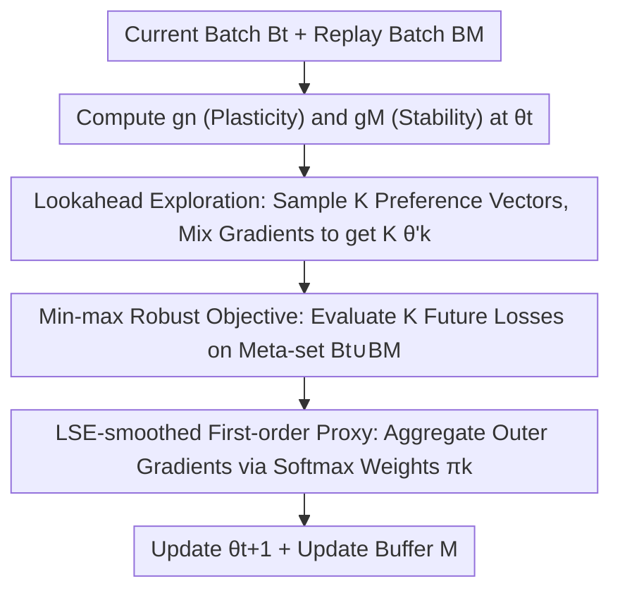

# Beyond Myopic Alignment: Lookahead Optimization for Online Class-Incremental Learning

**Conference**: CVPR 2026  
**Paper**: [CVF Open Access](https://openaccess.thecvf.com/content/CVPR2026/html/Lai_Beyond_Myopic_Alignment_Lookahead_Optimization_for_Online_Class_Incremental_Learning_CVPR_2026_paper.html)  
**Code**: None  
**Area**: Continual Learning / Online Class-Incremental Learning  
**Keywords**: Online Class-Incremental Learning, Experience Replay, Gradient Conflict, Lookahead Optimization, Min-max Robust Optimization  

## TL;DR
Addressing the issue of forgetting caused by "conflict between current task gradients and replay gradients" in online class-incremental learning, this paper theoretically reveals that hypergradient methods essentially align task gradients to a shared meta-objective but are "myopic" as they only consider the current step. Consequently, it proposes LOR: before updating, it explores multiple future model states along a set of "plasticity-stability" trade-off directions, then optimizes the worst-case direction using a Log-Sum-Exp softened min-max objective. This pushes the model toward flatter, more forgetting-resistant regions, outperforming SOTA on Seq-CIFAR10/100 and Seq-TinyImageNet.

## Background & Motivation
**Background**: In Online Class-Incremental Learning (OCIL), data arrives in a stream environment, and each task is typically seen only once. The model must learn new classes continuously without forgetting old ones. A dominant and powerful paradigm is **rehearsal-based** methods—maintaining a small memory buffer $\mathcal{M}$ and mixing old samples with the current batch for training. Representative methods include ER, DER/DER++, and iCaRL.

**Limitations of Prior Work**: Rehearsal is not a panacea. The core issue is that the optimization objective of the current task often **conflicts** with the goal of "preserving old knowledge": the inner product between the current batch gradient $\mathbf{g}_n$ and the buffer gradient $\mathbf{g}_{\mathcal{M}}$ can be negative ($\langle \mathbf{g}_n, \mathbf{g}_{\mathcal{M}}\rangle < 0$), pulling parameters in opposite directions and exacerbating catastrophic forgetting. GEM/A-GEM enforces non-increasing replay loss via projection, but the constraints are too rigid. Recently, VR-MCL, La-MAML, and MER have shifted toward a meta-learning perspective, using **hypergradients** to implicitly mitigate conflict and achieve SOTA results, **yet a formal explanation for their effectiveness has been lacking.**

**Key Challenge**: The first contribution of this paper is providing this explanation—proving via first-order Taylor expansion of bilevel optimization that hypergradients **align both current and old task gradients to a shared meta-objective** $\mathcal{L}_m$, thereby reducing angular conflict (see equation below). However, the authors point out that this alignment is **inherently myopic**: it only corrects the gradient direction at the current parameter point $\theta_t$ without considering the geometry of the loss surface after the update. A "non-conflicting" update can still lead parameters into a sharp valley, causing subsequent updates to interfere and destroy old knowledge.

**Key Insight & Core Idea**: Instead of performing a single "locally non-conflicting" correction, it is better to **explore ahead first**. Before each update, LOR takes a small step along several different "plasticity vs. stability" trade-off directions to simulate a set of possible future parameter states $\{\theta'_1,\dots,\theta'_K\}$. It then computes an update that is **robust even to the worst-case future direction** (min-max), guiding the model toward flat, generalizable regions robust to forgetting—replacing "current gradient correction" with "future surface exploration."

As a foundation, the mechanism by which hypergradients reduce conflict can be written as: within a single step, the inner update yields auxiliary parameters $\tilde\theta_j = \theta - \alpha\nabla_\theta\mathcal{L}_j(\theta)$. The hypergradient relative to the original parameters is $\mathbf{g}_j^{\text{HD}}(\theta) = (I-\alpha\nabla_\theta^2\mathcal{L}_j(\theta))^\top \nabla_{\tilde\theta_j}\mathcal{L}_m(\tilde\theta_j)$. After first-order expansion:

$$\mathbf{g}_j^{\text{HD}}(\theta) \approx \nabla_\theta\mathcal{L}_m(\theta) - \alpha\,\nabla_\theta^2\mathcal{L}_m(\theta)\,\nabla_\theta\mathcal{L}_j(\theta).$$

Here, the Hessian-vector product rotates the task gradient $\nabla_\theta\mathcal{L}_j$ toward the direction of "steeper descent of meta-loss." Since both current and old task hypergradients are pulled toward the same $\nabla_\theta\mathcal{L}_m$, conflict naturally decreases—but this occurs only at the single point $\theta_t$, blinded to anything beyond one step.

## Method

### Overall Architecture
LOR (Lookahead Optimization for Rehearsal) is a **plug-and-play optimization layer** that does not modify the network architecture or introduce second-order derivatives. It only replaces the logic of "how to obtain the current update from current/replay gradients." The input for one training step is the current task batch $B_t$ and a replay batch $B_{\mathcal{M}}$ sampled from the buffer; the output is the updated parameter $\theta_{t+1}$.

The pipeline is as follows: first, compute two "raw gradients" at the current parameter $\theta_t$—the current batch gradient $\mathbf{g}_n$ (promoting plasticity/learning new) and the memory batch gradient $\mathbf{g}_{\mathcal{M}}$ (promoting stability/protecting old). Next, sample $K$ preference vectors $\mathbf{w}_k=(w_{k,n}, w_{k,\mathcal{M}})$ to mix the two gradients into $K$ **frozen lookahead directions** and take small steps to obtain $K$ "future states" $\theta'_k$. Evaluate the loss $\hat{\mathcal{L}}_k$ for each future state on a shared meta-evaluation set $D_t^{\text{meta}}=B_t\cup B_{\mathcal{M}}$. Finally, use Log-Sum-Exp to soften the "worst-case future" into a differentiable objective, aggregating the outer gradients $\mathbf{G}_k$ of each future state according to softmax weights $\pi_k$ to obtain the actual update $\mathbf{g}_t$. Intuition: **whichever trade-off direction leads to a higher (more dangerous) future loss receives more weight in the final update**, causing the update to actively avoid solutions that fall into sharp regions in any direction, landing instead in a flat region safe for all directions.

### Key Designs

**1. Lookahead Exploration: Exploring multiple future states along plasticity-stability trade-off directions**

This step directly addresses the "myopia" pain point—since single-point correction cannot see beyond one step, explicitly step forward in multiple directions. At the current parameter $\theta$, use preference vectors $\mathbf{w}_k=(w_{k,n}, w_{k,\mathcal{M}})$ to linearly combine the current and memory gradients into an exploration direction, obtaining the $k$-th future state:

$$\theta'_k(\theta) = \theta - \eta_L\big(w_{k,n}\,\mathbf{g}_n(\theta) + w_{k,\mathcal{M}}\,\mathbf{g}_{\mathcal{M}}(\theta)\big),$$

where $\eta_L$ is the lookahead step size. Preference vectors are sampled from a Dirichlet distribution $\mathbf{w}_k\sim\text{Dir}(\alpha_s, \alpha_s)$, allowing the $K$ directions to **span the entire trade-off spectrum**: from pure plasticity $\mathbf{w}=(1,0)$ (learning only new) to pure stability $\mathbf{w}=(0,1)$ (protecting only old), and various intermediate mixtures. Each direction represents a hypothesis of "where the model will land if this step leans toward learning/protecting." Unlike general Lookahead optimizers (which maintain slow weights for periodic interpolation), LOR’s exploration is **specifically customized for the conflict structure of rehearsal-based OCIL**: the exploration axes are exactly the core contradiction of plasticity vs. stability.

**2. Min-max Robust Objective: Updates robust even against the worst-case future direction**

With $K$ future states, how to decide the actual direction for the current step? Instead of gambling on a single direction that "looks best" (which would revert to myopia), seek an update that is **robust against the worst-case scenario**, formulated as a min-max problem:

$$\min_\theta\ \max_{k\in\{1,\dots,K\}}\ \mathcal{L}\big(\theta'_k(\theta);\, D_t^{\text{meta}}\big),$$

where the loss is evaluated on a shared meta-evaluation set $D_t^{\text{meta}}=B_t\cup B_{\mathcal{M}}$ (covering both new and old). Why does this resist forgetting? Because a **sharp** minimum will always cause at least one lookahead direction to land in a high-loss region, which the max operator will then capture and penalize. The objective is only small when all exploration directions land in low-loss regions—this is equivalent to pushing the optimizer away from sharp solutions toward flat, generalizable regions. The paper further supports this from the perspectives of Distributionally Robust Optimization (DRO) and Domain Adaptation generalization bounds: the mismatch between the buffer distribution and the true old data distribution can be viewed as a "training distribution perturbation." Min-max makes the model robust to such perturbations, thereby reducing the "disagreement risk" (a formal measure of forgetting) with an ideal old model $h^*_{\mathcal{M}}$.

**3. LSE-smoothed First-order Proxy: Transforming non-differentiable max into a trainable objective**

The hard max in Eq. 5 is non-differentiable, and strictly calculating the derivative with respect to $\theta'_k$ would involve second-order derivatives, making it difficult to integrate into standard training. LOR implements this in two steps. First, it uses a **first-order approximation + stop-gradient**: at $\theta_t$, compute frozen gradients $\bar{\mathbf{g}}_n=\text{sg}(\nabla_\theta\mathcal{L}(B_t;\theta_t))$ and $\bar{\mathbf{g}}_{\mathcal{M}}=\text{sg}(\nabla_\theta\mathcal{L}(B_{\mathcal{M}};\theta_t))$. These are used to construct frozen directions $\mathbf{d}_k=w_{k,n}\bar{\mathbf{g}}_n+w_{k,\mathcal{M}}\bar{\mathbf{g}}_{\mathcal{M}}$ and future states $\theta'_k=\theta_t-\eta_L\mathbf{d}_k$—**gradients are not backpropagated through the construction of lookahead directions**, thus avoiding second-order terms. Second, use Log-Sum-Exp to soften the max:

$$\hat{\mathcal{L}}_{\text{LOR}}(\theta_t) = \mu\log\Big(\sum_{k=1}^{K}\exp\big(\hat{\mathcal{L}}_k/\mu\big)\Big),$$

The gradient of which is the softmax-weighted sum of the outer gradients $\mathbf{G}_k=\nabla_\theta\hat{\mathcal{L}}_k$ of each future state:

$$\mathbf{g}_t = \nabla_\theta\hat{\mathcal{L}}_{\text{LOR}}(\theta_t) = \sum_{k=1}^{K}\pi_k\,\mathbf{G}_k,\qquad \pi_k = \frac{\exp(\hat{\mathcal{L}}_k/\mu)}{\sum_j\exp(\hat{\mathcal{L}}_j/\mu)}.$$

The temperature $\mu$ controls the hardness of the "soft-worst case": as $\mu\to 0$, it degrades to a hard max targeting only the worst direction; as $\mu$ increases, it tends toward a uniform average of all directions. Thus, LOR only requires $K$ forward passes + first-order outer gradients for aggregation, without second-order differentiation, allowing it to be directly inserted into an SGD training loop.

### Loss & Training
Training uses standard SGD with a Reduced ResNet-18 backbone, following the online protocol (streaming data, usually 1 epoch per task, no task ID at inference). Step-wise Algorithm (Algorithm 1): Fetch $B_t$, sample $B_{\mathcal{M}}$ from $\mathcal{M}$, let $D_t^{\text{meta}}=B_t\cup B_{\mathcal{M}}$ $\rightarrow$ Compute $\mathbf{g}_n, \mathbf{g}_{\mathcal{M}}$ $\rightarrow$ Sample $K$ vectors $\mathbf{w}_k$ $\rightarrow$ For each $k$, construct frozen direction $\mathbf{d}_k$, obtain $\theta'_k$, evaluate $\hat{\mathcal{L}}_k$, compute outer gradient $\mathbf{G}_k$ $\rightarrow$ Compute LSE weights $\pi_k$ $\rightarrow$ Aggregate $\mathbf{g}_t$ $\rightarrow$ $\theta_{t+1}=\theta_t-\eta\mathbf{g}_t$ $\rightarrow$ Update buffer. Key hyperparameters include the number of directions $K$, LSE temperature $\mu$, Dirichlet concentration $\alpha_s$, and lookahead step size $\eta_L$.

## Key Experimental Results

### Main Results
Three standard benchmarks: Seq-CIFAR10 (5 tasks), Seq-CIFAR100 (20 tasks), and Seq-TinyImageNet (20 tasks), using Reduced ResNet-18, mean of 5 runs. **AAA (Average Anytime Accuracy)** comparison (excerpt from Table 1):

| Method | Seq-CIFAR10 \|M\|=1k | Seq-CIFAR100 \|M\|=5k | Seq-TinyImageNet \|M\|=5k |
|------|------|------|------|
| ER | 54.91 | 20.67 | 16.10 |
| DER++ | 61.01 | 17.08 | 11.93 |
| CLSER | 63.27 | 23.25 | 18.88 |
| POCL (Prev. SOTA) | 66.23 | 36.34 | 25.48 |
| **LOR (Ours)** | **74.22** | **43.26** | **31.36** |

Final **Acc** (average accuracy across all tasks after learning the full sequence, Table 2) also leads significantly: on Seq-CIFAR100 \|M\|=5k, LOR 39.02 vs POCL 33.36 vs CLSER 16.42; on Seq-CIFAR10 \|M\|=1k, LOR 71.47 vs POCL 58.50. **Forgetting Measure (FM)** (closer to 0 is better, Table 3) also shows LOR's superiority: on Seq-CIFAR100 \|M\|=5k, LOR −11.12 vs POCL −17.55 vs CLSER −50.71, indicating it is indeed better at preserving old knowledge. The gains increase as task sequences get longer and more complex (CIFAR100, TinyImageNet), validating the hypothesis that "myopic errors accumulate over time, and lookahead gains compound."

### Ablation Study

| Configuration | Key Metrics | Note |
|------|---------|------|
| Small 3-layer DNN backbone (Table 4, Seq-CIFAR10 \|M\|=1k) | LOR AAA 64.41 / Acc 51.81 / FM −18.62 vs ER 48.50 / 33.20 / −38.50 | Even with a minimal network, LOR significantly outperforms ER, indicating gains stem from the learning process itself, not just over-parameterization. |
| Full ResNet-18 (Table 7, Seq-CIFAR100 \|M\|=5k) | LOR Acc 25.45 vs VR-MCL 19.68 vs CLSER 19.45 | Architecture-independent; still outperforms the latest VR-MCL on larger networks. |
| 40-task Long Sequence (Table 8, Seq-TinyImageNet \|M\|=5k) | LOR AAA 24.15 / Acc 17.21 vs POCL 19.96 / 14.33 | The gap with competitors widens further as tasks double, verifying long-term compounding benefits. |
| Hyperparameter Sensitivity (Table 5, Seq-CIFAR100 \|M\|=5k) | AAA stable at 42.3–43.3 for $\mu\in[0.5,2.0]$ and $\alpha_s\approx 1.0$ | Soft-worst case reweighting is insensitive to smoothing intensity; symmetric Dirichlet (uniform exploration) is effective and nearly parameter-free. |
| Buffer Size (Table 6, Seq-CIFAR100, \|M\|=200/600/1000) | LOR AAA 24.50/28.90/31.47 leads CLSER 16.80/19.50/22.58 across all tiers | Relative gains are especially large under small buffer constraints, making it friendly for memory-limited scenarios. |

### Key Findings
- **min-max + lookahead is the primary cause of anti-forgetting**: LOR's advantage in FM is more pronounced than in Acc (improving FM from −17.55 to −11.12 on CIFAR100 \|M\|=5k), indicating it primarily improves "old knowledge preservation" rather than just refreshing current accuracy.
- **Harder cases enjoy more value**: Relative gains are largest in "hard scenarios" such as long sequences (40 tasks), many classes (CIFAR100/TinyImageNet), and small buffers, echoing the core hypothesis of compounding lookahead benefits.
- **Nearly parameter-free**: $\mu$ in the range of 0.5–2.0 and $\alpha_s = 1.0$ (uniform sampling on the simplex) are consistently effective, reducing deployment costs.

## Highlights & Insights
- **Solid narrative of "explain first, improve second"**: The paper first clarifies why hypergradients reduce conflict (alignment to meta-objectives) using first-order Taylor expansions, then identifies the myopic limitation before proposing lookahead—the motivation is derived from the limitations of prior work rather than being arbitrary.
- **Porting sharpness-aware concepts to CL**: The core mechanism is essentially "min-max exploration + soft-worst penalty $\rightarrow$ preference for flat regions," which is consistent with SAM. However, the exploration axes are specifically chosen as the plasticity-stability trade-off spectrum, ensuring "flat regions" correspond exactly to "anti-forgetting regions."
- **Engineering efficiency**: Three techniques—stop-gradient, first-order proxy, and LSE—reduce a min-max problem involving second-order Hessians to "$K$ forward passes and weighted aggregations," making it easy to plug into any rehearsal-based OCIL pipeline with low barriers to reproduction.
- **Transferability**: The paradigm of "sampling multiple trade-off directions $\rightarrow$ evaluating future loss $\rightarrow$ soft-worst case aggregation" could be applied to multi-objective optimization, multi-task gradient conflict, and trade-offs like "helpfulness vs. safety" in RLHF.

## Limitations & Future Work
- **Linear growth in computational cost with $K$**: Each step requires $K$ extra forward passes and outer gradients. The main text does not provide specific values for $K$ or comparisons of wall-clock time/VRAM (stating these are in the supplement). The optimal value of $K$ in practice ⚠️ remains subject to the supplementary material.
- **Verification limited to small datasets/backbones**: Experiments conclude at CIFAR/TinyImageNet and (Reduced) ResNet-18, without involving large-scale data or pre-trained large models in OCIL. Generalization to industrial-scale scenarios remains to be seen.
- **Directions are still linear combinations of gradients**: Lookahead directions are only sampled within the 2D plane spanned by $\mathbf{g}_n$ and $\mathbf{g}_{\mathcal{M}}$, potentially missing better exploration directions outside this plane. Incorporating more diverse (e.g., second-order or historical) directions might offer further improvements.
- **Approximation gap between theory and algorithm**: The ideal min-max in Eq. 5 is not strictly equivalent to the first-order stop-gradient proxy (Eq. 6/7) used in practice. The authors explicitly state that the practical algorithm does not backpropagate through direction construction, and the impact of this gap on the final solution is not quantified.

## Related Work & Insights
- **vs GEM / A-GEM**: These methods use rigid projection constraints to prevent conflicts, which can be overly restrictive on plasticity; LOR avoids hard projections, using flexible exploration of trade-off directions instead, and significantly outperforms them across all benchmarks.
- **vs MER / La-MAML / VR-MCL (Hypergradient family)**: These methods use bilevel optimization/hypergradients to implicitly reduce conflict. This paper proves their alignment is only current-point-based and myopic; LOR extends the horizon from "direction at the current point" to "surface geometry one step ahead."
- **vs General Lookahead Optimizers / Extra-gradient**: General lookahead maintains slow weights for stability, and extra-gradient explores one step before updating in min-max games; LOR is inspired by these but **structures exploration around the plasticity-stability spectrum**, specifically for OCIL conflict.
- **vs POCL (Pareto Optimization)**: POCL treats continual learning as a multi-objective Pareto problem to find compromise points; LOR replaces this with "future exploration + soft-worst min-max," generally outperforming POCL in AAA/Acc/FM, especially in long sequences.

## Rating
- Novelty: ⭐⭐⭐⭐ Combining the explanation of hypergradient myopia with lookahead min-max exploration in OCIL is clear and theoretically grounded.
- Experimental Thoroughness: ⭐⭐⭐⭐ Covers multiple benchmarks, buffer sizes, backbones, long sequences, and sensitivity; however, lacks large model scenarios and detailed cost analysis for $K$.
- Writing Quality: ⭐⭐⭐⭐⭐ Logical derivation of motivation, clear formulas, and supporting evidence from both optimization and statistical perspectives.
- Value: ⭐⭐⭐⭐ Plug-and-play, nearly parameter-free, and significant gains in anti-forgetting, providing a new paradigm of "active surface exploration" for rehearsal-based OCIL.

<!-- RELATED:START -->

## Related Papers

- [\[CVPR 2026\] An Optimal Transport-driven Approach for Cultivating Latent Space in Online Incremental Learning](an_optimal_transport_driven_approach_for_cultivating_latent_space_in_online_incr.md)
- [\[CVPR 2026\] Exemplar-Free Class Incremental Learning via Preserving Class-Discriminative Structure](exemplar-free_class_incremental_learning_via_preserving_class-discriminative_str.md)
- [\[CVPR 2026\] Geometry-driven OOD Detectors Are Class-Incremental Learners](geometry-driven_ood_detectors_are_class-incremental_learners.md)
- [\[CVPR 2026\] Semantic-Guided Global-Local Collaborative Prompt Learning for Few-Shot Class Incremental Learning](semantic-guided_global-local_collaborative_prompt_learning_for_few-shot_class_in.md)
- [\[CVPR 2026\] Temporal Imbalance of Positive and Negative Supervision in Class-Incremental Learning](temporal_imbalance_of_positive_and_negative_supervision_in_class-incremental_lea.md)

<!-- RELATED:END -->
