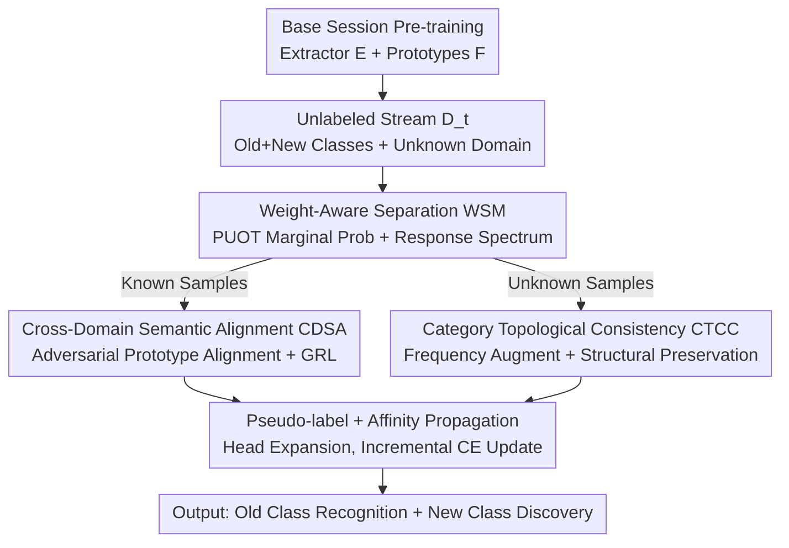

# Beyond the Static World: Continual Category Discovery under Visual Drift

**Conference**: CVPR 2026  
**Paper**: [CVF Open Access](https://openaccess.thecvf.com/content/CVPR2026/html/Feng_Beyond_the_Static_World_Continual_Category_Discovery_under_Visual_Drift_CVPR_2026_paper.html)  
**Code**: None  
**Area**: Self-supervised / Category Discovery / Continual Learning  
**Keywords**: Open Continual Category Discovery, Partial Unbalanced Optimal Transport, Domain Shift, Adversarial Alignment, Category Topological Consistency  

## TL;DR
Addressing the realistic scenario where "unlabeled data streams both introduce new categories and originate from unfamiliar domains," this paper proposes the OCCD task. It introduces a three-component framework—"Optimal Transport for automatic separation of known/unknown samples → Adversarial Alignment of known class prototypes → Frequency-domain augmentation for category topological consistency"—achieving new SOTA performance in both new category discovery and old category recognition on DomainNet and SSB-C.

## Background & Motivation
**Background**: Generalized Category Discovery (GCD) aims to simultaneously recognize known classes and cluster new classes from unlabeled data. However, mainstream GCD requires **simultaneous access** to labeled and unlabeled data during training. Continual Category Discovery (CCD) relaxes this, allowing a pre-trained model to incrementally discover new classes on an incoming stream of unlabeled data, which is better suited for privacy-sensitive and decentralized deployments.

**Limitations of Prior Work**: CCD assumes that labeled data and the unlabeled data stream come from the **same domain**. In reality, data streams often contain both new categories **and** unfamiliar domains (e.g., medical images from different hospitals, street views in different weather). When domain drift occurs, traditional Unsupervised Domain Adaptation (UDA) indiscriminately aligns distributions, forcing unknown classes toward known ones and causing "negative transfer" and semantic drift; meanwhile, standard CCD fails completely under domain shift.

**Key Challenge**: The model must handle two types of shifts simultaneously in **one data stream**: semantic shift (emergence of unseen classes) and visual/domain shift (different appearances of the same class). These are intertwined: failure to separate known and unknown samples leads to alignment that contaminates unknown classes, while domain shift makes clean separation difficult.

**Goal**: Define and solve Open Continual Category Discovery (OCCD), requiring the model to: (1) discover and structure new classes in heterogeneous, drifting data streams; (2) avoid catastrophic forgetting of old classes; and (3) resist domain shift.

**Key Insight**: Implement "stream separation" before "alignment"—only by reliably separating known and unknown samples can domain alignment be applied to known classes without affecting unknown ones, and structural preservation be applied to unknown classes without being "swallowed" by old classes.

**Core Idea**: Utilize Partial Unbalanced Optimal Transport (PUOT) and multi-scale response spectra to automatically label samples as "known/unknown." Known samples undergo adversarial prototype alignment to resist domain shift, while unknown samples utilize frequency-domain style augmentation and category topological consistency constraints to preserve semantic structure.

## Method

### Overall Architecture
The model is first supervisedly pre-trained on a base session with labeled known classes to obtain a feature extractor $E$ and a prototype classification head $F$. During the continual discovery phase, each step receives a batch of unlabeled data $D^u_t$ (mixing old/new classes from potentially unfamiliar domains). The model follows a "Separation → Dual-path Processing → Clustering & Expansion" workflow:

1. **WSM (Weight-Aware Separation)**: Uses PUOT to estimate the marginal probability of each sample belonging to known prototypes, then scans a set of temperatures $\tau$ to obtain a "response spectrum" for binary classification into known $x^t_{kno}$ and unknown $x^t_{unk}$;
2. **Known Path → CDSA (Cross-Domain Semantic Alignment)**: Clusters known samples into target domain prototypes and performs adversarial alignment with source domain prototypes to eliminate domain discrepancies and maintain old class recognition;
3. **Unknown Path → CTCC (Category Topological Consistency Constraint)**: Applies frequency-domain style perturbations to unknown samples, enforcing consistency in the "distance structure relative to known prototypes" before and after perturbation to stably position new classes in the semantic space;
4. **Clustering & Expansion**: Known samples are assigned pseudo-labels using the previous checkpoint. Unknown samples use Affinity Propagation to automatically estimate the number of clusters and dynamically expand the online classification head, followed by incremental updates via cross-entropy.

### Key Designs

**1. Weight-Aware Separation (WSM): Automatic Separation via Optimal Transport**

The first barrier in OCCD is distinguishing old and new classes in the unlabeled stream. WSM involves two steps. **IPM (Instance Probability Modeling)** formulates this as a **Partial Unbalanced Optimal Transport (PUOT)** problem: given a mini-batch of $N$ samples and $C_{kno}$ known prototypes, find a transport plan $\pi$ minimizing $\min_{\pi\ge 0}\ \langle U,\pi\rangle+\tau\cdot \mathrm{KL}(\pi\mathbf{1}_{C_{kno}}\Vert a)$, subject to $\pi^\top\mathbf{1}_N=b$. The cost matrix $U_{ij}$ is defined by entropy-weighted cosine distance: $U_{ij}=e^{E(z^t_i)}\cdot\lVert z^t_i/\lVert z^t_i\rVert - e^{(o)}_j/\lVert e^{(o)}_j\rVert\rVert_2^2$. Higher entropy (higher uncertainty) increases the cost of matching to known prototypes. Unlike classic OT, PUOT relaxes marginal constraints into a KL penalty, allowing some samples to remain unmatched. The dual formulation reduces complexity from $N\cdot C_{kno}$ to $N+C_{kno}$ and provides marginal probabilities $q_\tau(x^t_i)=a_i\cdot\exp(-(f^*_i+\zeta^*)/\tau)$.

**RSQ (Response Spectrum Quantization)** addresses the difficulty of choosing $\tau$ by scanning $\tau\in\{0.01, 0.05, 0.1, 0.5, 1, 5, 10\}$ and concatenating the marginal probabilities into a spectrum $Q\in\mathbb{R}^{N\times 7}$. After binarization $\hat Q_{ij}=\mathbb{1}[Q_{ij}\ge 1/N]$, K-means clustering is applied to the spectra; samples with larger norm centers are classified as $C_{known}$ and others as $C_{unknown}$.

**2. Cross-Domain Semantic Alignment (CDSA): Adversarial Alignment of Known Prototypes**

Known samples from unfamiliar domains are processed via CDSA at the **prototype level**. Target domain prototypes $e^{(u)}_c$ are estimated via confidence-weighted aggregation: $e^{(u)}_c=\frac{\sum_i p^u_{i,c} z_i}{\sum_i p^u_{i,c}}$. A CNN discriminator $D$ distinguishes between source domain prototypes $P_l$ and target prototypes $P_u$. Using a **Gradient Reversal Layer (GRL)**, the feature extractor is trained to "fool" the discriminator, minimizing $L_{adv}=\max_P\min_D L_{dis}$ (BCE loss for domain classification). This ensures domain-invariant representations for known classes while avoiding negative transfer by excluding unknown samples.

**3. Category Topological Consistency Constraint (CTCC): Structural Stability for New Classes**

CTCC leverages the insight that the **relative relationship between known and unknown classes should be domain-invariant**. It applies **frequency-domain style augmentation** using FFT to exchange amplitude spectra $A_i$ with dataset statistics via AdaIN-style reparameterization $\tilde A^t_i=\gamma\cdot\frac{A^t_i-\mu(A^t_i)}{\sigma(A^t_i)}+\beta$, while preserving phase. The model calculates distances $w_{i,c}$ between unknown samples and known prototypes, defining a "topological map." Consistency is enforced via a Gaussian potential loss:
$$L_{topo}=\frac{1}{N_u}\sum_{i=1}^{N_u}\log\Big(\frac{1}{C_{kno}}\sum_c \exp\big(-m(\hat w_{i,c}-w_{i,c})^2\big)\Big),\quad m=2.$$
This requires the relative ranking of distances to known centers to remain consistent across "style" changes.

### Loss & Training
The framework uses pseudo-labels for old classes and **Affinity Propagation** (a non-parametric clustering method that estimates the number of clusters) for unknown classes to dynamically expand classification heads. The total objective is $L_{total}=L_{ce}+\lambda_1 L_{adv}+\lambda_2 L_{topo}$ (with $\lambda_1=\lambda_2=1$). The backbone is a ViT-B/16 pre-trained with DINO, fine-tuning only the last block over 50 epochs per stage ($T=3$).

## Key Experimental Results

### Main Results
Evaluated on DomainNet and SSB-C (CUB/Cars/Aircraft with 9 types of corruptions).

DomainNet (Average All ACC compared to strongest CCD baselines):

| Real → Target Domain | Metric | Ours | PromptCCD | HiLo |
|---|---|---|---|---|
| Painting (Real side) | All | **60.2** | 56.5 | 56.1 |
| Painting (Paint. side) | All | **38.9** | 31.5 | 31.0 |
| Quickdraw (Real side) | All | **53.5** | 45.2 | 43.9 |
| Clipart (Real side) | All | **57.4** | 54.1 | 55.4 |

SSB-C (Average All / Old / New, comparing with PromptCCD):

| Dataset | Setting | Ours All | PromptCCD All | Ours New | PromptCCD New |
|---|---|---|---|---|---|
| CUB-C | Original | **52.9** | 30.1 | **47.1** | 24.5 |
| CUB-C | Corrupted | **47.2** | 27.4 | **40.4** | 20.3 |

On CUB-C, Ours exceeds PromptCCD by **22.8%** (All) on the original domain and **19.8%** on the corrupted domain.

### Ablation Study

Ablation on Real → Painting:

| WSM | CDSA | CTCC | Real All | Painting All | Painting New |
|---|---|---|---|---|---|
| ✗ | ✗ | ✗ | 54.6 | 28.7 | 27.9 |
| ✓ | ✓ | ✓ | **60.2** | **38.9** | **37.7** |

Comparison of separation strategies (Painting All): Entropy-based (**29.4**) vs. Energy-based (**30.1**) vs. **Ours PUOT (38.9)**.

### Key Findings
- **Modular Division of Labor**: WSM+CDSA primarily improves old class recognition (Old), while CTCC primarily improves new class discovery (New).
- **PUOT outperforms threshold-based methods**: Achieving nearly 9 points higher ACC than energy-based methods on the Painting domain, proving that multi-temperature response spectra adapt better to varying unknown ratios.
- **Robustness to hyperparameters**: Performance remains stable for $\lambda_1, \lambda_2$ across reasonable ranges.

## Highlights & Insights
- **Decoupling Shifts via Dual-path Design**: By separating known and unknown streams, the model prevents the negative transfer typically seen in UDA, where unknown classes are erroneously aligned with known ones.
- **PUOT Dual Multiplier as "Unknownness" Score**: The marginal probability $q_\tau$ naturally encodes uncertainty regarding known prototypes. Multi-temperature spectra resolve the fragility of single-point thresholds.
- **Relative Topology vs. Absolute Position**: CTCC enforces "order consistency" rather than "location consistency," ensuring new classes form independent clusters while maintaining logical semantic distances from old classes.

## Limitations & Future Work
- **Computational Overhead**: The framework involves scanning 7 temperatures, adversarial training, and FFT augmentations; the actual deployment throughput costs are not quantified.
- **Reproducibility**: Source code is currently unavailable. Relying on K-means for spectrum binarization may be unstable under extreme unknown ratios (>80%).
- **Prototype Dependence**: CTCC relies on known prototypes as anchors; if the initial known set is semantically narrow, the topological structure may lack discriminative power.

## Related Work & Insights
- **vs. CCD (PromptCCD / HiLo)**: These assume the same domain. HiLo uses patch-mixing which may introduce semantic noise; Ours uses frequency-style augmentation (semantic-preserving) and aligns only known prototypes.
- **vs. UDA / Source-free DA**: Traditional UDA does not discover new classes. Ours enables discovery while selectively aligning known classes to prevent negative transfer.

## Rating
- Novelty: ⭐⭐⭐⭐⭐ (Formulates OCCD and introduces PUOT for separation).
- Experimental Thoroughness: ⭐⭐⭐⭐ (Comprehensive benchmarks and ablations, though lacks code/throughput analysis).
- Writing Quality: ⭐⭐⭐⭐ (Clear motivation and logic).
- Value: ⭐⭐⭐⭐⭐ (Addresses critical real-world pain points in "Open + Continual + Drift" scenarios).

<!-- RELATED:START -->

## Related Papers

- [\[CVPR 2026\] Decouple Your Discovery and Memory in Continual Generalized Category Discovery](decouple_your_discovery_and_memory_in_continual_generalized_category_discovery.md)
- [\[AAAI 2026\] GOAL: Geometrically Optimal Alignment for Continual Generalized Category Discovery](../../AAAI2026/self_supervised/goal_geometrically_optimal_alignment_for_continual_generalized_category_discover.md)
- [\[CVPR 2026\] Learning Like Humans: Analogical Concept Learning for Generalized Category Discovery](learning_like_humans_analogical_concept_learning_for_generalized_category_discov.md)
- [\[CVPR 2026\] TAR: Token-Aware Refinement for Fine-grained Generalized Category Discovery](tar_token-aware_refinement_for_fine-grained_generalized_category_discovery.md)
- [\[CVPR 2026\] Seeing Through the Shift: Causality-Inspired Robust Generalized Category Discovery](seeing_through_the_shift_causality-inspired_robust_generalized_category_discover.md)

<!-- RELATED:END -->
