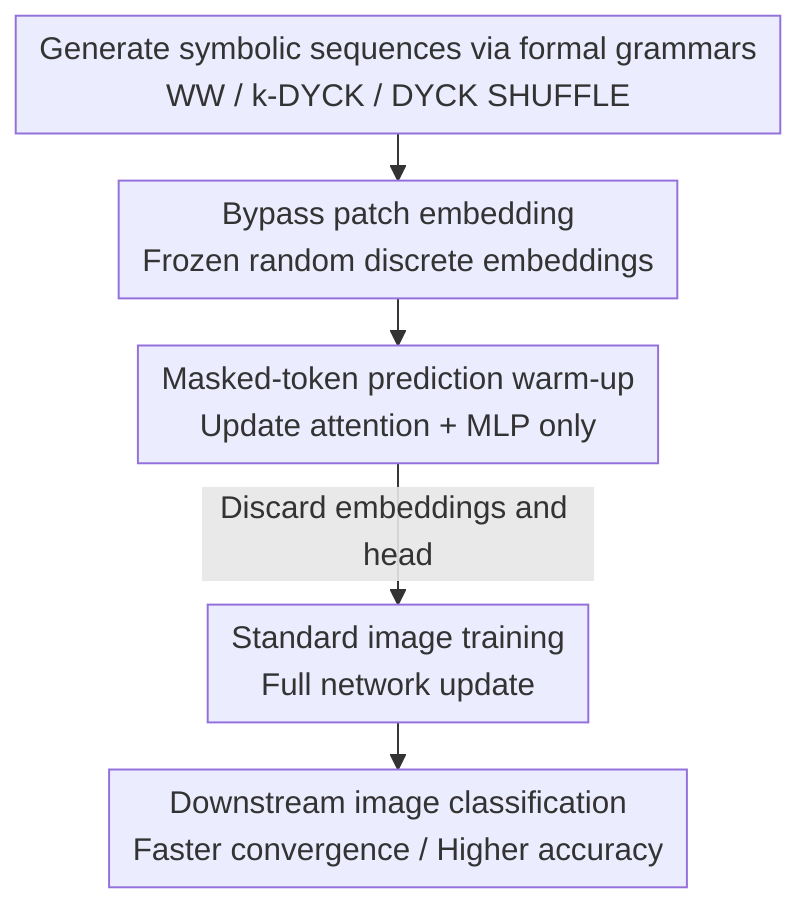

# Can You Learn to See Without Images? Procedural Warm-Up for Vision Transformers

**Conference**: CVPR 2026  
**Paper**: [CVF Open Access](https://openaccess.thecvf.com/content/CVPR2026/html/Shinnick_Can_You_Learn_to_See_Without_Images_Procedural_Warm-Up_for_CVPR_2026_paper.html)  
**Code**: https://zlshinnick.github.io/procedural-pretraining-page/  
**Area**: Self-supervised / Representation Learning  
**Keywords**: Procedural pre-training, formal grammars, ViT initialization, inductive bias, data efficiency  

## TL;DR
Before a ViT officially processes images, a lightweight masked-token pre-training (warm-up) is conducted using **purely symbolic sequences without any visual content** (e.g., "balanced parentheses") generated by formal grammars. This forces the model to internalize universal computational mechanisms such as stack-based hierarchy and long-range dependencies. When followed by standard image training, this approach achieves a +1.72% top-1 gain on ImageNet-1K with only a 1% training budget expansion, effectively substituting for 28% of image data.

## Background & Motivation
**Background**: The ability of Transformers to handle language, vision, and speech is believed to stem from their implementation of certain **cross-modal universal inductive biases**. In the LLM domain, prior work has found that pre-training on "procedural data" (data with no semantics, only structure) sampled from formal grammars can improve convergence speed and reasoning capabilities. Some studies even observed that models trained solely on text can process visual information, suggesting the existence of **modality-independent computational mechanisms**.

**Limitations of Prior Work**: Existing "abstract data pre-training" in vision follows a different path—using FractalDB, contour maps, ripples, or structured noise. These are essentially **synthetic images** that attempt to mimic the 2D statistical properties of natural images, primarily to replace real data for privacy or fairness reasons. They do not escape the "visual" box, and thus the signals they provide highly overlap with real images, serving as substitutes rather than complements.

**Key Challenge**: If "reasoning over images" is fundamentally a **reasoning problem rather than an image problem**, then forcing pre-training data to look like images might limit the model's ability to learn more universal structures. Furthermore, current structured initializations (e.g., Mimetic) only modify attention weights, which has a limited scope of effect.

**Goal**: To enable vision models to "learn to see without looking at images"—using purely symbolic data that has **no 2D structure and mimics no image attributes** to inject universal inductive biases useful for subsequent visual tasks.

**Key Insight**: This work transfers "procedural warm-up," previously validated in LLMs, to ViTs. Formal grammars (such as Dyck languages for balanced parentheses) can cheaply generate sequences with **precise hierarchical dependencies**. Recognizing these languages requires universal computational machines like stacks and finite state machines—which are exactly what the model can reuse across modalities.

**Core Idea**: Insert a warm-up phase before standard image training that uses a **bypass patch embedding to perform masked-token prediction on symbolic sequences**. This forces the model into a better initialization, after which the symbol-related components are discarded for image training.

## Method

### Overall Architecture
The method is a three-stage serial pipeline: **① Online generation of symbolic sequences via formal grammars → ② Masked-token warm-up with frozen embeddings → ③ Discarding symbolic components and transitioning to standard image training**. The input is an abstract token sequence (e.g., `( [ ] ) < >`) generated by a few lines of code. The intermediate product is a set of "warmed-up" ViT weights. The output is a model that converges faster and achieves higher accuracy on image classification. The warm-up accounts for only ~1% of the total training budget and can be amortized across any number of downstream models, positioning it as a replacement for standard random or structured initializations.

### Key Designs

**1. Generating "structured but non-semantic" symbolic data via formal grammars: Making warm-up signals purely computational**

The pain point is that abstract visual data always mimics vision, overlapping with real image signals. Ours completely abandons 2D structures and uses three representative grammars from the Chomsky hierarchy (see table below) to sample sequences where the data carries only **pure structural dependencies**:

| Grammar | Type | Example | Structural Properties |
|------|------|------|----------|
| WW | Regular | `a b c a b c` | Global one-to-one correspondence (string + its exact copy) |
| k-DYCK | Context-Free | `( [ ] ) < >` | Hierarchical, stack-based nested dependencies |
| k-DYCK SHUFFLE | Context-Sensitive | `( [ ) < ] >` | Crossover, interleaved dependencies |

The computational complexity required to recognize these languages increases progressively: regular languages require finite state automata, context-free languages require a **stack** to capture hierarchical nesting, and context-sensitive languages require expressing interleaved serial dependencies. The vocabulary is fixed at 128 tokens (for Dyck, $k=64$, i.e., 64 types of bracket pairs), and each sequence length $N = H \times W$ matches the fixed token count of the ViT. The generation cost is nearly zero and can be sampled on-the-fly.

**2. Bypass patch embedding + Frozen random discrete embeddings: Forcing knowledge into attention/MLP rather than embedding layers**

ViTs typically begin with a patch embedding that linearly projects image patches into feature vectors. For symbolic data with a discrete vocabulary, the authors use LLM-style **discrete look-up embeddings**. However, the key is to **freeze them as random vectors**—ensuring that tokens in the vocabulary are assigned approximately orthogonal vectors. Positional encodings are also kept frozen during the warm-up phase.

This step is the "force" mechanism of the method: if embeddings were learnable, the model could solve the masked-token task by simply tuning the embedding layer, bypassing the intermediate computational structures. Freezing the embeddings closes this shortcut, meaning the only way to reduce loss is for the **attention and MLP layers to truly learn to track stack depth and identify bracket types**, thereby embedding universal computation mechanisms into the main body of the network.

**3. Masked structural token prediction: Using "solving the generation algorithm" as supervision**

The warm-up uses a standard masked-token objective with a token prediction head. The masking strategy **specifically targets tokens with high structural information**: closing brackets for the Dyck series and the repeated half for WW. For k-DYCK and WW, loss masking is used to ensure each sample has a **unique valid completion**. For k-DYCK SHUFFLE, where a sequence might have multiple valid completions (e.g., `( [ ? < ? >` could be `( [ ] < ) >` or `( [ ) < ] >`), the authors use teacher-forcing to supervise one valid continuation. In this case, the model **cannot reach 100% accuracy**, but this drives it to track stack depth and bracket types to assign non-zero probabilities to all valid completions. Solving these tasks is equivalent to implementing hierarchical composition, long-range dependencies, and stack operations. Only attention and MLP layers are updated during warm-up.

**4. Discarding symbolic components and transitioning to standard training: Treating warm-up as an initialization**

After the warm-up, the symbol-specific token embeddings and prediction head are **discarded entirely**. They are replaced with visual patch embeddings and a classification head. The **entire network** then undergoes regular image training with standard learning rates and hyperparameters. Because only the "internal attention/MLP weight structures" are carried over, the warmed-up model can be compared fairly against random initialization, Mimetic initialization, or FractalDB warm-up—it essentially provides a set of better **initial weights** rather than a visual pre-training head-start.

## Key Experimental Results

### Main Results
ViT-B/16 was tested on ImageNet-1K, and ViT-T/16 on smaller datasets. Warm-up used k-DYCK ($k=64$) with a fixed budget of 1% of image samples. Green subscripts indicate absolute gains over the default initialization.

| Method | ImageNet-1K | Tiny-IN | Food-101 | CIFAR-10 | CIFAR-100 | STL-10 |
|------|-------------|---------|----------|----------|-----------|--------|
| Default Random Init | 77.49 | 55.42 | 74.52 | 91.29 | 68.52 | 60.52 |
| Mimetic Init | 78.68 | 57.20 | 79.21 | 92.89 | 70.72 | 65.37 |
| FractalDB warm-up | 78.06 | 55.17 | 74.25 | 88.98 | 64.61 | 58.62 |
| **Procedural warm-up (Ours)** | **79.21** (+1.72) | **58.20** (+2.78) | **79.47** (+4.95) | 92.81 (+1.52) | **71.98** (+3.46) | **66.48** (+5.96) |

The average gain is +3.4% over default initialization. Notably, it **comprehensively outperforms FractalDB**, which uses visual data specifically designed for visual structures, whereas Ours succeeds by using more universal symbolic data that has no correspondence to images.

On ImageNet-1K, the additive effect of "procedural warm-up + large-scale pre-training then fine-tuning" was also measured (E2≈385M image samples fixed, E1≈3.8M symbolic samples):

| Method (+ImageNet-1K pre-training) | Tiny-IN | Food-101 | CIFAR-10 | CIFAR-100 | STL-10 |
|------|---------|----------|----------|-----------|--------|
| Random Init | 86.59 | 89.64 | 98.59 | 87.54 | 98.55 |
| Mimetic | 87.29 | 90.74 | 98.68 | 88.78 | 98.81 |
| FractalDB | 88.42 | 90.13 | 98.41 | 88.35 | 98.46 |
| **Ours** | 87.93 | **90.79** | 98.68 | **89.20** | 98.66 |

Gains **persist** even after large-scale pre-training and fine-tuning, indicating that procedural data provides signals that are **complementary** to natural images rather than a head-start that is later overwritten. In a substitutive setting, replacing images with 3.8M symbolic samples (1% budget) allows for a 28% reduction (approx. 108M) in real images while maintaining parity in accuracy.

### Ablation Study
All variations were performed on a CIFAR-100 k-DYCK ($k=64$) baseline:

| Configuration | CIFAR-100 (%) | Description |
|------|---------------|------|
| Random Initialization | 68.52 | Baseline |
| WW (Regular) | 66.44 | No hierarchical structure, drops below baseline |
| k-DYCK (Context-Free) | **71.98** | Stacked hierarchy, strongest gain |
| k-DYCK SHUFFLE (Context-Sensitive) | 70.11 | Overly interleaved structure, weaker than Dyck |
| Shuffled tokens in k-DYCK sequence | 67.22 | Disrupting hierarchy drops performance below random init |
| Fully shuffled k-DYCK weights | 69.51 | Preserving magnitude distribution but destroying structure kills gains |
| Shuffled k-DYCK attention weights | 70.57 | Information distributed across the network, not just one component |
| Shuffled k-DYCK MLP weights | 70.71 | MLPs also carry inductive bias |
| Transfer first 4 layers only | 68.91 | Early layers contribute almost nothing |
| Transfer middle 4 layers only | 70.19 | Middle layers show limited contribution |
| Transfer last 4 layers only | 71.66 | **Deep layers contribute almost all of the gain** |

### Key Findings
- **Hierarchical structure is the source of gains**: Context-free Dyck (requiring a stack) is strongest, while regular WW (pure repetition) is ineffective or harmful. Shuffling tokens within a sequence (preserving distribution but destroying order) drops performance below random initialization—proving that **precise hierarchical dependencies**, not token frequency or co-occurrence, are what matter.
- **Operating mechanism is opposite to standard visual pre-training**: Gains rely on **precise weight structures** (shuffling weight values destroys efficacy) and involve both attention and MLP layers (Mimetic, which only touches attention, cannot replicate this). Counter-intuitively, gains are **almost entirely concentrated in deep layers**, whereas standard visual pre-training is widely considered to benefit primarily from low-level features in early layers. This strongly supports the idea that "procedural warm-up provides a qualitatively different training signal."
- **Sweet spot for warm-up duration**: Steps that are too short or too long lead to performance drops; over-training causes the model to overfit to symbolic data, harming its adaptability to visual tasks.

## Highlights & Insights
- **The "seeing as reasoning" reframe is elegant**: The authors posit that reasoning over images is first a reasoning problem, thus daring to abandon 2D constraints and train vision models with balanced parentheses—a striking cognitive leap.
- **Frozen random embeddings as a reusable trick**: To force knowledge into the network body rather than the embedding layer, freezing input embeddings as approximately orthogonal random vectors is a clean approach applicable to any probe or pre-training experiment aimed at "controlling knowledge localization."
- **Deep layer benefit anomaly**: This discovery transforms "procedural warm-up $\neq$ visual pre-training head-start" from a slogan into observable evidence and opens an interesting research avenue into how inductive biases propagate within Transformers.
- **Near-zero cost**: Data is generated online with a few lines of code, the warm-up uses only 1% of the budget, and it can be amortized across infinite downstream models, offering extremely high cost-effectiveness.

## Limitations & Future Work
- The authors acknowledge: (1) Only standard ViT was validated, without testing Swin, XCiT, etc.; (2) Only a few procedural generators (formal grammars) were tried, leaving alternatives like cellular automata unexplored; (3) Evaluation was restricted to image classification, leaving segmentation, OOD generalization, and multi-modal scenarios unknown.
- Self-identified limitations: Gains on smaller datasets often used ViT-T; the absolute gain is significant, but in some cases (e.g., CIFAR-10), it is close to Mimetic. **The advantage of procedural warm-up over structured initialization may be compressed in simple tasks**. The "28% data equivalence" in the substitutive setting was measured under specific budget ratios and should be extrapolated to larger scales with caution ⚠️.
- Improvement Ideas: The authors propose an ambitious direction—since gains come from precise weight structures and the Kolmogorov complexity of the generation algorithms is extremely low, it might be possible to derive **closed-form solutions** for procedural warm-up weights, much like Mimetic, eliminating the training step entirely.

## Related Work & Insights
- **vs. Mimetic Initialization**: Mimetic only creates diagonal structures in attention matrices and only affects attention layers; Ours acts on both attention and MLP layers across the network, primarily in deeper layers, providing richer inductive biases and stronger performance.
- **vs. FractalDB Warm-up**: FractalDB uses procedurally generated **visual** data (fractals) to substitute for real images; Ours uses procedurally generated **symbolic** data as a complement. In sample-matched comparisons, using non-visual data surprisingly outperforms FractalDB, suggesting that "universal structure" is more valuable than "mimicking vision."
- **vs. LLM Procedural Pre-training [19, 22, 44]**: This work is the first to systematically transfer "formal grammar warm-up," validated in LLMs, to ViTs. It contributes unique visual-side analysis (deep layer benefits, attention+MLP synergy), expanding this approach into a cross-modal universal pre-training paradigm.

## Rating
- Novelty: ⭐⭐⭐⭐⭐ The "learn to see without images" reframe + the first systematic application of symbolic procedural pre-training to ViT is conceptually bold.
- Experimental Thoroughness: ⭐⭐⭐⭐ Extensive datasets + additive large-scale pre-training + rich ablations (grammar types/order/weight structure/layer-wise), though limited to classification and a single architecture.
- Writing Quality: ⭐⭐⭐⭐⭐ Problem-driven, each experiment answers a clear hypothesis, and take-aways are distinct.
- Value: ⭐⭐⭐⭐ Points toward a data-efficient, modality-independent pre-training path with near-zero cost and high heuristic value.

<!-- RELATED:START -->

## Related Papers

- [\[CVPR 2026\] Vision Transformers Need More Than Registers](vision_transformers_need_more_than_registers.md)
- [\[CVPR 2025\] Transformers without Normalization](../../CVPR2025/self_supervised/transformers_without_normalization.md)
- [\[CVPR 2026\] A Stitch in Time: Learning Procedural Workflow via Self-Supervised Plackett-Luce Ranking](a_stitch_in_time_learning_procedural_workflow_via_self_supervised_plackett_luce_r.md)
- [\[CVPR 2026\] Learning to See Through a Baby's Eyes: Early Visual Diets Enable Robust Visual Intelligence in Humans and Machines](learning_to_see_through_a_babys_eyes_early_visual_diets_enable_robust_visual_int.md)
- [\[CVPR 2026\] DiverseDiT: Towards Diverse Representation Learning in Diffusion Transformers](diversedit_towards_diverse_representation_learning_in_diffusion_transformers.md)

<!-- RELATED:END -->
