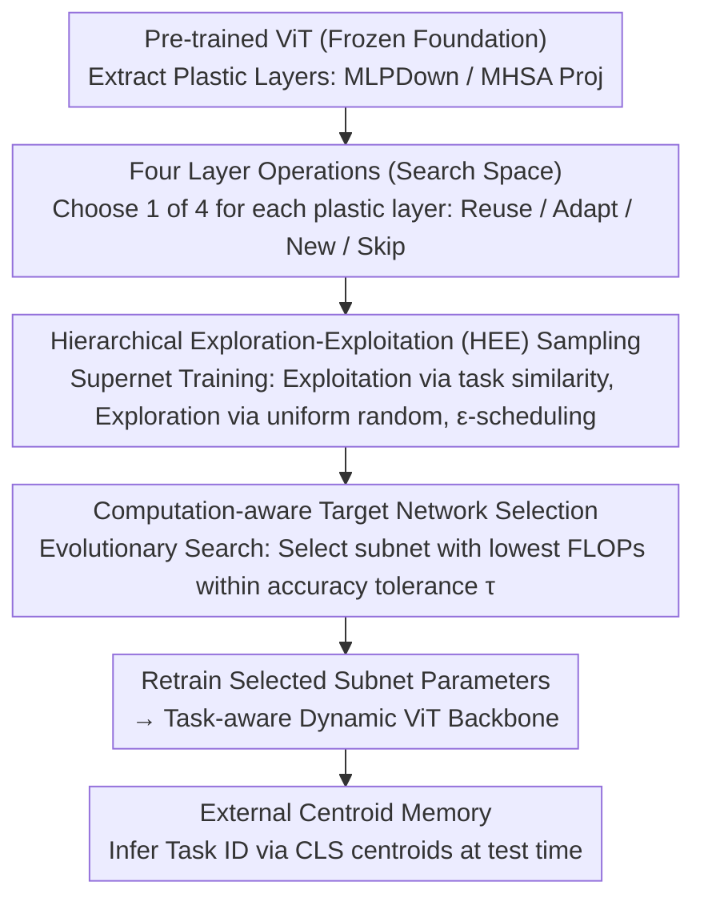

# CHEEM: Continual Learning by Reuse, New, Adapt and Skip -- A Hierarchical Exploration-Exploitation Approach

**Conference**: CVPR 2026  
**arXiv**: [2303.08250](https://arxiv.org/abs/2303.08250)  
**Code**: [GitHub](https://github.com/savadikarc/cheem)  
**Area**: Self-Supervised Learning  
**Keywords**: Continual Learning, Exemplar-free Class Incremental Learning, Neural Architecture Search, Inter-layer Operations, Vision Transformer

## TL;DR

Ours proposes the CHEEM framework, which automatically learns task-aware dynamic ViT backbones via Hierarchical Exploration-Exploitation (HEE) sampled NAS—selecting from four operations: Reuse, New, Adapt, and Skip at each layer. It significantly outperforms prompt-based methods on the MTIL and VDD benchmarks, approaching the upper bound of full fine-tuning.

## Background & Motivation

**Background**: Continual learning based on ViT has progressed significantly, primarily categorized into prompt-based methods (frozen backbone + learned prompts) and parameter-tuning methods (adapters/masks).

**Limitations of Prior Work**: (a) Prompt-based methods maintain stability but lack plasticity; frozen backbones cannot adapt to tasks significantly different from the pre-training distribution. (b) Parameter-tuning methods apply uniform operations across all layers, ignoring variations in task difficulty or similarity; simple tasks do not require all layers, while difficult tasks may necessitate entirely new layers.

**Key Challenge**: Existing methods keep computation fixed or monotonically increasing regardless of task difficulty—they lack Skip (to simplify models for easy tasks) and New (to introduce entirely new layers for highly dissimilar tasks) operations.

**Goal**: To learn a task-aware dynamic model architecture that automatically allocates Reuse, Adapt, New, and Skip operations across layers.

**Key Insight**: Continual learning is treated as a continual memory learning problem, consisting of internal parameter memory (NAS-driven dynamic backbone) and external centroid memory (task ID inference).

**Core Idea**: Neural Architecture Search (NAS) using Hierarchical Exploration-Exploitation (HEE) sampling to automatically select layer operations based on task similarity.

## Method

### Overall Architecture

CHEEM reformulates continual learning as a "continual memory learning" problem: the internal parameter memory is a dynamic ViT backbone that grows with tasks, while the external centroid memory is responsible for inferring which task a sample belongs to at test time. The core problem addressed is—given a sequence of tasks with varying difficulties and similarities to the pre-training distribution—how to decide which backbone layers to reuse old knowledge, which to fine-tune, which to create from scratch, and which to skip entirely. Existing methods either freeze the backbone (prompting) or treat every layer identically with adapters (parameter-tuning), lacking this "per-layer, task-aware dynamic decision" step.

Using a pre-trained ViT as the base, the MLPDown and MHSA projection layers in each block are selected as "plastic components." When a new task arrives, a four-step process follows: first, a supernet containing all candidate operations is constructed around these plastic components (search space); then, the supernet is trained using Hierarchical Exploration-Exploitation (HEE) sampling; next, a computation-aware evolutionary search is performed to select a specific subnet from the supernet as the target network; finally, the learnable parameters in the target network are retrained from scratch. At test time, an external centroid memory is used to infer the task ID and invoke the corresponding backbone.

### Key Designs

**1. Four Layer Operations: Expanding "Reuse/Fine-tune" to "New/Skip"**

Each plastic layer can select one of four operations. **Reuse** directly utilizes parameters trained on previous tasks to achieve knowledge transfer. **Adapt** adds a LoRA low-rank branch to the old parameters: $\theta_l^{(3,)} = \theta_l^{(2,)} + B_l \cdot A_l$, learning only a small amount of incremental change. These are standard in existing methods. The key innovations of CHEEM are the other two: **New** introduces a randomly initialized layer specifically for tasks that differ greatly from old ones where reuse would be detrimental; **Skip** bypasses the entire FFN/MHSA block, allowing simple tasks to use shallower networks. For example, when moving from ImageNet to MNIST, many layers can be skipped to save computation and prevent overfitting. With New and Skip, the model achieves the flexibility to "grow upwards and prune downwards."

**2. Hierarchical Exploration-Exploitation (HEE) Sampling: Guiding Reuse via Task Similarity**

The supernet contains four operations per layer and multiple potential experts from previous tasks, yielding a massive search space. Pure random sampling is inefficient, while pure greedy exploitation traps the model in local optima. HEE blends "Exploitation" and "Exploration" via epoch scheduling. **Exploitation** samples based on task similarity: for each layer, normalized cosine similarity $S_l^{i,t} = \text{NormCosine}(\mu_l^i, \mu_l^{i \to t})$ measures the similarity between old expert $i$ and new task $t$ (using mean CLS tokens $\mu$). Sampling occurs in two stages: first, choosing between "various old tasks" and an "Aux" option (which packages New/Skip); second, using a Bernoulli distribution with probability $\rho_i$ to decide between Reuse and Adapt. **Exploration** uses uniform random sampling to give unpopular combinations a chance. A probability switch toggles between the two: the supernet training phase leans toward exploitation ($\epsilon_1=0.3$), while the evolutionary search phase leans toward exploration ($\epsilon_2=0.5$).

**3. Computation-aware Target Network Selection: Choosing Efficiency at Equivalent Accuracy**

After supernet training, a specific subnet must be selected. Targeting only the highest accuracy often leads to heavy structures for marginal gains. CHEEM sets a performance tolerance threshold $\tau=2\%$: all candidates within $2\%$ of top accuracy are grouped, and the one with the lowest FLOPs is prioritized. This is achieved through evolutionary search (crossover and mutation), followed by full retraining of the learnable parameters.

**4. Figure of Merit (FoM): A Unified Metric for Accuracy Gap and Computation**

When comparing continual learning methods, accuracy and computation are often balanced trade-offs. The paper proposes FoM to combine them:

$$\text{FoM}(m,n) = \frac{A\mathbb{A}^{UB} - A\mathbb{A}^n}{A\mathbb{A}^{UB} - A\mathbb{A}^m} \cdot \frac{\text{FLOPs}^n}{\text{FLOPs}^m}$$

The first term compares the accuracy gap of methods $m$ and $n$ relative to the Full Fine-Tuning upper bound $A\mathbb{A}^{UB}$, while the second term compares computational overhead. $\text{FoM} > 1$ indicates that $m$ is superior to $n$ in the accuracy-computation trade-off.

### A Concrete Example

Taking two tasks of vastly different difficulties demonstrates how HEE adapts. For a simple task like **Caltech101**, the layer-wise CLS-token similarity to old experts suggests shallow information is sufficient. HEE shifts probability toward **Skip** in the Aux options across many layers, resulting in a significantly shallower network. For a difficult, fine-grained task like **FGVC Aircraft**, similarities are low. Simple reuse fails, so HEE samples **New** (adding capacity), **Adapt** (low-rank fine-tuning), and few **Skip** operations, creating a complex hybrid structure. Different subnets emerge from the same supernet based on task difficulty.

## Key Experimental Results

### Main Results — CHEEM vs. Upper Bound

| Method | MTIL (ViT-B) | MTIL (DEiT-T) | VDD (ViT-B) | VDD (DEiT-T) |
|------|-------------|---------------|-------------|---------------|
| Upper Bound (Full-FT) | 88.1 | 75.3 | 88.7 | 76.21 |
| CHEEM | 85.9 | 74.5 | 86.7 | 76.18 |
| Gap | -2.2 | -0.8 | -2.0 | **-0.03** |

### Ablation Study — FoM Comparison

| Method | MTIL ViT-B | MTIL DEiT-T | VDD ViT-B | VDD DEiT-T |
|------|-----------|-------------|-----------|------------|
| CODA-P | 24.2 | 84.6 | 35.9 | 2811.3 |
| S-Prompts | 3.2 | 10.5 | 5.5 | 338.8 |
| LoRA-CL | 1.7 | 5.7 | 1.5 | 73.6 |
| Tuna | 50.6 | 242.4 | 58.6 | 4538.8 |

All FoM > 1 values indicate that CHEEM is superior to all baselines in the accuracy-computation trade-off.

### Key Findings

1.  **Task-aware structures are semantically logical**: Caltech101 (easy) skips 5 MLP blocks; FGVC Aircraft (difficult) uses a New + Adapt + Skip combination.
2.  **Near-zero loss on VDD with DEiT-Tiny**: 76.18 vs 76.21 (Full-FT), a gap of only 0.03%, showing CHEEM fully exploits the capacity of small models.
3.  **LoRA-CL (a special case of CHEEM with Adapt in all layers)** approaches CHEEM on ViT-Base (FoM 1.7) but lags significantly on DEiT-Tiny (FoM 73.6), indicating small models require New/Skip operations more.
4.  Prompt-based methods almost fail on DEiT-Tiny (CODA-P at 5.6% Acc) because they are constrained by the backbone's fixed capacity.

## Highlights & Insights

- First to implement the full Reuse/New/Adapt/Skip spectrum in continual learning, spanning knowledge reuse, growth, and pruning.
- Learned task structures are highly interpretable—lightweight for easy tasks and complex for difficult ones.
- HEE sampling elegantly uses CLS token similarity as a proxy for task similarity.
- The FoM metric provides a comprehensive evaluation tool for the continual learning community.

## Limitations & Future Work

- NAS search increases training time; while per-task overhead is controlled, cumulative multi-task costs are non-negligible.
- The external task centroid memory (task ID inference) follows prior work; joint optimization with internal memory is not explored.
- Validated only on classification tasks; not yet extended to complex vision tasks like detection or segmentation.
- The **New** operation introduces new parameters, which might lead to rapid parameter growth over many tasks.

## Related Work & Insights

- Shares conceptual similarities with L2G (ConvNet CL driven by DARTS), but CHEEM introduces the Skip operation and HEE sampling specifically designed for ViT.
- Provides a feasible solution for the open problem of "adaptive computation allocation" in continual learning.
- HEE sampling can be generalized to other NAS scenarios requiring a balance between exploration and exploitation.

## Rating

- Novelty: ⭐⭐⭐⭐ Combination of four operations and HEE sampling is novel, though individual components (NAS/LoRA/Skip) exist.
- Experimental Thoroughness: ⭐⭐⭐⭐⭐ 2 benchmarks × 2 backbones × multiple baselines + interpretable structural analysis.
- Writing Quality: ⭐⭐⭐⭐ Clear diagrams, though the text is lengthy.
- Value: ⭐⭐⭐⭐ Significantly outperforms prompt-based methods on challenging benchmarks, approaching full fine-tuning.

<!-- RELATED:START -->

## Related Papers

- [\[ICML 2026\] Learning to Extrapolate to New Tasks: A Relational Approach to Task Extrapolation](../../ICML2026/self_supervised/learning_to_extrapolate_to_new_tasks_a_relational_approach_to_task_extrapolation.md)
- [\[CVPR 2026\] A Faster Path to Continual Learning](a_faster_path_to_continual_learning.md)
- [\[CVPR 2026\] Spectral Mixture-of-Experts for Continual Learning](spectral_mixture-of-experts_for_continual_learning.md)
- [\[CVPR 2026\] Is Parameter Isolation Better for Prompt-Based Continual Learning?](is_parameter_isolation_better_for_prompt-based_continual_learning.md)
- [\[CVPR 2026\] Exemplar-Free Continual Learning for State Space Models](exemplar-free_continual_learning_for_state_space_models.md)

<!-- RELATED:END -->
