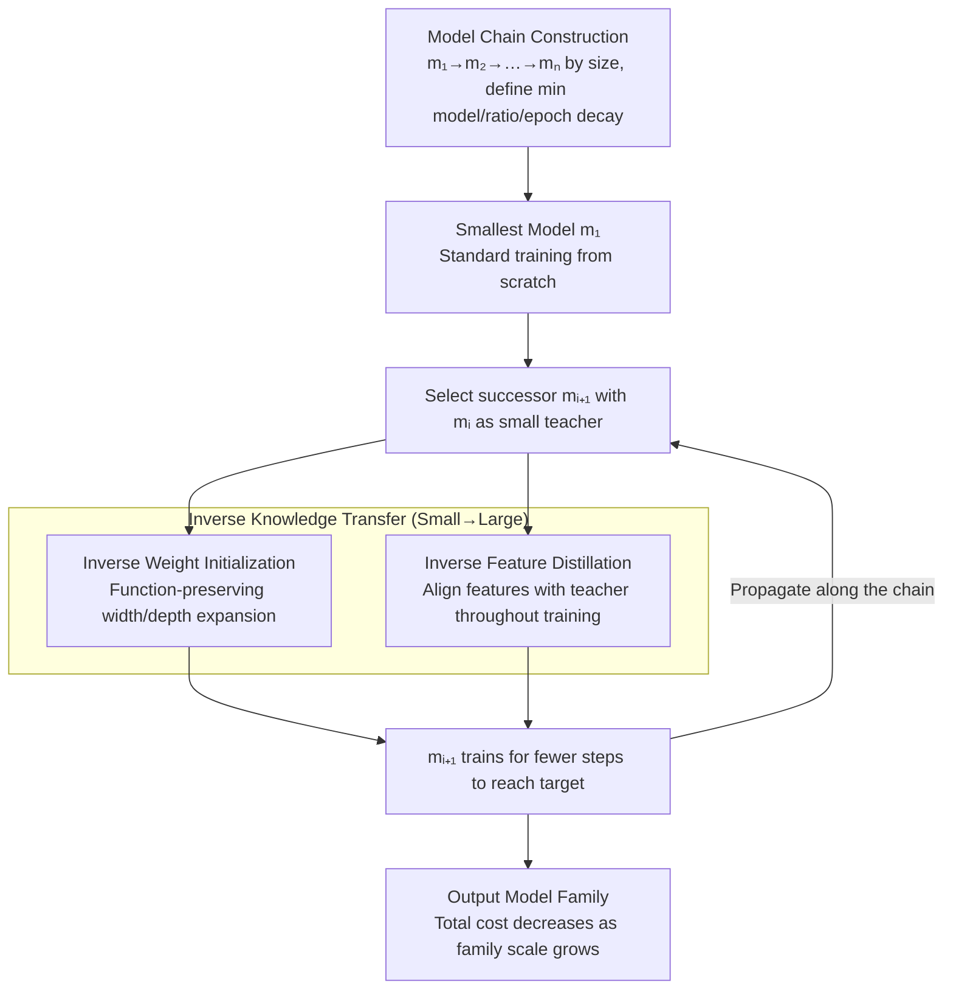

# Chain-of-Models Pre-Training: Rethinking Training Acceleration of Vision Foundation Models

**Conference**: CVPR 2026  
**arXiv**: [2604.12391](https://arxiv.org/abs/2604.12391)  
**Code**: [https://github.com/deep-optimization/CoM-PT](https://github.com/deep-optimization/CoM-PT)  
**Area**: Self-Supervised Learning / Training Acceleration  
**Keywords**: Model Chain, Pre-training Acceleration, Inverse Knowledge Transfer, CLIP, Vision Foundation Models

## TL;DR

Ours proposes Chain-of-Models Pre-Training (CoM-PT), which arranges Vision Foundation Models (VFMs) by size into a "model chain." It achieves lossless pre-training acceleration through small-to-large inverse knowledge transfer (weight initialization + feature distillation), where training efficiency improves as the scale of the model family grows.

## Background & Motivation

**Background**: The costs of pre-training Vision Foundation Models (VFMs) are exceedingly high (e.g., ViT-L/14 requires $1.2 \times 10^5$ A100 GPU hours on LAION-2B). Existing acceleration methods (mixed precision, masked modeling, data-efficient methods) focus on single-model optimization.

**Limitations of Prior Work**: VFMs are typically pre-trained as a model family (different sizes for various deployment scenarios). However, standard independent training is highly redundant, as models share the same optimization objectives, datasets, and training protocols, causing common knowledge to be learned repeatedly.

**Key Challenge**: As the scale of model families grows (more specialized sizes + larger model ranges), the total cost of independent training increases linearly, creating a dilemma between escalating pre-training costs and sacrificing deployment flexibility.

**Goal**: To achieve pre-training acceleration that scales efficiently with the size of the model family.

**Key Insight**: Microscopically, the cost of large models is the primary bottleneck; macroscopically, the redundancy of independent training is the root of inefficiency. The key to solving both is implementing small-to-large knowledge reuse within the family.

**Core Idea**: Arrange the model family by size to form a model chain. The smallest model undergoes standard training, while subsequent models accelerate their pre-training through inverse knowledge transfer (Small $\rightarrow$ Large).

## Method

### Overall Architecture

Ours addresses the total cost problem of model family pre-training. Given the same data and objective, training multiple VFMs of different sizes is standard but involves redundant learning of shared "common knowledge." CoM-PT breaks this by chaining models from small to large: $C_M: m_1 \rightarrow m_2 \rightarrow \cdots \rightarrow m_n$. Only the smallest $m_1$ is trained from scratch. Each successor $m_{i+1}$ builds upon its predecessor $m_i$ by "inversely" transferring learned knowledge as a starting point. This transfer occurs through two parallel channels: weight initialization in the parameter space and feature distillation in the feature space.

### Key Designs

**1. Inverse Weight Initialization: Transferring weights as a starting point**

Large models are expensive primarily due to slow convergence from random weights. CoM-PT reuses trained weights from smaller models as initial values for larger models using two "function-preserving" expansion operations. For width expansion, parameters from the small teacher are embedded into corresponding positions in the larger student, with extra dimensions initialized randomly. For depth expansion, weights of each layer are duplicated to serve as successor layers. "Function-preserving" ensures the output of the large model initially matches the small model, allowing it to start from a state of "existing competence" rather than from zero. This captures **static** knowledge.

**2. Inverse Feature Distillation: Capturing dynamic knowledge**

Weight initialization alone is insufficient as snapshots do not capture response patterns across different samples. Inverse feature distillation continuously aligns student features with teacher features during training:

$$\mathcal{L}_{IFD}(F^t, F^s) = \alpha \| F^t - \mathbf{T}(F^s) \|_2^2$$

where the transformation $\mathbf{T}(\cdot)$ projects student features into the teacher's space to align dimensions. In dual-tower structures like CLIP, both vision and text features are distilled: $\hat{\mathcal{L}}_{IFD} = (\mathcal{L}_{IFD}(v^t,v^s) + \mathcal{L}_{IFD}(t^t,t^s))/2$. Weight initialization provides a static starting point, while distillation provides dynamic cross-sample knowledge; the two channels are complementary.

**3. Three Principles of Model Chain Design**

To determine the chain configurations, three empirical principles are proposed: (i) The smallest model is selected based on data scale to ensure sufficient capacity to fit the distribution. (ii) The expansion ratio between adjacent models is set to $2\times$–$4\times$. (iii) Training epochs decrease linearly along the chain, as larger models with better starting points require less subsequent training. This leads to the counter-intuitive result that a ViT-T→S→B→L chain is cheaper than a ViT-B→L chain because intermediate small models are inexpensive to train and significantly accelerate the convergence of larger ones.

### Loss & Training

The total loss is $\mathcal{L} = \mathcal{L}_{task} + \hat{\mathcal{L}}_{IFD}$. The task loss utilizes the contrastive loss from LaCLIP (with text augmentation). During training, it is ensured that $\mathcal{L}_{IFD} < \mathcal{L}_{task}$ to keep distillation as an auxiliary role.

## Key Experimental Results

### Main Results

| Model Chain | ImageNet Top-1 | Training MACs | Gain (Speedup) |
|-------------|----------------|---------------|----------------|
| ViT-L Independent | 38.2% | 100% | 1.0× |
| ViT-B→L | 38.0% | 48% | 2.1× |
| ViT-S→B→L | 38.1% | 36% | 2.8× |
| ViT-T→S→B→L | **38.3%** | **28%** | **3.6×** |

### Ablation Study

| Configuration | ImageNet Top-1 | Description |
|---------------|----------------|-------------|
| Full CoM-PT | 38.3% | Weight Init + Feature Distill |
| Weight Init Only | 37.8% | No distillation |
| Feature Distill Only | 37.5% | Random initialization |
| Independent | 38.2% | Baseline |

### Key Findings

- **Counter-intuitive phenomenon**: Training more models is more efficient—speedup jumps from 4.13× to 5.68× and 7.09× when chaining 3, 4, and 7 models respectively.
- The model chain structure drives the primary efficiency gains, while weight initialization and distillation provide necessary synergy.
- Performance is preserved across 45 downstream datasets (accuracy loss <0.5%).

## Highlights & Insights

- The discovery that "training more models is more efficient" is highly insightful: because intermediate models in the chain converge rapidly, the total overhead can be lower than training a single large model directly.
- The method is agnostic to pre-training paradigms and can potentially scale to even more compute-intensive scenarios like LLM pre-training.
- Inverse knowledge transfer (Small $\rightarrow$ Large) acts as a novel dual to traditional knowledge distillation (Large $\rightarrow$ Small).

## Limitations & Future Work

- Verification has primarily focused on CLIP; large-scale testing on LLM pre-training is yet to be conducted.
- Model chain design still requires manual adjustment; an automated method is lacking.
- Simple duplication/insertion strategies for expansion may have more optimal alternatives.
- Cross-architecture model chains (e.g., ViT $\rightarrow$ Swin) have not been explored.

## Related Work & Insights

- **vs. Net2Net**: Net2Net first proposed function-preserving transformations for expansion; CoM-PT extends this into a systematic training pipeline.
- **vs. FLIP/DeCLIP**: These methods accelerate at the single-model level, while CoM-PT accelerates at the model-family level, making them orthogonally complementary.

## Rating

- Novelty: ⭐⭐⭐⭐⭐ A fresh perspective on model-family level acceleration.
- Experimental Thoroughness: ⭐⭐⭐⭐⭐ Comprehensive validation across 45 downstream datasets.
- Writing Quality: ⭐⭐⭐⭐⭐ Thorough analysis from both micro and macro perspectives.
- Value: ⭐⭐⭐⭐⭐ Significant practical implications for large-scale pre-training.

<!-- RELATED:START -->

## Related Papers

- [\[CVPR 2026\] Robustness of Vision Foundation Models to Common Perturbations](robustness_of_vision_foundation_models_to_common_perturbations.md)
- [\[CVPR 2026\] Scaling Parallel Sequence Models to Vision Foundation Models](scaling_parallel_sequence_models_to_vision_foundation_models.md)
- [\[CVPR 2026\] JetViT: Efficient High-Resolution Vision Transformer with Post-Training Attention Search](jetvit_efficient_high-resolution_vision_transformer_with_post-training_attention.md)
- [\[CVPR 2026\] Reading Your Actions: Learning Generalizable Action Representations via Pre-training AEMG](reading_your_actions_learning_generalizable_action_representations_via_pre-train.md)
- [\[CVPR 2026\] Harnessing the Power of Foundation Models for Accurate Material Classification](harnessing_the_power_of_foundation_models_for_accurate_material_classification.md)

<!-- RELATED:END -->
