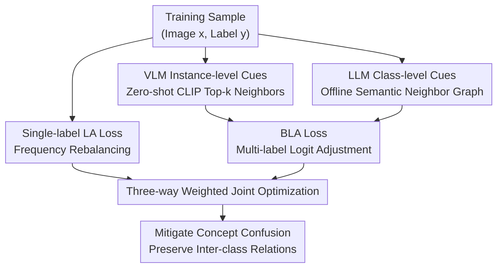

# CUE: Concept-Aware Multi-Label Expansion to Mitigate Concept Confusion in Long-Tailed Learning

**Conference**: CVPR 2026  
**arXiv**: [2605.01309](https://arxiv.org/abs/2605.01309)  
**Code**: https://github.com/zhangruichi/CUE (Available)  
**Area**: Long-Tailed Learning / Foundation Model Fine-tuning / Representation Learning  
**Keywords**: Long-tailed distribution, concept confusion, multi-label expansion, CLIP zero-shot, LLM semantic neighbors

## TL;DR
Addressing "concept confusion" (where tail samples are misclassified into semantically related classes) during foundation model fine-tuning for long-tailed recognition, CUE provides instance-level semantic cues via zero-shot CLIP and class-level cues via LLMs. By supervising these related classes as positive labels using two Binary Logit-Adjustment (BLA) auxiliary losses, CUE preserves the inter-class relationships learned during pre-training, yielding significant gains for tail classes across four long-tailed benchmarks.

## Background & Motivation
**Background**: Recent mainstream Long-Tailed Learning (LTL) focuses on fine-tuning foundation models like CLIP using Parameter-Efficient Fine-Tuning (PEFT) methods (e.g., prompt tuning, adapters, LoRA) combined with rebalancing techniques such as Logit Adjustment (LA) to mitigate class imbalance. Representative methods include LIFT and LPT.

**Limitations of Prior Work**: Existing methods focus solely on the "class frequency imbalance" bias while ignoring another bias introduced by the fine-tuning process itself. The authors observed on CIFAR100-LT that many samples correctly classified by zero-shot CLIP are misclassified after fine-tuning, especially tail classes. These errors predominantly fall into **semantically related neighbor classes** (e.g., misclassifying one bird species as another). Grad-CAM reveals that fine-tuning shifts attention from the object itself to irrelevant regions. This phenomenon is termed **concept confusion**.

**Key Challenge**: The root cause lies in the **exclusivity of single-label supervision**. Specifically, single-label constraints force each sample into one class, even if it is highly related to others semantically or visually. Under long-tail distributions, this exclusivity biases the model toward head classes with more representative samples. Consequently, head classes dominate optimization, destroying the pre-trained inter-class structures and magnifying concept confusion.

**Goal**: To **preserve the inter-class relationships** that should be retained during fine-tuning without discarding class imbalance rebalancing, allowing the model to explicitly learn "which classes are related to this sample" rather than collapsing into hard single-label decisions.

**Key Insight**: Foundation models possess strong semantic priors. VLMs learn fine-grained instance-level visual associations during vision-language pre-training, while LLMs possess high-level semantic/conceptual associations between categories. Since concept confusion stems from the "exclusivity-driven suppression of related classes," these related classes should be **identified and treated as additional positive labels**.

**Core Idea**: Generate a set of semantically related expansion labels for each sample using VLMs and LLMs. This transforms single-label training into multi-label supervision (target label + related classes), using positive signals from related classes to offset single-label exclusivity, thereby repairing inter-class relationships and mitigating concept confusion.

## Method

### Overall Architecture
CUE is a **plug-and-play module** built upon standard long-tailed fine-tuning pipelines (CLIP backbone + AdaptFormer + LA loss) without changing the architecture or optimizer. It expands the original "true label $y_i$" supervision into a three-way joint supervision: ① The original single-label LA loss (class imbalance rebalancing); ② **Instance-level** related classes provided via zero-shot CLIP, transformed into multi-label targets using a BLA loss; ③ **Class-level** semantic neighbors constructed offline via LLMs, also supervised using a BLA loss. The two types of cues are complementary: VLMs capture "what this specific image looks like," while LLMs capture "which classes are naturally close to this category."

### Key Designs

**1. Concept Confusion Diagnosis: Attributing Errors to Single-label Exclusivity**
CUE starts with a diagnostic insight rather than just a trick. Experiments prove that a significant portion of performance degradation in long-tailed fine-tuning is not caused by "few samples" but by the disruption of pre-trained inter-class structures. Zero-shot CLIP attention remains relatively focused on objects, whereas fine-tuned attention shifts, with errors flowing toward semantic neighbors. The root cause is precisely the **exclusivity** of single-label cross-entropy, which requires $\theta_{y_i}$ to be much larger than all other logits, forcibly suppressing related classes. In long-tail settings, this suppression biases towards head classes, justifying the solution of "providing positive labels to related classes."

**2. VLM Instance-level Cues: Identifying "Specific Targets" via Zero-shot CLIP**
To address the suppression of instance-level visual correlations, CUE passes each training image $\mathbf{x}_i$ through a frozen zero-shot CLIP model. Using the template "a photo of a [CLASS]," it computes image-text cosine similarity scores $\theta^{\text{zs}}(\mathbf{x}_i)$ and selects the Top-$k$ most similar classes (excluding the true label) as additional cues: $\mathcal{T}^{\text{zs}}(x_i)=\text{Top-}k(\operatorname{argsort}_{y\neq y_i}\theta^{\text{zs}}_y(\mathbf{x}_i))$ (fixed at $k=5$). The true label plus these Top-$k$ classes are set to 1 to form a binary multi-label target $\tilde{t}^{\text{zs}}_i$. This captures the local class neighborhood **specific to the current image** in the pre-training space.

**3. LLM Class-level Cues: Building Semantic Neighbor Graphs**
Complementing image-specific visual cues, CUE uses an LLM to build a per-class semantic neighbor set $\mathcal{N}^{\text{llm}}(c)$ offline. To avoid LLM context limitations or noisy outputs when processing long label lists, CUE utilizes a **batch-prompting + filtering** pipeline. Labels are segmented into small batches, and the LLM is constrained to return a JSON mapping of "class name → semantic neighbors" within that subset. Outputs are merged, filtered for ambiguity/duplicates, and aligned to label indices. Samples of the same class share this neighbor set $\tilde{t}^{\text{llm}}_i$, providing broad semantic associations that are robust to single-image noise.

**4. BLA Loss: Calibrated Multi-label Supervision for Long-tail Distributions**
Directly applying binary cross-entropy to expanded related classes is problematic because sigmoid decisions would again bias toward head classes due to frequency imbalance. CUE adapts the prior logit shift from LA to the binary setting, proposing **Binary Logit-Adjustment (BLA)**. Before applying the sigmoid, the empirical class prior $\pi_c$ is used to adjust each class logit: $\tilde{\theta}_c(\mathbf{x})=\theta_c(\mathbf{x})+\tau_b\log\pi_c$. This ensures that multi-label expansion and long-tailed rebalancing coexist without the expanded labels reinforcing frequency bias.

### Loss & Training
The total objective function is a weighted sum:

$$\mathcal{L}=\underbrace{\mathcal{L}^{\text{LA}}(\mathbf{x}_i,y_i)}_{\text{baseline}}+\lambda_{\text{zs}}\underbrace{\mathcal{L}^{\text{BLA}}(\mathbf{x}_i,\tilde{\mathbf{t}}^{\text{zs}}_i)}_{\text{VLM cue}}+\lambda_{\text{llm}}\underbrace{\mathcal{L}^{\text{BLA}}(\mathbf{x}_i,\tilde{\mathbf{t}}^{\text{llm}}_i)}_{\text{LLM cue}}$$

Where $\mathcal{L}^{\text{LA}}$ is the class-balanced logit-adjusted softmax loss with temperature $\tau$ ($\theta'_c=\theta_c+\tau\log\pi_c$). The backbone is CLIP-ViT-B/16 with AdaptFormer, trained with SGD (lr=0.01, momentum=0.9, weight decay=$5\times10^{-4}$), batch size 128, and a cosine schedule on an RTX 5090.

## Key Experimental Results

### Main Results
Evaluated on four long-tailed benchmarks (CIFAR100-LT, ImageNet-LT, Places-LT, iNaturalist2018), with the backbone and parameter count aligned with LIFT.

| Dataset | Metric | CUE | LIFT (SOTA) | Gain |
|--------|------|------|----------|------|
| CIFAR100-IR100 | All | 82.8 | 80.3 | +2.5 |
| CIFAR100-IR100 | Few | 82.0 | 74.3 | +7.7 |
| ImageNet-LT | All | 77.4 | 77.0 | +0.4 |
| ImageNet-LT | Few | 73.0 | 71.5 | +1.5 |
| Places-LT | All | 51.7 | 51.5 | +0.2 |
| Places-LT | Few | 52.4 | 50.5 | +1.9 |
| iNaturalist2018 | All | 79.6 | 79.1 | +0.5 |
| iNaturalist2018 | Many | 73.4 | 72.4 | +1.0 |

Gains primarily originate from tail classes ("Few") without degrading head/medium classes. In iNaturalist, where LIFT suffers from head-class degradation due to over-adaptation, CUE improves both Many (+1.0) and Few (+0.6).

### Ablation Study
Starting from the LIFT baseline (AdaptFormer + LA) adding cues (Table 5):

| Configuration | CIFAR100-IR100 Few | ImageNet-LT Few | Places-LT Few |
|------|------|---------|------|
| Baseline (No cue) | 74.3 | 71.5 | 50.5 |
| + VLM cue | 81.6 | 72.6 | 52.3 |
| + LLM cue | 80.2 | 72.5 | 51.1 |
| + VLM + LLM (Full) | 82.0 | 73.0 | 52.4 |

### Key Findings
- Both cues significantly improve tail class performance independently, with **VLM instance-level cues providing slightly higher gains** than LLM cues.
- The two cues are **complementary**; their joint use yields the most balanced results.
- Robustness: Performance remains stable across a wide range of $\lambda_{\text{VLM}}$ and $\lambda_{\text{LLM}}$ (0 to 1).
- CUE is effective across five PEFT types (e.g., VPT-shallow Few 52.2→75.2) and four from-scratch methods (e.g., LOS Few 1.5→6.8).

## Highlights & Insights
- **Problem Redefinition**: Decomposes long-tailed fine-tuning loss into "frequency imbalance" and "concept confusion," providing empirical evidence via Grad-CAM and error flow analysis.
- **Foundation Models Healing Foundation Models**: Concepts are confused because fine-tuning disrupts pre-trained structures; CUE addresses this by querying the foundation models themselves for class relationships.
- **BLA as a Critical Glue**: Prevents multi-label expansion from amplifying frequency bias, serving as a generalizable tool for multi-label/pseudo-labeling in long-tail scenarios.
- **High Utility**: Plug-and-play capability with zero architectural changes and low implementation cost.

## Limitations & Future Work
- Cue quality depends on external CLIP and LLM priors; performance on domains rare in pre-training data (e.g., specialized medical images) is untested.
- LLM neighbor graphs are offline and class-level, failing to capture image-specific semantic nuances.
- Fixed $k=5$ may not suit datasets with vastly different class numbers (e.g., CIFAR100 vs iNaturalist with 8142 classes).
- Gains on overall metrics for large-scale benchmarks (ImageNet-LT) are relatively small (+0.2~0.4).

## Related Work & Insights
- **vs LIFT / LPT**: While these use rebalancing tricks for frequency imbalance, CUE identifies and treats "concept confusion" as a distinct fine-tuning bias and acts as an incremental plug-and-play enhancement.
- **vs Pseudo-labeling**: Traditional pseudo-labeling generates a **single** label for unlabeled data; CUE expands **multiple** related labels for labeled data to preserve inter-class relations.
- **vs LA**: CUE generalizes the prior-shift concept of LA into binary loss (BLA) for multi-label calibration.

## Rating
- Novelty: ⭐⭐⭐⭐ 
- Experimental Thoroughness: ⭐⭐⭐⭐ 
- Writing Quality: ⭐⭐⭐⭐ 
- Value: ⭐⭐⭐⭐ 

<!-- RELATED:START -->

## Related Papers

- [\[CVPR 2026\] Decision Boundary-aware Generation for Long-tailed Learning](decision_boundary-aware_generation_for_long-tailed_learning.md)
- [\[CVPR 2026\] Learning Like Humans: Analogical Concept Learning for Generalized Category Discovery](learning_like_humans_analogical_concept_learning_for_generalized_category_discov.md)
- [\[CVPR 2026\] Reframing Long-Tailed Learning via Loss Landscape Geometry](reframing_long-tailed_learning_via_loss_landscape_geometry.md)
- [\[CVPR 2026\] Trust-calibrated Collaborative Learning for Long-Tailed Visual Recognition](trust-calibrated_collaborative_learning_for_long-tailed_visual_recognition.md)
- [\[CVPR 2026\] AdaPrior: Bayesian-Inspired Adaptive Prior Correction for Long-Tailed Continual Learning](adaprior_bayesian-inspired_adaptive_prior_correction_for_long-tailed_continual_l.md)

<!-- RELATED:END -->
